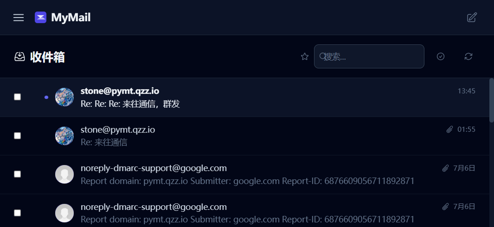
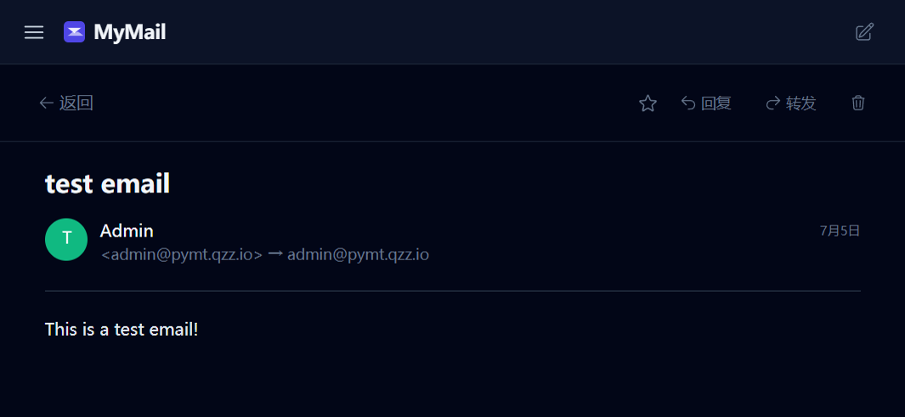
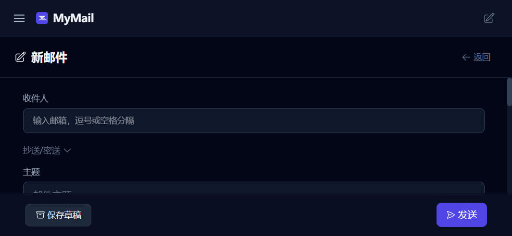
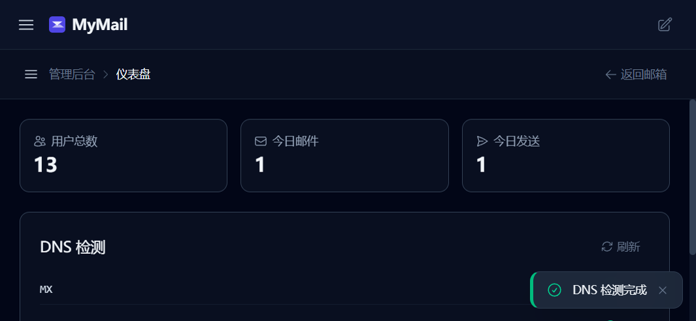
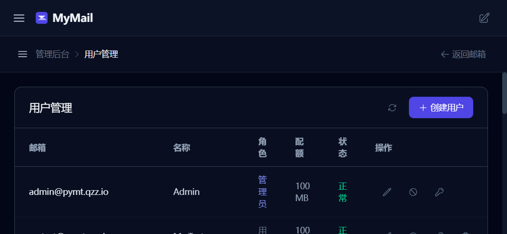

<div align="center">

# MyMail

**自托管邮件平台 · Go + Vue · Docker 一键部署**

SMTP 收发 · IMAP 访问 · 反垃圾 · 多用户 · API 发信 · 实时通知

[](https://go.dev/)
[](https://vuejs.org/)
[](https://www.docker.com/)
[]()
[]()

</div>

---

MyMail 是一个开箱即用的自托管邮件平台。后端 Go + SQLite，前端 Vue 3 + Tailwind，三容器 Docker 部署，**5 分钟从零到收发信**。适合个人、小团队、私有邮箱场景。

## 为什么选 MyMail

- **开箱即用** — 克隆、填域名、`docker compose up -d`，自带管理后台和 Web 客户端
- **现代前端** — Vue 3 + Tailwind 4，深色模式、移动端适配、OA 风格管理后台
- **反垃圾齐全** — SPF、DNSBL、评分引擎、熔断器、灰名单（生产可关）
- **安全可控** — JWT 认证、API Key 发信、HTML 净化、审计日志、AES-256 加密备份
- **可观测** — Prometheus 指标、OpenTelemetry 链路、结构化日志、Grafana 仪表盘
- **生产就绪** — 蓝绿 + 金丝雀发布、CI 8 阶段门禁、覆盖率 ≥80%、自动回滚

## 快速开始

```bash
git clone https://github.com/Stone5618/mymail.git
cd mymail/mymail-go && cp .env.example .env
# 编辑 .env，至少填这 4 项：
#   DOMAIN=your-domain.com
#   MAIL_HOST=mail.your-domain.com
#   JWT_SECRET=$(openssl rand -hex 32)
#   ADMIN_PASSWORD=<强密码>

cd deployments/docker
docker compose build app && docker compose up -d
```

浏览器打开 `http://your-server:3000`，用 `admin` + 你设置的密码登录即可。

> 完整部署（含 DNS、TLS、蓝绿发布）见下方 [部署详解](#部署详解)。

## 功能一览

**邮件收发** — SMTP 收发（25/587）+ IMAP（993）+ Maildir 存储；草稿、星标、回收站、批量操作、附件 zip 下载；MIME 解析支持非标准编码 From 头。

**反垃圾** — SPF 校验（失败 +5）、DNSBL 三大黑名单（命中 +10 拒绝）、评分引擎（≥5 标记 / ≥10 拒绝）、灰名单、熔断器、指数退避重试、降级模式保证可用。

**管理后台** — OA 风格子菜单布局（PC 左侧分组导航 + 移动端抽屉式）：仪表盘、用户管理、邮件管理、审计日志、系统配置、维护工具。

**安全** — JWT + bcrypt、强制改密、API Key 发信 + Per-Key 限流；HTML 净化（白名单 inline style + `ql-*` class）；CSP/HSTS/CORS/gzip；审计日志保留期可配。

**实时通知** — WebSocket + 指数退避重连，最大 5 次后降级轮询 `/api/mail/unread-count`；页面可见性感知。

**规则引擎** — 用户自定义过滤规则（CRUD）+ ReDoS 防护；支持标记已读、移动、删除、星标。

## 截图

<div align="center">

**收件箱**



**邮件详情**



**写邮件**



**管理后台 - 仪表盘**



**管理后台 - 用户管理**



**关于页**


</div>

## 部署详解

### 环境要求

- Docker 24+ / Docker Compose v2
- 域名 + DNS 控制权（MX/SPF/DMARC）
- 开放端口：25（SMTP）、587（SMTPS）、993（IMAPS）、3000（Web）
- 本地开发可选：Go 1.25+、Node.js 22+

### DNS 记录

```
your-domain.com.              MX    10 mail.your-domain.com.
your-domain.com.              TXT   "v=spf1 mx a -all"
_dmarc.your-domain.com.       TXT   "v=DMARC1; p=quarantine; rua=mailto:admin@your-domain.com"
```

### 蓝绿 + 金丝雀发布

常规升级直接 `docker compose build && up -d`；需要灰度时用 `scripts/deploy.sh`：

```bash
./scripts/deploy.sh v1.2.0 10     # 10% 流量到新版本，观察 30 分钟
./scripts/deploy.sh v1.2.0 50     # 扩大至 50%，观察 1 小时
./scripts/deploy.sh v1.2.0 100    # 全量切换
./scripts/rollback.sh             # 异常时回滚到上一稳定版本
```

脚本自动完成：构建镜像 → 启动 green 容器 → 健康检查 → Nginx 分流 → 观察期 → 全量切换。任一阶段失败自动回滚。

## 配置

**必填项**（完整列表见 [`mymail-go/.env.example`](mymail-go/.env.example)）：

| 变量 | 说明 |
|------|------|
| `DOMAIN` | 邮件域名 |
| `MAIL_HOST` | 邮件主机名（如 `mail.your-domain.com`） |
| `JWT_SECRET` | JWT 签名密钥，≥32 字符（`openssl rand -hex 32`） |
| `ADMIN_PASSWORD` | 管理员初始密码 |

**生产建议**：

| 变量 | 建议值 | 原因 |
|------|--------|------|
| `FEATURE_GREYLIST` | `false` | 大型 MTA（QQ 邮箱等）轮换出站 IP，灰名单会误杀 |
| `SMTP_TLS_REJECT_UNAUTHORIZED` | `false` | Postfix 自签证书场景 |
| `AUDIT_RETENTION_DAYS` | `365` | 自动清理过期审计日志 |
| `SPAM_SUSPICIOUS_THRESHOLD` | `5` | 可疑评分标记阈值 |
| `SPAM_THRESHOLD` | `10` | 垃圾评分拒绝阈值 |

<details>
<summary><b>查看完整环境变量列表</b></summary>

| 变量 | 默认值 | 说明 |
|------|--------|------|
| `ENV` | `dev` | 运行环境（`prod` 时 Gin 切换 ReleaseMode） |
| `PORT` | `3000` | HTTP 监听端口 |
| `DB_PATH` | `./data/mymail.db` | SQLite 数据库路径 |
| `MAILDIR_PATH` | `./data/maildir` | Maildir 存储路径 |
| `ATTACHMENT_PATH` | `./data/attachments` | 附件存储路径 |
| `MAX_ATTACHMENT_SIZE` | `26214400` | 单附件大小上限（25MB） |
| `SMTP_PORT` | `25` | SMTP 接收端口 |
| `SMTP_SEND_HOST` | `postfix` | 出站 SMTP 主机 |
| `SMTP_SEND_PORT` | `587` | 出站 SMTP 端口 |
| `JWT_EXPIRES_IN` | `24h` | JWT 有效期 |
| `JWT_REMEMBER_EXPIRES_IN` | `720h` | Remember Me 有效期 |
| `RATE_LIMIT_MAX` | `100` | API 限流（次/窗口） |
| `SEND_RATE_LIMIT_PER_MIN` | `10` | 发信限流（封/分钟） |
| `SPF_ENABLED` | `true` | 启用 SPF 校验 |
| `DNSBL_ENABLED` | `true` | 启用 DNSBL 查询 |
| `DNSBL_ZONES` | `zen.spamhaus.org,...` | DNSBL zone 列表（逗号分隔） |
| `SMTP_CIRCUIT_BREAKER_FAILURE_RATIO` | `0.6` | 出站 SMTP 熔断器失败率阈值 |
| `RULES_MAX_PATTERN_LENGTH` | `500` | 规则正则长度上限（ReDoS 防护） |
| `RULES_COMPILE_TIMEOUT_MS` | `2000` | 规则正则编译超时（ReDoS 防护） |
| `FEATURE_API_KEY` | `true` | 启用 API Key 发信 |
| `FEATURE_RULES` | `true` | 启用规则引擎 |
| `FEATURE_AUDIT` | `true` | 启用审计日志 |
| `FEATURE_REGISTRATION` | `true` | 启用用户注册 |
| `CORS_ALLOWED_ORIGINS` | - | CORS 白名单（逗号分隔） |
| `AUDIT_RETENTION_DAYS` | `365` | 审计日志保留天数 |
| `LOG_LEVEL` | `info` | 日志级别 |
| `LOG_FORMAT` | `json` | 日志格式 |
| `METRICS_ENABLED` | `true` | 启用 Prometheus 指标 |
| `METRICS_PATH` | `/metrics` | 指标暴露路径 |
| `TRACING_ENABLED` | `false` | 启用 OpenTelemetry 链路追踪 |

</details>

## 架构

```
                    ┌─────────────┐
  用户 ──HTTPS──→   │ Cloudflare  │ ──→ Nginx ──→ ┌───────────────┐
                    │ (CDN/SSL)   │               │  mymail-app   │
                    └─────────────┘               │  (Go :3000)   │
                                                  └───┬───────┬───┘
                         ┌──────────────────────────┘       │
                         ▼                                  ▼
                  ┌──────────────┐                   ┌──────────────┐
                  │  postfix     │                   │  dovecot     │
                  │ (SMTP :25/587)│                   │ (IMAP :993)  │
                  └──────────────┘                   └──────────────┘
                         │                                  │
                         └──────────┬───────────────────────┘
                                    ▼
                           ┌────────────────┐
                           │  Docker Volume │
                           │  · SQLite DB   │
                           │  · Maildir     │
                           │  · Attachments │
                           │  · Avatars     │
                           └────────────────┘
```

前端构建产物通过 `//go:embed` 嵌入 Go 二进制，运行时由 Go 直接服务静态资源，无需独立 Web 服务器。带 hash 的资源（`/assets/*`）长期缓存，`index.html` 不缓存。

## API 概览

| 分组 | 路径前缀 | 认证方式 |
|------|----------|----------|
| 公开 | `/healthz` `/readyz` `/startupz` `/api/version` `/api/auth/{login,register}` | 无 |
| 用户 | `/api/mail/*` `/api/auth/*` `/api/rules` `/api/auth/api-keys` | JWT |
| 管理员 | `/api/admin/*` | JWT + Admin 角色 |
| 外部发信 | `/api/v1/send` | API Key（`mk_` 前缀）+ Per-Key 限流 + Scope |
| 实时 | `/ws?token=<JWT>` | JWT（查询参数） |

<details>
<summary><b>查看完整端点列表</b></summary>

### 公开端点（无需认证）

| 方法 | 路径 | 说明 |
|------|------|------|
| GET | `/healthz` | 存活探针 |
| GET | `/readyz` | 就绪探针 |
| GET | `/startupz` | 启动探针 |
| GET | `/api/version` | 版本信息 |
| POST | `/api/auth/register` | 用户注册 |
| POST | `/api/auth/login` | 用户登录 |

### 用户端点（JWT 认证）

| 方法 | 路径 | 说明 |
|------|------|------|
| GET | `/api/auth/me` | 当前用户信息 |
| PUT | `/api/auth/profile` | 更新资料 |
| PUT | `/api/auth/password` | 修改密码 |
| POST | `/api/auth/change-default-password` | 强制修改默认密码 |
| POST | `/api/auth/avatar` | 上传头像 |
| GET | `/api/mail/list` | 邮件列表 |
| GET | `/api/mail/unread-count` | 未读计数（降级轮询专用） |
| POST | `/api/mail/send` | 发送邮件 |
| POST | `/api/mail/save-draft` | 保存草稿 |
| POST | `/api/mail/empty-trash` | 清空回收站 |
| POST | `/api/mail/batch/mark-read` | 批量标记已读 |
| POST | `/api/mail/batch/move` | 批量移动 |
| POST | `/api/mail/batch/delete` | 批量删除 |
| GET | `/api/mail/:id` | 邮件详情 |
| DELETE | `/api/mail/:id` | 删除邮件 |
| PUT | `/api/mail/:id/read` | 标记已读 |
| PUT | `/api/mail/:id/unread` | 标记未读 |
| PUT | `/api/mail/:id/star` | 切换星标 |
| PUT | `/api/mail/:id/restore` | 恢复邮件（回收站） |
| GET | `/api/mail/:id/attachments/download-all` | 下载全部附件（zip） |
| GET | `/api/mail/:id/attachments/:aid/download` | 下载单个附件 |
| GET/POST/PUT/DELETE | `/api/rules` | 规则管理 |
| GET/POST/DELETE | `/api/auth/api-keys` | API Key 管理 |

### 管理员端点（JWT + Admin 角色）

| 方法 | 路径 | 说明 |
|------|------|------|
| GET | `/api/admin/stats` | 平台统计 |
| GET | `/api/admin/dns-status` | DNS 状态检测 |
| GET | `/api/admin/config` | 系统配置只读展示 |
| GET | `/api/admin/audit-logs` | 审计日志列表（分页+筛选） |
| GET | `/api/admin/mails` | 邮件列表管理（无正文） |
| GET | `/api/admin/users` | 用户列表 |
| GET | `/api/admin/users/:id` | 用户详情 |
| POST | `/api/admin/users` | 创建用户 |
| PUT | `/api/admin/users/:id` | 更新用户（role/配额/密码/启用状态） |
| DELETE | `/api/admin/users/:id` | 软删除用户 |
| POST | `/api/admin/maintenance/resanitize` | 重新净化全量邮件 |

### 外部 API（API Key 认证）

| 方法 | 路径 | 说明 |
|------|------|------|
| POST | `/api/v1/send` | 外部发信（Scope: send） |

### 实时通信

| 协议 | 路径 | 说明 |
|------|------|------|
| WebSocket | `/ws?token=<JWT>` | 实时通知（新邮件推送） |

</details>

## 开发

```bash
# 后端（开发模式）
cd mymail-go && make dev

# 前端（开发服务器，代理 API 到生产环境）
cd mymail-vue && npm i && npm run dev

# 查看所有命令
cd mymail-go && make help
```

常用 Makefile 目标：

| 命令 | 用途 |
|------|------|
| `make build` | 构建二进制到 `dist/mymail`（注入版本信息） |
| `make build-all` | 交叉编译全平台（linux/darwin/windows × amd64/arm64） |
| `make test` | 单元测试 + 覆盖率（`-race -cover`） |
| `make lint` | golangci-lint 静态检查 |
| `make security` | govulncheck + gosec 安全扫描 |
| `make docker-build` | 构建 Docker 镜像 |
| `make docker-up` | docker compose up -d |
| `make migrate` | 执行数据库迁移 |

<details>
<summary><b>手动构建（含版本信息注入）</b></summary>

```bash
# 前端
cd mymail-vue && npm run build

# 后端
cd mymail-go
CGO_ENABLED=0 go build -ldflags="-s -w \
  -X main.Version=$(git describe --tags --always --dirty 2>/dev/null || echo dev) \
  -X main.BuildTime=$(date -u +%Y-%m-%dT%H:%M:%SZ) \
  -X main.CommitSHA=$(git rev-parse --short HEAD 2>/dev/null || echo unknown)" \
  -o dist/mymail ./cmd/mymail
```

</details>

## CI/CD

PR 合并需通过 8 阶段门禁（`.github/workflows/ci.yml`，`ci-gate` 作为分支保护必需状态检查）：

| 阶段 | 工具 | 说明 |
|------|------|------|
| 1. Lint | golangci-lint | Go 静态检查 |
| 2. Vet | go vet | 编译期检查 |
| 3. Test | go test -race -cover | 单元测试 + 竞态检测 + 覆盖率 |
| 4. Build | go build | 二进制构建 |
| 5. Frontend | npm ci + npm run build | 前端构建 |
| 6. Docker | docker build | 验证 Dockerfile + HEALTHCHECK |
| 7. Security Scan | gosec + govulncheck | 安全扫描 + 漏洞检查 |
| 8. Coverage Check | go tool cover | 覆盖率阈值 ≥ 80% |

同分支/PR 新运行自动取消旧运行，节省 CI 资源。打 tag 时触发 `release.yml` 构建多平台二进制 + Docker 镜像 + GitHub Release。

## 运维脚本

`mymail-go/scripts/` 下提供完整运维工具链：

| 脚本 | 用途 |
|------|------|
| `setup.sh` | 一键初始化环境（生成密钥、配置文件、目录权限） |
| `deploy.sh <version> <10\|50\|100>` | 蓝绿 + 金丝雀发布（自动健康检查 + 观察期 + 失败回滚） |
| `rollback.sh` | 发布回滚到上一稳定版本 |
| `backup.sh` | AES-256-CBC 加密备份（PBKDF2 派生密钥，排除 .env，保留最近 7 份） |
| `gen-dkim.sh` | 生成 DKIM 密钥对并输出 DNS 记录 |
| `migrate-data.go` | 数据迁移工具 |
| `resanitize.go` | 独立重新净化全量邮件（也可通过管理后台触发） |
| `rollback-migrate.go` | 数据库迁移回滚工具 |

**加密备份与恢复**：

```bash
# 备份
export BACKUP_PASSWORD='your-secret-password'
cd mymail-go && ./scripts/backup.sh
# 产物：backups/mymail_backup_YYYYMMDD_HHMMSS.tar.gz.enc + .sha256

# 恢复
openssl enc -d -aes-256-cbc -pbkdf2 -in <file>.enc -out backup.tar.gz -pass env:BACKUP_PASSWORD
sha256sum -c <file>.sha256     # 完整性校验
tar -xzf backup.tar.gz -C /target/path
```

## 监控告警

`deployments/` 下预置完整可观测性栈：

| 组件 | 目录 | 说明 |
|------|------|------|
| Prometheus | `deployments/prometheus/` | 指标采集 + 告警规则（`prometheus.yml` + `alerts.yml`） |
| Alertmanager | `deployments/alertmanager/` | 告警通知路由（支持邮件/Webhook） |
| Grafana | `deployments/grafana/dashboards/` | 预置仪表盘（`overview.json`） |

**核心指标**：HTTP QPS/延迟/错误率、SMTP 收发量/熔断器状态、SPF/DNSBL 命中数、垃圾评分分布、用户/邮件/队列/API Key 调用量。

**告警示例**：HTTP 5xx > 1% 持续 5 分钟、SMTP 熔断器打开、磁盘 > 85%、队列堆积 > 1000。

## 项目结构

```
mymail/
├── mymail-go/                    # Go 后端
│   ├── cmd/mymail/               # 程序入口
│   ├── internal/                 # 业务代码（httpapi / service / smtp / spam / storage / ws 等）
│   ├── config/                   # Dovecot/Nginx 配置
│   ├── deployments/              # Docker + Prometheus + Alertmanager + Grafana
│   ├── scripts/                  # 运维脚本
│   ├── .github/workflows/        # CI/CD 流水线
│   ├── Makefile                  # 构建/测试/部署命令入口
│   └── web/                      # 前端嵌入（//go:embed）
├── mymail-vue/                   # Vue 3 前端
│   └── src/
│       ├── api/                  # API 封装
│       ├── components/           # 基础组件
│       ├── composables/          # 组合式函数
│       ├── router/               # 路由配置
│       ├── stores/               # Pinia 状态管理
│       └── views/                # 页面视图（含 admin/ 6 个管理子组件）
└── README.md
```

<details>
<summary><b>查看完整目录结构</b></summary>

```
mymail/
├── mymail-go/
│   ├── cmd/mymail/
│   ├── internal/
│   │   ├── audit/                # 审计日志（写入 + 查询 + 定时清理）
│   │   ├── config/               # 配置加载（Viper）
│   │   ├── crypto/               # JWT/API Key/bcrypt
│   │   ├── httpapi/
│   │   │   ├── handler/          # 请求处理器
│   │   │   ├── middleware/       # 认证、限流、安全头、gzip
│   │   │   └── dto/
│   │   ├── logger/               # slog 结构化日志
│   │   ├── mailsender/           # SMTP 发送 + 队列
│   │   ├── metrics/              # Prometheus 指标
│   │   ├── resilience/           # 熔断器 + 重试
│   │   ├── rules/                # 规则引擎
│   │   ├── sanitize/             # HTML 净化（白名单样式）
│   │   ├── server/               # 服务器生命周期管理
│   │   ├── service/              # 业务逻辑层
│   │   ├── smtp/                 # SMTP 接收 + 反垃圾
│   │   ├── spam/                 # SPF/DNSBL/评分
│   │   ├── storage/
│   │   │   ├── attachment/
│   │   │   ├── dao/
│   │   │   ├── db/migrations/    # SQL 迁移脚本（001-008）
│   │   │   └── maildir/
│   │   ├── tracing/              # OpenTelemetry 链路追踪
│   │   ├── util/
│   │   └── ws/                   # WebSocket Hub
│   ├── config/                   # Dovecot/Nginx 配置
│   ├── deployments/
│   │   ├── docker/
│   │   ├── prometheus/
│   │   ├── alertmanager/
│   │   └── grafana/
│   ├── scripts/
│   ├── .github/workflows/
│   ├── web/
│   ├── .golangci.yml
│   ├── Makefile
│   └── go.mod
├── mymail-vue/
│   └── src/
│       ├── api/
│       ├── components/
│       ├── composables/
│       ├── router/
│       ├── stores/
│       └── views/
│           ├── admin/
│           │   ├── AdminOverview.vue
│           │   ├── AdminUsers.vue
│           │   ├── AdminMails.vue
│           │   ├── AdminAudit.vue
│           │   ├── AdminConfig.vue
│           │   └── AdminMaintenance.vue
│           └── AdminView.vue
└── README.md
```

</details>

## 安全

- 所有 API 端点经过中间件链：Recover → Security → RequestID → RequestLogger → CORS → Metrics → Gzip
- 用户端点增加 `Authenticate`（JWT 校验）
- 管理员端点增加 `RequireAdmin`（角色校验）
- 外部 API 使用 `APIKeyAuth` + `RateLimit` + `RequireScope`
- 发现安全漏洞请私下联系维护者，请勿直接公开 issue

## 贡献

私有项目，欢迎内部成员提交 PR。提交前请确保：

```bash
cd mymail-go && make lint && make test
cd mymail-vue && npm run lint
```

## 许可证

本项目基于 [MIT 协议](LICENSE) 开源。
