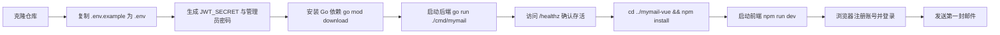

# MyMail 快速入门指南

> **目标**：5 分钟内把 MyMail 后端 + 前端在本地跑起来，并完成第一次注册、登录、发信验证。
> **适用对象**：刚加入团队的初级开发人员。
> **工作目录**：`mymail-go/`

---

## 从源码到运行的步骤



---

## 1. 环境准备

| 依赖 | 最低版本 | 验证命令 | 说明 |
|---|---|---|---|
| Go | 1.25+ | `go version` | `go.mod` 中声明 `go 1.25.0` |
| Node.js | 20.19+ 或 22.12+ | `node -v` | `mymail-vue/package.json` 中 `engines` 要求 |
| npm | 9+ | `npm -v` | 随 Node.js 一起安装 |
| Git | 2.20+ | `git --version` | 克隆仓库 |
| Docker（可选） | 24+ | `docker version` | 用于一键 Docker Compose 启动 |
| Docker Compose（可选） | v2+ | `docker compose version` | 用于一键 Docker Compose 启动 |

> **提示**：本指南默认你在 `mymail/mymail-go/` 目录下操作。前端项目位于同级目录 `mymail/mymail-vue/`。

---

## 2. 后端启动步骤

### 2.1 复制环境变量文件

```bash
cp .env.example .env
```

`.env.example` 位于 `mymail-go/.env.example`，里面包含所有配置项的默认值和占位符。

### 2.2 填写必填项

使用任意文本编辑器打开 `.env`，至少修改以下三项（开发环境）：

```bash
# 1. 域名（用于生成用户邮箱后缀）
DOMAIN=example.com
MAIL_HOST=mail.example.com

# 2. JWT 密钥，必须 >= 32 字符，且不能是默认占位符
# 生成命令：openssl rand -hex 32
JWT_SECRET=YOUR_RANDOM_64_HEX_CHARS_HERE

# 3. 管理员密码（登录后台用）
# 生成命令：openssl rand -hex 16
ADMIN_PASSWORD=YOUR_ADMIN_PASSWORD_HERE
```

> 开发环境下 `config.Validate()` 只强制校验 `JWT_SECRET` 和 `DOMAIN`；生产环境还需要配置 `CORS_ALLOWED_ORIGINS` 和 `METRICS_ENABLED`。

### 2.3 安装依赖

```bash
go mod download
```

如果国内下载慢，可先设置 Go 代理：

```bash
go env -w GOPROXY=https://goproxy.cn,direct
```

### 2.4 启动后端

方式一：使用 `make`（推荐，命令来自 `Makefile`）：

```bash
make dev
```

方式二：直接运行：

```bash
go run ./cmd/mymail
```

默认监听 `0.0.0.0:3000`，日志会输出类似：

```json
{"time":"2026-07-04T10:00:00+08:00","level":"INFO","msg":"MyMail 已启动","port":3000}
```

### 2.5 健康检查

打开新终端执行：

```bash
curl http://localhost:3000/healthz
```

预期返回：

```json
{
  "status": "alive",
  "time": "2026-07-04T10:00:00+08:00"
}
```

 也可以检查就绪探针：

```bash
curl http://localhost:3000/readyz
```

预期返回（启动约 2 秒后）：

```json
{
  "status": "ready",
  "checks": {
    "startup": "ready",
    "db": "up"
  }
}
```

---

## 3. 前端启动步骤

在 **新的终端** 中进入前端目录：

```bash
cd ../mymail-vue
```

### 3.1 安装依赖

```bash
npm install
```

> 如果 Node 版本不满足，请使用 `nvm` 切换到 20 或 22：`nvm use 22`。

### 3.2 启动开发服务器

```bash
npm run dev
```

`package.json` 中定义 `dev` 脚本为 `vite`，默认会启动在 `http://localhost:5173/`。控制台会打印实际地址，用浏览器打开即可。

---

## 4. 一键 Docker Compose 启动

如果你已经装好 Docker 和 Docker Compose，可以用一条命令启动完整栈（Go 后端 + Dovecot + Postfix + Nginx）：

```bash
make docker-up
```

它等价于：

```bash
docker compose -f deployments/docker/docker-compose.yml up -d
```

启动前请确保：

1. `.env` 已按第 2.2 节配置好。
2. Docker Compose 会读取 `mymail-go/.env`（`docker-compose.yml` 中 `env_file: ../../.env`）。
3. 已构建前端产物并复制到 `mymail-go/web/dist/`（可选，生产镜像构建时会自动处理）。

暴露的端口：

| 端口 | 用途 |
|---|---|
| 3000 | Go 后端 API + 前端 SPA |
| 25 | SMTP 入站接收 |
| 587 | Postfix 出站提交 |
| 993 | Dovecot IMAPS |
| 80 / 443 | Nginx HTTP/HTTPS 入口 |

查看日志：

```bash
make docker-logs
```

停止：

```bash
make docker-down
```

---

## 5. 第一个功能验证：注册 + 登录 + 发邮件

### 5.1 通过 Web 界面（推荐）

1. 打开前端地址 `http://localhost:5173/`。
2. 点击“注册”，填写用户名、密码、显示名，提交。
3. 注册成功后会自动登录，进入收件箱。
4. 点击“写邮件”，收件人填自己的邮箱（如 `alice@example.com`，与注册的域名一致），填写主题和正文，点击发送。
5. 在“已发送”或“收件箱”查看邮件。

### 5.2 通过命令行验证（可选）

如果你更习惯用 `curl`：

```bash
# 1. 注册
 curl -X POST http://localhost:3000/api/auth/register \
  -H 'Content-Type: application/json' \
  -d '{"username":"alice","password":"P@ssw0rd","displayName":"Alice"}'

# 2. 登录，获取 token
TOKEN=$(curl -s -X POST http://localhost:3000/api/auth/login \
  -H 'Content-Type: application/json' \
  -d '{"email":"alice@example.com","password":"P@ssw0rd"}' | \
  python3 -c "import sys,json;print(json.load(sys.stdin)['token'])")

# 3. 发邮件
 curl -X POST http://localhost:3000/api/mail/send \
  -H "Authorization: Bearer $TOKEN" \
  -F "to=alice@example.com" \
  -F "subject=Hello MyMail" \
  -F "bodyHtml=<p>第一封邮件发送成功！</p>"
```

> 本地开发时若未配置外部 SMTP（`SMTP_SEND_HOST`），向本域地址（`@example.com`）发信会由 `LocalDeliverer` 直接投递到数据库和 maildir；外域邮件需要正确配置 Postfix/Docker Compose 才能发出。

---

## 6. 常见启动失败与解决

| 现象 | 原因 | 解决 |
|---|---|---|
| `JWT_SECRET 必须设置` / `不能使用默认占位符` | `.env` 中 `JWT_SECRET` 未修改 | `openssl rand -hex 32` 生成并写入 `.env` |
| `DOMAIN 必须设置` | `.env` 中 `DOMAIN` 为空 | 填写本机或测试域名，如 `example.com` |
| `bind: address already in use`（端口 3000） | 3000 被占用 | 修改 `.env` 中 `PORT=3001`，或关闭占用进程 |
| `listen tcp :25: bind: permission denied` | 非 root 用户绑定 25 端口 | 开发环境可改 `.env` 中 `SMTP_PORT=2525`；或用 `sudo` |
| 前端页面空白 / API 请求 401 | token 失效 | 清除浏览器 localStorage 后重新登录 |
| 前端报错 `CORS error` | 生产环境未配置跨域 | 开发环境保持 `ENV=dev`；生产环境配置 `CORS_ALLOWED_ORIGINS` |
| `npm install` 报错 `EBADENGINE` | Node 版本过低 | 升级到 Node 20.19+ 或 22.12+ |
| `go mod download` 超时 | 网络问题 | 设置 `GOPROXY=https://goproxy.cn,direct` |
| Docker 启动后 `app` 不断重启 | `.env` 必填项未配置 | 检查 `JWT_SECRET`、`DOMAIN`、`ADMIN_PASSWORD` |

---

## 7. 下一步阅读推荐

按以下顺序阅读，能帮助你从“跑起来”过渡到“看懂代码、能改代码”：

1. **[项目规格文档](./01-项目规格文档.md)** — 产品定位、技术栈、架构总览。
2. **[后端文件详解：入口与基础设施](./02-后端文件详解/01-入口与基础设施.md)** — 从 `cmd/mymail/main.go` 开始，理解启动流程。
3. **[后端文件详解：HTTP 接口层](./02-后端文件详解/02-HTTP接口层.md)** — 路由、中间件、Handler、DTO。
4. **[后端文件详解：业务服务与数据存储](./02-后端文件详解/03-业务服务与数据存储.md)** — Service、DAO、DB、事务。
5. **[后端文件详解：邮件发送与反垃圾](./02-后端文件详解/04-邮件发送与反垃圾.md)** — SMTP、队列、反垃圾、规则引擎、WebSocket。
6. **[前端文件详解](./03-前端文件详解.md)** — Vue 3 入口、路由、Store、视图、组件。
7. **[API 参考文档](./04-API参考文档.md)** — 全部 REST API 与 WebSocket 接口详情。
8. **[DEPLOY.md](./DEPLOY.md)** — 部署指南。
9. **[OPERATIONS.md](./OPERATIONS.md)** — 日常运维手册。
10. **[MIGRATION.md](./MIGRATION.md)** — Node.js → Go 迁移指南。
11. **[runbooks/](./runbooks/)** — 故障处理 Runbook。

---

## 8. 常用命令速查

```bash
# 后端
make dev              # 开发模式启动后端
go run ./cmd/mymail  # 同上
make build            # 构建二进制到 dist/mymail
make test             # 运行单元测试
go run ./cmd/mymail -migrate  # 手动执行数据库迁移

# 前端
cd ../mymail-vue
npm install
npm run dev
npm run build

# Docker
make docker-up
make docker-down
make docker-logs
```

---

> **恭喜！** 如果你已经能看到 `/healthz` 返回 `alive`，并且能在浏览器里注册登录，说明 MyMail 已在本地成功运行。继续阅读上面的推荐文档，开始你的第一次代码改动吧。
