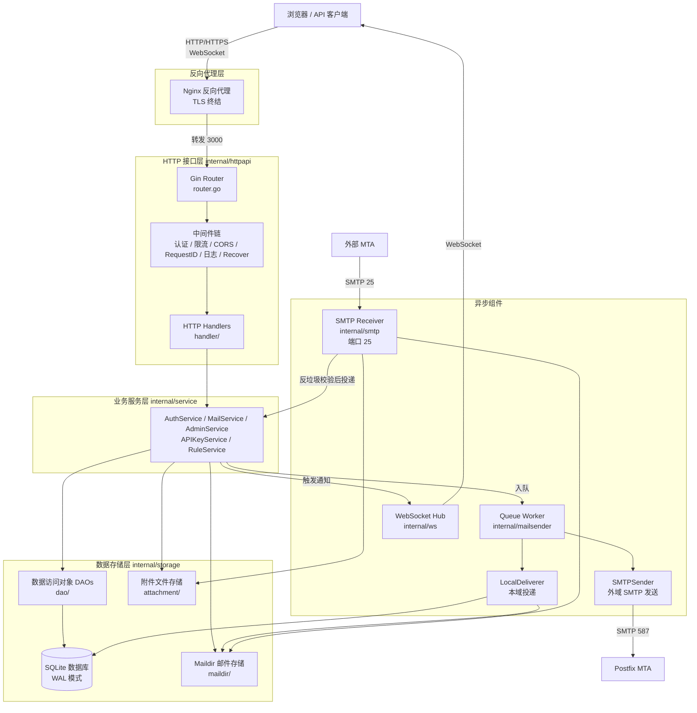
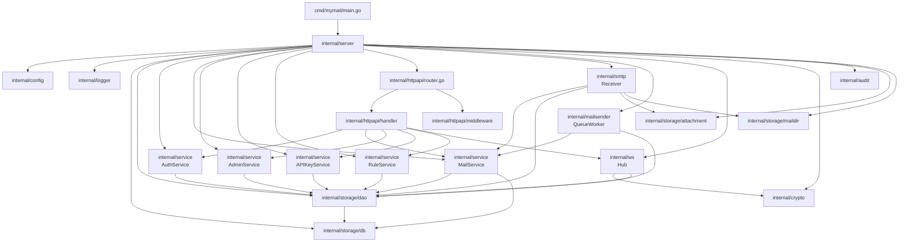
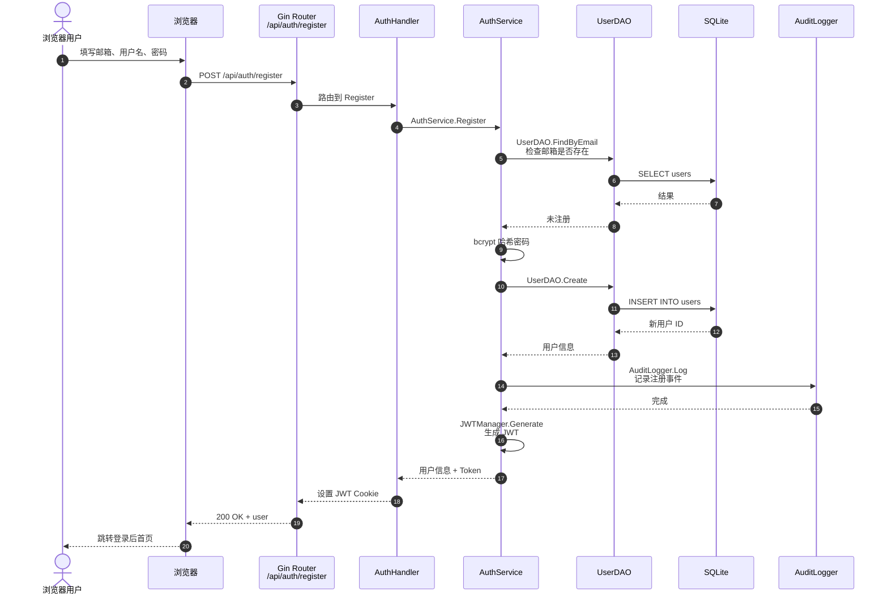
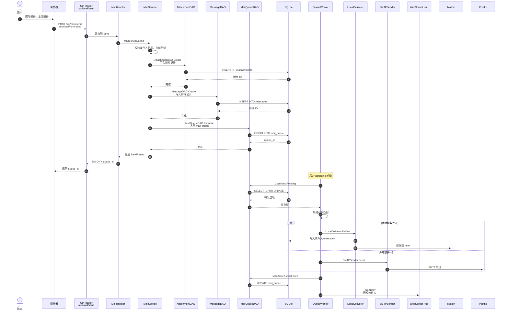
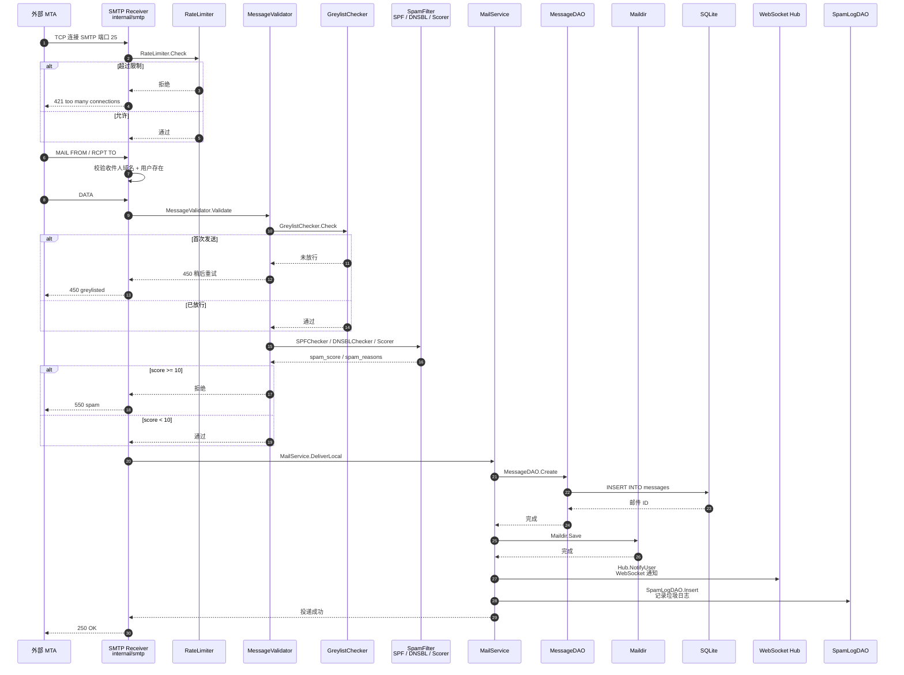

# MyMail 项目规格文档

> **文档版本**：v1.0
> **编写日期**：2026-07-04
> **适用对象**：初级开发人员、新加入团队的工程师、维护人员
> **文档目的**：提供对 MyMail 项目的完整认知，涵盖产品定位、技术架构、模块划分、数据流、安全设计与开发指南

---

## 一、项目概述

### 1.1 产品定位

MyMail 是一个**自托管的轻量级邮件服务平台**，提供完整的邮件收发、Web 界面管理、API 集成能力。项目目标是为个人开发者和小型团队提供一个可私有部署的邮件解决方案，避免依赖第三方邮件服务。

### 1.2 核心功能

| 功能域 | 能力 |
|---|---|
| 邮件收发 | SMTP 接收外部邮件、SMTP 发送外域邮件、本地域内投递 |
| Web 邮箱 | 邮件列表/详情/撰写/回复/转发、附件上传下载、星标/已读/删除 |
| 用户管理 | 注册/登录/登出、密码修改、存储配额、管理员后台 |
| API 集成 | RESTful API Key 认证、外部程序发信、Webhook 通知 |
| 规则引擎 | 用户自定义过滤规则、自动移动/标记/转发 |
| 实时推送 | WebSocket 新邮件到达通知、连接状态维护 |
| 反垃圾 | SPF 校验、DNSBL 查询、灰名单、评分系统 |
| 可观测性 | Prometheus 指标、OpenTelemetry 追踪、结构化日志、审计日志 |

### 1.3 项目历史

MyMail 最初由 Node.js 实现（`mymail-platform/`，已删除），后因性能、类型安全、可维护性等原因，**完整重构为 Go 语言版本**（`mymail-go/`）。重构过程中修复了原版的 9 项 P0 阻断性 Bug 和 21 项 P1 高危 Bug，并融入了企业级治理能力（可观测性、审计、韧性、CI/CD）。

---

## 二、技术栈

### 2.1 后端技术栈

| 类别 | 技术 | 版本 | 用途 |
|---|---|---|---|
| 语言 | Go | 1.25+ | 主开发语言 |
| Web 框架 | Gin | v1.10 | HTTP 路由与中间件 |
| 数据库 | SQLite | - | 主数据存储（通过 modernc.org/sqlite 纯 Go 驱动） |
| SQL 工具 | sqlx | - | SQL 扫描与映射（手写 SQL，不用 ORM） |
| 配置管理 | Viper | v1.19 | 环境变量 + .env 文件 |
| 日志 | slog | - | Go 标准库结构化日志 |
| 指标 | Prometheus | v1.20 | 指标采集与暴露 |
| 追踪 | OpenTelemetry | v1.44 | 分布式追踪 |
| JWT | golang-jwt/jwt/v5 | v5.3 | 用户认证令牌 |
| 密码哈希 | bcrypt | - | 密码安全哈希（cost=12） |
| HTML 净化 | bluemonday | v1.0 | XSS 防御（UGCPolicy） |
| 邮件解析 | emersion/go-message | v0.18 | MIME 邮件解析 |
| SMTP 服务器 | emersion/go-smtp | v0.24 | SMTP 接收器 |
| SMTP 客户端 | wneessen/go-mail | v0.7 | SMTP 发送器 |
| WebSocket | coder/websocket | v1.8 | 实时推送 |
| 熔断器 | sony/gobreaker/v2 | v2.4 | 出站 SMTP 韧性 |
| 唯一 ID | google/uuid | v1.6 | 附件、API Key 生成 |

### 2.2 前端技术栈

| 类别 | 技术 | 用途 |
|---|---|---|
| 框架 | Vue 3 | 渐进式前端框架 |
| 状态管理 | Pinia | Vue 3 官方推荐状态管理 |
| 路由 | Vue Router 4 | SPA 路由 |
| HTTP 客户端 | Axios | API 调用 |
| 构建工具 | Vite | 开发服务器与构建 |
| CSS 框架 | Tailwind CSS 4 | 原子化 CSS |
| XSS 防御 | DOMPurify | 前端 HTML 净化 |
| 代码规范 | ESLint + Prettier | 代码风格统一 |
| Git 钩子 | Husky | 提交前检查 |

### 2.3 基础设施

| 组件 | 用途 |
|---|---|
| Docker Compose | 多容器编排（app + dovecot + postfix + nginx） |
| Dovecot | IMAP 服务器（用户通过 IMAP 客户端访问邮件） |
| Postfix | 外部 MTA 中继（可选，用于外域发送） |
| Nginx | 反向代理 + TLS 终结 + 静态资源 |
| Prometheus + Grafana | 指标采集与可视化 |
| Alertmanager | 告警路由 |

---

## 三、系统架构

### 3.1 整体架构图

下面的 Mermaid 图从请求入口到数据持久化，展示了 MyMail 的整体分层。可以看到：HTTP/WebSocket 流量统一经 Nginx 进入 Gin Router，再依次经过中间件、Handler、Service、DAO，最终落入 SQLite、Maildir 或附件存储；SMTP 接收、队列发送和 WebSocket 通知作为三个独立组件并行运行。



> **图 3-1 说明**：
> - 横向从左到右表示一次 Web 请求的完整路径：Nginx → Gin Router → 中间件 → Handler → Service → DAO → SQLite/Maildir/Attachments。
> - 纵向并行的三个组件是系统的“非 HTTP 入口”：`SMTP Receiver` 接收外部邮件，`Queue Worker` 异步发送邮件，`WebSocket Hub` 推送实时通知。
> - 所有业务逻辑都收敛在 Service 层，DAO 层只负责数据库 CRUD，符合文档后续“分层架构”的依赖规则。

```
┌─────────────────────────────────────────────────────────────┐
│                       外部用户 / API 客户端                       │
└──────────┬──────────────────┬──────────────────┬────────────┘
           │ HTTP/HTTPS       │ SMTP             │ WebSocket
           ▼                  ▼                  ▼
┌─────────────────────────────────────────────────────────────┐
│                    Nginx 反向代理 (TLS 终结)                    │
└──────────┬──────────────────────────────────────────────────┘
           │
           ▼
┌─────────────────────────────────────────────────────────────┐
│                    MyMail Go 应用 (端口 3000)                   │
│  ┌─────────────────────────────────────────────────────────┐ │
│  │                  HTTP API 层 (Gin)                       │ │
│  │  认证中间件 → 限流 → CORS → RequestID → 日志 → Recover  │ │
│  │  路由: /api/auth /api/mail /api/admin /api/v1 /ws        │ │
│  └────────┬────────────────────────────────────────────────┘ │
│           │                                                   │
│  ┌────────▼────────┐  ┌──────────────┐  ┌────────────────┐  │
│  │  业务服务层       │  │  规则引擎     │  │  WebSocket Hub │  │
│  │  AuthService     │  │  Engine       │  │  实时推送       │  │
│  │  MailService     │  │  Matcher      │  └────────────────┘  │
│  │  AdminService    │  │  Action       │                      │
│  │  APIKeyService   │  └──────────────┘                      │
│  └────────┬────────┘                                          │
│           │                                                   │
│  ┌────────▼────────┐  ┌──────────────┐  ┌────────────────┐  │
│  │  数据存储层       │  │  SMTP 接收器  │  │  邮件发送器     │  │
│  │  DAO (11 个)     │  │  Receiver    │  │  Queue + Sender│  │
│  │  SQLite + WAL    │  │  Validator   │  │  熔断器 + 重试  │  │
│  │  Maildir 存储    │  │  反垃圾链     │  └────────────────┘  │
│  └─────────────────┘  └──────────────┘                      │
└──────────┬──────────────────────────────────────────────────┘
           │
           ▼
┌─────────────────────────────────────────────────────────────┐
│                    Dovecot (IMAP) + Postfix (MTA)              │
└─────────────────────────────────────────────────────────────┘
```

### 3.2 分层架构

项目采用**清晰的四层架构**，每层职责明确，依赖方向自上而下：

```
┌─────────────────────────────────────────┐
│  HTTP 接口层 (internal/httpapi/)          │  ← 接收 HTTP 请求，返回 JSON
│  - handler/  处理器                       │
│  - middleware/  中间件                    │
│  - dto/  数据传输对象                     │
│  - router.go  路由注册                    │
├─────────────────────────────────────────┤
│  业务服务层 (internal/service/)           │  ← 业务逻辑编排
│  - AuthService  认证                      │
│  - MailService  邮件                      │
│  - AdminService  管理                     │
│  - APIKeyService  API Key                 │
│  - RuleService  规则                      │
├─────────────────────────────────────────┤
│  数据访问层 (internal/storage/)           │  ← 数据库 CRUD
│  - dao/  数据访问对象 (11 个)              │
│  - db/  数据库连接与迁移                   │
│  - attachment/  附件存储                   │
│  - maildir/  Maildir 格式存储              │
├─────────────────────────────────────────┤
│  基础设施层 (internal/)                   │  ← 通用能力
│  - config/ logger/ metrics/ tracing/     │
│  - crypto/ sanitize/ audit/              │
│  - smtp/ spam/ mailsender/ resilience/   │
│  - rules/ ws/ util/                      │
└─────────────────────────────────────────┘
```

**依赖规则**：
- 上层可以依赖下层，下层不能依赖上层
- 同层之间通过接口解耦（如 Service 层通过 DAO 接口访问数据）
- 基础设施层是独立的，可以被任何层调用

### 3.3 模块清单

下面的 Mermaid 图展示了后端主要模块之间的依赖关系。箭头方向表示“依赖/使用”，可以直观看到 `cmd/mymail/main.go` 如何驱动 `internal/server` 完成依赖注入，以及 HTTP 层、Service 层、DAO 层、存储层之间的上下层关系。



> **图 3-2 说明**：
> - `internal/server` 是整个后端的“组装中心”：`server.New` 依次创建 DB、DAO、Service、Router、SMTPReceiver、QueueWorker、WSHub，并把依赖注入给各层。
> - 上层依赖下层：Handler 依赖 Service，Service 依赖 DAO，DAO 依赖 `internal/storage/db`；基础设施包（config、logger、crypto、audit）被 Server 直接初始化后注入到各层。
> - SMTP 接收器和队列发送器都直接依赖 `MailService`，因为它们需要复用统一的邮件投递与存储逻辑。

#### 后端模块（mymail-go/）

| 模块 | 路径 | 职责 |
|---|---|---|
| 应用入口 | `cmd/mymail/` | main 函数，启动与优雅关闭 |
| 服务器编排 | `internal/server/` | 依赖注入与生命周期管理 |
| 配置管理 | `internal/config/` | 环境变量加载与校验 |
| 日志系统 | `internal/logger/` | slog 结构化日志 + trace_id |
| 指标系统 | `internal/metrics/` | Prometheus 指标定义 |
| 追踪系统 | `internal/tracing/` | OpenTelemetry 追踪初始化 |
| HTTP 路由 | `internal/httpapi/router.go` | 路由注册与中间件链 |
| HTTP 处理器 | `internal/httpapi/handler/` | 请求处理（8 个 Handler） |
| HTTP 中间件 | `internal/httpapi/middleware/` | 认证、限流、CORS 等（8 个） |
| 数据传输对象 | `internal/httpapi/dto/` | 请求/响应结构体（3 个） |
| 认证服务 | `internal/service/auth_service.go` | 注册/登录/改密 |
| 邮件服务 | `internal/service/mail_service.go` | 收发/列表/详情/附件 |
| 管理员服务 | `internal/service/admin_service.go` | 用户管理/重置密码 |
| API Key 服务 | `internal/service/apikey_service.go` | API Key 生成与校验 |
| 规则服务 | `internal/service/rule_service.go` | 邮件过滤规则 CRUD |
| 数据库连接 | `internal/storage/db/` | SQLite 连接、迁移、事务 |
| 数据访问对象 | `internal/storage/dao/` | 11 个 DAO（User/Message/...） |
| 附件存储 | `internal/storage/attachment/` | 文件系统附件存储 |
| Maildir 存储 | `internal/storage/maildir/` | Maildir 格式邮件存储 |
| 邮件发送 | `internal/mailsender/` | 队列工作器 + SMTP 发送 |
| SMTP 接收 | `internal/smtp/` | SMTP 服务器 + 验证器 + 限流 |
| 反垃圾 | `internal/spam/` | SPF + DNSBL + 评分 |
| 韧性机制 | `internal/resilience/` | 熔断器 + 重试 |
| 规则引擎 | `internal/rules/` | 匹配器 + 动作执行 |
| WebSocket | `internal/ws/` | Hub + Client + 认证 |
| 加密安全 | `internal/crypto/` | JWT + bcrypt + API Key |
| HTML 净化 | `internal/sanitize/` | XSS 防御 |
| 审计日志 | `internal/audit/` | 双写 DB + JSONL |
| 工具函数 | `internal/util/` | 附件打包 + 输入校验 |

#### 前端模块（mymail-vue/src/）

| 模块 | 路径 | 职责 |
|---|---|---|
| 应用入口 | `main.js` | Vue 应用挂载 |
| 根组件 | `App.vue` | 全局布局 |
| 路由 | `router/index.js` | SPA 路由 + 守卫 |
| API 封装 | `api/index.js` | Axios 实例 + 拦截器 |
| 认证状态 | `stores/auth.js` | 用户登录态 + 角色 |
| WebSocket 状态 | `stores/ws.js` | WS 连接管理 |
| 格式化 | `composables/useFormat.js` | 日期/大小格式化 |
| 提示 | `composables/useToast.js` | Toast 通知 |
| 布局组件 | `components/AppLayout.vue` | 侧边栏 + 顶栏 |
| 上传组件 | `components/UploadZone.vue` | 附件上传 |
| 骨架屏 | `components/SkeletonList.vue` | 列表加载占位 |
| 登录视图 | `views/LoginView.vue` | 登录页面 |
| 邮件列表 | `views/MailView.vue` | 邮件列表 + 文件夹 |
| 邮件详情 | `views/MailDetailView.vue` | 邮件内容 + 附件 |
| 撰写邮件 | `views/ComposeView.vue` | 写信 + 附件 |
| 管理后台 | `views/AdminView.vue` | 用户管理 |
| 设置 | `views/SettingsView.vue` | 个人设置 |

---

## 四、数据流

### 4.1 用户注册与登录流程

下面的时序图展示了用户注册请求的完整调用链。浏览器发起 `POST /api/auth/register` 后，请求经过 Gin Router、AuthHandler、AuthService，最终通过 `UserDAO` 写入 SQLite，并返回 JWT Cookie。



> **图 4-1 说明**：
> - 注册时先查后写，避免重复邮箱；密码在 `AuthService` 层用 bcrypt 哈希后再交给 DAO。
> - `AuditLogger` 在注册成功后记录审计事件，便于后续安全审计与问题排查。
> - JWT 由 `crypto.JWTManager` 生成，最终通过 `httpOnly` Cookie 返回浏览器。

```
用户 → POST /api/auth/register
  → AuthHandler.Register
  → AuthService.Register
    → UserDAO.FindByEmail (检查邮箱是否已存在)
    → UserDAO.Create (bcrypt 哈希密码 + 写入 users 表)
    → AuditLogger.Log (记录注册事件)
  → 设置 JWT Cookie
  → 返回用户信息
```

```
用户 → POST /api/auth/login
  → AuthHandler.Login
  → AuthService.Login
    → UserDAO.FindByEmail (查找用户)
    → bcrypt.CompareHashAndPassword (校验密码)
    → UserDAO.UpdateLastLogin (更新登录时间)
    → JWTManager.Generate (生成 JWT)
    → AuditLogger.Log (记录登录事件)
  → 设置 JWT Cookie (httpOnly, secure)
  → 返回用户信息 + 角色
```

### 4.2 邮件发送流程

下面的时序图展示了从用户点击“发送”到邮件真正投递出去的完整链路。HTTP 请求只负责把邮件写入 `mail_queue` 并返回 `queue_id`，真正的发送由后台 `QueueWorker` 异步完成。



> **图 4-2 说明**：
> - 同步阶段（HTTP 请求内）只做校验、写库、入队，保证用户能立即拿到 `queue_id`，不会阻塞在附件上传或外域 SMTP 网络调用上。
> - 异步阶段由 `QueueWorker` 轮询 `mail_queue`：本域邮件走 `LocalDeliverer` 直接写入收件人的 Maildir 和 DB；外域邮件走 `SMTPSender`，经过熔断器和指数退避重试后投递给 Postfix。
> - 发送成功后通过 `WebSocket Hub` 通知收件人，前端邮件列表自动刷新。

```
用户 → POST /api/mail/send (multipart/form-data)
  → MailHandler.Send
  → MailService.Send
    → 校验发件人归属
    → 校验存储配额
    → 存储附件到文件系统
    → AttachmentDAO.Create (写入附件记录)
    → MessageDAO.Create (写入邮件记录)
    → MailQueueDAO.Enqueue (入队 mail_queue 表)
    → AuditLogger.Log (记录发送事件)
  → 返回 queue_id

后台 QueueWorker (goroutine):
  → MailQueueDAO.ClaimNextPending (领取待发邮件)
  → 规则引擎匹配 (如果命中规则则执行动作)
  → 判断收件人域名:
    → 本地域: LocalDeliverer.Deliver (写入收件人 Maildir)
    → 外域: SMTPSender.Send (通过 SMTP 发送)
      → 熔断器包装 (失败率 > 60% 触发熔断)
      → 重试策略 (指数退避，最多 3 次)
  → MailQueueDAO.MarkSent / MarkFailed (更新队列状态)
  → WebSocket Hub.Notify (通知收件人新邮件)
```

### 4.3 SMTP 接收流程

下面的时序图展示了外部 MTA 向 MyMail 投递邮件时的完整处理链路。系统先进行连接限流、灰名单和反垃圾检查，通过后再写入数据库、Maildir，并通过 WebSocket 通知收件人。



> **图 4-3 说明**：
> - 连接到达后先经过 `RateLimiter` 做 IP 级连接限流，防止暴力连接拖垮服务。
> - 灰名单对首次发件方返回 `450` 临时拒绝，短暂间隔后重试才会放行；反垃圾模块综合 SPF、DNSBL 和评分决定接受、标记可疑或拒绝。
> - 通过检查后调用 `MailService.DeliverLocal` 同步写入 DB、Maildir、审计/垃圾日志，并触发 WebSocket 通知，保证前端能实时收到新邮件。

```
外部 MTA → SMTP 端口 25 连接
  → smtp.Receiver (emersion/go-smtp 服务器)
  → RateLimiter.Allow (检查 IP 连接频率)
  → SMTPHandler.Handle (会话处理器)
    → Validator.ValidateSender (校验发件人)
    → GreylistChecker.Check (灰名单校验)
      → 首次: 拒绝 (返回 450)
      → 5 分钟后: 放行
    → SpamFilter.Check (反垃圾检查)
      → SPFChecker.Check (SPF 记录校验)
      → DNSBLChecker.Check (DNSBL 查询)
      → Scorer.Score (综合评分)
        → score < 5: 正常投递
        → 5 ≤ score < 10: 标记为可疑
        → score ≥ 10: 拒绝
    → MessageDAO.Create (写入邮件)
    → Maildir.Save (存储到收件人 Maildir)
    → WebSocket Hub.Notify (实时通知)
    → SpamLogDAO.Insert (记录垃圾日志)
```

### 4.4 WebSocket 实时通知流程

```
客户端 → GET /ws (带 JWT 子协议或 query token)
  → WSHandler.ServeWS
  → ws.Auth.Authenticate (校验 JWT)
    → 失败: 立即 401 关闭
    → 成功: 升级为 WebSocket 连接
  → Hub.RegisterClient (注册到 Hub)
  → Client.ReadPump (读循环，处理 pong)
  → Client.WritePump (写循环，30s ping)

新邮件到达:
  → MailService.Send/Deliver
  → Hub.NotifyUser(userID, message)
  → Client.Send (推送 JSON 通知)
  → 前端 stores/ws.js 接收
  → 触发邮件列表刷新
```

---

## 五、数据库设计

### 5.1 数据库选型

- **数据库**：SQLite（单文件，零配置，便于部署）
- **驱动**：modernc.org/sqlite（纯 Go 实现，无 CGO 依赖）
- **并发模式**：WAL（Write-Ahead Logging），支持并发读写
- **连接池**：MaxOpenConns=1（SQLite 写串行，避免锁冲突）

### 5.2 核心表结构

项目通过 4 个迁移文件创建以下表：

| 迁移文件 | 创建的表 |
|---|---|
| 001_initial_schema | users, messages, attachments, send_log, settings |
| 002_add_apikeys_rules | api_keys, mail_rules |
| 003_add_greylist_spamlog | greylist, spam_log, mail_queue, audit_log |
| 004_add_indexes | 补全索引（优化查询性能） |

#### 关键表说明

**users 表**（用户）
```sql
CREATE TABLE users (
    id            INTEGER PRIMARY KEY AUTOINCREMENT,
    email         TEXT NOT NULL UNIQUE,
    username      TEXT NOT NULL UNIQUE,
    password_hash TEXT NOT NULL,           -- bcrypt 哈希
    role          TEXT NOT NULL DEFAULT 'user',  -- user/admin
    storage_limit INTEGER NOT NULL DEFAULT 524288000,  -- 500MB
    storage_used  INTEGER NOT NULL DEFAULT 0,
    is_active     INTEGER NOT NULL DEFAULT 1,
    locked_until  DATETIME,
    last_login_at DATETIME,
    created_at    DATETIME NOT NULL DEFAULT CURRENT_TIMESTAMP,
    updated_at    DATETIME NOT NULL DEFAULT CURRENT_TIMESTAMP
);
```

**messages 表**（邮件）
```sql
CREATE TABLE messages (
    id             INTEGER PRIMARY KEY AUTOINCREMENT,
    user_id        INTEGER NOT NULL REFERENCES users(id) ON DELETE CASCADE,
    uid            INTEGER NOT NULL,        -- Maildir 内唯一 ID
    from_addr      TEXT NOT NULL,
    to_addrs       TEXT NOT NULL,           -- JSON 数组
    cc_addrs       TEXT,
    subject        TEXT,
    body_html      TEXT,                    -- 净化后的 HTML
    body_html_raw  TEXT,                    -- 原始 HTML（审计用）
    body_text      TEXT,
    folder         TEXT NOT NULL DEFAULT 'INBOX',
    is_read        INTEGER NOT NULL DEFAULT 0,
    is_starred     INTEGER NOT NULL DEFAULT 0,
    is_deleted     INTEGER NOT NULL DEFAULT 0,
    spam_score     INTEGER DEFAULT 0,
    spam_reasons   TEXT,                    -- JSON 数组
    message_id     TEXT,                    -- RFC 822 Message-ID
    in_reply_to    TEXT,
    references     TEXT,
    received_at    DATETIME NOT NULL DEFAULT CURRENT_TIMESTAMP,
    created_at     DATETIME NOT NULL DEFAULT CURRENT_TIMESTAMP
);
```

**api_keys 表**（API Key）
```sql
CREATE TABLE api_keys (
    id           INTEGER PRIMARY KEY AUTOINCREMENT,
    user_id      INTEGER NOT NULL REFERENCES users(id) ON DELETE CASCADE,
    name         TEXT NOT NULL,
    key_prefix   TEXT NOT NULL,             -- 前 8 字符明文（用于索引查找）
    key_hash     TEXT NOT NULL,             -- bcrypt 哈希
    scopes       TEXT NOT NULL DEFAULT '[]', -- JSON 数组: ["send","read"]
    is_active    INTEGER NOT NULL DEFAULT 1,
    last_used_at DATETIME,
    expires_at   DATETIME,
    created_at   DATETIME NOT NULL DEFAULT CURRENT_TIMESTAMP
);
CREATE INDEX idx_api_keys_prefix ON api_keys(key_prefix);  -- P1-3: 前缀索引
```

**mail_queue 表**（发送队列）
```sql
CREATE TABLE mail_queue (
    id            INTEGER PRIMARY KEY AUTOINCREMENT,
    user_id       INTEGER NOT NULL REFERENCES users(id) ON DELETE CASCADE,
    from_addr     TEXT NOT NULL,
    to_addrs      TEXT NOT NULL,
    cc_addrs      TEXT,
    bcc_addrs     TEXT,
    subject       TEXT,
    body_html     TEXT,
    body_text     TEXT,
    reply_to      TEXT,
    attachments   TEXT,                     -- JSON 数组
    status        TEXT NOT NULL DEFAULT 'pending',  -- pending/sent/failed
    attempts      INTEGER NOT NULL DEFAULT 0,
    max_attempts  INTEGER NOT NULL DEFAULT 3,
    next_retry_at DATETIME,
    error_msg     TEXT,
    created_at    DATETIME NOT NULL DEFAULT CURRENT_TIMESTAMP,
    sent_at       DATETIME
);
CREATE INDEX idx_queue_status ON mail_queue(status, next_retry_at);
```

### 5.3 索引策略

- **主键索引**：所有表都有 `id INTEGER PRIMARY KEY AUTOINCREMENT`
- **外键索引**：所有 `user_id` 字段都有索引
- **唯一索引**：`users.email`、`users.username`、`api_keys.key_prefix`
- **部分索引**：如 `idx_msg_user_starred WHERE is_starred = 1`（只索引星标邮件）
- **复合索引**：如 `idx_queue_status(status, next_retry_at)`（队列查询优化）

---

## 六、安全设计

### 6.1 认证与授权

| 机制 | 用途 | 实现 |
|---|---|---|
| JWT Cookie | Web 用户认证 | httpOnly + Secure Cookie，24h 有效 |
| API Key | 外部程序认证 | Bearer Header，前缀索引查找 + bcrypt 校验 |
| 角色控制 | 管理员权限 | `role` 字段（user/admin），中间件校验 |
| 归属校验 | 防止越权访问 | ownership 中间件，检查资源 owner_id |

### 6.2 密码安全

- **哈希算法**：bcrypt（cost=12，约 245ms/次）
- **跨语言兼容**：使用 `$2b$` 前缀，与 Node.js 版本兼容
- **强制校验**：JWT_SECRET 未设置时启动失败（P0-8 修复）

### 6.3 XSS 防御

- **后端净化**：邮件 HTML 入库前用 bluemonday UGCPolicy 净化（P0-4 修复）
  - 移除 `<script>`、`<iframe>`、`on*` 事件属性
  - `href` 仅允许 http/https/mailto 协议
  - `src` 仅允许 http/https/data 协议
- **前端净化**：MailDetailView 和 ComposeView 用 DOMPurify 二次净化
- **原始保留**：`body_html_raw` 保留原始 HTML（审计用），不返回给前端

### 6.4 速率限制

| 限制维度 | 策略 | 配置 |
|---|---|---|
| 登录失败 | IP 级别，5 次后锁定 15 分钟 | RateLimitMax=100 |
| API 发信 | API Key 级别，固定窗口 | SendRateLimitPerMin=10 |
| SMTP 连接 | IP 级别 | SMTPMaxConnectionsPerIP=10 |
| WebSocket | 连接级消息频率 | 1MB 最大 payload |

### 6.5 审计日志

- **双写策略**：DB（audit_log 表）+ JSONL 文件
- **记录内容**：ActorType（user/admin/system）、Action、Result（success/failure）、IP、UserAgent
- **保留期**：365 天
- **覆盖操作**：登录/登出/密码修改/邮件发送/删除/管理员操作

---

## 七、性能指标

### 7.1 基准测试结果

| 操作 | 耗时 | QPS | 目标 | 达标 |
|---|---|---|---|---|
| 用户登录 | 245ms | ~4 | 100 QPS | ✗（bcrypt cost=12 安全权衡） |
| 邮件列表 | 1.24ms | ~806 | 200 QPS | ✓ |
| 邮件详情 | 0.64ms | ~1562 | 500 QPS | ✓ |
| 未读计数 | 0.54ms | ~1851 | - | ✓ |

> **说明**：登录性能未达标是安全设计决策。bcrypt cost=12 比标准 cost=10 慢 4 倍，但显著提高暴力破解难度。

### 7.2 关键性能配置

| 参数 | 默认值 | 说明 |
|---|---|---|
| DB_MAX_OPEN_CONNS | 1 | SQLite 写串行，避免锁冲突 |
| QUEUE_WORKER_COUNT | 2 | 邮件发送队列工作器数量 |
| QUEUE_MAX_ATTEMPTS | 3 | 邮件发送最大重试次数 |
| SPAM_THRESHOLD | 10 | 垃圾邮件拒绝阈值 |
| SPAM_SUSPICIOUS_THRESHOLD | 5 | 垃圾邮件标记阈值 |
| GREYLIST_DELAY_MS | 300000 | 灰名单等待时间（5 分钟） |
| WS_MAX_PAYLOAD | 1MB | WebSocket 最大消息大小 |

---

## 八、部署架构

### 8.1 Docker Compose 部署

```yaml
services:
  app:        # MyMail Go 应用（端口 3000）
  dovecot:    # IMAP 服务器（端口 143/993）
  postfix:    # MTA 中继（端口 25/587）
  nginx:      # 反向代理（端口 80/443）
```

### 8.2 Dockerfile 多阶段构建

1. **阶段 1（Node）**：构建 Vue 前端 → `dist/`
2. **阶段 2（Go）**：编译 Go 二进制，嵌入前端 `dist/`
3. **阶段 3（运行时）**：Alpine + UID 1000 + tini + HEALTHCHECK

### 8.3 数据持久化

| 路径 | 用途 | 挂载方式 |
|---|---|---|
| `/app/data/mymail.db` | SQLite 数据库 | Volume |
| `/app/data/maildir/` | Maildir 邮件存储 | Volume |
| `/app/data/attachments/` | 附件存储 | Volume |
| `/app/data/audit.log` | 审计日志 JSONL | Volume |

---

## 九、开发指南

### 9.1 本地开发环境

```bash
# 1. 克隆仓库
git clone <repo-url>
cd mymail

# 2. 配置环境变量
cd mymail-go
cp .env.example .env
# 编辑 .env，设置 JWT_SECRET、ADMIN_PASSWORD 等

# 3. 启动 Go 后端
go run cmd/mymail/main.go

# 4. 启动 Vue 前端（另一个终端）
cd ../mymail-vue
npm install
npm run dev
```

### 9.2 项目结构

```
mymail/
├── mymail-go/              # Go 后端
│   ├── cmd/mymail/         # 应用入口
│   ├── internal/           # 内部包（不对外暴露）
│   │   ├── config/         # 配置
│   │   ├── server/         # 服务器编排
│   │   ├── httpapi/        # HTTP 接口层
│   │   ├── service/        # 业务服务层
│   │   ├── storage/        # 数据存储层
│   │   ├── mailsender/     # 邮件发送
│   │   ├── smtp/           # SMTP 接收
│   │   ├── spam/           # 反垃圾
│   │   ├── rules/          # 规则引擎
│   │   ├── ws/             # WebSocket
│   │   ├── crypto/         # 加密安全
│   │   ├── audit/          # 审计日志
│   │   ├── logger/         # 日志
│   │   ├── metrics/        # 指标
│   │   ├── tracing/        # 追踪
│   │   ├── sanitize/       # HTML 净化
│   │   ├── resilience/     # 韧性机制
│   │   └── util/           # 工具
│   ├── tests/e2e/          # E2E 测试
│   ├── scripts/            # 脚本
│   ├── docs/               # 文档
│   ├── deployments/        # 部署配置
│   ├── config/             # Dovecot/Nginx 配置
│   ├── web/                # 前端嵌入
│   └── go.mod
├── mymail-vue/             # Vue 前端
│   └── src/
│       ├── api/            # API 封装
│       ├── components/     # 通用组件
│       ├── composables/    # 组合式函数
│       ├── router/         # 路由
│       ├── stores/         # 状态管理
│       └── views/          # 视图组件
└── docs/                   # 项目文档
```

### 9.3 测试

```bash
# 运行所有测试
cd mymail-go
go test ./... -timeout=180s

# 运行特定模块测试
go test ./internal/service/...

# 运行 E2E 测试
go test ./tests/e2e/...

# 运行基准测试
go test -bench=. ./tests/e2e/...

# 查看覆盖率
go test -cover ./internal/...
```

### 9.4 代码规范

- **Go 代码**：遵循 [Effective Go](https://go.dev/doc/effective_go) 和项目 `.golangci.yml` 配置
- **Vue 代码**：遵循 `.eslintrc.json` 和 `.prettierrc` 配置
- **提交规范**：`type(scope): description`，如 `feat(mail): 添加批量删除接口`
- **Bug 修复**：在代码注释中标注 Bug 编号（如 `// P0-4 修复：XSS 净化`）

### 9.5 文档导航

| 文档 | 路径 | 内容 |
|---|---|---|
| 项目规格文档 | `docs/01-项目规格文档.md` | 本文档，项目全貌 |
| 后端入口与基础设施 | `docs/02-后端文件详解/01-入口与基础设施.md` | main.go、server、config、logger、crypto 等 |
| 后端 HTTP 接口层 | `docs/02-后端文件详解/02-HTTP接口层.md` | router、handler、middleware、dto |
| 后端业务与存储 | `docs/02-后端文件详解/03-业务服务与数据存储.md` | service、dao、db、migrations |
| 后端邮件与反垃圾 | `docs/02-后端文件详解/04-邮件发送与反垃圾.md` | mailsender、smtp、spam、rules、ws |
| 前端文件详解 | `docs/03-前端文件详解.md` | 所有 Vue 源文件 |
| API 参考文档 | `docs/04-API参考文档.md` | 所有 REST API 与 WebSocket 接口 |
| 部署文档 | `docs/DEPLOY.md` | 部署指南 |
| 迁移文档 | `docs/MIGRATION.md` | Node.js → Go 迁移指南 |
| 运维文档 | `docs/OPERATIONS.md` | 运维手册 |
| Runbook | `docs/runbooks/RB-001~004.md` | 应急响应手册 |

---

## 十、Bug 修复对照表

重构过程中修复的所有 P0/P1 Bug：

### P0 阻断性 Bug（9 项）

| 编号 | 描述 | 修复位置 | 修复方式 |
|---|---|---|---|
| P0-1 | Dovecot 密码字段名错误 | config/dovecot/dovecot-sql.conf | password → password_hash |
| P0-2 | 反垃圾模块完全失效 | internal/spam/ | 重写 SPF + DNSBL + 评分系统 |
| P0-3 | IDOR 越权访问 | middleware/ownership.go | 添加归属校验中间件 |
| P0-4 | XSS 存储型漏洞 | internal/sanitize/html.go + DOMPurify | 后端 bluemonday + 前端 DOMPurify |
| P0-5 | 管理员路由无守卫 | router/index.js + middleware/auth.go | meta.requiresAdmin + 路由守卫 |
| P0-6 | 批量删除无提示 | MailView.vue | 引入 useToast |
| P0-7 | 附件上传无状态反馈 | UploadZone.vue | uploadingCount + 状态显示 |
| P0-8 | JWT_SECRET 未校验 | internal/config/config.go | 启动时强制校验 |
| P0-9 | 数据库迁移不一致 | internal/storage/db/migrations/ | 统一 schema |

### P1 高危 Bug（21 项，列举关键的）

| 编号 | 描述 | 修复位置 |
|---|---|---|
| P1-1 | 事务未使用 | internal/storage/db/tx.go + service 层 |
| P1-2 | CORS 配置过宽 | middleware/cors.go（白名单） |
| P1-3 | API Key 无索引 | api_keys.key_prefix 索引 |
| P1-4 | UID 竞态条件 | MessageDAO.CreateOn（事务内生成 UID） |
| P1-5 | 存储配额未校验 | MailService.Send（配额检查） |
| P1-6 | 备份未加密 | scripts/backup.sh（AES-256-CBC） |
| P1-7 | 规则引擎 ReDoS | internal/rules/（RE2 + 超时） |
| P1-9 | 数据路径错误 | 配置统一 /app/data/ |
| P1-12 | vmail 用户为 root | setup.sh（UID 5000） |
| P1-15 | 401 未跳转登录 | router/index.js（router.replace） |
| P1-16 | 管理员重置密码 UI 缺失 | AdminView.vue（模态框 + 复制） |
| P1-17 | 登出按钮不可见 | AppLayout.vue（始终显示） |
| P1-18 | WebSocket 认证超时 | ws/auth.go（子协议 + 立即 401） |
| P1-19 | escapeHtml 缺失 | textContent 替代 innerHTML |

---

## 十一、关键设计决策

### 11.1 为什么选择 SQLite 而非 PostgreSQL？

- **零配置**：单文件，无需单独数据库服务
- **兼容性**：与原 Node.js 版本数据兼容，迁移零成本
- **性能足够**：WAL 模式下读并发，写串行对邮件场景足够
- **备份简单**：复制文件即可

### 11.2 为什么使用 modernc.org/sqlite 而非 mattn/go-sqlite3？

- **纯 Go 实现**：无 CGO 依赖，跨平台编译更简单
- **Docker 构建友好**：不需要安装 C 编译器
- **性能接近**：对邮件场景性能差异可忽略

### 11.3 为什么 bcrypt cost=12？

- **安全优先**：cost=12 比 cost=10 慢 4 倍，显著提高暴力破解难度
- **跨语言兼容**：`$2b$` 前缀与 Node.js 版本兼容
- **权衡**：登录 QPS 降至 ~4，但邮件读写不受影响

### 11.4 为什么使用 //go:embed 嵌入前端？

- **单二进制部署**：无需额外 Web 服务器
- **版本一致**：前端与后端同时发布，避免版本不匹配
- **Docker 简化**：3 阶段构建，最终镜像只含一个二进制

### 11.5 为什么使用 SQLite 表作为消息队列？

- **轻量**：不引入 Kafka/RabbitMQ
- **持久化**：崩溃后队列不丢失
- **事务保证**：邮件入库与入队在同一事务中

---

## 十二、附录

### 12.1 术语表

| 术语 | 说明 |
|---|---|
| MTA | Mail Transfer Agent，邮件传输代理 |
| MDA | Mail Delivery Agent，邮件投递代理 |
| IMAP | Internet Message Access Protocol，邮件访问协议 |
| SMTP | Simple Mail Transfer Protocol，邮件传输协议 |
| SPF | Sender Policy Framework，发件人策略框架 |
| DNSBL | DNS-based Blackhole List，DNS 黑名单 |
| JWT | JSON Web Token，JSON Web 令牌 |
| WAL | Write-Ahead Logging，预写式日志 |
| UGC | User Generated Content，用户生成内容 |
| IDOR | Insecure Direct Object Reference，不安全的直接对象引用 |
| ReDoS | Regular Expression Denial of Service，正则表达式拒绝服务 |
| XSS | Cross-Site Scripting，跨站脚本攻击 |
| CORS | Cross-Origin Resource Sharing，跨域资源共享 |

### 12.2 参考文档

- [Go 官方文档](https://go.dev/doc/)
- [Gin 框架文档](https://gin-gonic.com/docs/)
- [SQLite 文档](https://www.sqlite.org/docs.html)
- [Vue 3 文档](https://vuejs.org/)
- [Tailwind CSS 文档](https://tailwindcss.com/)
- [emersion/go-smtp](https://github.com/emersion/go-smtp)
- [bluemonday 文档](https://github.com/microcosm-cc/bluemonday)

---

**文档结束**

> 本文档为 MyMail 项目的整体规格说明。如需了解具体文件的代码细节，请参阅 `docs/02-后端文件详解/` 和 `docs/03-前端文件详解.md`。如需了解 API 接口细节，请参阅 `docs/04-API参考文档.md`。
