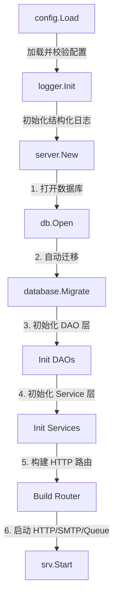
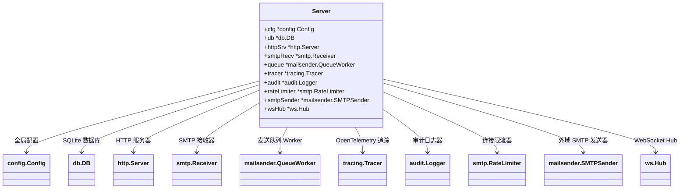
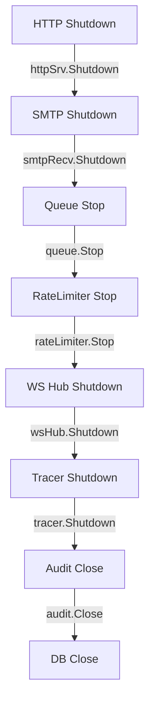
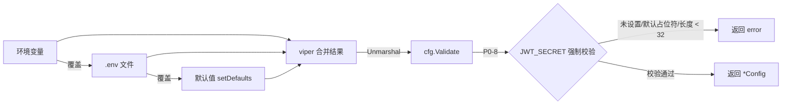
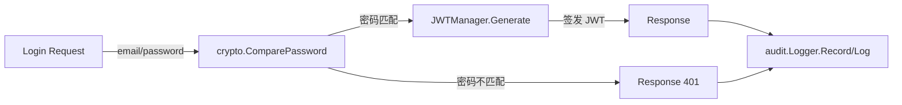

# 后端文件详解：入口与基础设施 + 安全加密 + 工具

本文档详细解读 MyMail Go 后端项目的「入口与基础设施」「安全加密」「工具」三大模块共 14 个源文件。面向初级开发人员，每个文件均包含：文件路径与所属包、功能概述、关键类型/结构体、关键函数签名与实现要点、依赖关系、代码片段引用，以及从代码注释中提取的设计决策与 Bug 编号。

---

## 1. 应用入口 cmd/mymail/main.go

### 1.1 文件功能

- **文件路径**：`cmd/mymail/main.go`
- **所属包**：`package main`
- **功能概述**：MyMail 应用的可执行入口点，负责加载配置、初始化日志、构建服务器实例、启动 HTTP 服务并处理优雅关闭（graceful shutdown）。该文件保持极简，仅做编排（orchestration），不包含业务逻辑，所有具体能力都委托给 `internal/` 子包。

### 1.2 main() 函数详解

```go
func main()
```

- **参数**：无
- **返回值**：无
- **功能**：程序入口，按固定顺序完成启动与关闭流程。
- **实现要点**：
  1. 调用 `config.Load()` 加载配置（含 **P0-8** 修复：`JWT_SECRET` 强制校验）。若失败，由于 logger 尚未初始化，直接用标准库 `slog.Error` 输出并 `os.Exit(1)`。
  2. 将构建时通过 `-ldflags` 注入的 `version` 写入 `cfg.Version`。
  3. 调用 `logger.Init()` 初始化结构化日志，随后打印启动 banner。
  4. 用 `signal.NotifyContext` 创建根 context，监听 `SIGINT`/`SIGTERM`，`defer stop()` 释放信号订阅。
  5. 调用 `server.New(ctx, cfg)` 构建服务器实例。
  6. 在独立 goroutine 中调用 `srv.Start()`，避免阻塞主 goroutine 监听信号。
  7. `<-ctx.Done()` 阻塞等待终止信号。
  8. 创建 30 秒超时 context，调用 `srv.Shutdown()` 优雅关闭。

### 1.3 启动流程

```go
// 1. 加载配置（含 P0-8 修复：JWT_SECRET 强制校验）
cfg, err := config.Load()
if err != nil {
    slog.Error("配置加载失败", "error", err)
    os.Exit(1)
}
cfg.Version = version

// 2. 初始化结构化日志（slog + trace_id 注入）
logger.Init(cfg.LogLevel, cfg.LogFormat)

// 4. 构建并启动服务器
srv, err := server.New(ctx, cfg)
```

`version` 是包级变量，默认值 `"dev"`，构建时通过 `go build -ldflags "-X main.version=v1.0.0"` 注入。

启动流程图如下：



上图展示了 MyMail 从 `main.go` 到 `server.New` 的完整启动链路：先加载配置并初始化日志，然后在 `Server` 构造函数中按顺序完成数据库、DAO、Service、路由的初始化，最终调用 `Start()` 同时启动 HTTP、SMTP 与队列服务。任一中间步骤失败都会立即返回错误，避免带着不完整状态继续启动。

### 1.4 优雅关闭

```go
// 5. 等待终止信号
<-ctx.Done()
slog.Info("收到终止信号，开始优雅关闭...")

// 给予 30 秒优雅关闭窗口
shutdownCtx, cancel := context.WithTimeout(context.Background(), 30*time.Second)
defer cancel()

if err := srv.Shutdown(shutdownCtx); err != nil {
    slog.Error("优雅关闭失败", "error", err)
    os.Exit(1)
}
```

优雅关闭窗口为 30 秒，足够让在途 HTTP 请求、SMTP 连接、队列任务完成。若超时仍未结束，则强制退出。HTTP 服务在 goroutine 中启动时，通过 `errors.Is(err, http.ErrServerClosed)` 区分「正常关闭」与「异常退出」。

### 1.5 依赖关系

- `internal/config`：加载配置
- `internal/logger`：初始化日志
- `internal/server`：构建与启动服务器
- 标准库：`context`、`errors`、`log/slog`、`net/http`、`os`、`os/signal`、`syscall`、`time`

---

## 2. 服务器编排 internal/server/server.go

### 2.1 文件功能

- **文件路径**：`internal/server/server.go`
- **所属包**：`package server`
- **功能概述**：服务器编排层，负责初始化数据库、DAO 层、Service 层、HTTP 路由、SMTP 接收器、队列 worker、追踪、审计等全部运行时依赖，并提供 `Start()` 与 `Shutdown()` 方法。这是整个应用的依赖注入（Dependency Injection）中心。

### 2.2 Server 结构体

```go
type Server struct {
    cfg         *config.Config
    db          *db.DB
    httpSrv     *http.Server
    smtpRecv    *smtp.Receiver
    queue       *mailsender.QueueWorker
    tracer      *tracing.Tracer
    audit       *audit.Logger
    rateLimiter *smtp.RateLimiter       // SMTP 连接限流器（Shutdown 时停止后台清理）
    smtpSender  *mailsender.SMTPSender  // 外部 SMTP 发送器（供 queue 外域发送）
    wsHub       *ws.Hub                 // WebSocket 连接管理器（Shutdown 时优雅关闭）
}
```

字段说明：
- `cfg`：全局配置引用
- `db`：SQLite 数据库连接（含连接池）
- `httpSrv`：标准库 HTTP 服务器
- `smtpRecv`：SMTP 接收器（端口 25 监听）
- `queue`：发送队列 worker（后台 goroutine）
- `tracer`：OpenTelemetry 追踪器（可选）
- `audit`：审计日志器
- `rateLimiter`：SMTP 连接级限流器（含后台清理 goroutine）
- `smtpSender`：外域 SMTP 发送器
- `wsHub`：WebSocket 连接管理器

`Server` 结构体核心依赖关系如下图所示：



上图用类图形式呈现了 `Server` 结构体所持有的全部核心依赖。`cfg` 与 `db` 是最基础的输入；`httpSrv`、`smtpRecv`、`queue` 负责对外服务；`tracer`、`audit`、`rateLimiter` 提供可观测性与安全防护；`smtpSender` 和 `wsHub` 分别支撑外域邮件投递与实时通知。

### 2.3 New() 构造函数

```go
func New(ctx context.Context, cfg *config.Config) (*Server, error)
```

- **参数**：`ctx` 根 context（用于追踪初始化）；`cfg` 已校验的配置
- **返回值**：`*Server` 服务器实例；`error` 初始化错误
- **功能**：按顺序完成 10 个阶段初始化，任一阶段失败立即返回错误。

初始化顺序：
1. 数据库连接 + 自动迁移（`db.Open` + `database.Migrate`）
2. OpenTelemetry 追踪（可选，受 `TracingEnabled` 控制；失败仅 Warn 不退出）
3. DAO 层初始化（User/Message/Attachment/SendLog/MailQueue DAO）
4. 阶段 5 扩展 DAO：APIKey/Settings/Rule DAO
5. JWT 管理器（**P0-8**：强制校验已在 `config.Validate` 完成）
6. 审计日志器（双写 DB + JSONL）
7. Service 层（Auth/Mail/APIKey/Admin/Rule）
8. 附件文件存储（**P0-7**：含 MIME 白名单 + 魔数校验）+ Maildir
9. HTTP 路由 + HTTP Server（含超时与 MaxHeaderBytes 配置）
10. SMTP 接收器 + 反垃圾组件（灰名单/SPF/DNSBL/Scorer/Validator/RateLimiter）+ 队列 worker

HTTP Server 关键超时配置：

```go
httpSrv := &http.Server{
    Addr:              addr,
    Handler:           router,
    ReadHeaderTimeout: 10 * time.Second,
    ReadTimeout:       60 * time.Second,
    WriteTimeout:      60 * time.Second,
    IdleTimeout:       120 * time.Second,
    MaxHeaderBytes:    1 << 20, // 1MB
}
```

这些超时是防御 Slowloris 等慢速攻击的关键配置。

### 2.4 Start() 方法

```go
func (s *Server) Start() error
```

- **参数**：无
- **返回值**：`error` 启动错误
- **功能**：阻塞启动 HTTP + SMTP 服务。
- **启动顺序**：
  1. 队列 worker（异步，内部 goroutine）
  2. SMTP 接收器（独立 goroutine，避免阻塞 HTTP）
  3. HTTP 服务（阻塞调用 `ListenAndServe`）

```go
func (s *Server) Start() error {
    s.queue.Start()
    go func() {
        if err := s.smtpRecv.Start(); err != nil {
            slog.Error("SMTP 接收器异常", "error", err)
        }
    }()
    slog.Info("HTTP 服务监听中", "addr", s.httpSrv.Addr)
    if err := s.httpSrv.ListenAndServe(); err != nil && !errors.Is(err, http.ErrServerClosed) {
        return err
    }
    return nil
}
```

### 2.5 Shutdown() 方法

```go
func (s *Server) Shutdown(ctx context.Context) error
```

- **参数**：`ctx` 关闭超时 context
- **返回值**：`error`（始终返回 nil，子步骤错误仅记录日志）
- **功能**：按与启动相反的顺序优雅关闭各组件。
- **关闭顺序**：HTTP → SMTP → 队列 worker → 限流器 → WebSocket Hub → 追踪 → 审计 → 数据库。

```go
// 3.1 停止 SMTP 限流器后台清理 goroutine（幂等）
if s.rateLimiter != nil {
    s.rateLimiter.Stop()
}
// 3.2 阶段 6：优雅关闭 WebSocket Hub（draining 所有连接）
if s.wsHub != nil {
    s.wsHub.Shutdown()
}
```

每个子步骤都做了 nil 检查，保证部分初始化失败时也能安全关闭。

优雅关闭顺序如下图所示：



关闭顺序遵循「先停对外服务，再停内部组件，最后关库」的原则：`HTTP` 与 `SMTP` 先拒绝新连接；`Queue` 与 `RateLimiter` 停止后台 goroutine；`WebSocket Hub` 断开所有长连接；`Tracer` 与 `Audit` 刷出未发送/未落盘数据；最后关闭数据库连接。每个步骤都有 nil 保护，确保部分初始化失败时也能安全退出。

### 2.6 依赖注入链

依赖关系（顶层 → 底层）：

```
main → server.New
         ├─ config.Config (输入)
         ├─ db.DB → DAO (User/Message/Attachment/SendLog/MailQueue/APIKey/Settings/Rule/Greylist/SpamLog)
         ├─ tracing.Tracer (可选)
         ├─ crypto.JWTManager
         ├─ audit.Logger → AuditDAO
         ├─ service.* (Auth/Mail/APIKey/Admin/Rule) ← 依赖 DAO + JWTManager + audit
         ├─ attachment.Store / maildir.Maildir
         ├─ ws.Hub
         ├─ httpapi.Router ← 依赖上述全部
         ├─ smtp.Receiver ← 依赖 userDAO + mailSvc + maildir + attachStore + 反垃圾组件
         └─ mailsender.QueueWorker ← 依赖 localDeliverer + smtpSender + queueDAO
```

### 2.7 依赖的外部包

`internal/audit`、`internal/config`、`internal/crypto`、`internal/httpapi`、`internal/mailsender`、`internal/service`、`internal/smtp`、`internal/spam`、`internal/storage/{attachment,dao,db,maildir}`、`internal/tracing`、`internal/ws`。

---

## 3. 配置管理 internal/config/config.go

### 3.1 文件功能

- **文件路径**：`internal/config/config.go`
- **所属包**：`package config`
- **功能概述**：使用 viper 加载配置，配置来源优先级为「环境变量 > .env 文件 > 默认值」。包含 **P0-8** 修复：`JWT_SECRET` 强制校验，未设置或为默认占位符或长度不足 32 字符时启动失败。

### 3.2 Config 结构体

`Config` 持有应用全部配置，按业务域分组：

- **基本信息**：`Env`、`Version`、`Debug`
- **服务器**：`Port`（默认 3000）、`Host`（默认 0.0.0.0）
- **域名**：`Domain`、`MailHost`
- **JWT**（P0-8）：`JWTSecret`、`JWTExpiresIn`（默认 24h）、`JWTRememberExpiresIn`（默认 720h）
- **数据库**：`DBPath`（默认 `./data/mymail.db`）
- **邮件存储**：`MaildirPath`、`AttachmentPath`、`MaxAttachmentSize`（默认 25MB）
- **管理员**：`AdminUsername`/`AdminPassword`/`AdminEmail`
- **SMTP**：端口、发送配置、TLS、连接限流（`SMTPMaxConnectionsPerIp` 默认 10、`SMTPRateWindowMs` 默认 60000）
- **灰名单**：`GreylistDelayMs`（默认 5 分钟）、`GreylistTtlMs`（默认 1 小时）
- **限流**：`RateLimitMax`、`SendRateLimitPerMin`
- **反垃圾**：`SpamThreshold`、`SpamSuspiciousThreshold`、SPF/DNSBL 配置
- **出站 SMTP 熔断器**（gobreaker）：6 个参数
- **出站 SMTP 重试**（backoff）：5 个参数
- **规则引擎**（**P1-7** ReDoS 防护）：`RulesMaxPatternLength`（默认 500）、`RulesCompileTimeoutMs`（默认 2000）
- **CORS**（**P1-2**）：`CORSAllowedOrigins`
- **可观测性**：日志、Metrics、Tracing
- **审计**：`AuditEnabled`、`AuditRetentionDays`
- **特性开关**：`FeatureSpamFilter`/`FeatureWSNotify`/`FeatureGreylist`/`FeatureAPIKey`/`FeatureRules`/`FeatureAudit`/`FeatureRegistration`（默认全部开启）

字段示例：

```go
type Config struct {
    Env     string `mapstructure:"ENV"`
    Version string
    Debug   bool `mapstructure:"DEBUG"`
    Port int    `mapstructure:"PORT"`
    Host string `mapstructure:"HOST"`
    // JWT（P0-8：强制校验）
    JWTSecret            string `mapstructure:"JWT_SECRET"`
    JWTExpiresIn         string `mapstructure:"JWT_EXPIRES_IN"`
    JWTRememberExpiresIn string `mapstructure:"JWT_REMEMBER_EXPIRES_IN"`
    // ...
}
```

### 3.3 Load() 函数

```go
func Load() (*Config, error)
```

- **参数**：无
- **返回值**：`*Config` 配置实例；`error` 加载或校验错误
- **功能**：创建 viper 实例，设置默认值，读取 `.env`，开启 `AutomaticEnv`，反序列化到 `Config`，最后调用 `Validate()`。
- **实现要点**：`.env` 不存在不报错（`_ = v.ReadInConfig()`）；环境变量不加前缀。

```go
v := viper.New()
setDefaults(v)
v.SetConfigFile(".env")
v.AutomaticEnv()
_ = v.ReadInConfig()
var cfg Config
if err := v.Unmarshal(&cfg); err != nil {
    return nil, fmt.Errorf("解析配置失败: %w", err)
}
if err := cfg.Validate(); err != nil {
    return nil, err
}
```

配置加载的优先级与 `P0-8` 强制校验流程如下图所示：



该图说明了 `config.Load()` 的取值规则：环境变量优先级最高，可覆盖 `.env` 文件中的值；`.env` 文件又可覆盖 `setDefaults()` 设置的默认值。无论以何种方式取值，最终都会经过 `Validate()` 的 `P0-8` 节点校验 `JWT_SECRET`，未通过则启动失败。

### 3.4 setDefaults() 函数

```go
func setDefaults(v *viper.Viper)
```

- **功能**：为所有配置项设置合理默认值。
- **关键默认值**：
  - `PORT=3000`、`HOST=0.0.0.0`
  - `JWT_EXPIRES_IN=24h`、`JWT_REMEMBER_EXPIRES_IN=720h`
  - `DB_PATH=./data/mymail.db`
  - `MAX_ATTACHMENT_SIZE=26214400`（25MB）
  - `SMTP_PORT=25`、`SMTP_SEND_PORT=587`
  - `SMTP_MAX_CONNECTIONS_PER_IP=10`、`SMTP_RATE_WINDOW_MS=60000`
  - `GREYLIST_DELAY_MS=300000`（5 分钟）、`GREYLIST_TTL_MS=3600000`（1 小时）
  - `SPF_MAX_DEPTH=10`（RFC 7208 建议的 include 递归上限）
  - `DNSBL_ZONES`：zen.spamhaus.org、bl.spamcop.net、b.barracudacentral.org
  - `RULES_MAX_PATTERN_LENGTH=500`、`RULES_COMPILE_TIMEOUT_MS=2000`（P1-7 ReDoS 防护）
  - 特性开关默认全部开启

### 3.5 Validate() 方法（P0-8 修复核心）

```go
func (c *Config) Validate() error
```

- **功能**：校验配置合法性，是 **P0-8** 修复的核心。
- **校验规则**：
  1. `JWT_SECRET` 必须设置，提示用 `openssl rand -hex 32` 生成
  2. 拒绝默认占位符（`change-me-in-production`、`change_me`、`changeme`、含 `change-me`）
  3. `JWT_SECRET` 长度必须 ≥ 32 字符
  4. `DOMAIN` 必填
  5. 生产环境（`Env == "prod"`）额外校验：不能开启 `Debug`、必须配置 `CORSAllowedOrigins`、必须开启 `MetricsEnabled`

```go
if c.JWTSecret == "" {
    return fmt.Errorf("JWT_SECRET 必须设置，请用 `openssl rand -hex 32` 生成")
}
lowerSecret := strings.ToLower(c.JWTSecret)
if lowerSecret == "change-me-in-production" ||
    lowerSecret == "change_me" ||
    lowerSecret == "changeme" ||
    strings.Contains(lowerSecret, "change-me") {
    return fmt.Errorf("JWT_SECRET 不能使用默认占位符，请生成随机字符串")
}
if len(c.JWTSecret) < 32 {
    return fmt.Errorf("JWT_SECRET 长度必须 >= 32 字符（当前 %d）", len(c.JWTSecret))
}
```

### 3.6 依赖关系

- `github.com/spf13/viper`：配置加载
- 标准库：`fmt`、`strings`

### 3.7 设计决策与 Bug 编号

- **P0-8**：JWT_SECRET 强制校验，防止生产环境使用默认密钥导致 token 可伪造
- **P1-7**：规则引擎 ReDoS 防护（正则长度 + 编译超时）
- **P1-2**：CORS 白名单（生产环境强制配置）

---

## 4. 日志系统 internal/logger/logger.go

### 4.1 文件功能

- **文件路径**：`internal/logger/logger.go`
- **所属包**：`package logger`
- **功能概述**：基于标准库 `log/slog` 的结构化日志，自动注入 `trace_id`、`span_id`（来自 OpenTelemetry）和 `request_id`（来自中间件），实现全链路日志关联。

### 4.2 关键类型

```go
type contextKey string
const RequestIDKey contextKey = "request_id"

type traceHandler struct {
    slog.Handler  // 包装底层 handler
}
```

- `contextKey`：自定义 context key 类型，避免键冲突
- `RequestIDKey`：用于从 context 中存取 request_id
- `traceHandler`：包装 `slog.Handler`，在每条日志记录中注入追踪字段

### 4.3 全局变量

```go
var L *slog.Logger
```

`L` 是全局 logger 实例，由 `Init()` 创建。其他包通过 `slog.Info(...)`（已 `SetDefault`）或 `logger.L` 访问。

### 4.4 traceHandler.Handle() 方法

```go
func (h *traceHandler) Handle(ctx context.Context, r slog.Record) error
```

- **参数**：`ctx` 携带追踪信息；`r` 日志记录
- **返回值**：`error` 底层 handler 错误
- **功能**：在每条日志记录中注入 `trace_id`、`span_id`、`request_id`。
- **实现要点**：
  - 从 `ctx` 提取 `trace.SpanFromContext(ctx)`，若 `SpanContext().IsValid()` 则注入 trace_id 和 span_id
  - 从 `ctx.Value(RequestIDKey)` 提取 request_id（中间件存入）

```go
func (h *traceHandler) Handle(ctx context.Context, r slog.Record) error {
    if span := trace.SpanFromContext(ctx); span.SpanContext().IsValid() {
        sc := span.SpanContext()
        r.AddAttrs(
            slog.String("trace_id", sc.TraceID().String()),
            slog.String("span_id", sc.SpanID().String()),
        )
    }
    if reqID, ok := ctx.Value(RequestIDKey).(string); ok && reqID != "" {
        r.AddAttrs(slog.String("request_id", reqID))
    }
    return h.Handler.Handle(ctx, r)
}
```

### 4.5 Init() 函数

```go
func Init(level string, format string)
```

- **参数**：`level` 日志级别（debug/info/warn/error）；`format` 输出格式（json/text）
- **返回值**：无
- **功能**：初始化全局 logger，设置级别、格式、AddSource，并包装为 `traceHandler`。
- **实现要点**：调用 `slog.SetDefault(L)` 使 `slog.Info` 等包级函数自动使用带追踪的 logger。

```go
opts := &slog.HandlerOptions{
    Level:     lvl,
    AddSource: true,  // 记录源码位置
}
var h slog.Handler
if strings.ToLower(format) == "text" {
    h = slog.NewTextHandler(os.Stdout, opts)
} else {
    h = slog.NewJSONHandler(os.Stdout, opts)
}
L = slog.New(&traceHandler{Handler: h})
slog.SetDefault(L)
```

### 4.6 WithContext() 函数

```go
func WithContext(ctx context.Context) *slog.Logger
```

- **参数**：`ctx` 携带追踪信息的 context
- **返回值**：`*slog.Logger` 带 context 的 logger
- **功能**：返回带 context 的 logger。
- **实现要点**：若 `L` 未初始化（nil），返回 `slog.Default()` 兜底。

### 4.7 依赖关系

- `go.opentelemetry.io/otel/trace`：提取 span context
- 标准库：`context`、`log/slog`、`os`、`strings`

---

## 5. 指标系统 internal/metrics/metrics.go

### 5.1 文件功能

- **文件路径**：`internal/metrics/metrics.go`
- **所属包**：`package metrics`
- **功能概述**：定义 Prometheus 指标，指标命名遵循 `mymail_*` 命名空间约定。使用 `promauto` 自动注册到默认 registry。所有指标为包级变量，全局共享。

### 5.2 指标分组

文件按业务域分 5 组定义指标：

#### HTTP 指标

```go
HTTPRequestsTotal = promauto.NewCounterVec(
    prometheus.CounterOpts{Name: "mymail_http_requests_total", Help: "HTTP 请求总数"},
    []string{"method", "path", "status"},
)
HTTPRequestDuration = promauto.NewHistogramVec(
    prometheus.HistogramOpts{Name: "mymail_http_request_duration_seconds", ...},
    []string{"method", "path"},
)
HTTPRequestsInFlight = promauto.NewGauge(...)  // 当前在途请求数
```

#### 业务指标

- `MailsReceivedTotal`（Counter，labels: folder, spam_action）：接收邮件总数
- `MailsSentTotal`（Counter，labels: status）：发送邮件总数
- `QueueDepth`（Gauge）：发送队列当前深度

#### SMTP 指标（阶段 4 使用）

- `SMTPConnectionsActive`（Gauge）：活跃 SMTP 连接数
- `SMTPConnectionsTotal`（Counter，labels: result）：SMTP 连接总数

#### 基础设施指标

- `DBConnectionsActive`（Gauge）：活跃数据库连接数
- `AuthAttemptsTotal`（Counter，labels: method, result）：认证尝试总数

#### WebSocket 指标（阶段 6 使用）

- `WSConnectionsActive`（Gauge）
- `WSConnectionsTotal`（Counter，labels: result）
- `WSMessagesSent`（Counter，labels: type）

### 5.3 设计要点

- 所有指标用 `promauto` 创建，自动注册，无需手动 `Register`
- Counter 用 `CounterVec` 支持多维度标签
- Histogram 用 `prometheus.DefBuckets` 默认桶
- Gauge 用于可增可减的瞬时值（连接数、队列深度）

### 5.4 依赖关系

- `github.com/prometheus/client_golang/prometheus`
- `github.com/prometheus/client_golang/prometheus/promauto`

---

## 6. 分布式追踪 internal/tracing/tracing.go

### 6.1 文件功能

- **文件路径**：`internal/tracing/tracing.go`
- **所属包**：`package tracing`
- **功能概述**：提供 OpenTelemetry 分布式追踪初始化。采样后的追踪数据通过 OTLP HTTP 协议导出到配置的 Collector。

### 6.2 Tracer 结构体

```go
type Tracer struct {
    tp *trace.TracerProvider
}
```

- `tp`：OpenTelemetry TracerProvider，封装 exporter、resource、sampler

### 6.3 Init() 函数

```go
func Init(ctx context.Context, endpoint, serviceName string, sampleRate float64) (*Tracer, error)
```

- **参数**：`ctx`；`endpoint` OTLP Collector 地址（如 `localhost:4318`）；`serviceName` 服务名；`sampleRate` 采样率 0.0-1.0
- **返回值**：`*Tracer` 追踪器；`error`
- **功能**：创建 OTLP HTTP exporter、resource（含 service.name 和 service.version）、TracerProvider，并注册为全局 TracerProvider 与 TraceContext propagator。
- **实现要点**：使用 `otlptracehttp.WithInsecure()`（明文，适合本地开发）；sampler 用 `TraceIDRatioBased`。

```go
exporter, err := otlptracehttp.New(ctx,
    otlptracehttp.WithEndpoint(endpoint),
    otlptracehttp.WithInsecure(),
)
res, err := resource.New(ctx,
    resource.WithAttributes(
        semconv.ServiceName(serviceName),
        semconv.ServiceVersion("1.0.0"),
    ),
)
tp := trace.NewTracerProvider(
    trace.WithBatcher(exporter),       // 批量导出
    trace.WithResource(res),
    trace.WithSampler(trace.TraceIDRatioBased(sampleRate)),
)
otel.SetTracerProvider(tp)
otel.SetTextMapPropagator(propagation.TraceContext{})
```

### 6.4 Shutdown() 方法

```go
func (t *Tracer) Shutdown(ctx context.Context) error
```

- **参数**：`ctx` 关闭超时
- **返回值**：`error`
- **功能**：优雅关闭追踪 exporter，刷新未发送的 span 到 Collector。
- **实现要点**：nil 检查保护，`tp == nil` 时直接返回 nil。

### 6.5 依赖关系

- `go.opentelemetry.io/otel`：全局注册
- `go.opentelemetry.io/otel/exporters/otlp/otlptrace/otlptracehttp`：OTLP HTTP exporter
- `go.opentelemetry.io/otel/propagation`：TraceContext propagator
- `go.opentelemetry.io/otel/sdk/resource`：资源（service.name 等）
- `go.opentelemetry.io/otel/sdk/trace`：TracerProvider、sampler
- `go.opentelemetry.io/otel/semconv/v1.21.0`：语义约定属性

---

## 7. API Key 加密 internal/crypto/apikey.go

### 7.1 文件功能

- **文件路径**：`internal/crypto/apikey.go`
- **所属包**：`package crypto`
- **功能概述**：实现 API Key 生成与校验。包含 **P1-3** 修复：用 `key_prefix` 索引避免原 Node.js 全表 O(n) bcrypt 比对。

### 7.2 设计决策（P1-3 修复）

```go
// 设计（P1-3 修复）：
//   - 格式：mk_<32字节hex>（共 67 字符）
//   - key_prefix：前 12 字符（mk_ + 9 hex），存入 DB 用于 O(1) 索引查找
//   - 哈希：bcrypt（复用 HashPassword），与用户密码哈希互通
//   - 查找流程：明文 key → 提取 prefix → WHERE key_prefix=? → bcrypt.Compare
//     避免原 Node.js 全表 O(n) bcrypt 比对
```

### 7.3 关键常量

```go
const (
    APIKeyPrefix    = "mk_"      // 固定前缀
    keyPrefixLength = 12         // 索引用前缀长度（mk_ + 9 hex）
    keyRandomBytes  = 32         // 随机部分字节数（64 hex 字符）
)
```

### 7.4 APIKeyResult 结构体

```go
type APIKeyResult struct {
    PlainText string // 明文 key（mk_ + 64 hex），仅创建时返回一次
    KeyHash   string // bcrypt 哈希
    KeyPrefix string // 前缀（12 字符），用于索引查找
}
```

- `PlainText`：仅在创建时返回一次，后续无法恢复（只存哈希）
- `KeyHash`：存入数据库
- `KeyPrefix`：存入数据库，用于 O(1) 索引查找

### 7.5 GenerateAPIKey() 函数

```go
func GenerateAPIKey() (*APIKeyResult, error)
```

- **参数**：无
- **返回值**：`*APIKeyResult`；`error`
- **功能**：生成新的 API Key（明文 + 哈希 + 前缀）。
- **实现要点**：
  1. 用 `crypto/rand.Read` 生成 32 字节随机数
  2. 拼接 `mk_` + hex 编码得到明文（67 字符）
  3. 调用 `HashPassword`（bcrypt）生成哈希
  4. 调用 `ExtractKeyPrefix` 提取前缀

```go
buf := make([]byte, keyRandomBytes)
if _, err := rand.Read(buf); err != nil {
    return nil, fmt.Errorf("生成随机数失败: %w", err)
}
plaintext := APIKeyPrefix + hex.EncodeToString(buf)
hash, err := HashPassword(plaintext)
// ...
return &APIKeyResult{
    PlainText: plaintext,
    KeyHash:   hash,
    KeyPrefix: ExtractKeyPrefix(plaintext),
}, nil
```

### 7.6 其他函数

```go
func ExtractKeyPrefix(key string) string  // 提取前 12 字符
func VerifyAPIKey(hash, plaintext string) error  // 复用 ComparePassword
func IsAPIKeyFormat(s string) bool  // 检查 mk_ 前缀 + 至少 12 字符
```

- `ExtractKeyPrefix`：长度不足时返回原字符串（防御性）
- `VerifyAPIKey`：直接委托给 `ComparePassword`，复用 bcrypt
- `IsAPIKeyFormat`：用于中间件快速判断是否为 API Key 认证

### 7.7 依赖关系

- 包内：`HashPassword`、`ComparePassword`（来自 `bcrypt.go`）
- 标准库：`crypto/rand`、`encoding/hex`、`fmt`、`strings`

---

## 8. 密码哈希 internal/crypto/bcrypt.go

### 8.1 文件功能

- **文件路径**：`internal/crypto/bcrypt.go`
- **所属包**：`package crypto`
- **功能概述**：提供 bcrypt 密码哈希与校验，与原 Node.js 后端互通（cost=12，`$2a$` 前缀）。

### 8.2 关键常量

```go
const BcryptCost = 12
```

- **设计决策**：cost=12 与原 Node.js 后端保持一致，确保密码哈希互通。Go 生成的 `$2a$` 哈希可被 Node.js `bcrypt.compare` 验证。

### 8.3 HashPassword() 函数

```go
func HashPassword(password string) (string, error)
```

- **参数**：`password` 明文密码
- **返回值**：`string` bcrypt 哈希（`$2a$` 开头）；`error`
- **功能**：对明文密码进行 bcrypt 哈希。
- **实现要点**：空密码直接返回错误；底层调用 `bcrypt.GenerateFromPassword`。

```go
func HashPassword(password string) (string, error) {
    if password == "" {
        return "", fmt.Errorf("密码不能为空")
    }
    hash, err := bcrypt.GenerateFromPassword([]byte(password), BcryptCost)
    if err != nil {
        return "", fmt.Errorf("密码哈希失败: %w", err)
    }
    return string(hash), nil
}
```

### 8.4 ComparePassword() 函数

```go
func ComparePassword(hashedPassword, password string) error
```

- **参数**：`hashedPassword` 哈希；`password` 明文
- **返回值**：`error`（nil 表示匹配）
- **功能**：校验明文密码与哈希是否匹配。
- **实现要点**：兼容 `$2a$`/`$2b$`/`$2y$` 三种前缀（Go bcrypt 原生支持）。

```go
func ComparePassword(hashedPassword, password string) error {
    return bcrypt.CompareHashAndPassword([]byte(hashedPassword), []byte(password))
}
```

### 8.5 依赖关系

- `golang.org/x/crypto/bcrypt`
- 标准库：`fmt`

### 8.6 设计决策

- **跨语言互通**：cost=12 + `$2a$` 前缀，确保 Go 与 Node.js 后端密码哈希互通，便于从 Node.js 迁移到 Go 时用户密码不重置。

---

## 9. JWT 管理 internal/crypto/jwt.go

### 9.1 文件功能

- **文件路径**：`internal/crypto/jwt.go`
- **所属包**：`package crypto`
- **功能概述**：实现 JWT 生成与校验，支持 `KeyRotator` 密钥轮换。算法 HS256，payload 与原 Node.js 后端一致（`{id, email, role}`）。

### 9.2 Claims 结构体

```go
type Claims struct {
    ID    int64  `json:"id"`
    Email string `json:"email"`
    Role  string `json:"role"`
    jwt.RegisteredClaims
}
```

- 与原 Node.js 后端一致：仅 `id`/`email`/`role` + 标准声明（`IssuedAt`、`ExpiresAt`）。

### 9.3 JWTManager 结构体

```go
type JWTManager struct {
    rotator           *KeyRotator
    expiresIn         time.Duration
    rememberExpiresIn time.Duration
}
```

- `rotator`：密钥轮换器（支持多密钥并存）
- `expiresIn`：普通登录过期时间
- `rememberExpiresIn`：「记住我」过期时间

### 9.4 NewJWTManager() 构造函数

```go
func NewJWTManager(secret, expiresIn, rememberExpiresIn string) (*JWTManager, error)
```

- **参数**：`secret` 密钥；`expiresIn` 过期时间字符串（如 `24h`）；`rememberExpiresIn` 记住我过期时间（如 `720h`）
- **返回值**：`*JWTManager`；`error`
- **功能**：创建单密钥 JWT 管理器。
- **实现要点**：调用 `parseDuration` 解析时长字符串（支持 `24h`/`30d`/`60m`/`3600s`）。

### 9.5 Generate() 方法

```go
func (m *JWTManager) Generate(id int64, email, role string, remember bool) (string, error)
```

- **参数**：`id` 用户 ID；`email`；`role`；`remember` 是否使用「记住我」过期时间
- **返回值**：`string` 签名后的 JWT；`error`
- **功能**：生成 JWT。
- **实现要点**：用当前主密钥（`rotator.CurrentKey()`）签名，算法 HS256。

```go
claims := Claims{
    ID: id, Email: email, Role: role,
    RegisteredClaims: jwt.RegisteredClaims{
        IssuedAt:  jwt.NewNumericDate(now),
        ExpiresAt: jwt.NewNumericDate(now.Add(exp)),
    },
}
token := jwt.NewWithClaims(jwt.SigningMethodHS256, claims)
signed, err := token.SignedString(m.rotator.CurrentKey())
```

### 9.6 Verify() 方法（支持密钥轮换）

```go
func (m *JWTManager) Verify(tokenString string) (*Claims, error)
```

- **参数**：`tokenString` JWT 字符串
- **返回值**：`*Claims`；`error`
- **功能**：校验 JWT。
- **实现要点**（企业级密钥轮换）：
  1. 先用当前主密钥校验
  2. 失败则依次尝试 `rotator.OldKeys()` 中的历史密钥
  3. 任一成功即返回 Claims
  4. 校验签名算法必须是 HS256（防止 `alg=none` 攻击）

```go
_, err := jwt.ParseWithClaims(tokenString, claims, func(t *jwt.Token) (any, error) {
    alg, ok := t.Method.(*jwt.SigningMethodHMAC)
    if !ok || alg.Alg() != jwt.SigningMethodHS256.Alg() {
        return nil, fmt.Errorf("非预期的签名算法: %v", t.Header["alg"])
    }
    return m.rotator.CurrentKey(), nil
})
if err != nil {
    // 主密钥失败，尝试轮换中的旧密钥
    for _, key := range m.rotator.OldKeys() {
        // ... 用 key 重试
    }
}
```

### 9.7 KeyRotator 结构体（密钥轮换）

```go
type KeyRotator struct {
    mu       sync.RWMutex
    current  []byte
    previous [][]byte
}
```

- `current`：当前签名密钥
- `previous`：历史密钥列表（仅保留最近 2 个）
- `mu`：读写锁，保证并发安全

方法：
```go
func NewKeyRotator(secret string) *KeyRotator       // 创建单密钥轮换器
func (r *KeyRotator) CurrentKey() []byte            // 当前签名密钥
func (r *KeyRotator) OldKeys() [][]byte             // 历史密钥（返回副本）
func (r *KeyRotator) Rotate(newSecret string)       // 轮换：当前降级为历史，新密钥成为当前
```

`Rotate` 仅保留最近 2 个历史密钥，避免无限增长：

```go
func (r *KeyRotator) Rotate(newSecret string) {
    r.mu.Lock()
    defer r.mu.Unlock()
    r.previous = append(r.previous, r.current)
    if len(r.previous) > 2 {
        r.previous = r.previous[len(r.previous)-2:]
    }
    r.current = []byte(newSecret)
}
```

### 9.8 parseDuration() 函数

```go
func parseDuration(s string) (time.Duration, error)
```

- **功能**：解析时长字符串，兼容原 Node.js 格式。
- **实现要点**：`d` 后缀按天换算（如 `30d` → 30×24h），其他用 `time.ParseDuration`。

### 9.9 依赖关系

- `github.com/golang-jwt/jwt/v5`
- 标准库：`errors`、`fmt`、`sync`、`time`

### 9.10 设计决策

- **跨语言兼容**：HS256 + payload `{id, email, role}` 与 Node.js `jsonwebtoken` 一致
- **企业级密钥轮换**：支持新旧密钥并存，便于定期轮换与密钥泄露紧急轮换
- **算法白名单**：Verify 强制校验 HS256，防止 `alg=none` 攻击

---

## 10. HTML 净化 internal/sanitize/html.go

### 10.1 文件功能

- **文件路径**：`internal/sanitize/html.go`
- **所属包**：`package sanitize`
- **功能概述**：实现 HTML 净化，防御 XSS。包含 **P0-4** 修复（后端部分）：原 Node.js 后端对邮件 HTML 零处理，前端 `v-html` 直接渲染存在存储型 XSS 风险。

### 10.2 P0-4 修复说明

```go
// P0-4 修复（后端部分）：原 Node.js 后端对邮件 HTML 零处理，body_html 原样入库原样返回，
// 前端 MailDetailView.vue 直接 v-html，存在存储型 XSS 风险。
//
// 本包用 bluemonday UGCPolicy（用户生成内容策略）净化：
//   - 保留常见格式标签（p/div/span/a/img/ul/ol/li/table 等）
//   - 移除 script/style/iframe/object/embed/form 等危险标签
//   - 移除所有 on* 事件属性
//   - a 标签 href 仅允许 http/https/mailto 协议（防 javascript:）
//   - img 标签 src 仅允许 http/https/data 协议
//
// 净化策略：邮件入库时调用 SanitizeHTML，净化后存 body_html，原始存 body_html_raw。
```

### 10.3 关键变量

```go
var (
    ugcPolicy     *bluemonday.Policy
    ugcPolicyOnce sync.Once
)
```

- `ugcPolicy`：预编译的 UGC 策略（线程安全，可并发使用）
- `ugcPolicyOnce`：单例初始化保证

### 10.4 policy() 函数

```go
func policy() *bluemonday.Policy
```

- **功能**：返回单例 UGC 策略。
- **实现要点**：用 `sync.Once` 保证只初始化一次；在 `UGCPolicy()` 基础上额外允许 `target` 属性（链接新窗口打开）。

```go
func policy() *bluemonday.Policy {
    ugcPolicyOnce.Do(func() {
        p := bluemonday.UGCPolicy()
        p.AllowAttrs("target").OnElements("a")
        ugcPolicy = p
    })
    return ugcPolicy
}
```

### 10.5 SanitizeHTML() 函数

```go
func SanitizeHTML(html string) string
```

- **参数**：`html` 待净化的 HTML 字符串
- **返回值**：`string` 净化后的安全 HTML
- **功能**：净化 HTML，输入为空返回空字符串。

### 10.6 SanitizeHTMLBytes() 函数

```go
func SanitizeHTMLBytes(html []byte) []byte
```

- **参数**：`html` 字节切片
- **返回值**：`[]byte` 净化后的字节切片
- **功能**：字节切片版本，输入为空返回 nil。

### 10.7 IsHTMLOnlyWhitespace() 函数

```go
func IsHTMLOnlyWhitespace(html string) bool
```

- **参数**：`html` HTML 字符串
- **返回值**：`bool`
- **功能**：判断 HTML 是否仅含空白（含被净化后变空的场景），用于决定是否回退显示 `body_text`。

### 10.8 依赖关系

- `github.com/microcosm-cc/bluemonday`
- 标准库：`sync`

### 10.9 设计决策

- **入库净化**：邮件入库时净化，净化后存 `body_html`，原始存 `body_html_raw`，既安全又保留原始数据
- **单例策略**：用 `sync.Once` 保证策略只初始化一次，bluemonday policy 并发安全

---

## 11. 审计日志 internal/audit/audit.go

### 11.1 文件功能

- **文件路径**：`internal/audit/audit.go`
- **所属包**：`package audit`
- **功能概述**：提供审计日志能力，记录「谁在何时从哪里对什么做了什么操作结果如何」。双写策略：SQLite `audit_log` 表（便于查询）+ JSONL 文件（便于离线归档、防篡改）。仅记录安全相关操作。

### 11.2 关键类型

#### ActorType（操作者类型）

```go
type ActorType string
const (
    ActorUser   ActorType = "user"
    ActorAdmin  ActorType = "admin"
    ActorAPI    ActorType = "api"
    ActorSMTP   ActorType = "smtp"
    ActorSystem ActorType = "system"
)
```

#### Result（操作结果）

```go
type Result string
const (
    ResultSuccess Result = "success"
    ResultFailure Result = "failure"
    ResultDenied  Result = "denied"
)
```

#### Entry 结构体

```go
type Entry struct {
    Timestamp    time.Time  `json:"timestamp"`
    ActorType    ActorType  `json:"actor_type"`
    ActorID      *int64     `json:"actor_id,omitempty"`
    ActorIP      string     `json:"actor_ip,omitempty"`
    Action       string     `json:"action"`
    ResourceType string     `json:"resource_type,omitempty"`
    ResourceID   string     `json:"resource_id,omitempty"`
    Result       Result     `json:"result"`
    Detail       string     `json:"detail,omitempty"`
    RequestID    string     `json:"request_id,omitempty"`
}
```

字段说明：
- `Timestamp`：发生时间
- `ActorType`/`ActorID`/`ActorIP`：操作者（谁 + 从哪里）
- `Action`：操作类型（如 `login`、`password_change`）
- `ResourceType`/`ResourceID`：操作对象（什么）
- `Result`：操作结果
- `Detail`：详细描述（JSON 字符串）
- `RequestID`：关联请求 ID（关联日志）

#### Logger 结构体

```go
type Logger struct {
    dao       *AuditDAO
    jsonlMu   sync.Mutex
    jsonlFile *os.File
    jsonlPath string
    enabled   bool
}
```

- `dao`：数据库访问对象
- `jsonlMu`：JSONL 文件写入互斥锁
- `jsonlFile`：JSONL 文件句柄
- `enabled`：是否启用（false 时所有操作 no-op）

### 11.3 NewLogger() 函数

```go
func NewLogger(database *db.DB, auditEnabled bool, jsonlPath string) (*Logger, error)
```

- **参数**：`database` DB；`auditEnabled` 是否启用；`jsonlPath` JSONL 文件路径（空则不写文件）
- **返回值**：`*Logger`；`error`
- **功能**：创建审计日志器。
- **实现要点**：若启用且 `jsonlPath` 非空，创建目录（`MkdirAll 0755`）并打开文件（`O_CREATE|O_APPEND|O_WRONLY`，权限 `0640`）。

### 11.4 Log() 方法（同步）

```go
func (l *Logger) Log(ctx context.Context, e Entry)
```

- **参数**：`ctx`；`e` 审计条目
- **返回值**：无
- **功能**：同步记录一条审计日志（写 DB + JSONL）。
- **实现要点**：
  1. 未启用直接返回
  2. 时间戳为零时填充当前时间
  3. 写 DB（失败仅记录错误日志）
  4. 写 JSONL（加锁序列化 + 追加换行）

```go
if l.jsonlFile != nil {
    l.jsonlMu.Lock()
    defer l.jsonlMu.Unlock()
    line, err := json.Marshal(e)
    // ...
    line = append(line, '\n')
    if _, err := l.jsonlFile.Write(line); err != nil {
        slog.Error("审计日志写入 JSONL 失败", "error", err, "action", e.Action)
    }
}
```

### 11.5 Record() 方法（异步）

```go
func (l *Logger) Record(ctx context.Context, e Entry)
```

- **参数**：`ctx`；`e` 审计条目
- **返回值**：无
- **功能**：异步记录审计日志（不阻塞调用方）。
- **实现要点**：启动 goroutine 调用 `Log`。**适用于业务流程中的审计埋点**，避免阻塞业务请求。

```go
func (l *Logger) Record(ctx context.Context, e Entry) {
    if !l.enabled {
        return
    }
    go l.Log(ctx, e)
}
```

### 11.6 Close() 方法

```go
func (l *Logger) Close() error
```

- **功能**：关闭 JSONL 文件句柄（刷盘）。
- **实现要点**：nil 检查保护。

### 11.7 依赖关系

- `internal/storage/db`：数据库连接
- 包内：`AuditDAO`（来自 `dao.go`）
- 标准库：`context`、`encoding/json`、`fmt`、`log/slog`、`os`、`path/filepath`、`sync`、`time`

### 11.8 设计决策

- **双写策略**：DB 便于查询 + JSONL 便于归档防篡改
- **同步/异步双 API**：`Log` 同步（关键场景）、`Record` 异步（业务埋点）
- **no-op 模式**：未启用时所有操作 no-op，调用方无需条件判断

### 11.9 认证与审计数据流

登录认证与审计日志的数据流如下图所示：



该图展示了登录请求的处理链路：首先通过 `crypto.ComparePassword`（底层使用 bcrypt）校验密码；校验成功后由 `JWTManager.Generate` 签发 token 并返回给客户端；无论成功还是失败，都会调用 `audit.Logger.Record` 或 `Log` 记录审计日志，满足「谁在何时从哪里做了什么、结果如何」的可观测要求。

---

## 12. 审计 DAO internal/audit/dao.go

### 12.1 文件功能

- **文件路径**：`internal/audit/dao.go`
- **所属包**：`package audit`
- **功能概述**：提供 `audit_log` 表的数据访问，封装插入操作。

### 12.2 AuditDAO 结构体

```go
type AuditDAO struct {
    db *db.DB
}
```

- `db`：数据库连接

### 12.3 NewAuditDAO() 函数

```go
func NewAuditDAO(database *db.DB) *AuditDAO
```

- **参数**：`database` DB
- **返回值**：`*AuditDAO`
- **功能**：创建 AuditDAO。

### 12.4 Insert() 方法

```go
func (d *AuditDAO) Insert(ctx context.Context, e Entry) error
```

- **参数**：`ctx`；`e` 审计条目
- **返回值**：`error`
- **功能**：插入一条审计日志到 `audit_log` 表。
- **实现要点**：
  - SQL 包含 10 个字段：`timestamp`、`actor_type`、`actor_id`、`actor_ip`、`action`、`resource_type`、`resource_id`、`result`、`detail`、`request_id`
  - `ActorID` 为 `*int64`，nil 时传 `any(nil)` 由驱动处理为 NULL
  - 时间戳转 UTC 并格式化为 `2006-01-02 15:04:05`

```go
const q = `INSERT INTO audit_log
    (timestamp, actor_type, actor_id, actor_ip, action, resource_type, resource_id, result, detail, request_id)
    VALUES (?, ?, ?, ?, ?, ?, ?, ?, ?, ?)`
var actorID any
if e.ActorID != nil {
    actorID = *e.ActorID
}
_, err := d.db.ExecContext(ctx, q,
    e.Timestamp.UTC().Format("2006-01-02 15:04:05"),
    string(e.ActorType),
    actorID,
    e.ActorIP,
    e.Action,
    e.ResourceType,
    e.ResourceID,
    string(e.Result),
    e.Detail,
    e.RequestID,
)
```

### 12.5 依赖关系

- `internal/storage/db`
- 标准库：`context`、`fmt`

---

## 13. 附件打包 internal/util/archive.go

### 13.1 文件功能

- **文件路径**：`internal/util/archive.go`
- **所属包**：`package util`
- **功能概述**：实现附件 zip 打包，用于批量下载。用标准库 `archive/zip` 流式写入避免 OOM，与原 Node.js `archiver` 行为兼容（`Content-Type=application/zip`）。

### 13.2 关键类型

```go
type ZipEntry struct {
    Filename   string // zip 内的文件名（显示给用户）
    SourcePath string // 磁盘上的源文件绝对路径
}

type ZipAttachmentsInput struct {
    Entries []ZipEntry
    Writer  io.Writer // 目标写入器（通常是 http.ResponseWriter）
}
```

### 13.3 ZipAttachments() 函数

```go
func ZipAttachments(in ZipAttachmentsInput) (int64, error)
```

- **参数**：`in` 打包输入（条目列表 + 写入器）
- **返回值**：`int64` 写入字节数；`error`
- **功能**：将多个附件流式打包为 zip 写入 `in.Writer`。
- **实现要点**：
  1. 空条目列表返回错误
  2. 用 `map[string]int` 跟踪已见文件名，重名时自动追加序号后缀（如 `report.pdf`、`report(1).pdf`）
  3. 调用 `appendFileToZip` 逐个追加
  4. 关闭 zip writer（写入中央目录）

```go
seenNames := make(map[string]int, len(in.Entries))
var total int64
for _, entry := range in.Entries {
    name := sanitizeZipName(entry.Filename)
    if cnt, exists := seenNames[name]; exists {
        seenNames[name] = cnt + 1
        ext := filepath.Ext(name)
        base := name[:len(name)-len(ext)]
        name = fmt.Sprintf("%s(%d)%s", base, cnt, ext)
    } else {
        seenNames[name] = 1
    }
    n, err := appendFileToZip(zipWriter, name, entry.SourcePath)
    // ...
}
```

### 13.4 appendFileToZip() 函数

```go
func appendFileToZip(zw *zip.Writer, name, srcPath string) (int64, error)
```

- **参数**：`zw` zip writer；`name` zip 内文件名；`srcPath` 源文件路径
- **返回值**：`int64` 写入的未压缩字节数；`error`
- **功能**：将单个文件追加到 zip writer。
- **实现要点**：
  1. 打开源文件（`defer Close`）
  2. 读取文件信息创建 zip header
  3. 设置 `header.Method = zip.Deflate`（默认压缩）
  4. `io.Copy` 流式写入

### 13.5 sanitizeZipName() 函数

```go
func sanitizeZipName(name string) string
```

- **参数**：`name` 原始文件名
- **返回值**：`string` 清理后的文件名
- **功能**：清理 zip 内文件名，**防止路径穿越**。
- **实现要点**：仅保留 `filepath.Base`，空/`.`/`..` 返回 `attachment`。

```go
func sanitizeZipName(name string) string {
    name = filepath.Base(name)
    if name == "" || name == "." || name == ".." {
        return "attachment"
    }
    return name
}
```

### 13.6 依赖关系

- 标准库：`archive/zip`、`fmt`、`io`、`os`、`path/filepath`

### 13.7 设计决策

- **流式写入**：用 `io.Copy` 流式写入，避免大附件 OOM
- **路径穿越防护**：`sanitizeZipName` 仅保留 basename，防止 `../../etc/passwd` 类攻击
- **重名处理**：自动追加 `(1)`/`(2)` 后缀，避免覆盖

---

## 14. 输入校验 internal/util/validator.go

### 14.1 文件功能

- **文件路径**：`internal/util/validator.go`
- **所属包**：`package util`
- **功能概述**：实现邮箱、用户名、文件夹等输入校验。兼容性：邮箱正则与原 Node.js `mail.js:111` 一致（宽松：`^[^\s@]+@[^\s@]+$`）。

### 14.2 关键变量

```go
var usernameRegex = regexp.MustCompile(`^[a-zA-Z0-9._]{3,20}$`)
var emailRegex    = regexp.MustCompile(`^[^\s@]+@[^\s@]+$`)

var validFolders = map[string]bool{
    "INBOX":  true,
    "SENT":   true,
    "DRAFTS": true,
    "TRASH":  true,
    "JUNK":   true,
}
```

- `usernameRegex`：用户名规则（字母、数字、点、下划线，3-20 字符），与原 Node.js + `auth_service.go` 一致
- `emailRegex`：邮箱宽松匹配（不要求顶级域名有点，比 RFC 5322 宽松但够用）
- `validFolders`：合法文件夹名（5 个，与原 Node.js 一致）

### 14.3 ValidateUsername() 函数

```go
func ValidateUsername(username string) error
```

- **参数**：`username` 用户名
- **返回值**：`error`（nil 表示合法）
- **功能**：校验用户名格式。
- **实现要点**：空返回错误；不匹配正则返回带提示的错误。

```go
func ValidateUsername(username string) error {
    if username == "" {
        return fmt.Errorf("用户名不能为空")
    }
    if !usernameRegex.MatchString(username) {
        return fmt.Errorf("用户名仅允许字母、数字、点、下划线，3-20字符")
    }
    return nil
}
```

### 14.4 ValidateEmail() 与 ValidateEmails()

```go
func ValidateEmail(email string) error       // 单个邮箱
func ValidateEmails(addrs []string) error    // 多个邮箱（切片）
```

- **功能**：校验邮箱格式。
- **实现要点**：`ValidateEmails` 任一不合法即返回错误（错误消息含第一个无效地址），与原 Node.js 一致；空字符串跳过。

### 14.5 SplitRecipients() 函数

```go
func SplitRecipients(s string) []string
```

- **参数**：`s` 逗号分隔的收件人字符串
- **返回值**：`[]string` 收件人列表
- **功能**：拆分收件人字符串，去空格、去空项。
- **实现要点**：与原 Node.js `mail.js:105-108` 的 `to.split(',')` 行为一致，但额外做 `TrimSpace`。

```go
func SplitRecipients(s string) []string {
    if s == "" {
        return nil
    }
    parts := strings.Split(s, ",")
    out := make([]string, 0, len(parts))
    for _, p := range parts {
        p = strings.TrimSpace(p)
        if p != "" {
            out = append(out, p)
        }
    }
    return out
}
```

### 14.6 ValidateFolder() 与 IsValidFolder()

```go
func ValidateFolder(folder string) error  // 错误版本
func IsValidFolder(folder string) bool    // 布尔版本
```

- **功能**：校验文件夹名是否合法。
- **实现要点**：用 `validFolders` map 查表，O(1)。

### 14.7 NormalizeEmail() 函数

```go
func NormalizeEmail(email string) string
```

- **参数**：`email` 邮箱
- **返回值**：`string` 标准化后的邮箱
- **功能**：标准化邮箱（小写 + 去空格），用于登录与投递时兼容大小写差异。

```go
func NormalizeEmail(email string) string {
    return strings.ToLower(strings.TrimSpace(email))
}
```

### 14.8 ExtractDomain() 与 ExtractUsername()

```go
func ExtractDomain(email string) string    // 提取域名（@ 之后，小写）
func ExtractUsername(email string) string  // 提取用户名（@ 之前，原样大小写）
```

- **功能**：从邮箱地址提取域名或用户名。
- **实现要点**：用 `strings.LastIndex(email, "@")` 找最后一个 `@`（兼容含多个 `@` 的异常输入）；无 `@` 时 `ExtractDomain` 返回空，`ExtractUsername` 返回原字符串。

```go
func ExtractDomain(email string) string {
    at := strings.LastIndex(email, "@")
    if at < 0 {
        return ""
    }
    return strings.ToLower(email[at+1:])
}
```

### 14.9 依赖关系

- 标准库：`fmt`、`regexp`、`strings`

### 14.10 设计决策

- **跨语言兼容**：邮箱正则与原 Node.js 一致，确保前后端校验规则统一
- **宽松邮箱校验**：不要求顶级域名有点，比 RFC 5322 宽松但够用，避免误拒合法邮箱
- **大小写处理**：`NormalizeEmail` 小写化用于存储与比对，`ExtractUsername` 保留原大小写用于显示

---

## 附录：Bug 编号与设计决策汇总

| 编号 | 模块 | 修复内容 |
|------|------|----------|
| **P0-4** | sanitize/html.go | 后端 HTML 净化，防御存储型 XSS（原 Node.js 零处理） |
| **P0-7** | server.go（引用） | 附件存储 MIME 白名单 + 魔数校验 |
| **P0-8** | config/config.go、main.go、server.go | JWT_SECRET 强制校验（必须设置、非默认占位符、长度≥32） |
| **P1-2** | config/config.go | CORS 白名单（生产环境强制配置） |
| **P1-3** | crypto/apikey.go | API Key 用 key_prefix 索引，避免全表 O(n) bcrypt 比对 |
| **P1-7** | config/config.go | 规则引擎 ReDoS 防护（正则长度 + 编译超时） |

## 附录：模块依赖关系图

```
main.go
  └─ server.go (编排)
       ├─ config.go (配置 + P0-8 校验)
       ├─ logger.go (slog + trace_id)
       ├─ tracing.go (OpenTelemetry)
       ├─ metrics.go (Prometheus 指标)
       ├─ crypto/
       │    ├─ bcrypt.go (密码哈希，跨语言互通)
       │    ├─ jwt.go (JWT + KeyRotator 密钥轮换)
       │    └─ apikey.go (API Key + P1-3 索引优化)
       ├─ sanitize/html.go (HTML 净化，P0-4 XSS 防御)
       ├─ audit/
       │    ├─ audit.go (双写 DB + JSONL)
       │    └─ dao.go (audit_log 表访问)
       ├─ util/
       │    ├─ archive.go (zip 打包，路径穿越防护)
       │    └─ validator.go (邮箱/用户名/文件夹校验)
       └─ (其他业务包：httpapi/service/smtp/spam/storage/ws/mailsender)
```

---

本文档覆盖了 MyMail Go 后端入口与基础设施、安全加密、工具三大模块共 14 个源文件，每个文件均包含功能概述、关键类型、关键函数详解、依赖关系、代码片段与设计决策。初级开发人员可按本文档顺序理解项目启动流程、依赖注入链、安全机制与工具函数实现。
