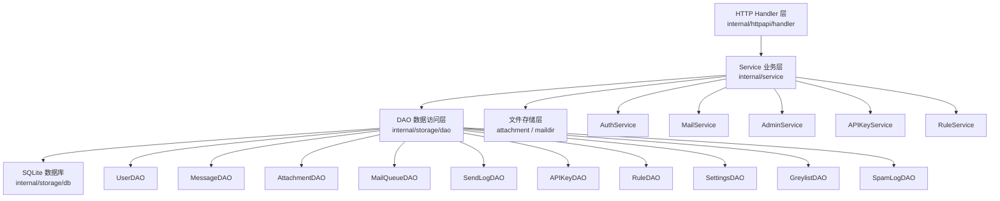
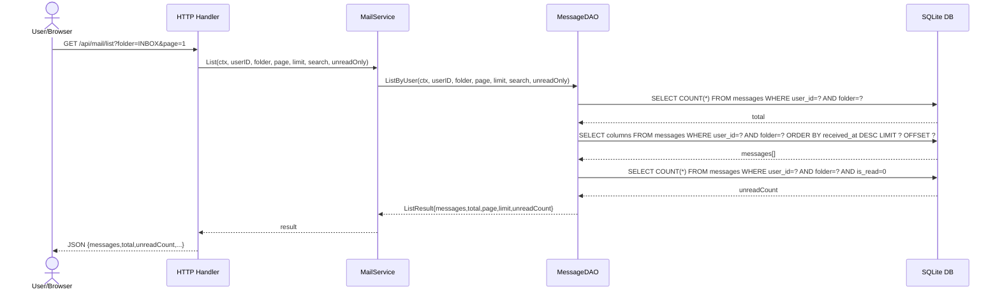
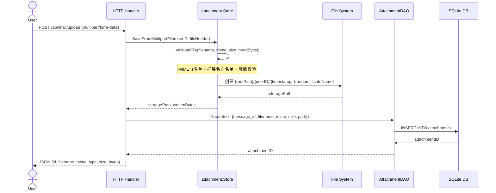
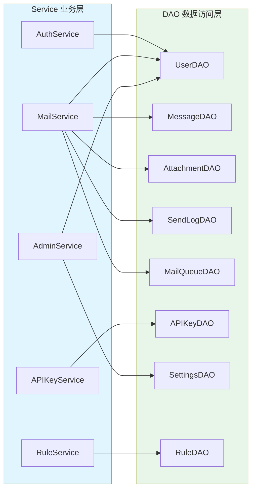

# 后端文件详解：业务服务与数据存储

> **文档定位**：MyMail Go 后端项目"业务服务层 + 数据存储层"模块详解
> **适用读者**：初级 Go 开发人员、维护本项目的工程师
> **配套文档**：《MyMail后端Go重构完整方案.md》《MyMail后端Go重构方案-企业级补充.md》
> **覆盖范围**：`internal/service/*`、`internal/storage/db/*`、`internal/storage/dao/*`、`internal/storage/attachment/*`、`internal/storage/maildir/*`、`internal/storage/db/migrations/*`

---

## 总览

MyMail 后端采用经典三层架构：HTTP Handler → Service（业务编排）→ DAO（数据访问）。本详解聚焦于后两层。

```
┌─────────────────────────────────────────────┐
│  HTTP Handler 层 (internal/httpapi/handler) │   ← 路由 + 请求解析
└──────────────────┬──────────────────────────┘
                   ▼
┌─────────────────────────────────────────────┐
│  Service 层 (internal/service)              │   ← 业务规则 + 事务编排
│   ├── AuthService   注册/登录/改密           │
│   ├── MailService   收发/CRUD/批量           │
│   ├── AdminService  管理员操作               │
│   ├── APIKeyService API Key 全生命周期       │
│   └── RuleService   规则 CRUD                │
└──────────────────┬──────────────────────────┘
                   ▼
┌─────────────────────────────────────────────┐
│  Storage 层 (internal/storage)              │
│   ├── db/          连接池 + 迁移 + 事务      │
│   ├── dao/         9 个 DAO（user/msg/...）  │   ← 纯 SQL 操作
│   ├── attachment/  附件文件存储              │
│   └── maildir/     Maildir 文件存储          │
└─────────────────────────────────────────────┘
```

### 架构分层调用关系图



**核心设计原则**：

1. **Service 不写 SQL，DAO 不写业务**：Service 负责校验、编排、事务、审计；DAO 只封装 SQL。
2. **关键多步操作必须事务化**：通过 `db.RunInTransaction` 包裹（修复 P1-1）。
3. **所有 `:id` 端点强制归属校验**：DAO 层用 `WHERE id = ? AND user_id = ?`（修复 P0-3）。
4. **错误消息与原 Node.js 完全一致**：前端依赖关键字匹配，不能改文案。

---

## 第一部分：业务服务层

业务服务层位于 `internal/service/`，共 5 个文件，每个文件对应一个独立业务域。所有 Service 通过构造函数注入 DAO 与依赖，便于测试与替换。

## 1. 认证服务 internal/service/auth_service.go

### 1.1 文件功能概述

`auth_service.go` 实现认证相关业务：注册、登录、登出、改密、强制改密。包注释明确指出"兼容性：所有错误消息与原 Node.js 后端完全一致（前端依赖关键字匹配）"，这是必须严守的契约。

文件同时实现"企业级增强"：登录失败/成功审计、Prometheus 指标、事务保护。这些增强不破坏前端兼容性，仅在原响应基础上叠加可观测性能力。

### 1.2 关键类型定义

#### AuthError 错误类型

```go
type AuthError struct {
    Status  int
    Message string
}
func (e *AuthError) Error() string { return e.Message }
```

`AuthError` 携带 HTTP 状态码与错误消息，与原 Node.js 响应格式完全一致（仅 `error` 字段）。HTTP Handler 通过 `IsAuthError(err)` 判断并提取状态码。

#### 预定义错误

```go
var (
    ErrUsernameRequired      = NewAuthError(400, "用户名和密码不能为空")
    ErrUsernameFormat        = NewAuthError(400, "用户名仅允许字母、数字、点、下划线，3-20字符")
    ErrPasswordTooShort      = NewAuthError(400, "密码至少6位")
    ErrUsernameExists        = NewAuthError(409, "用户名已存在")
    ErrEmailExists           = NewAuthError(409, "邮箱已被注册")
    ErrInvalidCredentials    = NewAuthError(401, "邮箱或密码错误")
    ErrAccountDisabled       = NewAuthError(403, "账号已被禁用")
    ErrCurrentPasswordWrong  = NewAuthError(401, "当前密码错误")
    // ...
)
```

这些错误消息必须与原 Node.js 字字对应，前端通过 `error.includes("已锁定")` 等关键字判断分支。

#### 锁定参数

```go
const (
    MaxLoginFails       = 5
    LockDurationMinutes = 15
)
```

连续失败 5 次锁定 15 分钟，与原 Node.js 一致。

#### AuthService 结构体

```go
type AuthService struct {
    userDAO     *dao.UserDAO      // 用户数据访问
    jwt         *crypto.JWTManager // JWT 生成
    audit       *audit.Logger     // 审计日志
    domain      string            // 邮件域名（如 example.com）
    maildirPath string            // maildir 根目录
}
```

依赖通过构造函数 `NewAuthService` 注入，便于单元测试用 mock 替换。

### 1.3 注册业务 Register

**方法签名**：

```go
func (s *AuthService) Register(ctx context.Context, username, password, displayName string) (*RegisterResult, error)
```

**业务规则**（13 步，与原 Node.js 完全一致）：

1. **非空校验**：`username` 或 `password` 为空 → `ErrUsernameRequired`（400）
2. **username 格式**：正则 `^[a-zA-Z0-9._]{3,20}$` 不匹配 → `ErrUsernameFormat`（400）
3. **password 长度**：`len(password) < 6` → `ErrPasswordTooShort`（400）
4. **displayName 长度**：传入时校验 1-50 字符 → `ErrDisplayNameLength`（400）
5. **username 唯一**：`userDAO.FindByUsername` 查到记录 → `ErrUsernameExists`（409）
6. **email 生成与唯一**：`email = SanitizeEmail(username@domain)`，查重 → `ErrEmailExists`（409）
7. **密码哈希**：`crypto.HashPassword(password)` 用 bcrypt 生成哈希
8. **首个用户自动 admin**：`userDAO.Count` 返回 0 时 `role = "admin"`，否则 `role = "user"`
9. **创建用户**：`userDAO.Create` 写入 `users` 表
10. **创建 maildir 目录**：`createMaildir(username)` 创建 `{maildirPath}/{domain}/{username}/{cur,new,tmp}`
11. **查询完整用户**：`userDAO.FindByID` 取回完整记录
12. **生成 JWT**：`jwt.Generate(userID, email, role, false)`
13. **审计日志**：`audit.Record` 记录 `auth.register` 事件

**关键代码片段**（email 标准化与唯一校验）：

```go
email := SanitizeEmail(fmt.Sprintf("%s@%s", username, s.domain))
existing, err = s.userDAO.FindByEmail(ctx, email)
if err != nil {
    return nil, fmt.Errorf("查询邮箱失败: %w", err)
}
if existing != nil {
    return nil, ErrEmailExists
}
```

`SanitizeEmail` 函数将邮箱统一为小写并去空格，避免大小写差异导致登录失败：

```go
func SanitizeEmail(email string) string {
    return strings.ToLower(strings.TrimSpace(email))
}
```

### 1.4 登录业务 Login

**方法签名**：

```go
func (s *AuthService) Login(ctx context.Context, email, password string, remember bool, clientIP string) (*LoginResult, error)
```

**业务规则**（8 步，含锁定逻辑）：

1. **非空校验**：`email` 或 `password` 为空 → `ErrEmailPasswordRequired`（400）
2. **查询用户**：`userDAO.FindByEmail`，未找到 → 记录审计 + 指标，返回 `ErrInvalidCredentials`（401，不暴露"用户不存在"以防枚举）
3. **禁用检查**：`!user.IsActive` → 记录审计，返回 `ErrAccountDisabled`（403）
4. **锁定检查**：`locked_until` 在未来 → 返回 423 + 剩余分钟数
5. **密码校验**：`crypto.ComparePassword` 失败时：
   - `fails = user.LoginFails + 1`
   - `fails >= 5`：`LockUser` 锁定 15 分钟，`UpdateLoginFails` 更新计数，返回 423 "连续失败5次，账号已锁定15分钟"
   - 否则：`UpdateLoginFails` 更新，返回 401 "邮箱或密码错误（还剩 N 次机会）"
6. **密码正确**：`ResetLoginFails` 清零失败计数与锁定时间（事务保护）
7. **生成 JWT**：`jwt.Generate(userID, email, role, remember)`
8. **审计 + 指标**：`metrics.AuthAttemptsTotal.WithLabelValues("login", "success").Inc()` + 审计日志

**关键代码片段**（锁定剩余时间计算）：

```go
if user.LockedUntil.Valid && user.LockedUntil.Time.After(time.Now()) {
    remaining := int(math.Ceil(user.LockedUntil.Time.Sub(time.Now()).Minutes()))
    if remaining < 1 {
        remaining = 1
    }
    s.recordFailedLogin(ctx, email, clientIP, "locked")
    return nil, NewAuthError(http.StatusLocked,
        fmt.Sprintf("账号已锁定，请 %d 分钟后重试", remaining))
}
```

**返回结构**：

```go
type LoginResult struct {
    Token                 string
    User                  *dao.User
    RequirePasswordChange bool // is_default_password=1 时为 true，前端引导强制改密
}
```

### 1.5 修改密码 ChangePassword / ChangeDefaultPassword

**ChangePassword**（用户主动改密，校验当前密码）：

```go
func (s *AuthService) ChangePassword(ctx context.Context, user *dao.User, currentPassword, newPassword string) error
```

流程：
1. `currentPassword` 或 `newPassword` 为空 → `ErrCurrentNewRequired`
2. `len(newPassword) < 6` → `ErrPasswordTooShort`
3. `crypto.ComparePassword(user.PasswordHash, currentPassword)` 失败 → `ErrCurrentPasswordWrong`
4. 哈希新密码 → `userDAO.UpdatePassword`
5. 审计日志 `auth.change_password`

**注意**：此接口不清除 `is_default_password` 标志（与原 Node.js 一致）。

**ChangeDefaultPassword**（强制改密，不校验当前密码，清除默认密码标志）：

```go
func (s *AuthService) ChangeDefaultPassword(ctx context.Context, user *dao.User, newPassword string) error
```

流程：
1. `newPassword` 为空 → `ErrNewPasswordRequired`
2. 长度校验
3. 哈希 + `UpdatePassword`
4. `userDAO.SetDefaultPassword(ctx, user.ID, false)` 清除标志
5. 审计日志 `auth.change_default_password`

### 1.6 更新个人资料 UpdateProfile

```go
func (s *AuthService) UpdateProfile(ctx context.Context, userID int64, displayName, signature *string) error
```

通过指针参数实现"选择性更新"：`nil` 表示不更新该字段。底层调用 `userDAO.UpdateProfile`，DAO 内动态拼接 SQL `SET` 子句。审计 `auth.update_profile`。

### 1.7 maildir 创建 createMaildir

```go
func (s *AuthService) createMaildir(username string) {
    base := filepath.Join(s.maildirPath, s.domain, username)
    for _, sub := range []string{"cur", "new", "tmp"} {
        dir := filepath.Join(base, sub)
        if err := os.MkdirAll(dir, 0755); err != nil {
            slog.Error("创建 maildir 失败", "dir", dir, "error", err)
            return
        }
    }
}
```

Maildir 标准结构：`{maildirPath}/{domain}/{username}/{cur,new,tmp}`，与原 Node.js `smtp-receiver.js` 完全兼容。

### 1.8 依赖关系

- `internal/storage/dao.UserDAO`：用户 CRUD
- `internal/crypto.JWTManager`：JWT 生成
- `internal/audit.Logger`：审计日志
- `internal/metrics`：Prometheus 指标
- `internal/crypto`（HashPassword/ComparePassword）：bcrypt 哈希

---

## 2. 邮件服务 internal/service/mail_service.go

### 2.1 文件功能概述

`mail_service.go` 是项目最复杂的 Service，实现邮件发送、草稿、本地投递、CRUD、批量操作。文件注释列出 4 项修复：

- **P0-3**：所有 `:id` 操作强制带 `user_id` 校验
- **P1-1**：Send / DeliverLocal 全程事务
- **P1-5**：发送/投递前校验 `storage_limit`，超出返回 413
- **P1-13**：DeliverLocal 完整实现（写 DB + 附件 + 配额 + 净化 HTML）
- **P0-4**：邮件 HTML 入库前用 bluemonday 净化，原始存 `body_html_raw`

### 2.2 错误类型与预定义错误

```go
type MailError struct {
    Status  int
    Message string
}
func (e *MailError) Error() string { return e.Message }

var (
    ErrRecipientRequired    = NewMailError(400, "收件人不能为空")
    ErrSubjectTooLong       = NewMailError(400, "主题最多500字符")
    ErrBodyTooLarge         = NewMailError(400, "正文太大，最多1MB")
    ErrMailNotFound         = NewMailError(404, "邮件不存在")
    ErrNoAttachment         = NewMailError(404, "没有附件")
    ErrNoPermission         = NewMailError(403, "无权访问")
    ErrStorageQuotaExceeded = NewMailError(413, "存储空间不足")
)
```

`sendRateLimitMsg(max)` 返回 429 "发送太频繁，每分钟最多 N 封"。

### 2.3 输入/输出结构体

文件定义了多个 IO 结构体：

- `AttachmentMeta`：已保存到磁盘的附件元信息（由 HTTP 层保存后传入）
- `SendInput`：发送邮件输入（含 To/Cc/Bcc/Subject/BodyHTML/Attachments）
- `SendResult`：发送结果（MessageID + MailID）
- `SaveDraftInput`：草稿输入（不写 send_log、不更新 storage_used）
- `DeliverLocalInput`：本地投递输入（含 SpamScore/SpamReasons）
- `LocalAttachment`：本地投递附件（含原始 Content 与已保存 StoragePath）
- `QueueAttachment`：队列中存储的附件元信息（JSON 序列化）

### 2.4 MailService 结构体

```go
type MailService struct {
    msgDAO         *dao.MessageDAO
    attachDAO      *dao.AttachmentDAO
    sendLogDAO     *dao.SendLogDAO
    queueDAO       *dao.MailQueueDAO
    userDAO        *dao.UserDAO
    database       *db.DB        // 用于事务编排
    audit          *audit.Logger
    domain         string
    sendRateLimit  int           // 默认 10
    maxAttachments int           // 固定 10
}
```

### 2.5 发送邮件 Send

**方法签名**：

```go
func (s *MailService) Send(ctx context.Context, userID int64, in SendInput) (*SendResult, error)
```

**业务流程**（10 步，全程事务）：

1. **收件人非空**：`To` 去空格后为空 → `ErrRecipientRequired`
2. **主题长度**：`len(Subject) > 500` → `ErrSubjectTooLong`
3. **正文大小**：`len(BodyHTML) + len(BodyText) > 1MB` → `ErrBodyTooLarge`
4. **速率限制**：`sendLogDAO.RecentSentCount(userID, time.Minute)` ≥ `sendRateLimit` → 429
5. **拆分收件人 + 邮箱校验**：`util.SplitRecipients` 拆分 To/Cc/Bcc，`util.ValidateEmail` 校验每个地址
6. **附件数限制**：`len(Attachments) > 10` → 400
7. **读用户 + 配额校验**（P1-5）：`user.StorageUsed + totalSize > user.StorageLimit` → 413
8. **准备字段**：`replyTo` 默认 `user.Email`，`messageID` 默认 `{userID}.{unixNano}@{domain}`
9. **事务内写入**（P1-1）：
   - 9.1 `msgDAO.GetNextUIDOn` 取 UID（事务内，P1-4 并发安全）
   - 9.2 `msgDAO.CreateOn` 写 `messages`（folder=SENT，HTML 净化）
   - 9.3 循环 `attachDAO.CreateOn` 写 `attachments`
   - 9.4 `sendLogDAO.CreateOn` 写 `send_log`（status=sent）
   - 9.5 `tx.ExecContext` 直接 UPDATE `users.storage_used`
   - 9.6 `queueDAO.EnqueueOn` 入队（外域收件人由 worker SMTP 发送）
10. **审计**：`audit.Record` 记录 `mail.send`

**关键代码片段**（事务编排）：

```go
err = s.database.RunInTransaction(ctx, func(tx *sql.Tx) error {
    // 9.1 取 UID（事务内，P1-4 并发安全）
    uid, err = s.msgDAO.GetNextUIDOn(ctx, tx, userID)
    if err != nil {
        return fmt.Errorf("获取 UID 失败: %w", err)
    }
    // 9.2 写 messages（SENT）
    mailID, err = s.msgDAO.CreateOn(ctx, tx, dao.CreateMessageInput{
        UserID:    userID,
        Folder:    "SENT",
        MessageID: messageID,
        UID:       &uid,
        // ...
        BodyHTML:    sanitize.SanitizeHTML(in.BodyHTML),
        BodyHTMLRaw: in.BodyHTML,
    })
    // 9.3-9.6 写附件、send_log、storage_used、入队
    return nil
})
```

**HTML 净化**（P0-4）：`BodyHTML` 字段存净化后内容（前端直接 v-html 渲染），`BodyHTMLRaw` 存原始 HTML（仅管理员可查）。

### 2.6 保存草稿 SaveDraft

```go
func (s *MailService) SaveDraft(ctx context.Context, userID int64, in SaveDraftInput) (int64, error)
```

与 `Send` 的区别：
- 不写 `send_log`
- 不更新 `storage_used`
- folder=`DRAFTS`
- subject 为空时默认 `"(无主题)"`
- messageID 格式 `draft-{unixNano}@{domain}`

仍用事务包裹（`GetNextUID` + `Create` 原子性）。

### 2.7 本地投递 DeliverLocal

```go
func (s *MailService) DeliverLocal(ctx context.Context, in DeliverLocalInput) error
```

**修复 P1-13**：原 Node.js `sendLocal` 只写 maildir 文件，不写 DB/附件/配额/规则/WS。本方法完整实现。

**业务流程**（5 步）：

1. **查收件人**：`userDAO.FindByUsername`，不存在或不活跃 → 静默跳过（返回 nil，与原 smtp-receiver 一致）
2. **配额校验**（P1-5）：`user.StorageUsed + size > user.StorageLimit` → 静默跳过 + 日志
3. **决定 folder**：`SpamScore >= 5` → `JUNK`，否则 `INBOX`
4. **净化 HTML**（P0-4）
5. **事务内写入**：
   - 5.1 `GetNextUIDOn` 取 UID
   - 5.2 `CreateOn` 写 `messages`（folder 由 spam_score 决定）
   - 5.3 单独 UPDATE 写 `spam_score`/`spam_reasons`（CreateMessageInput 不含这两个字段）
   - 5.4 循环 `attachDAO.CreateOn` 写附件记录（附件文件由 SMTP 接收器在调用前保存到磁盘）
   - 5.5 UPDATE `users.storage_used`

**关键代码片段**（spam_score 写入）：

```go
if in.SpamScore != 0 || in.SpamReasons != "" {
    var spamReasonsVal any
    if in.SpamReasons != "" {
        spamReasonsVal = in.SpamReasons
    }
    if _, err := tx.ExecContext(ctx,
        `UPDATE messages SET spam_score = ?, spam_reasons = ? WHERE id = ?`,
        in.SpamScore, spamReasonsVal, msgID); err != nil {
        return fmt.Errorf("写入垃圾评分失败: %w", err)
    }
}
```

**返回值约定**：
- 投递成功 → `nil`
- 收件人不存在 → `nil`（静默跳过）
- 配额不足 → `nil`（静默跳过 + 日志）
- 其他错误 → `error`

### 2.8 CRUD 方法

文件提供完整的邮件 CRUD，每个方法都通过 DAO 转发，并补充校验：

| 方法 | 功能 | 关键校验 |
|---|---|---|
| `List` | 分页查询 | `util.ValidateFolder(folder)` |
| `Get` | 获取单封（含附件） | `FindByIDForUser` 带归属校验 |
| `UnreadCount` | 单文件夹未读数 | - |
| `UnreadCountByFolders` | 批量文件夹未读数 | - |
| `MarkRead` / `MarkUnread` | 标记已读/未读 | DAO 层 `WHERE id = ? AND user_id = ?` |
| `ToggleStar` | 切换星标 | DAO 层带归属校验 |
| `MoveToFolder` | 移动到指定文件夹 | `util.ValidateFolder` |
| `SoftDelete` | 软删除（移到 TRASH） | DAO 层带归属校验 |
| `PermanentDelete` | 永久删除（含附件文件清理） | 先查附件 → DAO 删记录 → `os.Remove` 清理文件 |
| `Restore` | 从垃圾箱恢复到 INBOX | 同时清除 `is_deleted` 标志 |
| `EmptyTrash` | 清空垃圾箱 | DAO 事务保护 |

### 邮件列表查询时序图



**关键代码片段**（PermanentDelete 附件文件清理）：

```go
func (s *MailService) PermanentDelete(ctx context.Context, userID, id int64) error {
    // 先查附件用于清理文件
    attachments, err := s.attachDAO.FindByMessageID(ctx, id)
    if err != nil {
        return fmt.Errorf("查询附件失败: %w", err)
    }
    // P0-3：DAO 层 PermanentDelete 带 user_id 校验
    if err := s.msgDAO.PermanentDelete(ctx, id, userID); err != nil {
        return fmt.Errorf("永久删除邮件失败: %w", err)
    }
    // 清理附件文件（DB 已通过 ON DELETE CASCADE 删除附件记录）
    for _, a := range attachments {
        _ = os.Remove(a.StoragePath) // 幂等，忽略错误
    }
    // 审计...
}
```

### 2.9 批量操作

```go
func (s *MailService) BatchMarkRead(ctx, userID, ids) (int64, error)
func (s *MailService) BatchMove(ctx, userID, ids, folder) (int64, error)
func (s *MailService) BatchDelete(ctx, userID, ids) (int64, error)
```

DAO 层用 `WHERE user_id = ? AND id IN (...)` 限定用户，返回受影响行数。空 `ids` 直接返回 0。

### 2.10 附件相关

- `GetAttachmentForDownload`：通过 `attachDAO.FindByIDForUser` 校验邮件归属（P0-3），防止越权下载他人附件
- `ListAttachmentsByMessage`：先校验邮件归属，再查附件列表

### 2.11 依赖关系

- 5 个 DAO：`MessageDAO` / `AttachmentDAO` / `SendLogDAO` / `MailQueueDAO` / `UserDAO`
- `db.DB`：事务编排
- `audit.Logger`：审计
- `sanitize.SanitizeHTML`：HTML 净化
- `util.SplitRecipients` / `util.ValidateEmail` / `util.ValidateFolder`：输入校验

---

## 3. 管理员服务 internal/service/admin_service.go

### 3.1 文件功能概述

`admin_service.go` 实现管理员业务：用户管理、统计、全局设置。设计要点：
- 管理员操作均记录审计日志（`action="admin.*"`）
- 删除用户采用软删除（`SetActive(false)`），保留数据完整性
- 创建用户时直接设置 `storage_limit`（P1-14 修复）

### 3.2 AdminService 结构体

```go
type AdminService struct {
    userDAO     *dao.UserDAO
    settingsDAO *dao.SettingsDAO
    audit       *audit.Logger
}
```

### 3.3 统计与列表

#### Stats

```go
func (s *AdminService) Stats(ctx context.Context) (*AdminStats, error)
```

返回 `TotalUsers` 与 `ActiveUsers`，分别由 `userDAO.Count` 与 `userDAO.ActiveCount` 实现。

#### ListUsers

```go
func (s *AdminService) ListUsers(ctx context.Context) ([]*dao.User, error)
```

调用 `userDAO.ListAll`，按 ID 升序返回所有用户。

#### GetUser

```go
func (s *AdminService) GetUser(ctx context.Context, id int64) (*dao.User, error)
```

按 ID 查询，不存在返回 `AuthError(404, "用户不存在")`。

### 3.4 用户管理

#### CreateUser

```go
type CreateUserAdminInput struct {
    Username     string
    Email        string
    Password     string // 明文，service 内哈希
    DisplayName  string
    Role         string // 空则 "user"
    StorageLimit int64  // 0 则默认 100MB
}

func (s *AdminService) CreateUser(ctx, in CreateUserAdminInput) (*dao.User, error)
```

**P1-14 修复**：直接在 `CreateUserInput` 中设置 `storage_limit`，无需后续更新。流程：
1. `crypto.HashPassword(in.Password)` 哈希密码
2. `userDAO.Create` 创建用户（StorageLimit=0 时由 DAO 默认 100MB）
3. 审计 `admin.user.create`
4. `userDAO.FindByID` 返回完整用户

#### UpdateUser

```go
type UpdateUserAdminInput struct {
    Role         *string
    StorageLimit *int64
    IsActive     *bool
    Password     *string // 明文，非 nil 时哈希
}

func (s *AdminService) UpdateUser(ctx, id int64, in UpdateUserAdminInput) error
```

按字段指针选择性更新：
1. 校验用户存在（404）
2. `in.Role != nil` → `userDAO.UpdateRole`
3. `in.StorageLimit != nil` → `userDAO.UpdateStorageLimit`
4. `in.IsActive != nil` → `userDAO.SetActive`
5. `in.Password != nil` → 哈希 + `userDAO.UpdatePassword`
6. 审计 `admin.user.update`

#### DeleteUser

```go
func (s *AdminService) DeleteUser(ctx, id int64) error
```

**软删除**：调用 `userDAO.SetActive(ctx, id, false)` 禁用账号，保留数据完整性。审计 `admin.user.delete`。

### 3.5 全局设置

#### GetSettings

```go
func (s *AdminService) GetSettings(ctx context.Context) ([]*dao.Setting, error)
```

调用 `settingsDAO.GetAll`，按 key 升序返回所有设置项。

#### UpdateSettings

```go
func (s *AdminService) UpdateSettings(ctx, settings map[string]string) error
```

遍历 map，逐个调用 `settingsDAO.Set`（UPSERT）。审计 `admin.settings.update`。

---

## 4. API Key 服务 internal/service/apikey_service.go

### 4.1 文件功能概述

`apikey_service.go` 实现 API Key 业务：创建、列表、删除、校验。设计要点：
- 创建时明文仅返回一次（与原 Node.js 一致）
- 每用户最大 key 数限制（默认 10）
- 校验通过 `key_prefix` 索引 O(1) 定位候选行，再 bcrypt 比对（P1-3 修复）
- 删除校验归属（防越权）

### 4.2 APIKeyService 结构体

```go
type APIKeyService struct {
    apiKeyDAO  *dao.APIKeyDAO
    audit      *audit.Logger
    maxPerUser int // 每用户最大 key 数，默认 10
}
```

### 4.3 创建 API Key Create

```go
type CreateAPIKeyInput struct {
    UserID    int64
    Name      string
    Scopes    []string // nil 时默认 ["send"]
    RateLimit int      // 0 时默认 60
}

func (s *APIKeyService) Create(ctx, in CreateAPIKeyInput) (*CreateAPIKeyResult, error)
```

**业务流程**（6 步）：

1. **校验 Name**：为空 → 400 "API Key 名称不能为空"
2. **数量上限校验**：`apiKeyDAO.CountByUserID` ≥ `maxPerUser` → 400 "API Key 数量已达上限"
3. **生成 key**：`crypto.GenerateAPIKey` 返回明文 + 哈希 + 前缀
4. **持久化**：`apiKeyDAO.Create`（Scopes 为 nil 时 DAO 默认 `["send"]`，RateLimit 为 0 时默认 60）
5. **查询完整记录**：`apiKeyDAO.FindByID` 获取 `CreatedAt` 与默认值后的 `Scopes`/`RateLimit`
6. **审计**：`api_key.create`

**返回结构**（明文仅此一次返回）：

```go
type CreateAPIKeyResult struct {
    ID        int64
    PlainText string
    Name      string
    KeyPrefix string
    Scopes    []string
    RateLimit int
    CreatedAt string
}
```

### 4.4 列表与删除

```go
func (s *APIKeyService) ListByUser(ctx, userID int64) ([]*dao.APIKey, error)
func (s *APIKeyService) Delete(ctx, userID, keyID int64) error
```

`Delete` 流程：
1. `apiKeyDAO.FindByID` 查询，不存在 → 404
2. `key.UserID != userID` → 403 "无权操作此 API Key"（防越权）
3. `apiKeyDAO.Delete` 硬删除
4. 审计 `api_key.delete`

### 4.5 校验 Verify

```go
func (s *APIKeyService) Verify(ctx, plaintext string) (*dao.APIKey, error)
```

**P1-3 修复**：原 Node.js `api-key-dao.js` 用 `findByKeyHash` 全表遍历 + `bcrypt.compare`（O(n)）。Go 版改用索引查找。

**流程**（6 步）：

1. `crypto.IsAPIKeyFormat(plaintext)` 格式校验
2. `crypto.ExtractKeyPrefix(plaintext)` 提取前缀
3. `apiKeyDAO.FindByPrefix(prefix)` 索引查找候选行（`WHERE key_prefix = ? AND is_active = 1`）
4. 遍历候选行 `crypto.VerifyAPIKey(k.KeyHash, plaintext)` 比对
5. 匹配后 `apiKeyDAO.UpdateLastUsed` 更新最后使用时间（忽略错误）
6. 无匹配 → 401 "无效的 API Key"

**性能对比**：
- 原 Node.js：N 个 key → N 次 bcrypt（每次约 100ms），100 个 key 需 10 秒
- Go 版：1 次索引查询 + 1 次 bcrypt，100 个 key 仅需 0.1 秒

---

## 5. 规则服务 internal/service/rule_service.go

### 5.1 文件功能概述

`rule_service.go` 实现规则 CRUD 业务：列表、创建、更新、删除。设计要点：
- 规则为用户私有，更新/删除均校验归属（防越权）
- 不存在返回 404，归属不匹配返回 403
- Create/Update 直接复用 DAO 输入类型，不重复封装

### 5.2 RuleService 结构体

```go
type RuleService struct {
    ruleDAO *dao.RuleDAO
}
```

注意：本 Service 不注入 `audit.Logger`，规则操作不记审计（设计取舍：规则变更影响范围小，且频繁操作会产生大量审计噪音）。

### 5.3 业务方法

#### List

```go
func (s *RuleService) List(ctx, userID int64) ([]*dao.Rule, error)
```

调用 `ruleDAO.FindByUserID`，按 priority 降序、created_at 降序返回。

#### Create

```go
func (s *RuleService) Create(ctx, in dao.CreateRuleInput) (int64, error)
```

直接转发到 `ruleDAO.Create`，新建规则默认 `is_active=1`。

#### Update

```go
func (s *RuleService) Update(ctx, id, userID int64, in dao.UpdateRuleInput) error
```

**归属校验流程**：
1. `ruleDAO.FindByID(id)` 查询
   - `errors.Is(err, sql.ErrNoRows)` → 404
   - `r == nil` → 404
2. `r.UserID != userID` → 403 "无权操作此规则"
3. `ruleDAO.Update(id, in)`

#### Delete

```go
func (s *RuleService) Delete(ctx, id, userID int64) error
```

同 Update 的归属校验，通过后 `ruleDAO.Delete` 硬删除。

---

## 第二部分：数据存储层

数据存储层位于 `internal/storage/`，分为 4 个子包：
- `db/`：数据库连接、迁移、事务
- `dao/`：9 个 DAO，每个对应一张表
- `attachment/`：附件文件存储（磁盘）
- `maildir/`：Maildir 文件存储（磁盘）

## 6. 数据库连接 internal/storage/db/db.go

### 6.1 文件功能概述

`db.go` 封装 SQLite 数据库连接管理与 PRAGMA 配置。使用 `modernc.org/sqlite`（纯 Go，无 CGO 依赖），跨平台编译简单。

### 6.2 DB 结构体

```go
type DB struct {
    *sql.DB
}
```

直接嵌入 `*sql.DB`，复用标准库的所有方法（`Query`/`Exec`/`BeginTx` 等）。

### 6.3 Open 连接与 PRAGMA

```go
func Open(path string) (*DB, error)
```

**流程**：

1. **确保数据目录存在**：`os.MkdirAll(filepath.Dir(path), 0755)`
2. **构建 DSN**：`buildDSN(path)` 含 PRAGMA 查询参数
3. **打开数据库**：`sql.Open("sqlite", dsn)`
4. **配置连接池**（SQLite 写串行，统一 1 连接）：
   ```go
   db.SetMaxOpenConns(1)
   db.SetMaxIdleConns(1)
   db.SetConnMaxLifetime(0) // 长连接
   ```
5. **连通性检查**：`db.PingContext(ctx)`（5 秒超时）
6. **显式设置 PRAGMA**（二次确认，DSN 中已设）：
   ```go
   pragmas := []string{
       "PRAGMA journal_mode=WAL",
       "PRAGMA foreign_keys=ON",
       "PRAGMA busy_timeout=5000",
       "PRAGMA synchronous=NORMAL",
   }
   ```

### 6.4 SQLite 配置说明

| PRAGMA | 值 | 作用 |
|---|---|---|
| `journal_mode` | `WAL` | Write-Ahead Logging，并发读写性能更优 |
| `foreign_keys` | `ON` | 启用外键约束（默认关闭，需显式开启） |
| `busy_timeout` | `5000` | 写冲突时等待 5 秒（而非立即报错） |
| `synchronous` | `NORMAL` | WAL 模式下安全且更快（默认 FULL 较慢） |

### 6.5 buildDSN

```go
func buildDSN(path string) string {
    params := url.Values{}
    params.Add("_pragma", "journal_mode(WAL)")
    params.Add("_pragma", "foreign_keys(ON)")
    params.Add("_pragma", "busy_timeout(5000)")
    params.Add("_pragma", "synchronous(NORMAL)")
    return path + "?" + params.Encode()
}
```

`modernc.org/sqlite` 支持查询参数形式的 PRAGMA，连接时自动执行。

### 6.6 Close

```go
func (d *DB) Close() error
```

关闭数据库连接，记录日志。`d.DB == nil` 时直接返回 nil。

---

## 7. 数据库迁移 internal/storage/db/migrate.go

### 7.1 文件功能概述

`migrate.go` 实现自定义数据库迁移器。**修复 P0-9**：废弃 `init-db.js`，统一用 SQL 迁移文件管理 schema。

**迁移文件命名约定**：
- `NNN_description.up.sql`：升级
- `NNN_description.down.sql`：回滚

**迁移记录表** `schema_migrations` 跟踪当前版本。

### 7.2 嵌入迁移文件

```go
//go:embed migrations/*.sql
var migrationsFS embed.FS
```

用 `embed.FS` 将 `migrations/` 目录下所有 `.sql` 文件嵌入二进制，部署时无需外部文件。

### 7.3 migrationFile 结构

```go
type migrationFile struct {
    version int
    name    string
    path    string
    content string
}
```

### 7.4 Migrate 方法

```go
func (d *DB) Migrate() error
```

**流程**：

1. **确保 schema_migrations 表存在**：
   ```sql
   CREATE TABLE IF NOT EXISTS schema_migrations (
       version INTEGER PRIMARY KEY,
       applied_at DATETIME NOT NULL DEFAULT CURRENT_TIMESTAMP
   )
   ```
2. **读取已应用版本**：`getAppliedVersions` 返回 `map[int]bool`
3. **读取所有 up 迁移文件**：`loadMigrations("up")`
4. **按版本号顺序执行未应用的迁移**：
   - 用事务保证迁移原子性：`BeginTx`
   - 执行迁移 SQL：`tx.ExecContext(ctx, m.content)`
   - 记录版本：`INSERT INTO schema_migrations (version) VALUES (?)`
   - 提交：`tx.Commit`
   - 任一步失败 → `tx.Rollback`

**幂等性**：已应用的迁移不会重复执行（`applied[m.version]` 检查）。

### 7.5 loadMigrations

```go
func loadMigrations(direction string) ([]migrationFile, error)
```

从嵌入文件系统加载指定方向（up/down）的迁移文件：
1. 用正则 `^(\d+)_(.+)\.{direction}\.sql$` 匹配文件名
2. 解析版本号与名称
3. 读取文件内容
4. 按版本号升序排序

---

## 8. 事务辅助 internal/storage/db/tx.go

### 8.1 文件功能概述

`tx.go` 提供事务辅助函数。**修复 P1-1**：DAO 层无事务保护，关键多步操作必须用 `RunInTransaction` 包裹。

### 8.2 RunInTransaction

```go
func (d *DB) RunInTransaction(ctx context.Context, fn func(tx *sql.Tx) error) error
```

**行为**：
- 在事务中执行 `fn`，出错自动回滚，成功自动提交
- `fn` 返回 error → 事务回滚并返回该 error
- 事务提交失败 → 返回提交错误
- panic 时强制回滚并重新 panic（defer recover）

**关键代码**：

```go
func (d *DB) RunInTransaction(ctx context.Context, fn func(tx *sql.Tx) error) error {
    if d.DB == nil {
        return fmt.Errorf("数据库未初始化")
    }
    tx, err := d.BeginTx(ctx, nil)
    if err != nil {
        return fmt.Errorf("开启事务失败: %w", err)
    }
    defer func() {
        if r := recover(); r != nil {
            _ = tx.Rollback()
            panic(r)
        }
    }()
    if err := fn(tx); err != nil {
        if rbErr := tx.Rollback(); rbErr != nil {
            return fmt.Errorf("事务执行失败: %w（回滚失败: %v）", err, rbErr)
        }
        return err
    }
    if err := tx.Commit(); err != nil {
        return fmt.Errorf("提交事务失败: %w", err)
    }
    return nil
}
```

**用法示例**（Service 层编排）：

```go
err := db.RunInTransaction(ctx, func(tx *sql.Tx) error {
    if _, err := tx.ExecContext(ctx, "UPDATE ..."); err != nil {
        return err
    }
    return nil
})
```

**应用范围**：
- 邮件发送（创建消息+附件+日志+配额+队列）
- SMTP 接收（写文件+创建消息+附件+配额+规则触发）
- 清空垃圾箱（删附件+删邮件）
- API Key 创建/删除
- 用户重置登录失败计数

---

## 9. 用户 DAO internal/storage/dao/user.go

### 9.1 文件功能概述

`user.go` 实现 `UserDAO`，对应 `users` 表。**修复 P1-1**：关键多步操作支持事务（通过 `db.RunInTransaction`）。

### 9.2 User Model

```go
type User struct {
    ID                int64
    Username          string
    Email             string
    PasswordHash      string
    DisplayName       string
    Role              string
    StorageLimit      int64
    StorageUsed       int64
    IsActive          bool
    LoginFails        int
    LockedUntil       sql.NullTime
    IsDefaultPassword bool
    Signature         sql.NullString
    CreatedAt         string
    UpdatedAt         string
}
```

字段名与数据库列名一致（snake_case）。

### 9.3 列定义与扫描

```go
const userColumns = `id, username, email, password_hash, display_name, role,
    storage_limit, storage_used, is_active, login_fails, locked_until,
    is_default_password, signature, created_at, updated_at`

func scanUser(s interface{ Scan(dest ...any) error }) (*User, error) {
    var displayName sql.NullString
    var isActive int
    var isDefault int
    err := s.Scan(
        &u.ID, &u.Username, &u.Email, &u.PasswordHash, &displayName, &u.Role,
        &u.StorageLimit, &u.StorageUsed, &isActive, &u.LoginFails, &u.LockedUntil,
        &isDefault, &u.Signature, &u.CreatedAt, &u.UpdatedAt,
    )
    // ...
    u.DisplayName = displayName.String
    u.IsActive = isActive == 1
    u.IsDefaultPassword = isDefault == 1
    return &u, nil
}
```

`scanUser` 接受 `*sql.Row` 或 `*sql.Rows`（都实现 `Scan` 方法），统一扫描逻辑。SQLite 用 `INTEGER` 表示布尔值（0/1），需手动转换。

### 9.4 UserDAO 结构体

```go
type UserDAO struct {
    db *db.DB
}
func NewUserDAO(database *db.DB) *UserDAO
```

### 9.5 查询方法

#### FindByID / FindByEmail / FindByUsername

```go
func (d *UserDAO) FindByID(ctx, id int64) (*User, error)
func (d *UserDAO) FindByEmail(ctx, email string) (*User, error)
func (d *UserDAO) FindByUsername(ctx, username string) (*User, error)
```

三个方法 SQL 结构相同，仅 WHERE 条件不同：

```sql
SELECT id, username, email, password_hash, display_name, role,
       storage_limit, storage_used, is_active, login_fails, locked_until,
       is_default_password, signature, created_at, updated_at
FROM users WHERE id = ?
```

**返回约定**：`sql.ErrNoRows` → 返回 `(nil, nil)`（不区分"不存在"与"查询失败"，便于业务层判断）。

### 9.6 创建用户 Create

```go
type CreateUserInput struct {
    Username     string
    Email        string
    PasswordHash string
    DisplayName  string // 空则用 username
    Role         string // 空则 "user"
    StorageLimit int64  // 0 表示使用默认值 100MB
}

const DefaultStorageLimit int64 = 104857600 // 100MB

func (d *UserDAO) Create(ctx, in CreateUserInput) (int64, error)
```

**P1-14 修复**：直接在 INSERT 中设置 `storage_limit`，无需后续 `updateStorageUsed` 调用。

```sql
INSERT INTO users (username, email, password_hash, display_name, role, storage_limit)
VALUES (?, ?, ?, ?, ?, ?)
```

返回新用户 ID（`res.LastInsertId()`）。

### 9.7 更新方法

文件提供 8 个更新方法，每个对应一个字段或一组字段：

| 方法 | SQL | 用途 |
|---|---|---|
| `UpdateStorageLimit` | `UPDATE users SET storage_limit = ? WHERE id = ?` | 管理员调整配额 |
| `UpdateRole` | `UPDATE users SET role = ? WHERE id = ?` | 管理员改角色 |
| `UpdateLoginFails` | `UPDATE users SET login_fails = ? WHERE id = ?` | 登录失败计数 |
| `LockUser` | `UPDATE users SET locked_until = ? WHERE id = ?` | 锁定/解锁 |
| `ResetLoginFails` | `UPDATE users SET login_fails = 0, locked_until = NULL WHERE id = ?` | 重置（事务保护） |
| `UpdateProfile` | 动态拼接 `SET display_name = ?, signature = ?` | 更新资料（指针选择性更新） |
| `UpdatePassword` | `UPDATE users SET password_hash = ? WHERE id = ?` | 改密 |
| `SetDefaultPassword` | `UPDATE users SET is_default_password = ? WHERE id = ?` | 设置/清除默认密码标志 |
| `UpdateStorageUsed` | `UPDATE users SET storage_used = storage_used + ? WHERE id = ?` | 增量更新（可为负数） |
| `SetActive` | `UPDATE users SET is_active = ? WHERE id = ?` | 启用/禁用 |

**ResetLoginFails 事务保护**（P1-1）：

```go
func (d *UserDAO) ResetLoginFails(ctx context.Context, userID int64) error {
    return d.db.RunInTransaction(ctx, func(tx *sql.Tx) error {
        const q = `UPDATE users SET login_fails = 0, locked_until = NULL,
                   updated_at = CURRENT_TIMESTAMP WHERE id = ?`
        if _, err := tx.ExecContext(ctx, q, userID); err != nil {
            return fmt.Errorf("重置 login_fails 失败: %w", err)
        }
        return nil
    })
}
```

虽然只有一条 SQL，但用事务包裹为未来扩展（如同时写审计）预留空间。

**UpdateProfile 动态拼接**：

```go
func (d *UserDAO) UpdateProfile(ctx, userID int64, in UpdateProfileInput) error {
    fields := []string{}
    args := []any{}
    if in.DisplayName != nil {
        fields = append(fields, "display_name = ?")
        args = append(args, *in.DisplayName)
    }
    if in.Signature != nil {
        fields = append(fields, "signature = ?")
        args = append(args, *in.Signature)
    }
    if len(fields) == 0 {
        return nil
    }
    fields = append(fields, "updated_at = CURRENT_TIMESTAMP")
    args = append(args, userID)
    q := fmt.Sprintf("UPDATE users SET %s WHERE id = ?", strings.Join(fields, ", "))
    // ...
}
```

指针为 `nil` 时跳过该字段，实现"选择性更新"。

### 9.8 统计方法

```go
func (d *UserDAO) ListAll(ctx) ([]*User, error)  // 管理员后台
func (d *UserDAO) Count(ctx) (int64, error)       // 总数
func (d *UserDAO) ActiveCount(ctx) (int64, error) // 活跃数（is_active = 1）
```

`ListAll` 循环 `rows.Next()` + `scanUser(rows)`，注意 `rows.Next()` 返回 false 时退出循环。

---

## 10. 邮件 DAO internal/storage/dao/message.go

### 10.1 文件功能概述

`message.go` 实现 `MessageDAO`，对应 `messages` 表。是项目最复杂的 DAO。修复 3 项缺陷：

- **P0-3**：所有 `:id` 操作强制带 `user_id` 校验
- **P1-1**：关键多步操作支持事务（通过 `executor` 接口接受 `*sql.Tx`）
- **P1-4**：`GetNextUID` 在事务内执行，避免并发竞态产生重复 UID

### 10.2 executor 接口

```go
type executor interface {
    ExecContext(ctx context.Context, query string, args ...any) (sql.Result, error)
    QueryRowContext(ctx context.Context, query string, args ...any) *sql.Row
    QueryContext(ctx context.Context, query string, args ...any) (*sql.Rows, error)
}
```

`executor` 抽象 `*db.DB` 与 `*sql.Tx` 共同具备的查询能力。DAO 方法接受 `executor`，既能运行在普通连接上，也能运行在事务内（P1-1 修复）。

每个 DAO 方法提供两个版本：
- `Create(ctx, in)`：使用 `d.db`（普通连接）
- `CreateOn(ctx, ex, in)`：使用传入的 `executor`（可用于事务）

### 10.3 Message Model

```go
type Message struct {
    ID          int64  `json:"id"`
    UserID      int64  `json:"user_id"`
    Folder      string `json:"folder"`
    MessageID   string `json:"message_id"`
    UID         *int64 `json:"uid"` // 可空（draft 可无 uid）
    FromAddr    string `json:"from_addr"`
    // ... 28 个字段
    SpamScore   int    `json:"spam_score"`
    SpamReasons string `json:"spam_reasons,omitempty"`
    ReceivedAt  string `json:"received_at"`
}
```

JSON tag 保持 snake_case，兼容前端（Vue 前端依赖 `user_id` / `from_addr` / `is_read` 等字段名）。

### 10.4 Create / CreateOn

```go
type CreateMessageInput struct {
    UserID      int64
    Folder      string // 空则 "INBOX"
    MessageID   string
    UID         *int64
    // ...
}

func (d *MessageDAO) Create(ctx, in) (int64, error)  // 用 d.db
func (d *MessageDAO) CreateOn(ctx, ex executor, in) (int64, error)  // 用 ex
```

```sql
INSERT INTO messages
    (user_id, folder, message_id, uid, from_addr, from_name, to_addr,
     cc_addr, bcc_addr, reply_to, subject, body_text, body_html, body_html_raw,
     has_attach, attach_count, size_bytes, headers_raw, in_reply_to)
VALUES (?, ?, ?, ?, ?, ?, ?, ?, ?, ?, ?, ?, ?, ?, ?, ?, ?, ?, ?)
```

`nullable` 辅助函数将空字符串转 `nil`（用于插入 NULL）：

```go
func nullable(s string) any {
    if s == "" {
        return nil
    }
    return s
}
```

### 10.5 查询方法

#### FindByID（不校验归属，内部用）

```go
func (d *MessageDAO) FindByID(ctx, id int64) (*Message, error)
```

```sql
SELECT ... FROM messages WHERE id = ?
```

仅供内部场景（如 SMTP 接收）。业务侧应使用 `FindByIDForUser`。

#### FindByIDForUser（带归属校验，P0-3）

```go
func (d *MessageDAO) FindByIDForUser(ctx, id, userID int64) (*Message, error)
```

```sql
SELECT ... FROM messages WHERE id = ? AND user_id = ?
```

返回 `(nil, nil)` 表示邮件不存在或不属于该用户（不区分，防止枚举）。

#### FindByUID（Dovecot 集成用）

```go
func (d *MessageDAO) FindByUID(ctx, userID, uid int64) (*Message, error)
```

供 Dovecot IMAP 集成查询。

### 10.6 列表查询 ListByUser

```go
type ListResult struct {
    Messages    []*Message `json:"messages"`
    Total       int64      `json:"total"`
    Page        int        `json:"page"`
    Limit       int        `json:"limit"`
    UnreadCount int64      `json:"unreadCount"` // 当前文件夹未读数
}

func (d *MessageDAO) ListByUser(ctx, userID int64, folder string, page, limit int, search string, unreadOnly bool) (*ListResult, error)
```

**动态 WHERE 构造**：

```go
var sb strings.Builder
sb.WriteString("WHERE user_id = ? AND folder = ? AND is_deleted = 0")
args := []any{userID, folder}
if unreadOnly {
    sb.WriteString(" AND is_read = 0")
}
if search != "" {
    sb.WriteString(" AND (from_addr LIKE ? OR from_name LIKE ? OR subject LIKE ? OR body_text LIKE ?)")
    s := "%" + search + "%"
    args = append(args, s, s, s, s)
}
```

**两步查询**：
1. `SELECT COUNT(*) FROM messages {where}` 统计总数
2. `SELECT {columns} FROM messages {where} ORDER BY received_at DESC LIMIT ? OFFSET ?` 查询列表

返回 `ListResult`，含当前文件夹未读数（兼容前端契约）。

### 10.7 未读数 UnreadCount / UnreadCountByFolders

```go
func (d *MessageDAO) UnreadCount(ctx, userID int64, folder string) (int64, error)
```

```sql
SELECT COUNT(*) FROM messages
WHERE user_id = ? AND folder = ? AND is_read = 0 AND is_deleted = 0
```

`UnreadCountByFolders` 循环调用 `UnreadCount`，返回 `map[folder]int64`。仅查 INBOX/SENT/DRAFTS/TRASH（不含 JUNK），与原 Node.js 契约一致。

### 10.8 状态更新方法（均带归属校验 P0-3）

| 方法 | SQL |
|---|---|
| `MarkRead` | `UPDATE messages SET is_read = 1 WHERE id = ? AND user_id = ?` |
| `MarkUnread` | `UPDATE messages SET is_read = 0 WHERE id = ? AND user_id = ?` |
| `ToggleStar` | `UPDATE messages SET is_starred = CASE WHEN is_starred = 1 THEN 0 ELSE 1 END WHERE id = ? AND user_id = ?` |
| `MoveToFolder` | `UPDATE messages SET folder = ? WHERE id = ? AND user_id = ?` |
| `Restore` | `UPDATE messages SET is_deleted = 0, folder = 'INBOX' WHERE id = ? AND user_id = ?` |
| `SoftDelete` | `UPDATE messages SET is_deleted = 1, folder = 'TRASH' WHERE id = ? AND user_id = ?` |
| `PermanentDelete` | `DELETE FROM messages WHERE id = ? AND user_id = ?` |
| `UpdateFlags` | `UPDATE messages SET flags = ? WHERE id = ? AND user_id = ?` |

**Restore 注意**：必须同时清除 `is_deleted` 标志，否则 `ListByUser` 的 `WHERE is_deleted = 0` 过滤会排除已恢复的邮件。

### 10.9 EmptyTrash（事务保护 P1-1）

```go
func (d *MessageDAO) EmptyTrash(ctx, userID int64) error
```

```sql
DELETE FROM messages WHERE user_id = ? AND folder = 'TRASH'
```

附件记录由 `ON DELETE CASCADE` 自动删除（schema 已配置）。附件文件由服务层负责（DAO 不处理文件系统）。

### 10.10 GetNextUID（P1-4 并发安全）

```go
func (d *MessageDAO) GetNextUID(ctx, userID int64) (int64, error)         // 用 d.db
func (d *MessageDAO) GetNextUIDOn(ctx, ex executor, userID int64) (int64, error) // 用 ex
```

```sql
SELECT COALESCE(MAX(uid), 0) + 1 FROM messages WHERE user_id = ?
```

**P1-4 修复**：必须在事务内调用，否则并发场景下会产生重复 UID。SQLite 的写事务是串行的，故不会出现重复。

**正确用法**：

```go
err := db.RunInTransaction(ctx, func(tx *sql.Tx) error {
    uid, err := messageDAO.GetNextUIDOn(ctx, tx, userID)
    if err != nil { return err }
    // ... 使用 uid 创建邮件
    return nil
})
```

### 10.11 批量操作

```go
func (d *MessageDAO) BatchMarkRead(ctx, userID int64, ids []int64) (int64, error)
func (d *MessageDAO) BatchMove(ctx, userID int64, ids []int64, folder string) (int64, error)
func (d *MessageDAO) BatchSoftDelete(ctx, userID int64, ids []int64) (int64, error)
```

**动态 IN 子句构造**：

```go
placeholders := make([]string, len(ids))
args := []any{userID}
for i, id := range ids {
    placeholders[i] = "?"
    args = append(args, id)
}
q := fmt.Sprintf("UPDATE messages SET is_read = 1 WHERE user_id = ? AND id IN (%s)",
    strings.Join(placeholders, ","))
```

返回受影响行数（`res.RowsAffected()`）。

### 10.12 统计方法

```go
func (d *MessageDAO) TotalSize(ctx, userID int64) (int64, error)         // 用户邮件总大小
func (d *MessageDAO) TodaySentCount(ctx) (int64, error)                  // 全局今日发送数
func (d *MessageDAO) TodayReceivedCount(ctx) (int64, error)              // 全局今日接收数
func (d *MessageDAO) CleanOldTrash(ctx, userID int64, days int) error    // 清理旧垃圾箱（事务）
func (d *MessageDAO) FindTrashMessageIDs(ctx, userID int64) ([]int64, error) // 垃圾箱邮件 ID
```

`TodaySentCount` 用 `date('now')` 取今日零点：

```sql
SELECT COUNT(*) FROM messages WHERE folder = 'SENT' AND received_at >= date('now')
```

---

## 11. 附件 DAO internal/storage/dao/attachment.go

### 11.1 文件功能概述

`attachment.go` 实现 `AttachmentDAO`，对应 `attachments` 表。修复：
- **P1-1**：`CreateOn` / `DeleteByMessageIDOn` 支持事务
- **P0-3**：`FindByIDForUser` 校验邮件归属

### 11.2 Attachment Model

```go
type Attachment struct {
    ID          int64  `json:"id"`
    MessageID   int64  `json:"message_id"`
    Filename    string `json:"filename"`
    MimeType    string `json:"mime_type"`
    SizeBytes   int64  `json:"size_bytes"`
    StoragePath string `json:"-"` // 不暴露给前端（防止泄露服务器路径）
    CreatedAt   string `json:"created_at"`
}
```

`StoragePath` 用 `json:"-"` 标记，防止泄露服务器文件路径给前端。

### 11.3 CRUD 方法

#### Create / CreateOn

```go
func (d *AttachmentDAO) Create(ctx, in CreateAttachmentInput) (int64, error)
func (d *AttachmentDAO) CreateOn(ctx, ex executor, in CreateAttachmentInput) (int64, error)
```

```sql
INSERT INTO attachments (message_id, filename, mime_type, size_bytes, storage_path)
VALUES (?, ?, ?, ?, ?)
```

#### FindByMessageID

```go
func (d *AttachmentDAO) FindByMessageID(ctx, messageID int64) ([]*Attachment, error)
```

```sql
SELECT id, message_id, filename, mime_type, size_bytes, storage_path, created_at
FROM attachments WHERE message_id = ? ORDER BY id
```

#### FindByID（不校验归属）

```go
func (d *AttachmentDAO) FindByID(ctx, id int64) (*Attachment, error)
```

仅供内部场景。

#### FindByIDForUser（P0-3 归属校验）

```go
func (d *AttachmentDAO) FindByIDForUser(ctx, id, userID int64) (*Attachment, error)
```

```sql
SELECT a.id, a.message_id, a.filename, a.mime_type, a.size_bytes, a.storage_path, a.created_at
FROM attachments a INNER JOIN messages m ON a.message_id = m.id
WHERE a.id = ? AND m.user_id = ?
```

通过 INNER JOIN `messages` 表校验邮件归属，防止越权下载他人附件。

#### DeleteByMessageID / DeleteByMessageIDOn

```go
func (d *AttachmentDAO) DeleteByMessageID(ctx, messageID int64) error
func (d *AttachmentDAO) DeleteByMessageIDOn(ctx, ex executor, messageID int64) error
```

```sql
DELETE FROM attachments WHERE message_id = ?
```

仅删除 DB 记录，文件由服务层负责。

#### FindByMessageIDs（批量查询）

```go
func (d *AttachmentDAO) FindByMessageIDs(ctx, messageIDs []int64) ([]*Attachment, error)
```

用于 `EmptyTrash` 清理文件，动态构造 `IN (...)` 子句。

---

## 12. API Key DAO internal/storage/dao/api_key.go

### 12.1 文件功能概述

`api_key.go` 实现 `APIKeyDAO`，对应 `api_keys` 表。**P1-3 修复**：原 Node.js 用 `findByKeyHash` 全表遍历 + `bcrypt.compare`（O(n)）；Go 版改用 `FindByPrefix`（`WHERE key_prefix=?` 命中索引），再 bcrypt 比对。

### 12.2 APIKey Model

```go
type APIKey struct {
    ID         int64    `json:"id"`
    UserID     int64    `json:"user_id"`
    Name       string   `json:"name"`
    KeyHash    string   `json:"-"`          // 不暴露哈希
    KeyPrefix  string   `json:"key_prefix"` // 用于展示（如 mk_a1b2c3d4e5）
    Scopes     []string `json:"scopes"`
    RateLimit  int      `json:"rate_limit"`
    IsActive   bool     `json:"is_active"`
    LastUsedAt *string  `json:"last_used_at"`
    CreatedAt  string   `json:"created_at"`
}
```

`KeyHash` 用 `json:"-"` 防止泄露。`Scopes` 是 `[]string`，DB 中存 JSON 字符串，扫描时反序列化。

### 12.3 Create

```go
func (d *APIKeyDAO) Create(ctx, in CreateAPIKeyInput) (int64, error)
```

```sql
INSERT INTO api_keys (user_id, name, key_hash, key_prefix, scopes, rate_limit, is_active)
VALUES (?, ?, ?, ?, ?, ?, 1)
```

`Scopes` 为 nil 时默认 `["send"]`，`RateLimit` 为 0 时默认 60。`scopes` 字段 JSON 序列化后存入。

### 12.4 查询方法

#### FindByID

```sql
SELECT id, user_id, name, key_hash, key_prefix, scopes, rate_limit, is_active, last_used_at, created_at
FROM api_keys WHERE id = ?
```

#### FindByPrefix（P1-3 索引查找）

```go
func (d *APIKeyDAO) FindByPrefix(ctx, prefix string) ([]*APIKey, error)
```

```sql
SELECT ... FROM api_keys WHERE key_prefix = ? AND is_active = 1
```

返回候选列表（通常 0 或 1 条），调用方需对候选行逐一 bcrypt 比对。命中 `idx_api_keys_prefix` 部分索引（`WHERE is_active = 1`）。

#### FindByUserID

```sql
SELECT ... FROM api_keys WHERE user_id = ? ORDER BY created_at DESC
```

### 12.5 更新与删除

```go
func (d *APIKeyDAO) UpdateLastUsed(ctx, id int64) error  // 更新最后使用时间
func (d *APIKeyDAO) Deactivate(ctx, id int64) error       // 软删除（is_active=0）
func (d *APIKeyDAO) Delete(ctx, id int64) error           // 硬删除
func (d *APIKeyDAO) CountByUserID(ctx, userID int64) (int64, error) // 统计数量
```

### 12.6 scanAPIKey

```go
func scanAPIKey(s apiKeyScanner) (*APIKey, error) {
    var k APIKey
    var (
        scopesJSON string
        isActive   int
        lastUsed   *string
    )
    if err := s.Scan(&k.ID, &k.UserID, &k.Name, &k.KeyHash, &k.KeyPrefix,
        &scopesJSON, &k.RateLimit, &isActive, &lastUsed, &k.CreatedAt); err != nil {
        return nil, fmt.Errorf("扫描 API Key 行失败: %w", err)
    }
    k.IsActive = isActive == 1
    k.LastUsedAt = lastUsed
    if err := json.Unmarshal([]byte(scopesJSON), &k.Scopes); err != nil {
        return nil, fmt.Errorf("解析 scopes JSON 失败: %w", err)
    }
    return &k, nil
}
```

`scopes` 字段是 JSON 字符串，扫描后用 `json.Unmarshal` 反序列化为 `[]string`。

---

## 13. 灰名单 DAO internal/storage/dao/greylist.go

### 13.1 文件功能概述

`greylist.go` 实现 `GreylistDAO`，对应 `greylist` 表。用途：
- 灰名单（greylisting）反垃圾机制的数据持久化
- 记录 `(IP, sender, recipient)` 三元组的首次见到时间与放行状态
- 配合 `smtp.GreylistChecker` 实现首次拒绝、延迟窗口后放行的策略

**与原 Node.js `greylist-dao.js` 行为一致**：
- key 格式：`IP:sender:recipient`
- cleanup 阈值：`2 * ttlMs`（清理已过期记录）

### 13.2 GreylistEntry Model

```go
type GreylistEntry struct {
    Key       string // IP:sender:recipient
    FirstSeen int64  // Unix 毫秒时间戳
    Allowed   bool   // 是否已通过延迟窗口
}
```

### 13.3 方法

#### Get

```go
func (d *GreylistDAO) Get(ctx, key string) (*GreylistEntry, error)
```

```sql
SELECT key, first_seen, allowed FROM greylist WHERE key = ?
```

返回 `(nil, nil)` 表示记录不存在（用于首次见到的三元组）。

#### Upsert

```go
func (d *GreylistDAO) Upsert(ctx, key string, firstSeen int64, allowed bool) (*GreylistEntry, error)
```

```sql
INSERT INTO greylist (key, first_seen, allowed)
VALUES (?, ?, ?)
ON CONFLICT(key) DO UPDATE SET first_seen = excluded.first_seen
```

用 `ON CONFLICT ... DO UPDATE` 实现 UPSERT。仅更新 `first_seen`，不修改 `allowed`（避免覆盖已放行状态）。返回当前记录（再调 `Get`）。

#### SetAllowed

```sql
UPDATE greylist SET allowed = 1 WHERE key = ?
```

标记灰名单记录为已放行。若记录不存在则忽略（no-op），兼容并发场景。

#### Cleanup

```go
func (d *GreylistDAO) Cleanup(ctx, ttlMs int64) (int64, error)
```

**清理阈值 = 2 * ttlMs**（与原 Node.js 一致）：
- 已放行的记录：`first_seen` 超过 `ttlMs` 即清理（已通过验证，无需保留）
- 未放行的记录：`first_seen` 超过 `2 * ttlMs` 才清理（给重试更多时间）

```sql
DELETE FROM greylist
WHERE (allowed = 1 AND first_seen < ?)
   OR (allowed = 0 AND first_seen < ?)
```

返回清理的记录数。

#### Count

```sql
SELECT COUNT(*) FROM greylist
```

监控/测试用。

---

## 14. 邮件队列 DAO internal/storage/dao/queue.go

### 14.1 文件功能概述

`queue.go` 实现 `MailQueueDAO`，对应 `mail_queue` 表（新增表，原 Node.js 无）。用途：
- 持久化外发邮件队列，避免 SMTP 发送失败导致邮件丢失
- 支持重试（`attempts` / `max_attempts` / `next_retry_at`）
- worker 后台轮询 pending 队列并投递

**修复缺陷**：原 Node.js 无队列，`sendMail` 失败即丢；本 DAO 配合 `mailsender/queue.go` 实现持久化重试。

### 14.2 QueueStatus 类型

```go
type QueueStatus string

const (
    QueuePending   QueueStatus = "pending"
    QueueSending   QueueStatus = "sending"
    QueueSent      QueueStatus = "sent"
    QueueFailed    QueueStatus = "failed"
    QueueCancelled QueueStatus = "cancelled"
)
```

状态机：`pending → sending → sent`（成功）或 `pending → sending → pending`（重试）或 `pending → sending → failed`（最终失败）。

### 14.3 MailQueueItem Model

```go
type MailQueueItem struct {
    ID           int64
    UserID       int64
    FromAddr     string
    ToAddrs      string       // 逗号分隔
    CcAddrs      string
    BccAddrs     string
    Subject      string
    BodyHTML     string
    BodyText     string
    ReplyTo      string
    Attachments  string       // JSON 数组（附件文件路径元信息）
    Status       QueueStatus
    Attempts     int
    MaxAttempts  int
    NextRetryAt  sql.NullTime
    ErrorMsg     string
    CreatedAt    string
    SentAt       string
}
```

### 14.4 Enqueue / EnqueueOn

```go
func (d *MailQueueDAO) Enqueue(ctx, in EnqueueInput) (int64, error)
func (d *MailQueueDAO) EnqueueOn(ctx, ex executor, in EnqueueInput) (int64, error)
```

```sql
INSERT INTO mail_queue
    (user_id, from_addr, to_addrs, cc_addrs, bcc_addrs, subject,
     body_html, body_text, reply_to, attachments, status, max_attempts)
VALUES (?, ?, ?, ?, ?, ?, ?, ?, ?, ?, 'pending', ?)
```

`MaxAttempts <= 0` 时默认 3。入队后不立即发送，由 worker 异步处理。

### 14.5 ClaimNextPending（worker 领取）

```go
func (d *MailQueueDAO) ClaimNextPending(ctx) (*MailQueueItem, error)
```

**原子领取语义**（事务 + UPDATE ... LIMIT 1）：

```go
err := d.db.RunInTransaction(ctx, func(tx *sql.Tx) error {
    // 1. 查询最早的 pending 项
    const selectQ = `SELECT ... FROM mail_queue
        WHERE status = 'pending'
        AND (next_retry_at IS NULL OR next_retry_at <= CURRENT_TIMESTAMP)
        ORDER BY created_at ASC LIMIT 1`
    // 2. 标记为 sending，增加 attempts
    const updateQ = `UPDATE mail_queue SET status = 'sending', attempts = attempts + 1 WHERE id = ?`
    // ...
})
```

如果没有待发送项，返回 `(nil, nil)`。

### 14.6 MarkSent / MarkFailed / Cancel

#### MarkSent

```sql
UPDATE mail_queue SET status = 'sent', sent_at = CURRENT_TIMESTAMP WHERE id = ?
```

#### MarkFailed

```go
func (d *MailQueueDAO) MarkFailed(ctx, id int64, errorMsg string, retryDelayMinutes int) error
```

**分支逻辑**：
- `attempts >= max_attempts` → `status = 'failed'`（终态）
- 否则 → `status = 'pending'`，`next_retry_at = datetime('now', +N minutes)`（等待重试）

```sql
-- 重试
UPDATE mail_queue
SET status = 'pending', error_msg = ?,
    next_retry_at = datetime('now', ?)
WHERE id = ?
```

#### Cancel

```sql
UPDATE mail_queue SET status = 'cancelled' WHERE id = ?
```

### 14.7 监控与恢复

#### PendingCount

```sql
SELECT COUNT(*) FROM mail_queue WHERE status = 'pending'
```

指标埋点用。

#### FindStaleSending / RequeueStale（worker 崩溃恢复）

```go
func (d *MailQueueDAO) FindStaleSending(ctx, staleMinutes int) ([]*MailQueueItem, error)
func (d *MailQueueDAO) RequeueStale(ctx, staleMinutes int) (int64, error)
```

查询处于 `sending` 状态过久的项（worker 崩溃恢复用）：

```sql
SELECT ... FROM mail_queue
WHERE status = 'sending' AND created_at < datetime('now', '-N minutes')
```

`RequeueStale` 将卡死的 `sending` 项重置为 `pending`：

```sql
UPDATE mail_queue SET status = 'pending'
WHERE status = 'sending' AND created_at < datetime('now', '-N minutes')
```

#### FindByUser

```sql
SELECT ... FROM mail_queue WHERE user_id = ? ORDER BY created_at DESC LIMIT ?
```

管理后台用。

---

## 15. 规则 DAO internal/storage/dao/rule.go

### 15.1 文件功能概述

`rule.go` 实现 `RuleDAO`，对应 `mail_rules` 表。用途：
- 用户邮件规则 CRUD（条件 + 动作以 JSON 存储）
- 规则引擎查询用户活跃规则（按 priority 降序）

**数据模型**：
- `conditions`: JSON 数组 `[{field, op, value}, ...]`
- `actions`: JSON 数组 `[{type, folder, address}, ...]`

### 15.2 RuleCondition / RuleAction / Rule Model

```go
type RuleCondition struct {
    Field string `json:"field"` // from / to / subject / has_attachment / size
    Op    string `json:"op"`    // contains / equals / ends_with / regex / gt / lt
    Value any    `json:"value"`
}

type RuleAction struct {
    Type    string `json:"type"`    // move / mark_read / star / delete / flag / forward
    Folder  string `json:"folder,omitempty"`
    Address string `json:"address,omitempty"`
    Flag    string `json:"flag,omitempty"`
}

type Rule struct {
    ID         int64           `json:"id"`
    UserID     int64           `json:"user_id"`
    Name       string          `json:"name"`
    Priority   int             `json:"priority"`
    Conditions []RuleCondition `json:"conditions"`
    Actions    []RuleAction    `json:"actions"`
    IsActive   bool            `json:"is_active"`
    CreatedAt  string          `json:"created_at"`
}
```

### 15.3 Create

```go
func (d *RuleDAO) Create(ctx, in CreateRuleInput) (int64, error)
```

```sql
INSERT INTO mail_rules (user_id, name, priority, conditions, actions, is_active)
VALUES (?, ?, ?, ?, ?, 1)
```

`conditions` 与 `actions` 用 `json.Marshal` 序列化为 JSON 字符串后存入。新建规则默认 `is_active=1`。

### 15.4 查询方法

#### FindByID

```sql
SELECT id, user_id, name, priority, conditions, actions, is_active, created_at
FROM mail_rules WHERE id = ?
```

#### FindByUserID

```sql
SELECT ... FROM mail_rules WHERE user_id = ?
ORDER BY priority DESC, created_at DESC
```

#### FindActiveByUserID（规则引擎用）

```sql
SELECT ... FROM mail_rules WHERE user_id = ? AND is_active = 1
ORDER BY priority DESC
```

规则引擎执行时调用此方法，仅查活跃规则。

### 15.5 Update（动态拼接）

```go
type UpdateRuleInput struct {
    Name       *string
    Priority   *int
    Conditions *[]RuleCondition
    Actions    *[]RuleAction
    IsActive   *bool
}

func (d *RuleDAO) Update(ctx, id int64, in UpdateRuleInput) error
```

动态拼接 `SET` 子句，指针为 nil 时跳过该字段。`conditions` 与 `actions` 更新时需先 `json.Marshal`。

### 15.6 Delete

```sql
DELETE FROM mail_rules WHERE id = ?
```

硬删除。

### 15.7 scanRule

```go
func scanRule(s ruleScanner) (*Rule, error) {
    var r Rule
    var (
        condJSON  string
        actJSON   string
        isActive  int
        priority  int
    )
    if err := s.Scan(&r.ID, &r.UserID, &r.Name, &priority, &condJSON, &actJSON, &isActive, &r.CreatedAt); err != nil {
        return nil, fmt.Errorf("扫描规则行失败: %w", err)
    }
    r.Priority = priority
    r.IsActive = isActive == 1
    if err := json.Unmarshal([]byte(condJSON), &r.Conditions); err != nil {
        return nil, fmt.Errorf("解析 conditions JSON 失败: %w", err)
    }
    if err := json.Unmarshal([]byte(actJSON), &r.Actions); err != nil {
        return nil, fmt.Errorf("解析 actions JSON 失败: %w", err)
    }
    return &r, nil
}
```

`conditions` 与 `actions` 字段是 JSON 字符串，扫描后用 `json.Unmarshal` 反序列化为结构体切片。

---

## 16. 发送日志 DAO internal/storage/dao/send_log.go

### 16.1 文件功能概述

`send_log.go` 实现 `SendLogDAO`，对应 `send_log` 表。用途：
- 记录每封外发邮件的状态（pending/sent/failed）
- 实现发送频率限制（`RecentSentCount` 滑动窗口）

**修复 P1-1**：`CreateOn` 支持事务（与 message 创建同事务）。

### 16.2 SendLogStatus / SendLog Model

```go
type SendLogStatus string

const (
    SendLogPending SendLogStatus = "pending"
    SendLogSent    SendLogStatus = "sent"
    SendLogFailed  SendLogStatus = "failed"
)

type SendLog struct {
    ID        int64
    UserID    int64
    ToAddr    string
    Subject   string
    Status    SendLogStatus
    ErrorMsg  sql.NullString
    SentAt    string
}
```

### 16.3 Create / CreateOn

```go
func (d *SendLogDAO) Create(ctx, in CreateSendLogInput) (int64, error)
func (d *SendLogDAO) CreateOn(ctx, ex executor, in CreateSendLogInput) (int64, error)
```

```sql
INSERT INTO send_log (user_id, to_addr, subject, status, error_msg)
VALUES (?, ?, ?, ?, ?)
```

`Status` 为空时默认 `pending`。

### 16.4 UpdateStatus

```go
func (d *SendLogDAO) UpdateStatus(ctx, id int64, status SendLogStatus, errorMsg string) error
```

```sql
UPDATE send_log SET status = ?, error_msg = ? WHERE id = ?
```

### 16.5 RecentSentCount（频率限制）

```go
func (d *SendLogDAO) RecentSentCount(ctx, userID int64, window time.Duration) (int64, error)
```

```sql
SELECT COUNT(*) FROM send_log
WHERE user_id = ? AND sent_at >= ? AND status = 'sent'
```

`since = time.Now().Add(-window).UTC().Format("2006-01-02 15:04:05")`，统计指定时间窗口内已发送成功的邮件数。默认 60 秒窗口。

---

## 17. 设置 DAO internal/storage/dao/settings.go

### 17.1 文件功能概述

`settings.go` 实现 `SettingsDAO`，对应 `settings` 表。用途：
- 管理员全局配置（key-value），如域名、SMTP 端口、特性开关等
- 管理后台 `/api/admin/settings` 读写

### 17.2 Setting Model

```go
type Setting struct {
    Key       string `json:"key"`
    Value     string `json:"value"`
    UpdatedAt string `json:"updated_at"`
}
```

### 17.3 方法

#### GetAll

```sql
SELECT key, value, updated_at FROM settings ORDER BY key
```

#### Get

```go
func (d *SettingsDAO) Get(ctx, key string) (*Setting, error)
```

```sql
SELECT key, value, updated_at FROM settings WHERE key = ?
```

返回 `(nil, nil)` 表示不存在。

#### Set（UPSERT）

```go
func (d *SettingsDAO) Set(ctx, key, value string) error
```

```sql
INSERT INTO settings (key, value, updated_at)
VALUES (?, ?, CURRENT_TIMESTAMP)
ON CONFLICT(key) DO UPDATE SET value = excluded.value, updated_at = CURRENT_TIMESTAMP
```

用 `ON CONFLICT ... DO UPDATE` 实现 UPSERT，存在则更新，不存在则插入。

#### Delete

```sql
DELETE FROM settings WHERE key = ?
```

---

## 18. 垃圾邮件日志 DAO internal/storage/dao/spam_log.go

### 18.1 文件功能概述

`spam_log.go` 实现 `SpamLogDAO`，对应 `spam_log` 表。用途：
- 持久化 SMTP 接收邮件的反垃圾评估结果
- **修复原 Node.js 缺陷**：`spam-log-dao.js` 是死代码，spam 评分只输出到日志未落库
- 配合 `smtp.MessageValidator` 在 DATA 阶段记录每封邮件的评分
- 支持按 IP / action / 时间范围查询，用于管理员审计与监控

### 18.2 SpamLog Model

```go
type SpamLog struct {
    ID        int64  `json:"id"`
    Sender    string `json:"sender"`
    Recipient string `json:"recipient"`
    IP        string `json:"ip"`
    Score     int    `json:"score"`
    Reasons   string `json:"reasons"`
    Action    string `json:"action"` // allow / mark / reject
    CreatedAt string `json:"created_at"`
}
```

### 18.3 Create

```go
func (d *SpamLogDAO) Create(ctx, in CreateSpamLogInput) (int64, error)
```

```sql
INSERT INTO spam_log (sender, recipient, ip, score, reasons, action)
VALUES (?, ?, ?, ?, ?, ?)
```

`Reasons` 是格式化后的原因字符串（分号分隔）。

### 18.4 查询方法

#### FindByID

```sql
SELECT id, sender, recipient, ip, score, reasons, action, created_at
FROM spam_log WHERE id = ?
```

#### FindRecent（分页）

```go
func (d *SpamLogDAO) FindRecent(ctx, limit, offset int) ([]*SpamLog, error)
```

```sql
SELECT ... FROM spam_log ORDER BY created_at DESC, id DESC LIMIT ? OFFSET ?
```

`limit <= 0` 时默认 50，上限 500。

#### FindByIP

```sql
SELECT ... FROM spam_log WHERE ip = ? ORDER BY created_at DESC, id DESC LIMIT ?
```

用于管理员审计某 IP 的垃圾邮件历史。

### 18.5 统计方法

#### StatsByAction

```go
type SpamLogStat struct {
    Action string
    Count  int64
}

func (d *SpamLogDAO) StatsByAction(ctx, since string) ([]SpamLogStat, error)
```

```sql
-- since 为空
SELECT action, COUNT(*) FROM spam_log GROUP BY action ORDER BY action

-- since 非空
SELECT action, COUNT(*) FROM spam_log WHERE created_at >= ? GROUP BY action ORDER BY action
```

按 action 分组统计最近一段时间内的 spam_log 数量。

#### Count

```sql
SELECT COUNT(*) FROM spam_log
```

监控/测试用。

---

## 19. 附件文件存储 internal/storage/attachment/attachment.go

### 19.1 文件功能概述

`attachment.go` 实现附件文件存储与安全校验。修复：
- **P0-7**：MIME 类型白名单校验 + 文件头魔数校验，防止伪装文件类型
- **P1-5**：存储配额校验（上传前检查 `storage_limit`）

**目录结构**（与原 Node.js 一致）：
```
{attachmentPath}/{userId}/{timestamp}-{random}-{originalname}
```

### 19.2 Store 结构体

```go
type Store struct {
    rootPath        string
    maxSize         int64
    allowedTypes    map[string]bool
    allowedExts     map[string]bool
}
```

`allowedTypes` 包含文档（PDF/Word/Excel）、图片（JPEG/PNG/GIF/WebP/BMP/SVG）、音视频（MP3/OGG/WAV/MP4/WebM）、压缩包（ZIP/GZIP）等。

`allowedExts` 是对应的文件扩展名白名单。

### 19.3 文件头魔数校验（P0-7）

```go
var magicNumbers = []struct {
    mime string
    head []byte
}{
    {"application/pdf", []byte{0x25, 0x50, 0x44, 0x46}},                   // %PDF
    {"image/jpeg", []byte{0xFF, 0xD8, 0xFF}},                              // JPEG
    {"image/png", []byte{0x89, 0x50, 0x4E, 0x47, 0x0D, 0x0A, 0x1A, 0x0A}}, // PNG
    {"image/gif", []byte{0x47, 0x49, 0x46, 0x38}},                        // GIF8
    {"application/zip", []byte{0x50, 0x4B, 0x03, 0x04}},                  // PK..
    {"application/gzip", []byte{0x1F, 0x8B}},                             // gzip
    {"image/bmp", []byte{0x42, 0x4D}},                                    // BM
    {"image/webp", []byte{0x52, 0x49, 0x46, 0x46}},                       // RIFF
}

func detectMimeByMagic(head []byte) string
```

通过文件头魔数检测真实 MIME 类型，用于检测客户端伪造 MIME 类型。

### 19.4 ValidateFile

```go
func (s *Store) ValidateFile(filename, declaredMime string, size int64, head []byte) error
```

**校验项**（4 步）：

1. **大小校验**：`size > maxSize` → 错误；`size == 0` → "文件为空"
2. **MIME 白名单**：`!allowedTypes[declaredMime]` → "不支持的文件类型"
3. **扩展名白名单**：`!allowedExts[ext]` → "不支持的文件扩展名"
4. **魔数校验**（仅对已知魔数的类型）：检测到魔数后需与声明的一致（`isSameMimeFamily`），否则 "文件类型伪装"

**isSameMimeFamily** 判断两个 MIME 是否属于同族（允许同类变种）：
- `application/zip` 与 `application/x-zip-compressed` 同族
- `application/gzip` 与 `application/x-gzip` 同族

### 19.5 SaveFile

```go
type SaveFileInput struct {
    UserID     int64
    Filename   string
    MimeType   string
    Size       int64
    Reader     io.Reader
    HeadBytes  []byte    // 文件头前 N 字节（至少 16 字节）
}

func (s *Store) SaveFile(in SaveFileInput) (storagePath string, err error)
```

**流程**：
1. `ValidateFile` 校验
2. 创建用户目录：`{rootPath}/{userID}`
3. 生成唯一文件名：`{timestamp}-{random8}-{sanitized_name}`
4. 创建文件
5. 写入 `HeadBytes`（若有）
6. `io.Copy` 流式写入剩余内容
7. defer 处理：失败时清理半成品文件

**sanitizeFilename** 清理文件名中的危险字符（防止路径穿越）：仅保留字母、数字、点、下划线、连字符，其他字符替换为下划线；拒绝空、`.`、`..`；限制长度 100 字符。

### 19.6 SaveFromMultipartFile

```go
func (s *Store) SaveFromMultipartFile(userID int64, fh *multipart.FileHeader) (storagePath string, written int64, err error)
```

从 `multipart.File` 保存附件。内部自动读取文件头（前 16 字节）用于魔数校验，用 `io.MultiReader` 合并 head + 剩余内容。

### 附件上传流程时序图



### 19.7 其他方法

```go
func (s *Store) DeleteFile(storagePath string) error  // 删除附件文件（幂等）
func (s *Store) ReadFile(storagePath string) ([]byte, error)  // 读取附件文件内容
func (s *Store) OpenFile(storagePath string) (*os.File, error)  // 打开附件用于流式读取（下载用）
```

`DeleteFile` 文件不存在不报错（幂等），用 `os.IsNotExist` 判断。

---

## 20. Maildir 文件存储 internal/storage/maildir/maildir.go

### 20.1 文件功能概述

`maildir.go` 实现 Maildir 格式的邮件文件存储。

**Maildir 结构**（与原 Node.js 一致）：
```
{maildirPath}/{domain}/{username}/
  ├── new/   已接收未读
  ├── cur/   已读
  └── tmp/   临时（写入中）
```

**命名约定**：`{timestamp}.{unique}.{domain}`，与原 Node.js `smtp-receiver.js` 完全兼容。

### 20.2 Maildir 结构体

```go
type Maildir struct {
    rootPath string
    domain   string
}
```

### 20.3 目录管理

#### userDir / subDir

```go
func (m *Maildir) userDir(username string) string {
    return filepath.Join(m.rootPath, m.domain, username)
}
func (m *Maildir) subDir(username, sub string) string {
    return filepath.Join(m.userDir(username), sub)
}
```

#### EnsureUserDirs

```go
func (m *Maildir) EnsureUserDirs(username string) error
```

创建用户的 `new`/`cur`/`tmp` 三个子目录。

### 20.4 SaveNew

```go
func (m *Maildir) SaveNew(username string, data []byte) (string, error)
```

将原始邮件数据保存到 `new/` 目录，返回文件名（不含路径）。

```go
filename := m.genFilename()  // {timestamp}.{unique8}.{domain}
path := filepath.Join(m.subDir(username, "new"), filename)
os.WriteFile(path, data, 0640)
```

### 20.5 genFilename

```go
func (m *Maildir) genFilename() string {
    ts := time.Now().Unix()
    unique := randomHex(4) // 8 个 hex 字符
    return fmt.Sprintf("%d.%s.%s", ts, unique, m.domain)
}
```

### 20.6 文件操作

```go
func (m *Maildir) FullPath(username, filename string) string  // 完整路径
func (m *Maildir) Delete(username, filename string) error     // 删除（幂等）
func (m *Maildir) MoveToCur(username, filename string) error  // 从 new/ 移到 cur/（标记已读）
```

`MoveToCur` 用 `os.Rename` 移动文件，文件不存在不报错（幂等）。

### 20.7 查询方法

#### Exists

```go
func (m *Maildir) Exists(username string) bool
```

检查用户 maildir 是否存在。

#### UserUsedBytes

```go
func (m *Maildir) UserUsedBytes(username string) (int64, error)
```

返回用户 maildir 总字节数（`new + cur + tmp`），用于存储配额校验。

#### dirSize（递归计算目录大小）

```go
func dirSize(path string) (int64, error) {
    var size int64
    entries, err := os.ReadDir(path)
    // ...
    for _, entry := range entries {
        if entry.IsDir() {
            sub, err := dirSize(filepath.Join(path, entry.Name()))
            // ...
            size += sub
        } else {
            info, err := entry.Info()
            // ...
            size += info.Size()
        }
    }
    return size, nil
}
```

---

## 第三部分：数据库迁移

迁移文件位于 `internal/storage/db/migrations/`，用 `//go:embed` 嵌入二进制。命名约定：`NNN_description.{up|down}.sql`。共 4 个版本，按版本号顺序执行。

## 21. 001_initial_schema.up.sql

### 21.1 文件功能概述

初始 schema：`users` + `messages` + `attachments` + `send_log` + `settings` + `audit_log`。

**修复**：
- `password` 列改名为 `password_hash`（P0-1 关联）
- `is_default_password` 默认值 0（修复评估报告缺陷）
- `messages` 表加 `ON DELETE CASCADE`（修复外键级联缺失）
- 补全索引（`idx_msg_user_read`, `idx_msg_user_received`, `idx_msg_message_id`）

### 21.2 users 表

```sql
CREATE TABLE users (
    id                  INTEGER PRIMARY KEY AUTOINCREMENT,
    username            TEXT NOT NULL UNIQUE,
    email               TEXT NOT NULL UNIQUE,
    password_hash       TEXT NOT NULL,
    display_name        TEXT,
    role                TEXT NOT NULL DEFAULT 'user',
    storage_limit       INTEGER NOT NULL DEFAULT 104857600,  -- 100MB
    storage_used        INTEGER NOT NULL DEFAULT 0,
    is_active           INTEGER NOT NULL DEFAULT 1,
    login_fails         INTEGER NOT NULL DEFAULT 0,
    locked_until        DATETIME,
    is_default_password INTEGER NOT NULL DEFAULT 0,
    signature           TEXT,
    created_at          DATETIME NOT NULL DEFAULT CURRENT_TIMESTAMP,
    updated_at          DATETIME NOT NULL DEFAULT CURRENT_TIMESTAMP
);

CREATE INDEX idx_users_email ON users(email);
CREATE INDEX idx_users_username ON users(username);
```

**字段说明**：
- `id`：自增主键
- `username` / `email`：唯一约束（UNIQUE）
- `password_hash`：bcrypt 哈希（$2b$ 格式）
- `role`：默认 `user`，首个用户自动 `admin`
- `storage_limit`：默认 100MB（104857600 字节）
- `is_active`：1=活跃，0=禁用（软删除标志）
- `login_fails` / `locked_until`：登录失败锁定机制
- `is_default_password`：1=默认密码（需强制改密），0=已修改

### 21.3 messages 表

```sql
CREATE TABLE messages (
    id            INTEGER PRIMARY KEY AUTOINCREMENT,
    user_id       INTEGER NOT NULL REFERENCES users(id) ON DELETE CASCADE,
    folder        TEXT NOT NULL DEFAULT 'INBOX',
    message_id    TEXT,
    uid           INTEGER,
    from_addr     TEXT NOT NULL,
    from_name     TEXT,
    to_addr       TEXT NOT NULL,
    cc_addr       TEXT,
    bcc_addr      TEXT,
    reply_to      TEXT,
    subject       TEXT,
    body_text     TEXT,
    body_html     TEXT,           -- 净化后的 HTML
    body_html_raw TEXT,           -- 原始 HTML（备份，仅管理员可看）
    is_read       INTEGER NOT NULL DEFAULT 0,
    is_starred    INTEGER NOT NULL DEFAULT 0,
    is_deleted    INTEGER NOT NULL DEFAULT 0,
    has_attach    INTEGER NOT NULL DEFAULT 0,
    attach_count  INTEGER NOT NULL DEFAULT 0,
    size_bytes    INTEGER NOT NULL DEFAULT 0,
    headers_raw   TEXT,
    in_reply_to   TEXT,
    flags         TEXT NOT NULL DEFAULT '[]',
    spam_score    INTEGER NOT NULL DEFAULT 0,
    spam_reasons  TEXT,
    received_at   DATETIME NOT NULL DEFAULT CURRENT_TIMESTAMP
);

CREATE INDEX idx_msg_user_folder ON messages(user_id, folder);
CREATE INDEX idx_msg_received ON messages(received_at);
CREATE INDEX idx_msg_user_read ON messages(user_id, is_read);
CREATE INDEX idx_msg_user_received ON messages(user_id, received_at DESC);
CREATE INDEX idx_msg_message_id ON messages(message_id);
```

**关键设计**：
- `user_id` 外键 `ON DELETE CASCADE`：用户删除时邮件级联删除
- `body_html` 与 `body_html_raw`：双层 HTML 存储（净化 + 原始）
- `folder`：INBOX/SENT/DRAFTS/TRASH/JUNK
- `uid`：用户内唯一（IMAP UID），可空（draft 可无）
- `flags`：JSON 数组，存 IMAP flags

### 21.4 attachments / send_log / settings / audit_log

```sql
CREATE TABLE attachments (
    id           INTEGER PRIMARY KEY AUTOINCREMENT,
    message_id   INTEGER NOT NULL REFERENCES messages(id) ON DELETE CASCADE,
    filename     TEXT NOT NULL,
    mime_type    TEXT,
    size_bytes   INTEGER,
    storage_path TEXT NOT NULL,
    created_at   DATETIME NOT NULL DEFAULT CURRENT_TIMESTAMP
);
CREATE INDEX idx_attach_message ON attachments(message_id);

CREATE TABLE send_log (
    id         INTEGER PRIMARY KEY AUTOINCREMENT,
    user_id    INTEGER NOT NULL REFERENCES users(id) ON DELETE CASCADE,
    to_addr    TEXT NOT NULL,
    subject    TEXT,
    status     TEXT NOT NULL DEFAULT 'pending',
    error_msg  TEXT,
    sent_at    DATETIME NOT NULL DEFAULT CURRENT_TIMESTAMP
);
CREATE INDEX idx_send_log_user ON send_log(user_id);
CREATE INDEX idx_send_log_sent ON send_log(sent_at);

CREATE TABLE settings (
    key         TEXT PRIMARY KEY,
    value       TEXT,
    updated_at  DATETIME NOT NULL DEFAULT CURRENT_TIMESTAMP
);

CREATE TABLE audit_log (
    id            INTEGER PRIMARY KEY AUTOINCREMENT,
    timestamp     DATETIME NOT NULL DEFAULT CURRENT_TIMESTAMP,
    actor_type    TEXT NOT NULL,
    actor_id      INTEGER,
    actor_ip      TEXT,
    action        TEXT NOT NULL,
    resource_type TEXT,
    resource_id   TEXT,
    result        TEXT NOT NULL,
    detail        TEXT,
    request_id    TEXT
);
CREATE INDEX idx_audit_timestamp ON audit_log(timestamp);
CREATE INDEX idx_audit_actor ON audit_log(actor_type, actor_id);
CREATE INDEX idx_audit_action ON audit_log(action);
```

`audit_log` 表用于企业级审计日志（参见企业级补充方案 §2.5）。

---

## 22. 002_add_apikeys_rules.up.sql

### 22.1 文件功能概述

API Key + 邮件规则。**修复**：
- `api_keys` 加 `key_prefix` 列 + 索引（P1-3：解决 O(n) bcrypt 性能瓶颈）
- `mail_rules` 加复合索引（修复索引缺失）

### 22.2 api_keys 表

```sql
CREATE TABLE api_keys (
    id            INTEGER PRIMARY KEY AUTOINCREMENT,
    user_id       INTEGER NOT NULL REFERENCES users(id) ON DELETE CASCADE,
    name          TEXT NOT NULL,
    key_hash      TEXT NOT NULL,
    key_prefix    TEXT NOT NULL,           -- 用于索引查找
    scopes        TEXT NOT NULL DEFAULT '["send"]',
    rate_limit    INTEGER NOT NULL DEFAULT 60,
    is_active     INTEGER NOT NULL DEFAULT 1,
    last_used_at  DATETIME,
    created_at    DATETIME NOT NULL DEFAULT CURRENT_TIMESTAMP
);

-- P1-3 修复：用 key_prefix 索引加速查找（O(1) 而非 O(n)）
CREATE INDEX idx_api_keys_prefix ON api_keys(key_prefix) WHERE is_active = 1;
CREATE INDEX idx_api_keys_user ON api_keys(user_id);
```

**关键设计**：
- `key_hash`：bcrypt 哈希
- `key_prefix`：明文前 8 字符，用于索引查找（P1-3 修复）
- `scopes`：JSON 数组，默认 `["send"]`
- `rate_limit`：每分钟最大请求数，默认 60
- `idx_api_keys_prefix` 是部分索引（`WHERE is_active = 1`），仅索引活跃 key

### 22.3 mail_rules 表

```sql
CREATE TABLE mail_rules (
    id          INTEGER PRIMARY KEY AUTOINCREMENT,
    user_id     INTEGER NOT NULL REFERENCES users(id) ON DELETE CASCADE,
    name        TEXT NOT NULL,
    priority    INTEGER NOT NULL DEFAULT 0,
    conditions  TEXT NOT NULL,           -- JSON 数组
    actions     TEXT NOT NULL,           -- JSON 数组
    is_active   INTEGER NOT NULL DEFAULT 1,
    created_at  DATETIME NOT NULL DEFAULT CURRENT_TIMESTAMP
);

CREATE INDEX idx_rules_user_active ON mail_rules(user_id, is_active);
CREATE INDEX idx_rules_priority ON mail_rules(priority);
```

`conditions` 与 `actions` 用 JSON 字符串存储（参见 §15.2）。

---

## 23. 003_add_greylist_spamlog.up.sql

### 23.1 文件功能概述

灰名单 + 垃圾邮件日志 + 发送队列。**修复**：
- P0-9：统一 `greylist` 表结构（替代 `init-db.js` 与 migrations 不一致）
- `spam_log` 加索引（修复索引缺失）
- 新增 `mail_queue` 表（解决无队列导致邮件丢失问题）

### 23.2 greylist 表

```sql
CREATE TABLE greylist (
    key         TEXT PRIMARY KEY,        -- 格式: ip:sender:recipient
    first_seen  INTEGER NOT NULL,        -- Unix 毫秒时间戳
    allowed     INTEGER NOT NULL DEFAULT 0
);
CREATE INDEX idx_greylist_first_seen ON greylist(first_seen);
```

`key` 是 `IP:sender:recipient` 三元组拼接，作为主键。`first_seen` 是 Unix 毫秒时间戳。

### 23.3 spam_log 表

```sql
CREATE TABLE spam_log (
    id          INTEGER PRIMARY KEY AUTOINCREMENT,
    sender      TEXT,
    recipient   TEXT,
    ip          TEXT,
    score       INTEGER NOT NULL,
    reasons     TEXT,
    action      TEXT NOT NULL,           -- allow / mark / reject
    created_at  DATETIME NOT NULL DEFAULT CURRENT_TIMESTAMP
);
CREATE INDEX idx_spam_log_created ON spam_log(created_at);
CREATE INDEX idx_spam_log_sender ON spam_log(sender);
CREATE INDEX idx_spam_log_action ON spam_log(action);
```

### 23.4 mail_queue 表

```sql
CREATE TABLE mail_queue (
    id            INTEGER PRIMARY KEY AUTOINCREMENT,
    user_id       INTEGER NOT NULL REFERENCES users(id) ON DELETE CASCADE,
    from_addr     TEXT NOT NULL,
    to_addrs      TEXT NOT NULL,
    cc_addrs      TEXT,
    bcc_addrs     TEXT,
    subject       TEXT,
    body_html     TEXT,
    body_text     TEXT,
    reply_to      TEXT,
    attachments   TEXT,                  -- JSON 数组
    status        TEXT NOT NULL DEFAULT 'pending',
    attempts      INTEGER NOT NULL DEFAULT 0,
    max_attempts  INTEGER NOT NULL DEFAULT 3,
    next_retry_at DATETIME,
    error_msg     TEXT,
    created_at    DATETIME NOT NULL DEFAULT CURRENT_TIMESTAMP,
    sent_at       DATETIME
);
CREATE INDEX idx_queue_status ON mail_queue(status, next_retry_at);
CREATE INDEX idx_queue_user ON mail_queue(user_id);
```

**关键设计**：
- `status`：pending/sending/sent/failed/cancelled（状态机见 §14.2）
- `attempts` / `max_attempts`：重试机制
- `next_retry_at`：下次重试时间（NULL 表示立即可重试）
- `idx_queue_status` 复合索引：worker 查询 pending 项时命中

---

## 24. 004_add_indexes.up.sql

### 24.1 文件功能概述

补全所有缺失索引，优化查询性能。这些索引在 001-003 中部分已创建，此处补全遗漏的。

### 24.2 messages 表补充索引

```sql
CREATE INDEX IF NOT EXISTS idx_msg_user_starred ON messages(user_id, is_starred) WHERE is_starred = 1;
CREATE INDEX IF NOT EXISTS idx_msg_user_deleted ON messages(user_id, is_deleted) WHERE is_deleted = 1;
CREATE INDEX IF NOT EXISTS idx_msg_from_addr ON messages(from_addr);
CREATE INDEX IF NOT EXISTS idx_msg_folder ON messages(folder);
```

部分索引（`WHERE is_starred = 1`）仅索引星标邮件，减少索引体积。

### 24.3 users 表补充索引

```sql
CREATE INDEX IF NOT EXISTS idx_users_role ON users(role);
CREATE INDEX IF NOT EXISTS idx_users_active ON users(is_active) WHERE is_active = 1;
CREATE INDEX IF NOT EXISTS idx_users_locked ON users(locked_until) WHERE locked_until IS NOT NULL;
```

### 24.4 其他表补充索引

```sql
CREATE INDEX IF NOT EXISTS idx_send_log_status ON send_log(status);
CREATE INDEX IF NOT EXISTS idx_api_keys_active ON api_keys(is_active) WHERE is_active = 1;
CREATE INDEX IF NOT EXISTS idx_api_keys_last_used ON api_keys(last_used_at);
CREATE INDEX IF NOT EXISTS idx_rules_user_priority ON mail_rules(user_id, priority);
```

**用 `IF NOT EXISTS`**：保证迁移幂等（即使部分索引已存在也不会报错）。

---

## 附录 A：依赖关系总览

### A.1 Service 层依赖

```
AuthService
  ├── dao.UserDAO
  ├── crypto.JWTManager
  ├── audit.Logger
  └── metrics (Prometheus)

MailService
  ├── dao.MessageDAO
  ├── dao.AttachmentDAO
  ├── dao.SendLogDAO
  ├── dao.MailQueueDAO
  ├── dao.UserDAO
  ├── db.DB (事务编排)
  ├── audit.Logger
  ├── sanitize.SanitizeHTML
  └── util (SplitRecipients/ValidateEmail/ValidateFolder)

AdminService
  ├── dao.UserDAO
  ├── dao.SettingsDAO
  └── audit.Logger

APIKeyService
  ├── dao.APIKeyDAO
  ├── audit.Logger
  └── crypto (GenerateAPIKey/VerifyAPIKey)

RuleService
  └── dao.RuleDAO
```

### Service 与 DAO 依赖关系图



### A.2 DAO 层依赖

所有 DAO 都依赖 `db.DB`（通过构造函数注入）。`MessageDAO` / `AttachmentDAO` / `MailQueueDAO` / `SendLogDAO` 通过 `executor` 接口支持事务内执行。

### A.3 存储层依赖

```
attachment.Store
  └── config.Config (AttachmentPath/MaxAttachmentSize)

maildir.Maildir
  └── config.Config (MaildirPath/Domain)
```

### A.4 数据库表关系

```
users (1) ──── (N) messages (1) ──── (N) attachments
  │
  ├── (N) send_log
  ├── (N) api_keys
  ├── (N) mail_rules
  └── (N) mail_queue

greylist (独立，无外键)
spam_log (独立，无外键)
settings (独立，无外键)
audit_log (独立，无外键)
schema_migrations (迁移记录)
```

所有 `user_id` 外键均配置 `ON DELETE CASCADE`，用户删除时关联数据自动级联删除。

---

## 附录 B：Bug 修复对照表

| Bug ID | 描述 | 修复位置 | 修复方式 |
|---|---|---|---|
| P0-3 | mail.js IDOR 越权漏洞 | 所有 `:id` DAO 方法 | `WHERE id = ? AND user_id = ?` |
| P0-4 | 前端 XSS | mail_service.go Send/DeliverLocal | HTML 入库前用 bluemonday 净化 |
| P0-7 | 上传逻辑错乱 | attachment.go ValidateFile | MIME 白名单 + 文件头魔数校验 |
| P0-9 | init-db.js 与 migrations 不一致 | migrate.go | 废弃 init-db.js，统一用 SQL 迁移 |
| P1-1 | DAO 层无事务 | tx.go + 所有多步操作 | `RunInTransaction` 包裹 |
| P1-3 | API Key O(n) bcrypt | api_key.go FindByPrefix | `key_prefix` 索引查找 |
| P1-4 | getNextUid 竞态 | message.go GetNextUIDOn | 事务内执行 SELECT MAX(uid)+1 |
| P1-5 | storage_limit 未校验 | mail_service.go Send/DeliverLocal | 上传/接收前校验配额 |
| P1-13 | sendLocal 未保存 DB | mail_service.go DeliverLocal | 完整实现（DB+附件+配额+净化） |
| P1-14 | admin POST /users 错误 | admin_service.go CreateUser | 直接在 INSERT 中设置 storage_limit |

---

## 结语

本文档详细解析了 MyMail Go 后端"业务服务层 + 数据存储层"共 24 个文件，覆盖：

- **5 个 Service**：认证、邮件、管理员、API Key、规则
- **3 个 db 工具**：连接、迁移、事务
- **9 个 DAO**：user/message/attachment/api_key/greylist/queue/rule/send_log/settings/spam_log
- **2 个文件存储**：attachment、maildir
- **4 个 migrations**：001 初始 schema、002 API Key+规则、003 灰名单+垃圾日志+队列、004 补全索引

每个文件都遵循"单一职责"原则：Service 负责业务编排与事务，DAO 只封装 SQL，存储层只处理文件。所有 P0/P1 Bug 修复均有对应代码体现，并通过事务、归属校验、索引等手段保证数据完整性、安全性与性能。

初级开发人员可对照本文档与源码，逐文件理解项目架构与实现细节。如需进一步了解 HTTP Handler 层、SMTP 模块、规则引擎等，请参阅其他模块详解文档。
