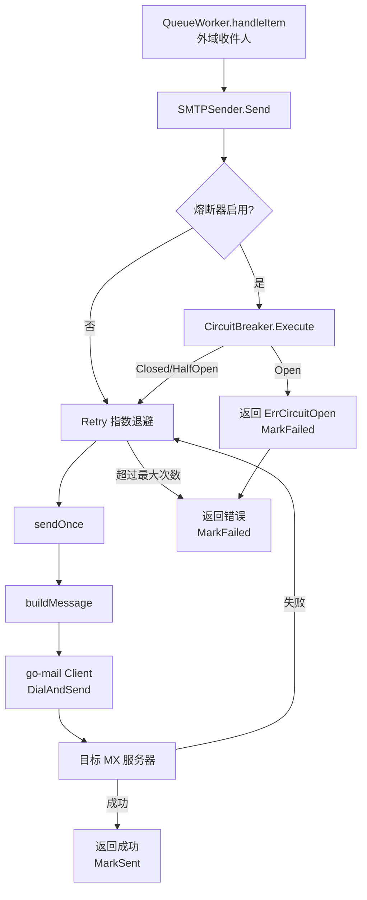
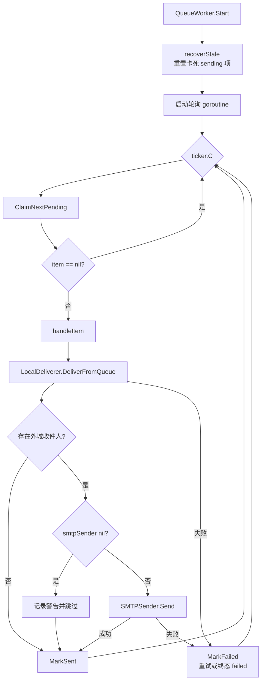
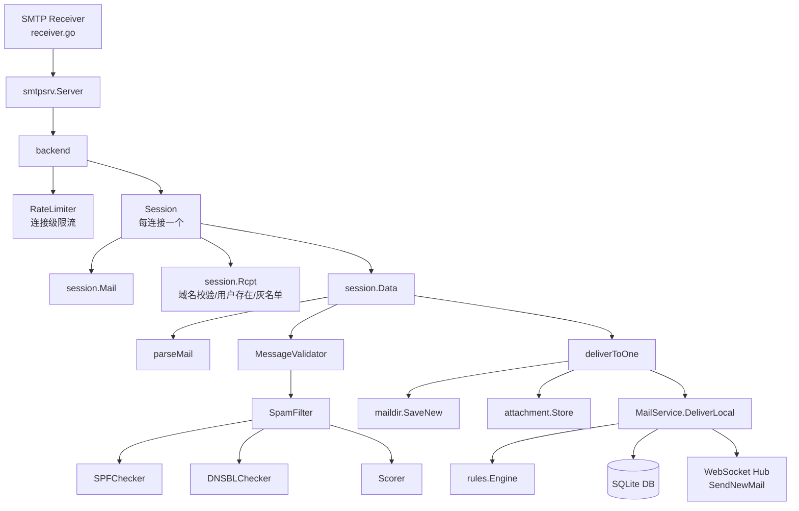
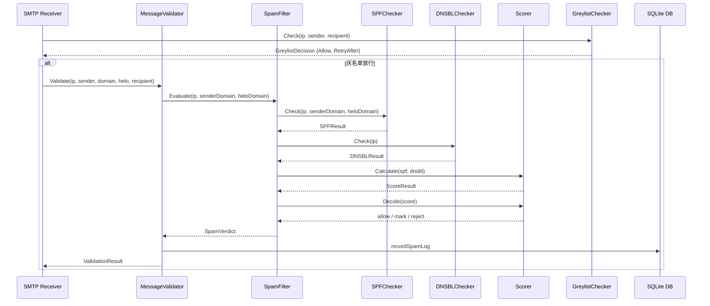
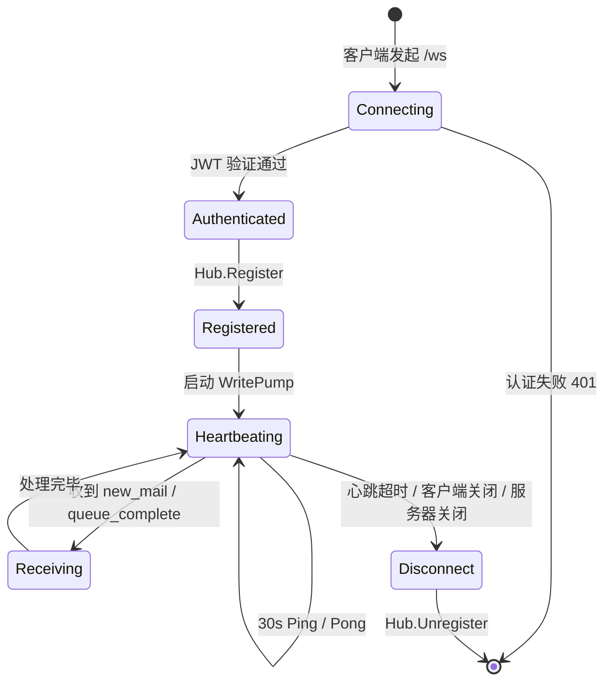

# 后端文件详解：邮件发送与反垃圾

> 本文档详解 MyMail Go 后端中「邮件发送 + SMTP 接收 + 反垃圾 + 规则引擎 + WebSocket」六大模块共 20 个源文件，面向初级开发人员。每个文件均包含：文件路径与所属包、功能概述、关键类型/结构体、关键函数说明、算法与流程说明、模块依赖关系、代码片段引用。

---

## 目录

- 第一部分：邮件发送（mailsender）
  - 1. 发送器接口 `internal/mailsender/sender.go`
  - 2. 本地投递 `internal/mailsender/local.go`
  - 3. 队列工作器 `internal/mailsender/queue.go`
- 第二部分：SMTP 接收（smtp）
  - 4. SMTP 接收器 `internal/smtp/receiver.go`
  - 5. SMTP 处理器 `internal/smtp/handler.go`
  - 6. SMTP 验证器 `internal/smtp/validator.go`
  - 7. 灰名单 `internal/smtp/greylist.go`
  - 8. 连接限流 `internal/smtp/ratelimit.go`
- 第三部分：反垃圾（spam）
  - 9. SPF 校验 `internal/spam/spf.go`
  - 10. DNSBL 查询 `internal/spam/dnsbl.go`
  - 11. 反垃圾主流程 `internal/spam/filter.go`
  - 12. 评分器 `internal/spam/scorer.go`
- 第四部分：韧性机制（resilience）
  - 13. 熔断器 `internal/resilience/circuit_breaker.go`
  - 14. 指数退避重试 `internal/resilience/retry.go`
- 第五部分：规则引擎（rules）
  - 15. 规则引擎 `internal/rules/engine.go`
  - 16. 条件匹配器 `internal/rules/matcher.go`
  - 17. 动作执行器 `internal/rules/action.go`
- 第六部分：WebSocket（ws）
  - 18. WebSocket Hub `internal/ws/hub.go`
  - 19. WebSocket Client `internal/ws/client.go`
  - 20. WebSocket 认证 `internal/ws/auth.go`

---

## 第一部分：邮件发送

邮件发送模块（`internal/mailsender`）负责将用户通过 HTTP `/api/mail/send` 提交的邮件投递出去。它由三个文件组成：发送器接口与 SMTP 实现（`sender.go`）、本地投递器（`local.go`）、持久化队列工作器（`queue.go`）。

整体数据流：
```
用户发邮件 → MailService.Send 入队 (mail_queue, status=pending)
            → QueueWorker 轮询 ClaimNextPending
                → LocalDeliverer 投递本域收件人 (DB + maildir + 附件)
                → SMTPSender 投递外域收件人 (熔断器 + 重试 + 外部 SMTP)
            → MarkSent / MarkFailed
```

### 1. 发送器接口 internal/mailsender/sender.go

**所属包**：`mailsender`

**文件功能概述**：
`sender.go` 实现外部 SMTP 发送器，通过第三方库 `wneessen/go-mail` 连接外部 SMTP 服务器发送邮件。它集成熔断器（`resilience.CircuitBreaker`）和指数退避重试（`resilience.Retry`），保护出站 SMTP 通道的稳定性。调用链路为：`Send → 熔断器.Execute → 重试.Retry → 实际 SMTP 发送`，即熔断器统计的是「整体发送（含重试）是否成功」。

**关键类型/结构体定义**：

```go
// SendInput 外发邮件输入参数
type SendInput struct {
    From     string   // 发件人邮箱
    To       []string // 收件人列表
    Cc       []string // 抄送列表
    Bcc      []string // 密送列表
    Subject  string   // 主题
    BodyHTML string   // HTML 正文
    BodyText string   // 纯文本正文
    ReplyTo  string   // 回复地址
}

// SMTPSender 外部 SMTP 发送器
type SMTPSender struct {
    host      string
    port      int
    username  string
    password  string
    tlsReject bool
    domain    string
    cb        *resilience.CircuitBreaker // 熔断器（可选）
    retryCfg  resilience.RetryConfig      // 重试配置
    cbEnabled bool                        // 熔断器开关
    timeout   time.Duration               // 单次发送超时（30s）
}
```

**关键函数/方法说明**：

- `NewSMTPSender(cfg *config.Config) *SMTPSender`：从配置创建发送器。读取 `SMTPSendHost/Port/Username/Password`、`SMTPTLSRejectUnauthorized`、`SMTPCircuitBreaker*`、`SMTPRetry*` 等配置项。当 `SMTPCircuitBreakerEnabled=true` 时构造熔断器实例。

- `Send(ctx context.Context, in SendInput) error`：发送入口。若熔断器启用，通过 `cb.Execute` 包裹 `sendWithRetry`；否则直接调用 `sendWithRetry`。熔断器开启时返回 `ErrCircuitOpen`。

```go
func (s *SMTPSender) Send(ctx context.Context, in SendInput) error {
    if s.cbEnabled && s.cb != nil {
        return s.cb.Execute(func() error {
            return s.sendWithRetry(ctx, in)
        })
    }
    return s.sendWithRetry(ctx, in)
}
```

- `sendWithRetry(ctx, in)`：调用 `resilience.Retry` 包裹 `sendOnce`，实现指数退避重试。
- `sendOnce(ctx, in)`：执行一次实际 SMTP 发送。流程：参数校验（host 非空、收件人非空）→ `buildMessage` 构建邮件 → 构造 go-mail 客户端（端口、超时、认证、TLS 策略）→ `client.DialAndSend(msg)` 发送。TLS 策略：`tlsReject=true` 用 `TLSMandatory`，否则用 `TLSOpportunistic`。
- `buildMessage(in)`：构建 go-mail `Msg` 对象，设置 From/To/Cc/Bcc/Subject/ReplyTo，并根据 HTML/纯文本是否存在设置 `SetBodyString` 与 `AddAlternativeString`。
- `CircuitBreakerState() string`：返回熔断器状态字符串（`closed/half-open/open/disabled`），供监控使用。
- `IsCircuitOpen() bool`：判断熔断器是否开启（`State()==2` 即 Open）。

**算法与流程说明**：

发送流程图：
```
Send(in)
  │
  ├─ cbEnabled? ──是──→ cb.Execute(sendWithRetry)
  │                       │
  │                       └─ Retry(sendOnce)  ← 指数退避
  │                              │
  │                              ├─ buildMessage
  │                              ├─ mail.NewClient(host, opts...)
  │                              └─ client.DialAndSend(msg)
  │
  └─ 否 ──→ sendWithRetry(in)  ← 同上 Retry 流程
```



外域发送韧性链路说明：当队列项包含外域收件人时，`SMTPSender.Send` 首先被熔断器包裹；熔断器闭合时进入指数退避重试，每次重试通过 `go-mail` 连接目标 MX；若失败率超过阈值则熔断器开启，快速失败避免持续压垮外部 SMTP；所有失败最终由 `QueueWorker` 标记为 `failed` 或按策略重试。

**与其他模块的依赖关系**：
- `github.com/wneessen/go-mail`：SMTP 客户端库
- `internal/config`：读取 SMTP 发送相关配置
- `internal/resilience`：熔断器与重试机制

---

### 2. 本地投递 internal/mailsender/local.go

**所属包**：`mailsender`

**文件功能概述**：
`local.go` 实现本地投递器 `LocalDeliverer`，职责是从队列项中解析收件人列表，筛选出本域收件人，调用 `MailService.DeliverLocal` 完成完整投递（DB 入库 + 附件记录 + 配额校验 + HTML 净化）。这是对原 Node.js `smtp-sender.js` 的 `sendLocal` 缺陷修复（P1-13）：原实现仅写 maildir 文件，未入 DB/附件/配额；Go 版通过 `MailService.DeliverLocal` 完成完整本地投递。

**关键类型/结构体定义**：

```go
// LocalDeliverer 本地投递器
type LocalDeliverer struct {
    mailSvc *service.MailService // 邮件业务服务（含 DeliverLocal）
    domain  string               // 本地域名（用于筛选本域收件人）
}
```

**关键函数/方法说明**：

- `NewLocalDeliverer(mailSvc, domain)`：创建本地投递器。
- `DeliverFromQueue(ctx, item) (localRecipients, externalRecipients []string, err error)`：核心方法。处理流程：
  1. 合并 to + cc + bcc 收件人并去重（`splitAddresses` + `dedupStrings`）
  2. 解析附件元信息 JSON（`item.Attachments` → `service.QueueAttachment` 列表）
  3. 遍历每个收件人：
     - 用 `splitAddress` 拆分 `user@domain`
     - 域名不等于本域 → 加入 `externalRecipients`（交由 SMTPSender 处理）
     - 域名等于本域 → 构造 `service.DeliverLocalInput` 调 `mailSvc.DeliverLocal`
     - 单个收件人失败不影响其他收件人（continue）

```go
for _, addr := range allRecipients {
    username, domain, ok := splitAddress(addr)
    if !ok { continue }
    if domain != d.domain {
        externalRecipients = append(externalRecipients, addr)
        continue
    }
    // 本域投递
    in := service.DeliverLocalInput{...}
    if err := d.mailSvc.DeliverLocal(ctx, in); err != nil {
        slog.Error("本地投递失败", ...)
        continue // 继续处理其他收件人
    }
    localRecipients = append(localRecipients, addr)
}
```

- `splitAddresses(s)`：拆分逗号分隔地址列表，去除空白与空项。
- `splitAddress(addr)`：拆分 `user@domain` 为 `(username, domain, ok)`，用 `LastIndex("@")` 处理。
- `dedupStrings(in)`：字符串切片去重，保持顺序，用 `map[string]bool` 实现。
- `Domain()`：返回配置的域名（测试用）。

**算法与流程说明**：

本地投递流程图：
```
DeliverFromQueue(item)
  │
  ├─ 合并 to+cc+bcc → 去重 → allRecipients
  ├─ 解析附件 JSON → attachments[]
  │
  └─ 遍历 allRecipients
       ├─ splitAddress(addr) → (user, domain)
       ├─ domain != 本域 → externalRecipients[]
       └─ domain == 本域 → DeliverLocalInput → mailSvc.DeliverLocal
                              ├─ 成功 → localRecipients[]
                              └─ 失败 → 记日志，继续下一个
```

**与其他模块的依赖关系**：
- `internal/service`：调用 `MailService.DeliverLocal` 完成入库
- `internal/storage/dao`：引用 `MailQueueItem` 类型

---

### 3. 队列工作器 internal/mailsender/queue.go

**所属包**：`mailsender`

**文件功能概述**：
`queue.go` 实现持久化发送队列工作器 `QueueWorker`。它后台轮询 `mail_queue` 表的待发项（`status=pending`），领取后处理：本域收件人交给 `LocalDeliverer`，外域收件人交给 `SMTPSender`（含熔断器 + 重试）。失败自动重试（`retry_delay_min` 分钟后重试），超过 `max_attempts` 标记为 `failed`；崩溃恢复时 `RequeueStale` 将卡死的 `sending` 项重置为 `pending`。修复了原 Node.js 无队列、`sendMail` 失败即丢的缺陷。

**关键类型/结构体定义**：

```go
// Sender 邮件发送器接口（依赖倒置，便于 mock 测试）
type Sender interface {
    Send(ctx context.Context, in SendInput) error
}

// QueueWorker 持久化发送队列 worker
type QueueWorker struct {
    local      *LocalDeliverer     // 本地投递器
    queueDAO   *dao.MailQueueDAO   // 队列 DAO
    smtpSender Sender              // 外部 SMTP 发送器（nil 时跳过外域发送）
    pollIntvl  time.Duration       // 轮询间隔（默认 5s）
    retryMin   int                 // 重试间隔（分钟，默认 5）
    ctx        context.Context
    cancel     context.CancelFunc
    wg         sync.WaitGroup
}
```

**关键函数/方法说明**：

- `NewQueueWorker(local, queueDAO, pollInterval, retryDelayMin, smtpSender)`：创建 worker。参数默认值：`pollInterval<=0` 用 5 秒，`retryDelayMin<=0` 用 5 分钟。创建带 cancel 的 context。

- `Start()`：启动 worker（非阻塞）。先 `recoverStale()` 做崩溃恢复，再启动后台 goroutine `run()`。

```go
func (w *QueueWorker) Start() {
    w.recoverStale()         // 1. 崩溃恢复
    w.wg.Add(1)
    go w.run()               // 2. 启动轮询
    slog.Info("队列 worker 已启动", ...)
}
```

- `Stop()`：停止 worker，调用 `cancel()` 取消 context，`wg.Wait()` 等待 goroutine 退出。
- `run()`：主循环。用 `time.NewTicker(pollIntvl)` 定时触发 `processNext()`，监听 `ctx.Done()` 退出。

- `processNext()`：尝试 `ClaimNextPending` 领取一个待发项，领取成功则 `handleItem`。

- `handleItem(item)`：核心处理逻辑，流程：
  1. 本域投递 `local.DeliverFromQueue`，返回 `externalRecipients`
  2. 若有外域收件人且 `smtpSender != nil`：构造 `SendInput` 调 `smtpSender.Send`；`smtpSender == nil` 则告警跳过
  3. 任一失败 → `MarkFailed(id, errMsg, retryMin)`
  4. 全部成功 → `MarkSent(id)`

- `recoverStale()`：崩溃恢复。调用 `RequeueStale(ctx, 10)`，将 10 分钟前仍为 `sending` 状态的项重置为 `pending`（视为卡死）。

- `ProcessOnce() bool`：立即处理一个队列项（测试用），返回是否处理了一项。

**算法与流程说明**：

队列处理流程图：
```
Start()
  ├─ recoverStale()  ← 重置卡死 sending 项 (>10min) 为 pending
  └─ go run()
        └─ for { ticker.C → processNext() }
              ├─ ClaimNextPending() → item
              │     └─ item==nil → return
              └─ handleItem(item)
                    ├─ local.DeliverFromQueue → externalRecipients
                    ├─ if externalRecipients && smtpSender:
                    │     smtpSender.Send(...) ─失败─→ MarkFailed; return
                    └─ MarkSent(id)  ← 全部成功
```



崩溃恢复机制说明：当 worker 进程异常退出时，正在处理的队列项状态停留在 `sending`，重启后这些项不会被自动重新领取。`RequeueStale` 通过时间阈值（10 分钟）识别这些「僵尸」项并重置为 `pending`，保证邮件不会丢失。

**与其他模块的依赖关系**：
- `internal/storage/dao`：`MailQueueDAO` 提供 `ClaimNextPending/MarkSent/MarkFailed/RequeueStale`
- `LocalDeliverer`（同包）：本域投递
- `Sender` 接口（同包）：外域发送，由 `*SMTPSender` 实现

---

## 第二部分：SMTP 接收

SMTP 接收模块（`internal/smtp`）负责接收外部 MTA 投递到本域的邮件，解析 RFC 5322 邮件格式，保存附件，并调用 `MailService.DeliverLocal` 完成本地投递。包含接收器、处理器、验证器、灰名单、限流五个文件。

### 4. SMTP 接收器 internal/smtp/receiver.go

**所属包**：`smtp`

**文件功能概述**：
`receiver.go` 包装 `emersion/go-smtp.Server`，创建 SMTP 接收服务器。它注入自实现的 `backend`，配置监听地址、域名、最大收件人（50）、最大消息字节数、读写超时（60s）、TLS 证书。与原 Node.js `smtp-receiver.js` 对应，支持优雅关闭（`Shutdown`）。

**关键类型/结构体定义**：

```go
// Receiver SMTP 接收服务器
type Receiver struct {
    server  *smtpsrv.Server
    backend *backend
    closed  chan struct{}
    closeMu sync.Mutex
}
```

**关键函数/方法说明**：

- `NewReceiver(cfg, userDAO, mailSvc, maildir, attStore)`：创建接收器。构造 `backend`，配置 server：
  - `Addr = "0.0.0.0:{SMTPPort}"`
  - `Domain = cfg.Domain`
  - `MaxRecipients = 50`
  - `MaxMessageBytes = cfg.MaxAttachmentSize`
  - `ReadTimeout/WriteTimeout = 60s`
  - `AllowInsecureAuth = true`（兼容原 Node.js `authOptional: true`）
  - 若配置了 `SMTPTLSCert/SMTPTLSKey`，加载 TLS 证书；加载失败回退明文。

- `SetAntiSpam(greylist, rateLimiter, validator)`：注入阶段 4 反垃圾组件（灰名单/限流/验证器）。各参数可为 nil（nil 表示禁用对应功能）。在 `NewReceiver` 之后、`Start` 之前调用。

- `RateLimiter()`：返回限流器实例（`server.go` 用于启动后台清理 + Shutdown 停止）。

- `Start()`：启动 SMTP 服务（阻塞调用）。`ListenAndServe` 在优雅关闭时返回 `ErrServerClosed`，通过 `closed` channel 判断是否为正常关闭。

- `Shutdown(ctx)`：优雅关闭。用 `closeMu` 保护 `closed` channel，幂等。

- `Addr()`：返回监听地址（测试用）。

**算法与流程说明**：

启动与关闭流程：
```
NewReceiver() → 配置 server + backend + TLS
       │
SetAntiSpam() → 注入 greylist/rateLimiter/validator 到 backend
       │
Start() → server.ListenAndServe()  ← 阻塞
       │
Shutdown(ctx) → close(closed) → server.Shutdown(ctx)  ← 优雅关闭
```

**与其他模块的依赖关系**：
- `github.com/emersion/go-smtp`：SMTP 服务器库
- `internal/config`：读取 SMTPPort/Domain/MaxAttachmentSize/TLS 配置
- `internal/service`：`MailService` 用于投递
- `internal/storage/dao`：`UserDAO` 校验收件人
- `internal/storage/maildir`：写原始邮件到 maildir
- `internal/storage/attachment`：附件存储

---

### 5. SMTP 处理器 internal/smtp/handler.go

**所属包**：`smtp`

**文件功能概述**：
`handler.go` 实现 `smtpsrv.Backend` + `smtpsrv.Session` 接口，是 SMTP 接收的核心逻辑。对应原 Node.js `smtp-receiver.js` 行为：`Mail` 记录 from、`Rcpt` 校验域名与用户存在、`Data` 解析 RFC 5322 邮件并投递。反垃圾（SPF/DNSBL/灰名单）在阶段 4 接入。

**关键类型/结构体定义**：

```go
// backend 实现 smtpsrv.Backend
type backend struct {
    cfg         *config.Config
    userDAO     *dao.UserDAO
    mailSvc     *service.MailService
    maildir     *maildir.Maildir
    attStore    *attachment.Store
    greylist    *GreylistChecker    // 灰名单（可选）
    rateLimiter *RateLimiter        // 限流（可选）
    validator   *MessageValidator   // 反垃圾验证器（可选）
}

// session 实现 smtpsrv.Session（每连接一个）
type session struct {
    backend  *backend
    remoteIP string
    hostname string
    from     string
    rcptTo   []string
}

// parsedMail 解析后的邮件
type parsedMail struct {
    messageID, subject, fromAddr, fromName string
    toAddr, ccAddr, replyTo, inReplyTo     string
    bodyText, bodyHTML, headersRaw         string
    attachments                            []parsedAttachment
}
```

**关键函数/方法说明**：

- `backend.NewSession(c *smtpsrv.Conn)`：每个 SMTP 连接创建一个新 session。提取 `remoteIP`，执行连接级限流（`rateLimiter.Check`），超限返回 `421 4.7.0 too many connections`。

- `session.Mail(from, opts)`：记录 `from`，重置 `rcptTo`。兼容原 Node.js：仅记录，不做 SPF 校验。

- `session.Rcpt(to, opts)`：校验收件人。流程：
  1. `mail.ParseAddress(to)` 解析地址
  2. 拆分 `user@domain`，校验 `domain == cfg.Domain`（拒绝外部域）
  3. `userDAO.FindByUsername` 校验用户存在且 `IsActive`
  4. 灰名单检查（`from` 非空时）：`greylist.Check(ip, from, recipient)`，`!Allow` 返回 `450 4.7.1 greylisted`
  5. 累计到 `rcptTo`

```go
// 灰名单检查（阶段 4）：MAIL FROM 为空（退信）时跳过
if s.backend.greylist != nil && s.from != "" {
    dec := s.backend.greylist.Check(ctx, s.remoteIP, s.from, addr.Address)
    if !dec.Allow {
        return fmt.Errorf("450 4.7.1 greylisted, try again in %d seconds", dec.RetryAfter)
    }
}
```

- `session.Data(r)`：核心投递方法。流程：
  1. `io.ReadAll(r)` 读取完整邮件数据
  2. `parseMail(data)` 解析 RFC 5322 邮件
  3. 反垃圾验证（`validator.Validate`），`ShouldReject` 时返回 `550 5.7.1 message rejected as spam`
  4. 对每个收件人调 `deliverToOne`

- `session.deliverToOne(username, recipient, raw, parsed, spamScore, spamReasons)`：单收件人投递：
  1. `maildir.SaveNew(username, raw)` 写原始邮件到 maildir（兼容性，失败仅告警）
  2. `userDAO.FindByUsername` 查收件人 ID
  3. 遍历 `parsed.attachments`，`saveAttachment` 保存到附件存储
  4. 构造 `service.DeliverLocalInput`（含 spamScore/spamReasons）调 `mailSvc.DeliverLocal`

- `parseMail(data)`：解析 RFC 5322 邮件。用 `emersion/go-message/mail` 的 `CreateReader`，提取头部字段（MessageID/Subject/From/To/Cc/Reply-To/In-Reply-To），遍历 parts 区分 `InlineHeader`（text/html 或 text/plain）与 `AttachmentHeader`。兜底：HTML 为空用 text，反之亦然。

- `serializeHeaders(h)`：将 Header 序列化为 JSON 字符串（与原 Node.js 兼容）。
- `extractDomain(addr)`：从邮箱提取域名（`LastIndex("@")`）。
- `session.Reset()`：清空 from/rcptTo。
- `session.Logout()`：调 Reset 清理。

**算法与流程说明**：

SMTP 会话状态机：
```
连接 → NewSession (限流检查 421)
  │
  ├─ MAIL FROM: <from>      → Mail() 记录 from, 重置 rcptTo
  │
  ├─ RCPT TO: <to>          → Rcpt() 校验
  │     ├─ ParseAddress 失败 → invalid recipient
  │     ├─ domain != 本域    → not our domain
  │     ├─ 用户不存在/未激活  → user not found
  │     └─ 灰名单拒绝        → 450 4.7.1 greylisted
  │     └─ 通过 → rcptTo[]
  │
  ├─ DATA                   → Data() 投递
  │     ├─ parseMail 解析邮件
  │     ├─ validator.Validate → ShouldReject? → 550 5.7.1
  │     └─ 遍历 rcptTo → deliverToOne
  │           ├─ maildir.SaveNew
  │           ├─ saveAttachment (每个附件)
  │           └─ mailSvc.DeliverLocal
  │
  ├─ RSET                   → Reset() 清空
  └─ QUIT                   → Logout()
```

### SMTP 接收器组件关系图



**与其他模块的依赖关系**：
- `github.com/emersion/go-message/mail`：邮件解析
- `github.com/emersion/go-smtp`：Backend/Session 接口
- `internal/service`、`internal/storage/dao`、`internal/storage/maildir`、`internal/storage/attachment`
- 同包：`GreylistChecker`、`RateLimiter`、`MessageValidator`

---

### 6. SMTP 验证器 internal/smtp/validator.go

**所属包**：`smtp`

**文件功能概述**：
`validator.go` 实现 SMTP 邮件验证器 `MessageValidator`，整合 `spam.Filter`（反垃圾评估）与 `SpamLogDAO`（结果落库）。它修复了原 Node.js 的缺陷：原 `spam-log-dao.js` 是死代码，spam 评分只输出到日志未落库；Go 版补上落库链路，支持管理员审计与监控。失败降级：spam.Filter 内部 DNS 失败返回 allow；spam_log 写入失败不阻断投递；validator 整体永不返回错误，始终返回 `ValidationResult`。

**关键类型/结构体定义**：

```go
type MessageValidator struct {
    filter     *spam.Filter     // 反垃圾过滤器
    spamLogDAO *dao.SpamLogDAO  // spam_log DAO
    enabled    bool             // 反垃圾总开关
}

type ValidationResult struct {
    Verdict      spam.SpamVerdict
    SpamScore    int
    SpamReasons  string
    ShouldReject bool
    ShouldMark   bool
}

type ValidateInput struct {
    IP, Sender, SenderDomain, HELODomain, Recipient string
}
```

**关键函数/方法说明**：

- `NewMessageValidator(filter, spamLogDAO, enabled)`：创建验证器。`filter=nil` 跳过评估，`spamLogDAO=nil` 不落库，`enabled=false` 直接放行。

- `Validate(ctx, in) ValidationResult`：核心方法。流程：
  1. `enabled=false` 或 `filter=nil` → 返回 allow（评分 0）
  2. `filter.Evaluate(ctx, ip, senderDomain, heloDomain)` 调用反垃圾评估
  3. `recordSpamLog` 持久化 spam_log（失败降级仅告警）
  4. 构造 `ValidationResult`（含 `ShouldReject/ShouldMark`）

```go
verdict := v.filter.Evaluate(ctx, in.IP, in.SenderDomain, in.HELODomain)
if v.spamLogDAO != nil {
    v.recordSpamLog(ctx, in, verdict)  // 失败不阻断
}
result := ValidationResult{
    Verdict:      verdict,
    SpamScore:    verdict.Score,
    SpamReasons:  verdict.FormatReasons(),
    ShouldReject: verdict.ShouldReject(),
    ShouldMark:   verdict.ShouldMark(),
}
```

- `recordSpamLog(ctx, in, verdict)`：调 `spamLogDAO.Create` 写入 spam_log。失败降级：仅 `slog.Warn`，不返回错误。

**算法与流程说明**：

验证流程图：
```
Validate(in)
  ├─ !enabled || filter==nil → 返回 allow (score=0)
  ├─ filter.Evaluate(ip, domain, helo) → verdict
  │     └─ 内部: SPF + DNSBL + Scorer (失败降级 allow)
  ├─ recordSpamLog (失败仅告警)
  └─ 返回 ValidationResult {ShouldReject, ShouldMark}
```



**与其他模块的依赖关系**：
- `internal/spam`：`Filter` 与 `SpamVerdict`
- `internal/storage/dao`：`SpamLogDAO`

---

### 7. 灰名单 internal/smtp/greylist.go

**所属包**：`smtp`

**文件功能概述**：
`greylist.go` 实现灰名单（greylisting）反垃圾机制。灰名单原理：首次见到 `(IP, sender, recipient)` 三元组时临时拒绝（4xx），正常 MTA 会在延迟窗口（默认 5 分钟）后重试，此时放行；大多数垃圾邮件不重试，从而被过滤。key 规则：`IP:sender:recipient`（与原 Node.js 一致）。失败降级：DB 查询/写入失败时放行（不阻断投递），记录 `reason="error"`。

**关键类型/结构体定义**：

```go
// 灰名单决策原因常量
const (
    GreylistReasonFirstAttempt = "first_attempt" // 首次见到，拒绝
    GreylistReasonExpired      = "expired"       // 记录已过期，重置后拒绝
    GreylistReasonPassed       = "passed"        // 通过延迟窗口，放行
    GreylistReasonCached       = "cached"        // 已放行缓存命中
    GreylistReasonWait         = "wait"          // 等待延迟窗口
    GreylistReasonError        = "error"         // DB 错误降级放行
    GreylistReasonDisabled     = "disabled"      // 功能关闭
)

type GreylistDecision struct {
    Allow      bool   // 是否放行
    Reason     string // 决策原因
    RetryAfter int    // 建议重试时间（秒）
}

type GreylistChecker struct {
    dao     *dao.GreylistDAO
    delayMs int64 // 延迟窗口（默认 300000=5min）
    ttlMs   int64 // 记录有效期（默认 3600000=1h）
    enabled bool
}
```

**关键函数/方法说明**：

- `NewGreylistChecker(greylistDAO, delayMs, ttlMs, enabled)`：创建检查器。默认值：`delayMs<=0` 用 5 分钟，`ttlMs<=0` 用 1 小时。

- `Check(ctx, ip, sender, recipient) GreylistDecision`：核心方法，5 状态判断。流程见下文。

- `buildGreylistKey(ip, sender, recipient)`：构造 key，格式 `IP:sender:recipient`。

**算法与流程说明**：灰名单 5 状态机

```
Check(ip, sender, recipient)
  │
  ├─ !enabled || dao==nil → Allow=true (disabled)
  │
  ├─ key = "ip:sender:recipient"
  ├─ entry, err = dao.Get(key)
  │
  ├─ err != nil → Allow=true (error 降级)
  │
  ├─ entry == nil (首次见到)
  │     ├─ dao.Upsert(key, now, allowed=false)
  │     └─ Allow=false, Reason=first_attempt, RetryAfter=delayMs/1000
  │
  ├─ entry.Allowed == true (已放行)
  │     └─ Allow=true, Reason=cached  ← 缓存命中
  │
  └─ entry.Allowed == false (未放行)
        ├─ elapsed = now - entry.FirstSeen
        │
        ├─ elapsed >= ttlMs (已过期)
        │     ├─ dao.Upsert(key, now, false)  ← 重置
        │     └─ Allow=false, Reason=expired
        │
        ├─ elapsed >= delayMs (通过延迟窗口)
        │     ├─ dao.SetAllowed(key, true)
        │     └─ Allow=true, Reason=passed  ← 放行
        │
        └─ elapsed < delayMs (等待中)
              └─ Allow=false, Reason=wait, RetryAfter=remaining
```

灰名单机制说明：垃圾邮件发送者通常不会在收到 4xx 临时错误后重试，而合法 MTA 会按 RFC 规定重试。通过强制首次延迟，可有效过滤大量僵尸网络发送的垃圾。延迟窗口（5 分钟）与有效期（1 小时）的设置权衡了反垃圾效果与用户等待体验。

**与其他模块的依赖关系**：
- `internal/storage/dao`：`GreylistDAO` 提供 `Get/Upsert/SetAllowed`

---

### 8. 连接限流 internal/smtp/ratelimit.go

**所属包**：`smtp`

**文件功能概述**：
`ratelimit.go` 实现 SMTP 连接级限流，采用固定时间窗口 + 每 IP 计数（内存 Map）。机制与原 Node.js `smtp-receiver.js` 一致：每个窗口内单 IP 最多 `maxConnectionsPerIp`（默认 10）次连接，超限拒绝（返回 421），窗口过期后自动重置。纯内存实现，进程重启即清空；`sync.Mutex` 保护；后台 goroutine 定期清理过期窗口。

**关键类型/结构体定义**：

```go
type ipCounter struct {
    count       int   // 当前窗口内连接数
    windowStart int64 // 当前窗口起始时间（Unix 毫秒）
}

type RateLimiter struct {
    mu       sync.Mutex
    maxPerIP int                   // 每 IP 最大连接数（默认 10）
    windowMs int64                 // 时间窗口毫秒（默认 60000=1min）
    counts   map[string]*ipCounter // IP → 计数器
    stopCh   chan struct{}
    stopped  bool
}
```

**关键函数/方法说明**：

- `NewRateLimiter(maxPerIP, windowMs)`：创建限流器。默认值：`maxPerIP<=0` 用 10，`windowMs<=0` 用 60000。

- `Check(ip) bool`：检查 IP 是否允许连接。`ip==""` 放行（兼容性）。逻辑：
  - 首次见到该 IP：创建计数器 `count=1`
  - 窗口已过期（`now-windowStart >= windowMs`）：重置 `count=1, windowStart=now`
  - 窗口内 `count >= maxPerIP`：返回 false（超限）
  - 否则 `count++` 返回 true

```go
// 窗口已过期：重置
if now-c.windowStart >= r.windowMs {
    c.count = 1
    c.windowStart = now
    return true
}
// 窗口内计数
if c.count >= r.maxPerIP {
    return false // 超限
}
c.count++
return true
```

- `CurrentCount(ip)`：返回当前窗口计数（测试用），窗口过期返回 0。
- `Cleanup()`：清理所有过期窗口，返回清理的 IP 数量。
- `StartCleanup(interval)`：启动后台定期清理 goroutine（默认 60 秒）。监听 `stopCh` 退出。
- `Stop()`：停止后台清理，幂等（`stopped` 标志 + `close(stopCh)`）。
- `Stats()`：返回当前跟踪的 IP 数量。

**算法与流程说明**：固定窗口算法

```
Check(ip)
  │
  ├─ ip=="" → true (兼容)
  │
  ├─ 首次见到 → counts[ip] = {count:1, windowStart:now} → true
  │
  ├─ 窗口过期 (now-windowStart >= windowMs)
  │     → count=1, windowStart=now → true
  │
  ├─ count >= maxPerIP → false (超限拒绝)
  │
  └─ count++ → true (放行)

后台清理:
  StartCleanup(60s) → ticker → Cleanup() → 删除过期窗口
```

固定窗口算法的局限：在窗口边界处可能允许 2 倍流量（如窗口结束前瞬间 10 次 + 新窗口开始 10 次）。对 SMTP 这种低频连接场景足够，且实现简单。

**与其他模块的依赖关系**：无外部依赖，纯内存实现。

---

## 第三部分：反垃圾

反垃圾模块（`internal/spam`）实现 SPF 校验、DNSBL 查询、评分计算与主流程整合。设计依据 RFC 7208（SPF）与原 Node.js `smtp-validator.js`。关键修复 P0-2：重写 spam 包（原 `spam-filter.js` 不可用）；失败降级：DNS 查询失败时邮件仍正常投递（spam_score=0）。

### 9. SPF 校验 internal/spam/spf.go

**所属包**：`spam`

**文件功能概述**：
`spf.go` 实现 SPF (Sender Policy Framework) 校验，支持 `ip4/ip6/mx/a/include/exists/all` 机制。SPF 通过查询发件人域名 DNS TXT 记录中的 `v=spf1` 记录，判断发件人 IP 是否被授权。递归深度限制（默认 10）防止 `include` 机制循环引用（RFC 7208 建议）。

**SPF 协议简介**：
SPF 是一种邮件验证协议，用于防止发件人地址伪造。域名所有者在 DNS TXT 记录中发布 SPF 策略，声明哪些 IP 地址被授权代表该域名发送邮件。接收方查询该记录并匹配发件人 IP，得到 pass/fail/softfail/neutral 等结果。

**关键类型/结构体定义**：

```go
// SPF 校验结果类型
const (
    SPFResultPass      = "pass"      // IP 匹配 SPF 记录
    SPFResultFail      = "fail"      // IP 不匹配且策略为 -all
    SPFResultSoftFail  = "softfail"  // IP 不匹配且策略为 ~all
    SPFResultNeutral   = "neutral"   // 策略为 ?all 或无 all
    SPFResultNone      = "none"      // 无 SPF 记录
    SPFResultError     = "error"     // 查询错误
    SPFResultSkip      = "skip"      // 跳过（功能关闭）
    SPFResultTempError = "temperror" // 临时错误（DNS 超时等）
)

// dnsResolver DNS 解析器接口（抽象用于 mock 测试）
type dnsResolver interface {
    LookupTXT(ctx, name) ([]string, error)
    LookupMX(ctx, name) ([]*net.MX, error)
    LookupIPAddr(ctx, host) ([]net.IPAddr, error)
}

type SPFResult struct {
    Result string
    Detail string
}

type SPFChecker struct {
    resolver  dnsResolver
    maxDepth  int  // include 递归最大深度（默认 10）
    timeoutMs int  // 单次校验总超时（默认 3000ms）
}
```

**关键函数/方法说明**：

- `NewSPFChecker(resolver, maxDepth, timeoutMs)`：创建校验器，公开构造器接受 `*net.Resolver`。
- `newSPFCheckerWithResolver(resolver, maxDepth, timeoutMs)`：内部构造器，接受 `dnsResolver` 接口（用于测试 mock）。

- `Check(ctx, senderIP, senderDomain, heloDomain) SPFResult`：入口方法。校验 `senderDomain` 非空、`senderIP` 合法，设置总超时，调 `checkDomain`。

- `checkDomain(ctx, ip, domain, depth) SPFResult`：递归查询域名的 SPF 记录。流程：
  1. 深度超限 → `error`
  2. `LookupTXT(domain)` 查询 TXT 记录，失败 → `none`（降级）
  3. 找 `v=spf1` 开头的记录，无 → `none`
  4. 拆分机制（跳过 `v=spf1`），跳过修饰符（`redirect=`/`exp=`，TODO 未实现）
  5. 依次 `matchMechanism`，遇 `all` 或匹配项立即返回
  6. 无 `all` 机制 → `neutral`

- `matchMechanism(ctx, mech, ip, domain, depth) (SPFResult, matched, isAll)`：匹配单个机制。解析限定符前缀（`+/-/~/?`，默认 `+`），根据机制类型匹配：
  - `all`：始终匹配，返回 `isAll=true`
  - `ip4:CIDR` / `ip6:CIDR`：调用 `matchIPv4CIDR` / `matchIPv6CIDR`
  - `mx[:domain]`：`matchMX` 查 MX 记录再查 A/AAAA
  - `a[:domain]`：`matchA` 查 A/AAAA 记录
  - `include:domain`：递归 `checkDomain`，子结果为 pass 才匹配
  - `exists:domain`：`matchExists` 查 A 记录是否存在

```go
// 限定符 → 结果映射
resultMap := map[string]string{
    "+": SPFResultPass,     // 通过
    "-": SPFResultFail,     // 硬失败
    "~": SPFResultSoftFail, // 软失败
    "?": SPFResultNeutral,  // 中性
}
```

- `matchIPv4CIDR(ip, cidr)`：检查 IPv4 是否在 CIDR 网段内，无掩码视为 `/32`。
- `matchIPv6CIDR(ip, cidr)`：检查 IPv6 是否在 CIDR 网段内，无掩码视为 `/128`。
- `matchMX(ctx, ip, domain)`：查 MX 记录，对每个 MX host 调 `matchA`。
- `matchA(ctx, ip, domain)`：查 A/AAAA 记录，逐个比较 IP。
- `matchExists(ctx, domain)`：查 A 记录是否存在（`err==nil` 即存在）。
- `isModifier(mech)`：判断是否为修饰符（含 `=` 且非 `ip4:`/`ip6:`）。

**算法与流程说明**：SPF 校验流程

```
Check(ip, domain, helo)
  │
  ├─ domain=="" → none
  ├─ ip 无效 → error
  ├─ 超时控制 (3s)
  │
  └─ checkDomain(ip, domain, depth=0)
        │
        ├─ depth > 10 → error (防循环)
        ├─ LookupTXT(domain) 失败 → none (降级)
        ├─ 找 v=spf1 记录，无 → none
        │
        └─ 遍历机制:
              ├─ ip4:1.2.3.0/24 → matchIPv4CIDR
              ├─ ip6:... → matchIPv6CIDR
              ├─ mx → matchMX (查 MX → 查 A → 比较 IP)
              ├─ a → matchA (查 A/AAAA → 比较 IP)
              ├─ include:other.com → 递归 checkDomain(depth+1)
              │     └─ 子结果 pass → 匹配; 否则继续
              ├─ exists:domain → matchExists (查 A 存在?)
              ├─ all → 始终匹配，返回限定符结果
              └─ 修饰符 (redirect=/exp=) → 跳过 (TODO)
```

**与其他模块的依赖关系**：
- 标准库 `net`：DNS 解析（`*net.Resolver`）
- 无其他内部依赖（纯算法实现）

---

### 10. DNSBL 查询 internal/spam/dnsbl.go

**所属包**：`spam`

**文件功能概述**：
`dnsbl.go` 实现 DNSBL (DNS-based Blackhole List) 并行查询。原理：将发件人 IP 反转（如 `1.2.3.4 → 4.3.2.1`），拼接 DNSBL zone（如 `4.3.2.1.zen.spamhaus.org`），查询 A 记录，若存在则命中黑名单。并行查询多个 zone 提高效率。默认 zone 列表与原 Node.js 一致：`zen.spamhaus.org`、`bl.spamcop.net`、`b.barracudacentral.org`。

**关键类型/结构体定义**：

```go
type DNSBLResult struct {
    Listed bool     // 是否命中任一黑名单
    Zones  []string // 命中的 zone 列表
}

type DNSBLChecker struct {
    resolver  dnsResolver
    zones     []string
    timeoutMs int
}
```

**关键函数/方法说明**：

- `NewDNSBLChecker(resolver, zones, timeoutMs)`：创建查询器。`zones` 为空用默认 3 个 zone。
- `newDNSBLCheckerWithResolver(...)`：内部构造器（测试用）。

- `Check(ctx, ip) DNSBLResult`：并行查询所有 zone。流程：
  1. 解析 IP，仅支持 IPv4（IPv6 直接返回未命中）
  2. 设置超时
  3. 反转 IP（`reverseIPv4`）
  4. 对每个 zone 启动 goroutine 并行查询（`sync.WaitGroup`）
  5. 命中的 zone 加入 `listed`（`sync.Mutex` 保护）
  6. 返回 `DNSBLResult{Listed: len(listed)>0, Zones: listed}`

```go
for _, zone := range c.zones {
    wg.Add(1)
    go func(z string) {
        defer wg.Done()
        if c.queryZone(ctx, reversed, z) {
            mu.Lock()
            listed = append(listed, z)
            mu.Unlock()
        }
    }(zone)
}
wg.Wait()
```

- `queryZone(ctx, reversedIP, zone)`：构造查询名 `reversedIP.zone`，`LookupIPAddr` 查询，`err==nil` 即命中（A 记录存在）。
- `reverseIPv4(ip)`：将 IPv4 反转，如 `1.2.3.4 → 4.3.2.1`，用 `net.IPv4(ipv4[3], ipv4[2], ipv4[1], ipv4[0])`。

**算法与流程说明**：DNSBL 查询流程

```
Check(ip)
  │
  ├─ 解析 IP 失败 → Listed=false
  ├─ IPv6 → Listed=false (仅支持 IPv4)
  ├─ 超时控制 (3s)
  ├─ reversed = reverseIPv4(ip)  // 1.2.3.4 → 4.3.2.1
  │
  └─ 并行查询 (goroutine per zone):
        ├─ zen.spamhaus.org    → query 4.3.2.1.zen.spamhaus.org
        ├─ bl.spamcop.net      → query 4.3.2.1.bl.spamcop.net
        └─ b.barracudacentral.org → query 4.3.2.1.b.barracudacentral.org
        │
        └─ A 记录存在 → 命中
        └─ WaitGroup 等待所有完成
        │
        └─ 返回 {Listed: 命中数>0, Zones: 命中列表}
```

**与其他模块的依赖关系**：
- 标准库 `net`：DNS 解析
- 同包：`dnsResolver` 接口（与 spf.go 共享）

---

### 11. 反垃圾主流程 internal/spam/filter.go

**所属包**：`spam`

**文件功能概述**：
`filter.go` 实现反垃圾主流程 `Filter`，整合 SPF + DNSBL + 评分。根据特性开关决定是否执行校验，输出最终判决（allow/mark/reject）。失败降级：DNS 查询失败时 SPF 返回 none、DNSBL 返回未命中，邮件仍正常投递（评分可能为 2，但不会 reject）；不向调用方返回错误。

**关键类型/结构体定义**：

```go
type SpamVerdict struct {
    Score   int
    Reasons []string
    Action  string // allow / mark / reject
}

// SPFCheckerIface SPF 校验器接口（依赖注入用）
type SPFCheckerIface interface {
    Check(ctx, ip, senderDomain, heloDomain string) SPFResult
}

// DNSBLCheckerIface DNSBL 查询器接口
type DNSBLCheckerIface interface {
    Check(ctx, ip string) DNSBLResult
}

type Filter struct {
    spfChecker   SPFCheckerIface
    dnsblChecker DNSBLCheckerIface
    scorer       *Scorer
    spfEnabled   bool
    dnsblEnabled bool
}
```

**关键函数/方法说明**：

- `NewFilter(spf, dnsbl, scorer, spfEnabled, dnsblEnabled)`：创建过滤器。`spf=nil` 不执行 SPF，`dnsbl=nil` 不执行 DNSBL。

- `Evaluate(ctx, ip, senderDomain, heloDomain) SpamVerdict`：核心方法。流程：
  1. `scorer==nil` → 直接放行（兜底）
  2. SPF 校验（`spfEnabled && spfChecker!=nil`）：调 `spfChecker.Check`
  3. DNSBL 校验（`dnsblEnabled && dnsblChecker!=nil`）：调 `dnsblChecker.Check`
  4. 评分：`scorer.Calculate(spfResult, dnsblResult)` → `scorer.Decide(score)`
  5. 返回 `SpamVerdict`

```go
spfResult := f.spfChecker.Check(ctx, ip, senderDomain, heloDomain)
dnsblResult := f.dnsblChecker.Check(ctx, ip)
scoreResult := f.scorer.Calculate(spfResult, dnsblResult)
action := f.scorer.Decide(scoreResult.Score)
return SpamVerdict{Score: scoreResult.Score, Reasons: scoreResult.Reasons, Action: action}
```

- `SpamVerdict.ShouldReject()`：`Action == ActionReject`。
- `SpamVerdict.ShouldMark()`：`Action == ActionMark`。
- `SpamVerdict.FormatReasons()`：将原因列表格式化为分号分隔字符串（持久化用）。

**算法与流程说明**：反垃圾评估流程

```
Evaluate(ip, domain, helo)
  │
  ├─ scorer==nil → allow (兜底)
  │
  ├─ SPF 校验 (若启用):
  │     └─ spfChecker.Check → {pass/fail/softfail/none/error/...}
  │
  ├─ DNSBL 校验 (若启用):
  │     └─ dnsblChecker.Check → {Listed, Zones}
  │
  ├─ scorer.Calculate(spf, dnsbl) → {Score, Reasons}
  │     ├─ SPF fail:     +5
  │     ├─ SPF softfail: +3
  │     ├─ SPF none:     +2
  │     ├─ SPF error:    +1
  │     └─ DNSBL 命中:   +5 * zone 数
  │
  ├─ scorer.Decide(score) → action
  │     ├─ score < 5  → allow
  │     ├─ 5 ≤ score < 10 → mark
  │     └─ score ≥ 10 → reject
  │
  └─ 返回 SpamVerdict
```

**与其他模块的依赖关系**：
- 同包：`SPFChecker`、`DNSBLChecker`、`Scorer`

---

### 12. 评分器 internal/spam/scorer.go

**所属包**：`spam`

**文件功能概述**：
`scorer.go` 实现反垃圾评分规则。评分依据：SPF fail +5、softfail +3、none +2、error +1；DNSBL 命中 +5/zone。阈值（可配置）：`score < 5` allow（INBOX）、`5 ≤ score < 10` mark（JUNK）、`score ≥ 10` reject。与原 Node.js 差异：评分更温和（原 +8/+10），避免单点误判直接拒绝。

**关键类型/结构体定义**：

```go
const (
    ActionAllow  = "allow"  // 允许投递（INBOX）
    ActionMark   = "mark"   // 标记可疑（JUNK）
    ActionReject = "reject" // 拒绝投递
)

type ScoreResult struct {
    Score   int
    Reasons []string
}

type Scorer struct {
    suspiciousThreshold int // 可疑阈值（默认 5）
    spamThreshold       int // 垃圾阈值（默认 10）
}
```

**关键函数/方法说明**：

- `NewScorer(suspiciousThreshold, spamThreshold)`：创建评分器。默认值：`suspiciousThreshold<=0` 用 5，`spamThreshold<=0` 用 10。

- `Calculate(spf, dnsbl) ScoreResult`：计算评分。SPF 评分 switch：
  - `SPFResultFail` → +5，reason `SPF hard fail`
  - `SPFResultSoftFail` → +3，reason `SPF softfail`
  - `SPFResultNone` → +2，reason `No SPF record`
  - `SPFResultError` / `SPFResultTempError` → +1
  - `SPFResultSkip` → 不评分
  - DNSBL 命中 → `+5 * len(Zones)`

```go
if dnsbl.Listed {
    score += 5 * len(dnsbl.Zones)
    reasons = append(reasons, fmt.Sprintf("IP blacklisted (%v)", dnsbl.Zones))
}
```

- `Decide(score) string`：根据评分决定动作。`score >= spamThreshold` 返回 reject；`score >= suspiciousThreshold` 返回 mark；否则 allow。
- `SuspiciousThreshold()` / `SpamThreshold()`：返回阈值（测试用）。

**算法与流程说明**：评分决策表

| SPF 结果 | DNSBL | 评分 | 动作 |
|---|---|---|---|
| pass | 无 | 0 | allow |
| none | 无 | 2 | allow |
| softfail | 无 | 3 | allow |
| fail | 无 | 5 | mark |
| none | 1 zone 命中 | 7 | mark |
| fail | 1 zone 命中 | 10 | reject |
| fail | 2 zone 命中 | 15 | reject |

**与其他模块的依赖关系**：无外部依赖，纯计算逻辑。

---

## 第四部分：韧性机制

韧性机制模块（`internal/resilience`）为出站 SMTP 发送提供高可用保障：熔断器（`circuit_breaker.go`）与指数退避重试（`retry.go`）。

### 13. 熔断器 internal/resilience/circuit_breaker.go

**所属包**：`resilience`

**文件功能概述**：
`circuit_breaker.go` 基于 `sony/gobreaker/v2`（泛型版本）封装熔断器。内部用 `struct{}` 作为结果类型，对外暴露 `Execute(fn func() error) error` 简化调用。验收标准：出站 SMTP 熔断器在失败率 > 60% 时触发。

**关键类型/结构体定义**：

```go
var ErrCircuitOpen = errors.New("circuit breaker is open")

type CircuitBreakerConfig struct {
    Name          string        // 熔断器名称
    MaxRequests   uint32        // 半开状态最大请求数（默认 5）
    Interval      time.Duration // closed 计数窗口（默认 60s）
    Timeout       time.Duration // open 持续时间（默认 30s）
    FailureRatio  float64       // 失败率阈值（默认 0.6）
    MinRequests   uint32        // 触发熔断最小请求数（默认 10）
}

type CircuitBreaker struct {
    cb *gobreaker.CircuitBreaker[struct{}]
}
```

**关键函数/方法说明**：

- `NewCircuitBreaker(cfg)`：创建熔断器，填充默认值。`ReadyToTrip` 回调：仅当 `counts.Requests >= MinRequests` 且失败率 `>= FailureRatio` 时熔断。

```go
ReadyToTrip: func(counts gobreaker.Counts) bool {
    if counts.Requests < minReqs {
        return false
    }
    ratio := float64(counts.TotalFailures) / float64(counts.Requests)
    return ratio >= failureRatio
},
```

- `Execute(fn func() error) error`：执行函数，受熔断器保护。开启时返回 `ErrCircuitOpen`。内部用 `struct{}` 作为泛型参数适配 gobreaker v2。

- `State() gobreaker.State`：返回当前状态（`StateClosed=0/StateHalfOpen=1/StateOpen=2`）。
- `StateString() string`：返回状态字符串（`closed/half-open/open/unknown`）。
- `Counts() gobreaker.Counts`：返回当前计数（监控用）。

**算法与流程说明**：熔断器三态状态机

```
                ┌─────────────────────────────┐
                │         Closed (正常)        │
                │  放行所有请求，统计失败率      │
                │  Requests≥MinRequests 且     │
                │  失败率≥FailureRatio → trip  │
                └──────────┬──────────────────┘
                           │ trip (失败率>60%)
                           ▼
                ┌─────────────────────────────┐
                │          Open (熔断)         │
                │  拒绝所有请求 (ErrCircuitOpen)│
                │  等待 Timeout (30s)         │
                └──────────┬──────────────────┘
                           │ Timeout 到期
                           ▼
                ┌─────────────────────────────┐
                │        HalfOpen (半开)       │
                │  放行 MaxRequests (5) 个请求  │
                │  成功 → Closed              │
                │  失败 → Open                │
                └─────────────────────────────┘
```

三态说明：
- **Closed（关闭）**：正常放行请求，在 `Interval` 窗口内统计失败率。当请求数达到 `MinRequests`（10）且失败率 ≥ `FailureRatio`（0.6）时，触发熔断转 Open。
- **Open（开启）**：拒绝所有请求，返回 `ErrCircuitOpen`。持续 `Timeout`（30s）后转 HalfOpen，给系统恢复机会。
- **HalfOpen（半开）**：放行 `MaxRequests`（5）个试探请求。若全部成功则转 Closed（恢复）；若任一失败则转 Open（继续熔断）。

**与其他模块的依赖关系**：
- `github.com/sony/gobreaker/v2`：熔断器库

---

### 14. 指数退避重试 internal/resilience/retry.go

**所属包**：`resilience`

**文件功能概述**：
`retry.go` 自实现指数退避重试（不依赖 `cenkalti/backoff`），逻辑简单可控。算法：首次执行不等待；失败后等待 `initialInterval * 2^(attempt-1)`，不超过 `maxInterval`；总耗时不超过 `maxElapsedTime`；最大尝试次数含首次 = `maxAttempts`。

**关键类型/结构体定义**：

```go
type RetryConfig struct {
    MaxAttempts     int           // 最大尝试次数（默认 3）
    InitialInterval time.Duration // 初始间隔（默认 500ms）
    MaxInterval     time.Duration // 最大间隔（默认 10s）
    MaxElapsedTime  time.Duration // 最大总耗时（<=0 不限）
    Enabled         bool          // 是否启用
}
```

**关键函数/方法说明**：

- `DefaultRetryConfig()`：返回默认配置（3 次 / 500ms / 10s / 60s / enabled）。

- `Retry(ctx, cfg, fn) error`：核心方法。流程：
  1. `!cfg.Enabled` → 仅执行一次
  2. `normalizeRetryConfig` 填充默认值
  3. 循环 `attempt=1..MaxAttempts`：
     - 检查 `ctx.Err()`（取消）
     - 检查 `MaxElapsedTime`（超时）
     - 执行 `fn()`，成功返回 nil
     - 失败：记录 `lastErr`，最后一次不等待，否则 `calculateBackoff` 退避后 `sleepWithContext`
  4. 全部失败返回 `重试 N 次后仍失败: lastErr`

```go
for attempt := 1; attempt <= cfg.MaxAttempts; attempt++ {
    if err := ctx.Err(); err != nil {
        return fmt.Errorf("重试被取消: %w", err)
    }
    if cfg.MaxElapsedTime > 0 && time.Since(start) >= cfg.MaxElapsedTime {
        return fmt.Errorf("重试超时（%s），最后错误: %w", cfg.MaxElapsedTime, lastErr)
    }
    err := fn()
    if err == nil {
        return nil
    }
    lastErr = err
    if attempt >= cfg.MaxAttempts { break }
    backoff := calculateBackoff(attempt, cfg)
    if err := sleepWithContext(ctx, backoff); err != nil {
        return fmt.Errorf("重试等待被取消: %w", err)
    }
}
return fmt.Errorf("重试 %d 次后仍失败: %w", cfg.MaxAttempts, lastErr)
```

- `RetryWithResult[T](ctx, cfg, fn) (T, error)`：泛型版本，返回结果。
- `calculateBackoff(attempt, cfg)`：计算退避时间。`attempt<=1` 返回 `InitialInterval`；否则 `initial * 2^(attempt-1)`，不超过 `MaxInterval`。

```go
backoff := cfg.InitialInterval
for i := 1; i < attempt; i++ {
    backoff *= 2
    if backoff >= cfg.MaxInterval {
        return cfg.MaxInterval
    }
}
```

- `sleepWithContext(ctx, d)`：带上下文取消的 sleep，用 `time.NewTimer` + `select`。
- `normalizeRetryConfig(cfg)`：填充默认值。

**算法与流程说明**：指数退避示意（默认配置）

```
attempt=1: 执行 fn → 失败 → 等待 500ms
attempt=2: 执行 fn → 失败 → 等待 1000ms (500*2)
attempt=3: 执行 fn → 失败 → 返回错误 (最后一次不等待)

退避序列: 500ms → 1000ms → 2000ms → 4000ms → ... → 上限 10s
总耗时上限: 60s (MaxElapsedTime)
```

**与其他模块的依赖关系**：仅依赖标准库（`context`/`time`/`log/slog`）。

---

## 第五部分：规则引擎

规则引擎模块（`internal/rules`）实现邮件规则自动化处理：加载用户活跃规则 → 匹配条件 → 执行动作。修复 P1-7：原 Node.js `rule-engine.js` 用 `new RegExp(strVal, 'i')` 用户可控正则存在 ReDoS 风险；Go 版使用标准库 regexp（基于 RE2，不回溯），额外限制 pattern 长度（500）+ 编译缓存。

### 15. 规则引擎 internal/rules/engine.go

**所属包**：`rules`

**文件功能概述**：
`engine.go` 实现规则引擎主流程。流程：加载用户活跃规则（按 priority 降序）→ 依次匹配每条规则的所有条件（AND 语义）→ 首个匹配的规则执行所有动作（与原 Node.js 一致：break after first match）→ 单个动作失败不影响其他动作。

**关键类型/结构体定义**：

```go
type Engine struct {
    ruleDAO  *dao.RuleDAO       // 规则 DAO
    matcher  *Matcher           // 条件匹配器
    executor *ActionExecutor    // 动作执行器
}
```

**关键函数/方法说明**：

- `NewEngine(ruleDAO, matcher, executor)`：创建规则引擎。

- `RunForMessage(ctx, userID, msg) error`：核心方法。流程：
  1. `ruleDAO.FindActiveByUserID(userID)` 加载活跃规则
  2. 加载失败 → 记日志，返回 nil（不阻断邮件投递）
  3. 无规则 → 返回 nil
  4. 遍历规则，`matcher.MatchAll(rule.Conditions, msg)`：
     - 匹配 → `executor.ExecuteAll(rule.Actions, msg)`，记录部分失败告警，返回 nil（首个匹配即停止）

```go
for _, rule := range rules {
    if e.matcher.MatchAll(rule.Conditions, msg) {
        slog.Info("规则匹配", "rule_id", rule.ID, ...)
        errs := e.executor.ExecuteAll(ctx, rule.Actions, msg)
        if len(errs) > 0 {
            slog.Warn("规则动作部分失败", ...)
        }
        return nil // 首个匹配的规则执行后返回
    }
}
```

**算法与流程说明**：规则引擎匹配流程

```
RunForMessage(userID, msg)
  │
  ├─ FindActiveByUserID(userID) → rules[] (按 priority 降序)
  │     └─ 失败 → 记日志，返回 nil (不阻断)
  │
  ├─ rules 为空 → 返回 nil
  │
  └─ 遍历 rules:
        ├─ MatchAll(conditions, msg) → AND 语义
        │     ├─ false → 下一条规则
        │     └─ true → ExecuteAll(actions, msg)
        │           ├─ 单个动作失败不中断
        │           └─ 返回 errs[]
        └─ 首个匹配即返回 (break after first match)
```

「首个匹配即停止」的设计与原 Node.js 一致，避免多规则叠加产生意外效果。规则按 `priority` 降序排列，保证高优先级规则先匹配。

**与其他模块的依赖关系**：
- `internal/storage/dao`：`RuleDAO.FindActiveByUserID`
- 同包：`Matcher`、`ActionExecutor`

---

### 16. 条件匹配器 internal/rules/matcher.go

**所属包**：`rules`

**文件功能概述**：
`matcher.go` 实现条件匹配，P1-7 修复核心：regex 操作符使用 Go 标准库 regexp（RE2，不回溯，天然防 ReDoS）。额外防护：pattern 长度限制（默认 500）、编译失败返回 false、编译结果缓存（避免重复编译开销）。

**关键类型/结构体定义**：

```go
type MessageView struct {
    ID        int64
    UserID    int64
    FromAddr  string
    ToAddr    string
    Subject   string
    HasAttach bool
    SizeBytes int64
    IsStarred bool
    Flags     string
    BodyHTML  string // forward 动作需要
    BodyText  string // forward 动作需要
}

// 字段名常量
const (
    FieldFrom          = "from"
    FieldTo            = "to"
    FieldSubject       = "subject"
    FieldHasAttachment = "has_attachment"
    FieldSize          = "size"
)

// 操作符常量
const (
    OpContains = "contains"
    OpEquals   = "equals"
    OpEndsWith = "ends_with"
    OpRegex    = "regex"
    OpGt       = "gt"
    OpLt       = "lt"
)

type Matcher struct {
    maxPatternLength int
    cacheMu          sync.RWMutex
    compiledCache    map[string]*regexp.Regexp
}
```

**关键函数/方法说明**：

- `NewMatcher(maxPatternLength)`：创建匹配器，默认 `maxPatternLength=500`。

- `MatchAll(conds, msg) bool`：匹配所有条件（AND 语义）。空条件列表返回 true（与原 Node.js `every()` 一致）。

- `MatchCondition(cond, msg) bool`：匹配单个条件。根据 `cond.Field` 分发：
  - `FieldFrom/To/Subject` → `matchStringOp`（值转小写）
  - `FieldHasAttachment` → `matchHasAttachment`
  - `FieldSize` → `matchSize`
  - 默认 → false

- `matchStringOp(cond, fieldValue)`：字符串匹配。值转小写，根据 `cond.Op`：
  - `OpContains` → `strings.Contains`
  - `OpEquals` → `==`
  - `OpEndsWith` → `strings.HasSuffix`
  - `OpRegex` → `matchRegex`

- `matchRegex(pattern, fieldValue)`：正则匹配（P1-7 修复核心）。流程：
  1. 长度限制：`len(pattern) > maxPatternLength` → false
  2. 空模式 → false
  3. 查缓存（`RLock`）
  4. 未命中：`regexp.Compile`（RE2 不回溯），编译失败缓存 nil，编译成功缓存 `*Regexp`
  5. `re==nil` → false（编译失败的 pattern）
  6. `re.MatchString(fieldValue)`

```go
func (m *Matcher) matchRegex(pattern, fieldValue string) bool {
    if len(pattern) > m.maxPatternLength {
        return false
    }
    if pattern == "" {
        return false
    }
    m.cacheMu.RLock()
    re, ok := m.compiledCache[pattern]
    m.cacheMu.RUnlock()
    if !ok {
        var err error
        re, err = regexp.Compile(pattern)  // RE2 不回溯，防 ReDoS
        if err != nil {
            m.cacheMu.Lock()
            m.compiledCache[pattern] = nil  // 缓存 nil 防重复编译
            m.cacheMu.Unlock()
            return false
        }
        m.cacheMu.Lock()
        m.compiledCache[pattern] = re
        m.cacheMu.Unlock()
    }
    if re == nil {
        return false
    }
    return re.MatchString(fieldValue)
}
```

- `matchHasAttachment(cond, hasAttach)`：匹配 `has_attachment`。value 可为 bool 或字符串 `"true"/"false"`；仅支持 `equals` 操作符。
- `matchSize(cond, sizeBytes)`：匹配 `size`。value 可为 float64/int/int64/string，支持 `gt/lt/equals`。
- `MaxPatternLength()` / `CacheSize()`：测试用访问器。

**算法与流程说明**：条件匹配分发

```
MatchCondition(cond, msg)
  │
  ├─ FieldFrom     → matchStringOp (小写, contains/equals/ends_with/regex)
  ├─ FieldTo       → matchStringOp
  ├─ FieldSubject  → matchStringOp
  ├─ FieldHasAttachment → matchHasAttachment (bool/string, equals)
  ├─ FieldSize     → matchSize (number, gt/lt/equals)
  └─ default       → false

matchRegex 防护链:
  长度限制(500) → 空检查 → 缓存查找 → 编译(RE2) → 缓存结果 → 匹配
```

ReDoS 防护说明：Go 标准库 `regexp` 基于 RE2 引擎，采用 NFA/DFA 模拟而非回溯，时间复杂度为 O(n)，天然免疫灾难性回溯（ReDoS）。配合 pattern 长度限制与编译缓存，提供双重防护。

**与其他模块的依赖关系**：
- 标准库 `regexp`：RE2 正则引擎
- `internal/storage/dao`：`RuleCondition` 类型

---

### 17. 动作执行器 internal/rules/action.go

**所属包**：`rules`

**文件功能概述**：
`action.go` 实现规则动作执行，支持 6 种动作：`move`（移动文件夹）、`mark_read`（标记已读）、`star`（加星）、`delete`（移到回收站）、`flag`（设置标志，P1-7 修复原占位）、`forward`（转发邮件，P1-7 修复原占位）。通过依赖注入接口避免循环依赖（rules 不直接依赖 service 包）。

**关键类型/结构体定义**：

```go
const (
    ActionMove     = "move"
    ActionMarkRead = "mark_read"
    ActionStar     = "star"
    ActionDelete   = "delete"
    ActionFlag     = "flag"
    ActionForward  = "forward"
)

// MessageActionApplier 邮件动作应用接口（*dao.MessageDAO 实现）
type MessageActionApplier interface {
    MoveToFolder(ctx, id, userID int64, folder string) error
    MarkRead(ctx, id, userID int64) error
    ToggleStar(ctx, id, userID int64) error
    UpdateFlags(ctx, id, userID int64, flags string) error
}

// Forwarder 转发接口（service.MailService 实现，避免 rules 依赖 service）
type Forwarder interface {
    ForwardMessage(ctx, userID int64, msg MessageView, toAddr string) error
}

type ActionExecutor struct {
    msgApplier MessageActionApplier
    forwarder  Forwarder // 可空
}
```

**关键函数/方法说明**：

- `NewActionExecutor(msgApplier, forwarder)`：创建执行器。`forwarder=nil` 时 forward 动作只记录日志。

- `ExecuteAll(ctx, actions, msg) []error`：执行所有动作。单个动作失败不影响其他动作（与原 Node.js 一致），返回所有发生的错误。

- `ExecuteAction(ctx, action, msg) error`：执行单个动作。switch `action.Type`：
  - `ActionMove`：校验 `action.Folder` 非空，调 `msgApplier.MoveToFolder`
  - `ActionMarkRead`：调 `msgApplier.MarkRead`
  - `ActionStar`：仅当未加星时 `ToggleStar`（与原 Node.js 一致）
  - `ActionDelete`：调 `MoveToFolder(..., "TRASH")`
  - `ActionFlag`：P1-7 修复，校验 `action.Flag` 非空，调 `UpdateFlags`
  - `ActionForward`：P1-7 修复，校验 `action.Address` 非空，`forwarder==nil` 时只记日志，否则调 `ForwardMessage`
  - 默认 → 未知动作类型错误

```go
case ActionForward:
    if action.Address == "" {
        return fmt.Errorf("forward 动作缺少 address 参数")
    }
    if e.forwarder == nil {
        slog.Info("forward 动作未注入 Forwarder，跳过实际转发", ...)
        return nil
    }
    return e.forwarder.ForwardMessage(ctx, msg.UserID, msg, action.Address)
```

**算法与流程说明**：动作执行流程

```
ExecuteAll(actions, msg)
  │
  └─ 遍历 actions:
        ├─ ExecuteAction(action, msg)
        │     ├─ move     → MoveToFolder(folder)
        │     ├─ mark_read → MarkRead
        │     ├─ star     → (未加星时) ToggleStar
        │     ├─ delete   → MoveToFolder("TRASH")
        │     ├─ flag     → UpdateFlags(flag)      [P1-7 修复]
        │     ├─ forward  → ForwardMessage(addr)   [P1-7 修复]
        │     │             └─ forwarder==nil → 只记日志
        │     └─ 未知     → 错误
        │
        ├─ 失败 → 记 warn，加入 errs[]
        └─ 继续（不中断）
  │
  └─ 返回 errs[] (可能为空)
```

依赖注入设计说明：`rules` 包若直接依赖 `service` 包会导致循环依赖（`service` 依赖 `rules`）。通过定义 `MessageActionApplier` 与 `Forwarder` 接口，由调用方注入实现（`*dao.MessageDAO` 与 `*service.MailService`），实现解耦。

**与其他模块的依赖关系**：
- `internal/storage/dao`：`RuleAction` 类型、`MessageActionApplier` 实现
- `Forwarder` 接口：由 `service.MailService` 实现（外部注入）

---

## 第六部分：WebSocket

WebSocket 模块（`internal/ws`）实现实时推送，支持新邮件通知与队列完成通知。设计：Hub（用户维度连接管理）、Client（单连接 + 心跳 30s）、Auth（P1-18 子协议优先 + URL query 兼容）。消息格式与原 Node.js 兼容。

### 18. WebSocket Hub internal/ws/hub.go

**所属包**：`ws`

**文件功能概述**：
`hub.go` 实现连接管理 Hub，按 `userID` 分组管理所有 WebSocket 连接，线程安全（`sync.RWMutex`）。提供向指定用户的所有连接广播消息的能力，集成 Prometheus 指标埋点。

**关键类型/结构体定义**：

```go
// NewMailData 新邮件通知数据
type NewMailData struct {
    ID      int64  `json:"id"`
    From    string `json:"from"`
    Subject string `json:"subject"`
    Time    string `json:"time"`
}

// Message WebSocket 消息（与原 Node.js 格式兼容）
type Message struct {
    Type    string      `json:"type"`
    Data    interface{} `json:"data,omitempty"`
    Message string      `json:"message,omitempty"`
}

// Hub 管理所有连接，按 userID 分组
type Hub struct {
    mu      sync.RWMutex
    clients map[int64]map[*Client]bool // userID → set of clients
}
```

**关键函数/方法说明**：

- `NewHub()`：创建 Hub，初始化 `clients` map。

- `Register(userID, c)`：注册客户端。`mu.Lock` 加写锁，为 userID 创建 set（若不存在），加入 client，`metrics.WSConnectionsActive.Inc()`。

```go
func (h *Hub) Register(userID int64, c *Client) {
    h.mu.Lock()
    defer h.mu.Unlock()
    if h.clients[userID] == nil {
        h.clients[userID] = make(map[*Client]bool)
    }
    h.clients[userID][c] = true
    metrics.WSConnectionsActive.Inc()
}
```

- `Unregister(userID, c)`：注销客户端。删除 client，`metrics.WSConnectionsActive.Dec()`，若 user 的 set 为空则删除 user 条目。

- `SendToUser(userID, payload)`：向指定用户的所有连接发送原始消息。先用 `RLock` 快照 clients 列表（避免长持锁），再遍历发送。

```go
func (h *Hub) SendToUser(userID int64, payload []byte) {
    h.mu.RLock()
    clients := h.clients[userID]
    snapshot := make([]*Client, 0, len(clients))
    for c := range clients {
        snapshot = append(snapshot, c)
    }
    h.mu.RUnlock()
    for _, c := range snapshot {
        c.Send(payload)
    }
}
```

- `SendNewMail(userID, data)`：发送新邮件通知。构造 `Message{Type:"new_mail", Data:data}`，`json.Marshal` 后 `SendToUser`，`metrics.WSMessagesSent.WithLabelValues("new_mail").Inc()`。

- `SendQueueComplete(userID, data)`：发送队列完成通知。`Type:"queue_complete"`，同样指标埋点。

- `Shutdown()`：关闭所有连接（优雅关闭 draining）。遍历所有 client 调 `Close()`，清空 map。
- `ClientCount()`：返回总连接数。
- `UserCount()`：返回在线用户数。

**算法与流程说明**：Hub 连接管理

```
Register(userID, c):
  Lock → clients[userID][c]=true → metrics.Inc → Unlock

Unregister(userID, c):
  Lock → delete(clients[userID], c) → metrics.Dec
       → 若 set 空 → delete(clients, userID) → Unlock

SendToUser(userID, payload):
  RLock → 快照 clients 列表 → RUnlock
       → 遍历快照 → c.Send(payload)

消息格式:
  {"type":"new_mail","data":{"id":1,"from":"...","subject":"...","time":"..."}}
  {"type":"queue_complete","data":{...}}
```

快照发送设计说明：在 `RLock` 临界区内仅做快照拷贝，释放锁后再遍历发送。这样避免发送过程中长持读锁阻塞 `Register/Unregister`，降低锁竞争。

**与其他模块的依赖关系**：
- `internal/metrics`：Prometheus 指标（`WSConnectionsActive`/`WSMessagesSent`）

---

### 19. WebSocket Client internal/ws/client.go

**所属包**：`ws`

**文件功能概述**：
`client.go` 封装单个 WebSocket 连接，基于 `coder/websocket`（原 nhooyr/websocket）。企业级能力：心跳 30s ping/pong（检测客户端存活）、消息大小限制（1MB）、优雅关闭（`done` channel）、指标埋点。

**关键类型/结构体定义**：

```go
const (
    sendBufferSize     = 64               // 发送通道缓冲
    MaxPayloadSize     = 1 << 20          // 1MB 最大消息
    HeartbeatInterval  = 30 * time.Second // 心跳间隔
    pingTimeout        = 10 * time.Second // Ping 超时
    writeTimeout       = 10 * time.Second // 写超时
)

type Client struct {
    userID    int64
    conn      *websocket.Conn
    hub       *Hub
    send      chan []byte
    done      chan struct{}
    closeOnce sync.Once
}
```

**关键函数/方法说明**：

- `NewClient(userID, conn, hub)`：创建客户端。`conn.SetReadLimit(MaxPayloadSize)` 设置读限制，创建 `send` channel（缓冲 64）与 `done` channel。

- `UserID()`：返回关联的用户 ID。

- `WritePump(ctx)`：核心方法，在独立 goroutine 中运行，处理写消息 + 心跳。流程：
  1. `ticker = time.NewTicker(HeartbeatInterval)` 心跳定时器
  2. `readCtx := conn.CloseRead(ctx)` 关闭读端，返回的 ctx 在客户端断开时取消
  3. `select` 多路复用：
     - `c.send` 有消息 → `conn.Write`（带 `writeTimeout`），失败返回
     - `ticker.C` → `conn.Ping`（带 `pingTimeout`），失败返回
     - `c.done` → `conn.Close(StatusGoingAway, "服务器关闭")`，返回
     - `ctx.Done()` → `conn.Close(StatusGoingAway, "")`，返回
     - `readCtx.Done()` → 客户端已断开，返回

```go
func (c *Client) WritePump(ctx context.Context) {
    ticker := time.NewTicker(HeartbeatInterval)
    defer ticker.Stop()
    readCtx := c.conn.CloseRead(ctx)  // 检测客户端断开
    for {
        select {
        case msg, ok := <-c.send:
            if !ok {
                c.conn.Close(websocket.StatusNormalClosure, "")
                return
            }
            writeCtx, cancel := context.WithTimeout(ctx, writeTimeout)
            err := c.conn.Write(writeCtx, websocket.MessageText, msg)
            cancel()
            if err != nil { return }
        case <-ticker.C:
            pingCtx, cancel := context.WithTimeout(ctx, pingTimeout)
            err := c.conn.Ping(pingCtx)
            cancel()
            if err != nil { return }
        case <-c.done:
            c.conn.Close(websocket.StatusGoingAway, "服务器关闭")
            return
        case <-ctx.Done():
            c.conn.Close(websocket.StatusGoingAway, "")
            return
        case <-readCtx.Done():
            return
        }
    }
}
```

- `Send(msg)`：非阻塞发送消息。`select` 写入 `c.send`，`default` 分支丢弃消息（缓冲区满时）。避免慢客户端阻塞 Hub。

```go
func (c *Client) Send(msg []byte) {
    select {
    case c.send <- msg:
    default:
        // 缓冲区已满，丢弃消息
    }
}
```

- `Close()`：优雅关闭。`sync.Once` 保证只关闭一次 `done` channel。

**算法与流程说明**：Client 生命周期

```
NewClient() → 设置读限制 1MB
     │
WritePump(ctx)  ← 独立 goroutine
     ├─ CloseRead(ctx) → readCtx (客户端断开时取消)
     │
     └─ select:
          ├─ send channel 有消息 → Write (10s 超时)
          ├─ 30s ticker → Ping (10s 超时)
          ├─ done channel → 服务器主动关闭 (StatusGoingAway)
          ├─ ctx.Done() → HTTP 服务器关闭
          └─ readCtx.Done() → 客户端断开
                │
                └─ 返回 → 触发 handler defer Unregister

Send(msg):
  ├─ send 缓冲区未满 → 入队
  └─ 缓冲区满 → 丢弃 (不阻塞)

Close():
  └─ sync.Once → close(done) → WritePump 触发关闭
```



WebSocket 客户端状态说明：连接首先进入 `Connecting` 并携带 token 认证；认证通过后 `Authenticated`，随后 `Hub.Register` 将该连接按 `userID` 分组；`WritePump` 启动后进入心跳保活状态，同时可接收服务端推送的新邮件/队列完成消息；任何心跳失败、客户端主动关闭或服务器关闭都会进入 `Disconnect`，最终由 `defer Unregister` 从 Hub 移除。

心跳机制说明：30s 间隔发送 Ping，10s 内未收到 Pong 则断开。`CloseRead` 提供更快的客户端断开检测（比等待 30s ping 失败更快），它是 `coder/websocket` 检测客户端主动关闭的标准方式。`Send` 的非阻塞设计防止慢客户端拖垮整个 Hub。

**与其他模块的依赖关系**：
- `github.com/coder/websocket`：WebSocket 库

---

### 20. WebSocket 认证 internal/ws/auth.go

**所属包**：`ws`

**文件功能概述**：
`auth.go` 实现 WebSocket 认证，P1-18 修复：WS token 走 URL query（支持子协议 + URL query 兼容）。认证优先级：1. `Sec-WebSocket-Protocol: auth.<token>`（推荐，避免 token 出现在 URL/日志）；2. `/ws?token=<token>`（兼容，用于无法设置子协议的客户端）。兼容性与原 Node.js 子协议格式完全一致（`auth.` 前缀）。

**关键类型/结构体定义**：

```go
const AuthTokenPrefix = "auth."

var (
    ErrMissingToken = errors.New("缺少认证 token")
    ErrInvalidToken = errors.New("认证 token 无效")
)
```

**关键函数/方法说明**：

- `ExtractToken(r *http.Request) string`：从 HTTP 请求提取 JWT token。
  1. 子协议优先：读取 `Sec-WebSocket-Protocol` header，按逗号分割，找 `auth.` 前缀的项，返回剩余部分
  2. URL query 兼容：返回 `r.URL.Query().Get("token")`

```go
func ExtractToken(r *http.Request) string {
    // 1. 子协议优先（推荐方式，token 不出现在 URL/日志中）
    protocols := r.Header.Get("Sec-WebSocket-Protocol")
    if protocols != "" {
        for _, p := range strings.Split(protocols, ",") {
            p = strings.TrimSpace(p)
            if strings.HasPrefix(p, AuthTokenPrefix) {
                return p[len(AuthTokenPrefix):]
            }
        }
    }
    // 2. URL query 兼容
    return r.URL.Query().Get("token")
}
```

- `Authenticate(r, jwtMgr, userDAO) (int64, error)`：验证 JWT token 并返回用户 ID。校验流程：
  1. `ExtractToken` 提取 token，空 → `ErrMissingToken`
  2. `jwtMgr.Verify(token)` 验证 JWT，失败 → `ErrInvalidToken`
  3. `userDAO.FindByID(claims.ID)` 查用户，不存在 → 错误
  4. `!user.IsActive` → 错误（用户已禁用）
  5. 返回 `user.ID`

```go
func Authenticate(r *http.Request, jwtMgr *crypto.JWTManager, userDAO *dao.UserDAO) (int64, error) {
    token := ExtractToken(r)
    if token == "" {
        return 0, ErrMissingToken
    }
    claims, err := jwtMgr.Verify(token)
    if err != nil {
        return 0, fmt.Errorf("%w: %v", ErrInvalidToken, err)
    }
    user, err := userDAO.FindByID(r.Context(), claims.ID)
    if err != nil {
        return 0, fmt.Errorf("查询用户失败: %w", err)
    }
    if user == nil {
        return 0, errors.New("用户不存在")
    }
    if !user.IsActive {
        return 0, errors.New("用户已被禁用")
    }
    return user.ID, nil
}
```

**算法与流程说明**：认证流程

```
Authenticate(r, jwtMgr, userDAO)
  │
  ├─ ExtractToken(r):
  │     ├─ Sec-WebSocket-Protocol: "auth.<token>, other" → 取 token (推荐)
  │     └─ /ws?token=<token> → 取 token (兼容)
  │
  ├─ token=="" → ErrMissingToken
  │
  ├─ jwtMgr.Verify(token) → claims
  │     └─ 失败 → ErrInvalidToken
  │
  ├─ userDAO.FindByID(claims.ID) → user
  │     └─ nil → 用户不存在
  │
  ├─ !user.IsActive → 用户已被禁用
  │
  └─ 返回 user.ID
```

子协议认证的优势：token 通过 `Sec-WebSocket-Protocol` header 传递，不会出现在 URL 或服务器访问日志中，安全性更高。URL query 方式作为兼容选项，用于不支持自定义子协议的客户端（如某些旧版浏览器 API）。`auth.` 前缀用于在多协议协商中识别认证协议，与原 Node.js 完全兼容。

**与其他模块的依赖关系**：
- `internal/crypto`：`JWTManager` 验证 token
- `internal/storage/dao`：`UserDAO` 查询用户

---

## 模块间协作总览

### 邮件发送全链路

```
用户 HTTP /api/mail/send
    │
    ▼
MailService.Send → 入队 (mail_queue, status=pending)
    │
    ▼
QueueWorker.processNext → ClaimNextPending
    │
    ▼
LocalDeliverer.DeliverFromQueue
    ├─ 本域收件人 → MailService.DeliverLocal (DB + maildir + 附件)
    └─ 外域收件人 → SMTPSender.Send
                       │
                       ▼
                   熔断器.Execute (resilience)
                       │
                       ▼
                   Retry (指数退避)
                       │
                       ▼
                   go-mail.DialAndSend (外部 SMTP)
    │
    ▼
MarkSent / MarkFailed
    │
    ▼
Hub.SendQueueComplete (WebSocket 通知用户)
```

### 邮件接收全链路

```
外部 MTA → SMTP Receiver (go-smtp)
    │
    ▼
backend.NewSession → RateLimiter.Check (421 限流)
    │
    ▼
session.Mail(from)
    │
    ▼
session.Rcpt(to)
    ├─ 域名校验 (本域?)
    ├─ userDAO.FindByUsername (用户存在/活跃?)
    └─ GreylistChecker.Check (450 灰名单)
    │
    ▼
session.Data(r)
    ├─ parseMail (RFC 5322 解析)
    ├─ MessageValidator.Validate
    │     └─ spam.Filter.Evaluate
    │           ├─ SPFChecker.Check (DNS TXT)
    │           ├─ DNSBLChecker.Check (并行 DNS)
    │           └─ Scorer.Calculate → Decide
    │                 ├─ reject → 550 拒绝
    │                 ├─ mark → 标记可疑
    │                 └─ allow → 放行
    └─ deliverToOne (每个收件人)
          ├─ maildir.SaveNew
          ├─ attStore.SaveFile (附件)
          └─ MailService.DeliverLocal
                │
                ▼
          rules.Engine.RunForMessage (规则引擎)
                ├─ Matcher.MatchAll (条件 AND)
                └─ ActionExecutor.ExecuteAll (6 种动作)
                │
                ▼
          Hub.SendNewMail (WebSocket 通知用户)
```

### 关键设计决策小结

1. **持久化队列**：修复原 Node.js 无队列、失败即丢的缺陷，提供崩溃恢复与重试能力。
2. **熔断器 + 重试**：出站 SMTP 集成 `gobreaker` 熔断器（失败率 >60% 触发）与指数退避重试（3 次），保障高可用。
3. **失败降级**：反垃圾 DNS 查询失败时邮件仍投递（评分可能为 2 但不 reject）；spam_log 写入失败不阻断；灰名单 DB 错误降级放行。
4. **ReDoS 防护**：规则引擎用 Go RE2 正则（不回溯）+ pattern 长度限制（500）+ 编译缓存。
5. **依赖倒置**：`rules` 包通过 `MessageActionApplier`/`Forwarder` 接口避免循环依赖；`mailsender.Sender` 接口便于 mock 测试。
6. **WebSocket 安全**：子协议认证优先（token 不入 URL/日志）+ URL query 兼容；心跳 30s + 非阻塞 Send 防慢客户端。

---

> **文档统计**：本文档详解 20 个源文件，覆盖邮件发送、SMTP 接收、反垃圾、韧性机制、规则引擎、WebSocket 六大模块，包含算法流程图、代码片段引用、模块依赖关系，面向初级开发人员可读。
