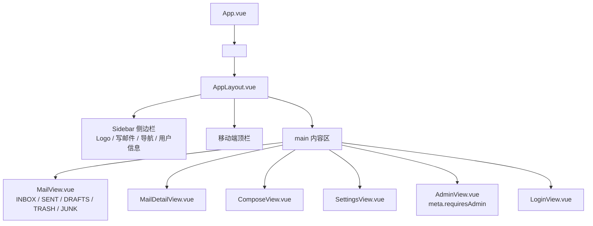
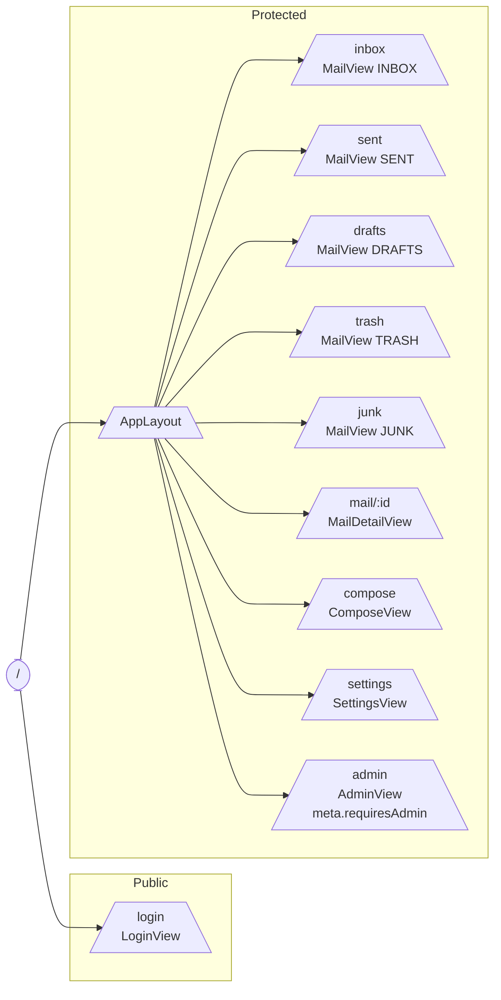
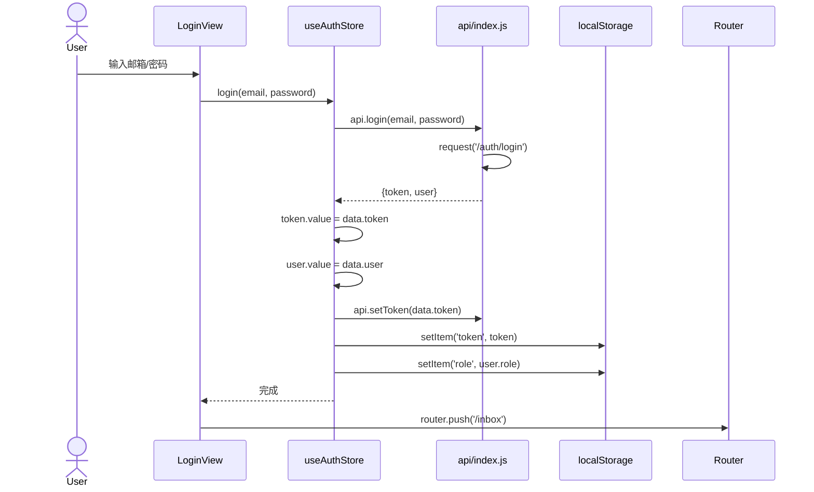
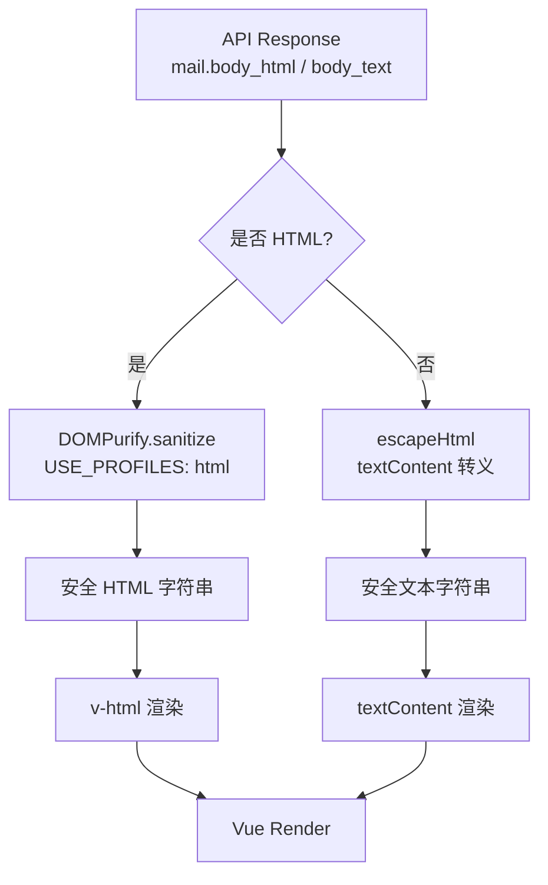

# 前端文件详解

> 本文档对 MyMail 前端项目（`mymail-vue`）所有源文件进行逐文件详解，覆盖应用入口、根组件、路由、API 封装、Pinia Store、组合式函数、通用组件、视图组件、样式与构建配置。
> 阅读对象：初级前端开发人员、维护者、代码审计人员。
> 关联 Bug 编号沿用《MyMail 项目完整评估分析报告》中的 P0-x / P1-x 命名（如 P0-4 XSS、P0-5 路由守卫等）。

---

## 1. 应用入口 `src/main.js`

**文件路径**：`mymail-vue/src/main.js`

### 1.1 功能概述

应用入口文件，负责创建 Vue 应用实例，注册 Pinia 状态管理与 Vue Router 路由插件，并挂载到 `index.html` 中的 `#app` 节点。同时引入全局样式 `main.css`。

### 1.2 代码片段

```js
import { createApp } from 'vue'
import { createPinia } from 'pinia'
import App from './App.vue'
import router from './router'
import './assets/main.css'

const app = createApp(App)
app.use(createPinia())
app.use(router)
app.mount('#app')
```

### 1.3 关键说明

- **插件注册顺序**：先 Pinia 后 Router。这是因为 `App.vue` 的 `onMounted` 钩子中调用 `useAuthStore()`，必须保证 Pinia 已注册。
- **全局样式**：`import './assets/main.css'` 引入 Tailwind CSS v4 与自定义主题（详见第 9 节）。
- **无全局错误处理器**：未调用 `app.config.errorHandler`，未捕获的 Promise 异常会输出到控制台。

### 1.4 与其他模块的交互

| 模块 | 关系 |
|---|---|
| `App.vue` | 根组件 |
| `router/index.js` | 路由配置 |
| `assets/main.css` | 全局样式 |

---

## 2. 根组件 `src/App.vue`

**文件路径**：`mymail-vue/src/App.vue`

### 2.1 功能概述

根组件，仅承担两件事：渲染 `<router-view>` 并提供页面切换过渡动画；在挂载时若 localStorage 存在 token，则调用 `auth.fetchMe()` 恢复登录状态。

### 2.2 模板结构

```vue
<template>
  <router-view v-slot="{ Component }">
    <transition name="page" mode="out-in">
      <component :is="Component" />
    </transition>
  </router-view>
</template>
```

使用 `<transition name="page">` 实现页面淡入淡出过渡，过渡类定义在 `main.css` 中（`.page-enter-active` 等）。

### 2.3 响应式状态与生命周期

```js
import { onMounted } from 'vue'
import { useAuthStore } from '@/stores/auth'

const auth = useAuthStore()

onMounted(async () => {
  if (auth.token) {
    await auth.fetchMe()
  }
})
```

- **生命周期钩子**：`onMounted` —— 应用启动时恢复用户信息。
- **状态交互**：读取 `auth.token`（来自 localStorage），调用 `auth.fetchMe()` 拉取 `/api/auth/me`。若 token 失效则 `fetchMe` 内部调用 `logout()` 清空状态。

### 2.4 修复的 Bug

无直接对应 Bug，但 `fetchMe()` 的 token 失效处理依赖 `api/index.js` 中 P1-15 的修复（401 用 `router.replace` 跳转而非 `window.location.href`）。

### Vue 应用组件树



上图展示了 MyMail Vue 应用的组件层级：`App.vue` 作为根组件只渲染 `<router-view>`；路由匹配到主布局 `AppLayout.vue` 后，由它提供侧边栏、移动端顶栏和主内容区；主内容区再根据当前路由挂载不同的视图组件。所有需要登录的页面都共享 `AppLayout`，而 `/login` 作为独立页面直接渲染。

---

## 3. 路由配置 `src/router/index.js`

**文件路径**：`mymail-vue/src/router/index.js`

### 3.1 功能概述

定义 SPA 路由表，包含登录页与主布局下的子路由（收件箱、已发送、草稿、回收站、垃圾邮件、邮件详情、写邮件、设置、管理后台）。配置全局前置守卫实现登录校验与管理员权限校验。

### 3.2 路由表结构

| 路径 | 名称 | 组件 | 说明 |
|---|---|---|---|
| `/login` | login | `LoginView.vue` | 登录/注册页 |
| `/` | - | `AppLayout.vue` | 主布局（含侧边栏） |
| `/inbox` | inbox | `MailView.vue` | 收件箱（folder=INBOX） |
| `/sent` | sent | `MailView.vue` | 已发送（folder=SENT） |
| `/drafts` | drafts | `MailView.vue` | 草稿箱（folder=DRAFTS） |
| `/trash` | trash | `MailView.vue` | 回收站（folder=TRASH） |
| `/junk` | junk | `MailView.vue` | 垃圾邮件（folder=JUNK） |
| `/mail/:id` | mail-detail | `MailDetailView.vue` | 邮件详情 |
| `/compose` | compose | `ComposeView.vue` | 写邮件/回复/转发/编辑草稿 |
| `/settings` | settings | `SettingsView.vue` | 设置 |
| `/admin` | admin | `AdminView.vue` | 管理后台（**meta.requiresAdmin**） |

`MailView.vue` 通过 `props: { folder: 'INBOX' }` 复用同一组件渲染 5 个文件夹。

### Vue Router 路由结构



路由结构图说明：根路径 `/` 重定向到 `/inbox`；所有业务页面都挂在 `AppLayout` 之下，`MailView` 通过 `props.folder` 复用渲染 5 个文件夹；`/admin` 单独标记 `meta.requiresAdmin`，由全局前置守卫校验 `localStorage.role`；`/login` 是唯一的公开路由，未登录用户会被强制跳转到这里。

### 3.3 路由守卫（P0-5 修复）

```js
router.beforeEach((to) => {
  const token = localStorage.getItem('token')
  if (!token && to.name !== 'login') return { name: 'login' }
  // P0-5：管理员路由守卫
  if (to.meta.requiresAdmin) {
    const role = localStorage.getItem('role')
    if (role !== 'admin') return { name: 'inbox' }
  }
})
```

**P0-5 修复说明**：原代码无管理员路由守卫，任意登录用户可直接访问 `/admin`。修复方案：
1. 在 `/admin` 路由配置 `meta: { requiresAdmin: true }`；
2. 守卫中读取 `localStorage.role`，非 `admin` 重定向到 `/inbox`；
3. `role` 由 `stores/auth.js` 在登录/拉取用户时同步写入 localStorage（详见第 5 节）。

### 3.4 与其他模块的交互

- `stores/auth.js`：负责写入/清除 `localStorage.role`。
- `api/index.js`：401 拦截器调用 `router.replace`（P1-15 修复）。

---

## 4. API 封装 `src/api/index.js`

**文件路径**：`mymail-vue/src/api/index.js`

### 4.1 功能概述

封装所有 HTTP 请求，统一处理：
- 基础路径前缀 `/api`
- JWT Bearer Token 注入（从 localStorage 读取）
- JSON / FormData 自动序列化
- 401 拦截（清 token + 跳转登录页）
- 错误响应解析

### 4.2 核心函数 `request`

```js
async function request(path, options = {}) {
  const headers = { ...options.headers }
  const token = getToken()
  if (token) headers['Authorization'] = `Bearer ${token}`

  if (!(options.body instanceof FormData)) {
    headers['Content-Type'] = 'application/json'
    if (options.body && typeof options.body === 'object') {
      options.body = JSON.stringify(options.body)
    }
  }

  const res = await fetch(BASE + path, { ...options, headers })

  if (res.status === 401) {
    setToken(null)
    localStorage.removeItem('role')
    // P1-15：用 router.replace 跳转
    const router = await getRouter()
    router.replace({ name: 'login' })
    throw new Error('请重新登录')
  }
  // ...
}
```

### 4.3 P1-15 修复：循环依赖与 401 跳转

**原 Bug**：
1. 401 处理用 `window.location.href = '/login'` 导致整页刷新，丢失 SPA 状态；
2. 直接 `import router from '@/router'` 会形成循环依赖（`api ← router ← views ← api`）。

**修复方案**：
```js
let _router = null
async function getRouter() {
  if (!_router) {
    const mod = await import('@/router')
    _router = mod.default
  }
  return _router
}
```
延迟动态导入 `router`，首次调用时加载并缓存，避免循环依赖；改用 `router.replace` 实现无刷新跳转。

### 4.4 导出的 API 函数清单

| 模块 | 函数 | HTTP 方法 | 路径 |
|---|---|---|---|
| Auth | `login(email, password, remember)` | POST | `/auth/login` |
| Auth | `register(username, password, displayName)` | POST | `/auth/register` |
| Auth | `getMe()` | GET | `/auth/me` |
| Auth | `updateProfile(data)` | PUT | `/auth/profile` |
| Auth | `changePassword(currentPw, newPw)` | PUT | `/auth/password` |
| Mail | `getMailList(params)` | GET | `/mail/list?...` |
| Mail | `getMail(id)` | GET | `/mail/:id` |
| Mail | `sendMail(formData)` | POST | `/mail/send` |
| Mail | `saveDraft(data)` | POST | `/mail/save-draft` |
| Mail | `deleteMail(id)` | DELETE | `/mail/:id` |
| Mail | `markRead(id)` / `markUnread(id)` | PUT | `/mail/:id/read`、`/mail/:id/unread` |
| Mail | `toggleStar(id)` | PUT | `/mail/:id/star` |
| Mail | `moveToFolder(id, folder)` | POST | `/mail/batch/move` |
| Mail | `uploadFiles(formData)` | POST | `/mail/upload` |
| Mail | `deleteUpload(id)` | DELETE | `/mail/upload/:id` |
| Mail | `batchDelete(ids)` / `batchMarkRead(ids)` / `batchMove(ids, folder)` | POST | `/mail/batch/*` |
| Admin | `getUsers()` / `getUser(id)` / `deleteUser(id)` | GET/DELETE | `/admin/users*` |
| Admin | `disableUser(id)` / `enableUser(id)` / `resetPassword(id, pw)` | PUT | `/admin/users/:id` |
| Admin | `checkDns()` / `getStats()` | GET | `/admin/dns-status`、`/admin/stats` |

### 4.5 工具函数

- `setToken(t)` / `getToken()`：token 读写 localStorage。
- `getAttachmentUrl(msgId, attId)` / `getDownloadAllUrl(msgId)`：构造附件下载 URL（直接走 `<a href>`，由浏览器自动带 Cookie/同源凭据）。

---

## 5. 状态管理 `stores/auth.js` + `stores/ws.js`

### 5.1 `stores/auth.js`

**文件路径**：`mymail-vue/src/stores/auth.js`

**功能概述**：认证状态管理，封装登录、注册、获取当前用户、登出，并将 `role` 同步到 localStorage 供路由守卫读取。

**响应式状态**：
```js
const user = ref(null)
const token = ref(localStorage.getItem('token') || null)
const isAuthenticated = computed(() => !!token.value)
```

**关键方法**：

| 方法 | 行为 |
|---|---|
| `login(email, password, remember)` | 调 `api.login` → 写 token/user → `persistRole` |
| `register(username, password, displayName)` | 调 `api.register` → 写 token/user → `persistRole` |
| `fetchMe()` | 调 `api.getMe` → 写 user → `persistRole`；失败则 `logout()` |
| `logout()` | 清空 user/token/role |

**P0-5 修复**：
```js
function persistRole(role) {
  if (role) localStorage.setItem('role', role)
  else localStorage.removeItem('role')
}
```
登录、注册、fetchMe 成功后均调用 `persistRole(data.user?.role)`，使路由守卫能在不访问 Pinia 实例的情况下读取 role。

### Pinia Store 状态流转



状态流转说明：`LoginView` 调用 `useAuthStore.login` 发起认证；`auth store` 通过 `api/index.js` 请求后端，拿到 token 与用户信息后写入 Pinia 响应式状态，并同步到 `localStorage`（token 与 role）；`api.setToken` 使后续请求自动带上 Bearer 头；最后视图层调用 `router.push` 进入收件箱。登出时流程反向执行，清空状态与本地存储。

### 5.2 `stores/ws.js`

**文件路径**：`mymail-vue/src/stores/ws.js`

**功能概述**：WebSocket 实时推送 + 未读轮询兜底。WebSocket 推送 `new_mail` / `queue_complete` 事件转换为浏览器 `CustomEvent`，由组件层监听。

**响应式状态**：
```js
const ws = ref(null)
const unreadCount = ref(0)
const connected = ref(false)
let reconnectTimer = null
let pollTimer = null
```

**关键方法**：

| 方法 | 行为 |
|---|---|
| `connect()` | 创建 WebSocket（`ws://host/ws?token=xxx`），onmessage 解析 JSON 并 `dispatchEvent`；onclose 5 秒后自动重连 |
| `disconnect()` | 关闭 WS、清定时器 |
| `startPolling()` | 每 10 秒调 `getMailList({folder:'INBOX', limit:1})` 更新 `unreadCount` |
| `stopPolling()` | 清轮询定时器 |
| `refreshUnread(getMailList)` | 单次拉取未读数 |

**P1-18 相关说明**：当前前端仍走 URL query 传 token（`?token=xxx`），后端已支持子协议认证（`Sec-WebSocket-Protocol: auth.<token>`）作为推荐方式，前端可后续切换。

**事件分发**：
```js
if (msg.type === 'new_mail') {
  window.dispatchEvent(new CustomEvent('mymail:new-mail', { detail: msg.data }))
} else if (msg.type === 'queue_complete') {
  window.dispatchEvent(new CustomEvent('mymail:queue-complete', { detail: msg.data }))
}
```

**与其他模块的交互**：
- `useAuthStore`：读取 token。
- `@/api`：动态导入 `getMailList` 用于轮询。
- `AppLayout.vue`：调用 `connect/startPolling/disconnect`，监听 `mymail:new-mail` 事件。

---

## 6. 组合式函数 `composables/useFormat.js` + `useToast.js`

### 6.1 `useFormat.js`

**文件路径**：`mymail-vue/src/composables/useFormat.js`

**功能概述**：提供日期格式化与 HTML 转义两个工具函数。

**`formatDate(str)`**：
- 当天 → `HH:mm`
- 当年 → `M月D日`
- 跨年 → `YYYY/M/D`

**`escapeHtml(str)`**（P1-19 修复）：
```js
function escapeHtml(str) {
  if (!str) return ''
  const div = document.createElement('div')
  div.textContent = String(str)
  return div.innerHTML
}
```

**P1-19 修复说明**：原实现用正则替换 `& < >`，未转义 `"` 与 `'`，导致属性上下文仍可 XSS。修复后利用浏览器 `textContent → innerHTML` 机制自动转义全部 5 个字符（`& < > " '`），更安全。

> 注意：邮件正文净化优先用 DOMPurify（见 P0-4），`escapeHtml` 仅用于纯文本展示场景（如 toast 消息）。

### 6.2 `useToast.js`

**文件路径**：`mymail-vue/src/composables/useToast.js`

**功能概述**：命令式 Toast 通知，动态创建 DOM 元素，3.5 秒自动消失，支持 info/success/error/warning 四种类型。

**用法**：
```js
const { toast } = useToast()
toast('已保存', 'success')
toast('删除失败', 'error')
```

**实现要点**：
- 单例容器：`document.getElementById('toast-container')`，不存在则创建。
- 动画：`requestAnimationFrame` 双层触发过渡，避免初始状态被合并。
- 内部 `escapeHtml`：toast 消息文本插入 `innerHTML` 前转义，防 XSS。
- 关闭按钮：`onclick="this.parentElement.remove()"` 内联事件。

**与其他模块的交互**：被 `MailView.vue`、`MailDetailView.vue`、`ComposeView.vue`、`AdminView.vue`、`SettingsView.vue` 广泛使用。

---

## 7. 通用组件 `components/AppLayout.vue` + `UploadZone.vue` + `SkeletonList.vue`

### 7.1 `AppLayout.vue`

**文件路径**：`mymail-vue/src/components/AppLayout.vue`

**功能概述**：主布局组件，含侧边栏（Logo + 写邮件按钮 + 导航 + 用户信息 + 退出）、移动端顶栏、`<router-view>` 内容区。负责 WebSocket 连接与未读轮询的生命周期管理。

**Props/Emits**：无。

**响应式状态**：
```js
const sidebarOpen = ref(false)  // 移动端侧边栏开关
const userInitial = computed(() => /* 取 displayName/email 首字母大写 */)
const navItems = computed(() => [
  { to: '/inbox', icon: '📥', label: '收件箱', badge: ws.unreadCount || 0 },
  { to: '/sent', icon: '📤', label: '已发送' },
  // ... 草稿/回收站/垃圾邮件/设置
  ...(auth.user?.role === 'admin' ? [{ to: '/admin', icon: '👤', label: '管理' }] : []),
])
```

**关键方法**：
- `handleLogout()`：`ws.disconnect()` → `auth.logout()` → `router.push('/login')`。
- `onNewMail()`：监听到 `mymail:new-mail` 事件时重启轮询。

**生命周期钩子**：
```js
onMounted(() => {
  ws.connect()
  ws.startPolling()
  window.addEventListener('mymail:new-mail', onNewMail)
})
onUnmounted(() => {
  ws.disconnect()
  ws.stopPolling()
  window.removeEventListener('mymail:new-mail', onNewMail)
})
```

**P1-17 修复说明**：原代码移动端退出按钮被侧边栏遮挡不可点击。修复后退出按钮始终可见（`lg:static` 侧边栏在桌面端常驻，移动端通过 `sidebarOpen` 控制滑入滑出，退出按钮在用户信息块内独立可点击）。

**与其他模块的交互**：
- `useAuthStore`（用户信息、登出）
- `useWsStore`（WS 连接、未读数）
- `vue-router`（路由跳转、当前路径高亮）

### 7.2 `UploadZone.vue`

**文件路径**：`mymail-vue/src/components/UploadZone.vue`

**功能概述**：附件上传区，支持拖拽与点击选择，并行上传多个文件，实时显示进度与状态，支持删除已上传文件。通过 `defineExpose` 暴露 `getAttachmentIds()` / `getFiles()` / `isUploading()` 给父组件。

**Props**：
```js
defineProps({
  accept: {
    type: String,
    default: '.pdf,.doc,.docx,.xls,.xlsx,.ppt,.pptx,.txt,.csv,.zip,.rar,.7z,.jpg,.jpeg,.png,.gif,.bmp,.svg,.mp3,.mp4,.avi,.mov'
  }
})
```

**Emits**：`update:attachments`（上传/删除完成后触发，传出 attId 数组）。

**暴露方法**（`defineExpose`）：
- `getAttachmentIds()`：返回 `status==='done'` 且有 `attId` 的文件 ID 列表。
- `getFiles()`：返回原始 File 对象数组（供 send 端点 multipart 上传）。
- `isUploading()`：返回 `uploadingCount.value > 0`。

**P0-7 修复说明**：原上传逻辑混乱——`isUploading` 始终返回 `false`，导致用户在附件上传未完成时即可点发送；且并行上传时状态管理错误。修复方案：
1. 引入 `uploadingCount` 计数器，`uploadOne` 进入时 `++`，finally 中 `--`；
2. `isUploading()` 返回 `uploadingCount.value > 0`；
3. `ComposeView.vue` 发送按钮 `:disabled="uploadZone && uploadZone.isUploading()"`。

**响应式状态**：
```js
const isDragging = ref(false)
const files = ref([])
const dropZone = ref(null)
const uploadingCount = ref(0)  // P0-7
```

**关键方法**：
- `onDrop(e)` / `onFileSelect(e)`：拖拽/选择入口，调 `handleFiles`。
- `handleFiles(newFiles)`：过滤 >25MB 文件，为每个文件创建 item（含 `previewUrl` 用于图片预览），推入 `files` 并调 `uploadOne`。
- `uploadOne(item)`：FormData 包装单文件，调 `api.uploadFiles`，成功设置 `attId` 与 `status='done'`，失败设 `status='error'`。
- `removeFile(file)`：上传中禁止删除；已上传调 `api.deleteUpload` 删除服务端文件；撤销 `blob:` URL。

**生命周期钩子**：无（纯受控组件）。

**与其他模块的交互**：
- `@/api`：`uploadFiles`、`deleteUpload`、`getUploadPreviewUrl`。
- `ComposeView.vue`：父组件，通过 ref 调用暴露方法。

### 7.3 `SkeletonList.vue`

**文件路径**：`mymail-vue/src/components/SkeletonList.vue`

**功能概述**：邮件列表加载骨架屏，渲染 `count` 个占位行，shimmer 动画。

**Props**：
```js
defineProps({ count: { type: Number, default: 6 } })
```

**样式**：scoped CSS 实现 shimmer 渐变动画：
```css
.skel {
  background: linear-gradient(90deg, #1e293b 25%, #334155 50%, #1e293b 75%);
  background-size: 200% 100%;
  animation: shimmer 1.5s infinite;
}
```

**使用场景**：`MailView.vue` 加载时 `<SkeletonList v-if="loading" :count="8" />`。

---

## 8. 视图组件 `views/*.vue`

### 8.1 `LoginView.vue`

**文件路径**：`mymail-vue/src/views/LoginView.vue`

**功能概述**：登录/注册双模式页面，含动态星空背景、密码强度计、显示/隐藏密码、记住我。登录成功后若 `requirePasswordChange` 为 true 则跳转设置页改密，否则跳转收件箱。

**响应式状态**：
```js
const isLogin = ref(true)
const loading = ref(false)
const error = ref('')
const showPw = ref(false)
const pwdStrength = ref(0)
const loginForm = reactive({ email: '', password: '', remember: false })
const registerForm = reactive({ username: '', password: '', password2: '', displayName: '' })
```

**关键方法**：
- `handleLogin()`：调 `api.login` → 写 `auth.token`/`auth.user` → `api.setToken` → 根据 `requirePasswordChange` 跳转。
- `handleRegister()`：校验两次密码一致 → 调 `api.register` → 写状态 → 跳转 `/inbox`。
- `calcStrength()`：根据长度、大写、数字、符号计算密码强度（0-100）。
- `starStyle(i)`：生成 30 颗星星的随机位置与动画参数。

**生命周期钩子**：无（纯事件驱动）。

**与其他模块的交互**：
- `useAuthStore`：写入 token/user。
- `@/api`：login/register。
- `vue-router`：跳转。

### 8.2 `MailView.vue`

**文件路径**：`mymail-vue/src/views/MailView.vue`

**功能概述**：邮件列表视图，5 个文件夹（INBOX/SENT/DRAFTS/TRASH/JUNK）共用，通过 `props.folder` 区分。支持搜索、星标筛选、单选/全选、批量已读/未读/删除、分页（每页 20 条）、点击进入详情或编辑草稿。

**Props**：
```js
defineProps({ folder: { type: String, default: 'INBOX' } })
```

**响应式状态**：
```js
const mails = ref([])
const page = ref(1)
const total = ref(0)
const search = ref('')
const loading = ref(true)
const selected = ref([])
const starredOnly = ref(false)
```

**Computed**：
- `folderName` / `folderIcon`：根据 folder 映射中文名与图标。
- `totalPages`：`Math.ceil(total / 20)`。
- `allSelected`：是否全选。

**关键方法**：
- `loadMails(p=1)`：调 `getMailList({folder, page, limit:20, search, starred})`，写入 `mails`/`total`。
- `toggleSelect(id)` / `toggleSelectAll()`：选择状态管理。
- `starMail(mail)`：乐观更新 + 失败回滚（调 `toggleStar`）。
- `openMail(mail)`：草稿 → 跳 `compose?draftId=`；其他 → 标记已读后跳详情。
- `batchRead()` / `batchUnread()` / `batchDelete()`：批量操作。

**P0-6 修复说明**：原 `batchDelete` 调用 `toast(...)` 但未导入 `useToast`，导致 `ReferenceError`。修复方案：
```js
import { useToast } from '@/composables/useToast'
const { toast } = useToast()
// batchDelete 中：
toast('已删除', 'success')
```

**生命周期钩子**：
```js
watch(() => props.folder, () => { starredOnly.value = false; loadMails(1) })
onMounted(() => loadMails())
```

**与其他模块的交互**：
- `@/api`：getMailList、markRead、markUnread、toggleStar、batchMarkRead、batchDelete。
- `useFormat`：formatDate。
- `useToast`：toast 通知。
- `SkeletonList`：加载骨架。

### 8.3 `MailDetailView.vue`

**文件路径**：`mymail-vue/src/views/MailDetailView.vue`

**功能概述**：邮件详情视图，展示主题、发件人、收件人、抄送、正文（HTML 净化后渲染）、附件列表（含单附件下载与批量 zip 下载）。支持回复、转发、星标切换、删除。

**Props**：
```js
defineProps({ id: { type: [String, Number], required: true } })
```

**P0-4 修复（核心）**：
```js
import DOMPurify from 'dompurify'

function sanitize(html) {
  if (!html) return ''
  return DOMPurify.sanitize(html, { USE_PROFILES: { html: true } })
}
```
模板中：
```html
<div v-html="sanitize(mail.body_html || escapeHtml(mail.body_text))"></div>
```
**原 Bug**：直接 `v-html="mail.body_html"` 渲染未净化的邮件 HTML，导致存储型 XSS（恶意邮件中的 `<script>` 在用户查看邮件时执行）。修复后用 DOMPurify 净化，移除 script/iframe/event handler 等危险元素。

### 前端安全处理链



安全处理链说明：邮件正文从 API 返回后，首先判断内容类型；HTML 正文必须经过 `DOMPurify.sanitize` 去除脚本、iframe、事件处理器等危险标签与属性，才能交给 `v-html` 渲染；纯文本则通过 `escapeHtml`（利用浏览器 `textContent` 机制）转义后使用 `textContent` 展示。该链路同时应用于 `MailDetailView` 的邮件阅读和 `ComposeView` 的回复/转发引用，阻断存储型 XSS。

**响应式状态**：
```js
const mail = ref(null)
const attachments = ref([])
const loading = ref(true)
```

**关键方法**：
- `loadMail()`：调 `getMail(id)`，拆分 attachments 与 mail。
- `reply()` / `forward()`：跳 `compose?replyId=` / `compose?forwardId=`。
- `toggleStarred()`：乐观更新 + 失败回滚。
- `del()`：调 `deleteMail` → toast → `router.back()`。
- `formatSize(bytes)` / `fileIcon(name)`：辅助显示。

**生命周期钩子**：`onMounted(loadMail)`。

**与其他模块的交互**：
- `@/api`：getMail、deleteMail、toggleStar。
- `dompurify`：HTML 净化。
- `useFormat`：formatDate、escapeHtml。
- `useToast`：toast。

### 8.4 `ComposeView.vue`

**文件路径**：`mymail-vue/src/views/ComposeView.vue`

**功能概述**：写邮件/回复/转发/编辑草稿四合一视图。含收件人 chip 输入、抄送/密送、主题、Quill 富文本编辑器（CDN 动态加载，失败回退 textarea）、附件上传区、签名开关、保存草稿、发送。离开页面前提示保存草稿。

**P0-4 修复（回复/转发 XSS）**：
```js
function sanitize(html) {
  if (!html) return ''
  return DOMPurify.sanitize(html, { USE_PROFILES: { html: true } })
}
// loadReplyOrForward 中：
await setBodyHtml(`<br><br><p>---------- 回复内容 ----------</p>...${sanitize(msg.body_html || msg.body_text || '')}`)
```
**原 Bug**：回复/转发时直接将原邮件 `body_html` 拼入编辑器，恶意脚本在编辑器内执行（二次 XSS）。修复后用 DOMPurify 净化原邮件 HTML 再拼接。

**响应式状态**：
```js
const toRecipients = ref([])
const toInputValue = ref('')
const showCcBcc = ref(false)
const cc = ref('')
const bcc = ref('')
const subject = ref('')
const useSignature = ref(true)
const sending = ref(false)
const saving = ref(false)
const attachmentIds = ref([])
const editorRef = ref(null)
const uploadZone = ref(null)
const quillReady = ref(false)
const quillFailed = ref(false)
const fallbackBody = ref('')
let quill = null
let currentDraftId = null
```

**路由参数**（query）：
- `draftId`：编辑草稿
- `replyId`：回复
- `forwardId`：转发

**关键方法**：
- `loadQuill()`：动态加载 Quill CSS/JS（8 秒超时），失败设 `quillFailed=true` 回退 textarea。
- `loadDraft()`：若 `draftId` 存在，调 `getMail` 填充表单。
- `loadReplyOrForward()`：根据 `replyId`/`forwardId` 加载原邮件，构造引用头 + 净化后的正文。
- `handleSend()`：校验收件人与上传状态 → FormData 包装 → 调 `sendMail` → 删除原草稿 → 跳 `/sent`。
- `handleSaveDraft()`：调 `saveDraft`（JSON body）→ 记录 `currentDraftId`。
- `handleBack()`：若有内容则 confirm 询问是否保存草稿。
- `onBeforeUnload(e)`：浏览器关闭/刷新前提示。

**生命周期钩子**：
```js
onMounted(async () => {
  await loadQuill()
  await loadDraft()
  await loadReplyOrForward()
  window.addEventListener('beforeunload', onBeforeUnload)
})
onUnmounted(() => { window.removeEventListener('beforeunload', onBeforeUnload); quill = null })
```

**与其他模块的交互**：
- `@/api`：sendMail、saveDraft、getMail、deleteMail。
- `dompurify`：净化原邮件 HTML。
- `useAuthStore`：读取 signature。
- `useToast`：toast。
- `UploadZone`：附件上传。

### 8.5 `AdminView.vue`

**文件路径**：`mymail-vue/src/views/AdminView.vue`

**功能概述**：管理后台，含统计卡片（用户总数、今日邮件、今日发送）、DNS 检测（MX/SPF/DMARC）、用户管理表格（桌面端表格 + 移动端卡片）。支持禁用/启用用户、重置密码、删除用户。

**响应式状态**：
```js
const users = ref([])
const stats = ref({})
const dns = ref([])
const resetPwModal = ref(null)  // P1-16
```

**P1-16 修复（重置密码明文 toast）**：
**原 Bug**：重置密码后将明文密码通过 `toast(pw, 'success')` 显示，密码短暂可见且会被 toast 自动消失逻辑丢失。修复方案：
1. 引入 `resetPwModal` 状态，重置成功后弹模态框显示新密码；
2. 模态框含"📋 复制"按钮调 `navigator.clipboard.writeText`；
3. 明确提示"此密码仅显示一次"。

```js
async function resetPw(id) {
  const pw = generatePw()
  await resetPassword(id, pw)
  resetPwModal.value = { userId: id, password: pw }
}
```

**关键方法**：
- `loadAll()`：`Promise.all` 并发加载 users/stats/dns。
- `loadDns()`：单独刷新 DNS，toast 提示。
- `formatDns(d)`：将 `{mx, spf, dmarc}` 转为展示数组。
- `disableUser(id)` / `enableUser(id)` / `deleteUser(id)`：调对应 API 并本地更新。
- `generatePw()`：12 位随机密码（含大小写字母、数字、符号）。
- `copyPassword()`：复制到剪贴板。

**生命周期钩子**：`onMounted(loadAll)`。

**与其他模块的交互**：
- `@/api`：getUsers、getStats、checkDns、deleteUser、disableUser、enableUser、resetPassword。
- `useToast`：toast。

> 注意：路由守卫（P0-5）已确保只有 `role==='admin'` 能进入此页。

### 8.6 `SettingsView.vue`

**文件路径**：`mymail-vue/src/views/SettingsView.vue`

**功能概述**：用户设置页，含个人信息（显示名称、签名）、修改密码、邮件配置展示（IMAP/SMTP 服务器与端口）。支持从 URL query `changePw=1` 自动滚动到修改密码区。

**响应式状态**：
```js
const displayName = ref('')
const signature = ref('')
const oldPw = ref('')
const newPw = ref('')
const newPw2 = ref('')
```

**关键方法**：
- `saveProfile()`：调 `updateProfile` → `auth.fetchMe()` 刷新 → toast。
- `changePw()`：校验两次一致 → 调 `changePassword` → 清空输入 → toast。

**生命周期钩子**：
```js
onMounted(async () => {
  if (auth.user) {
    displayName.value = auth.user?.displayName || ''
    signature.value = auth.user?.signature || ''
  }
  await nextTick()
  if (route.query.changePw) {
    document.getElementById('pw-section')?.scrollIntoView({ behavior: 'smooth' })
  }
})
```

**与其他模块的交互**：
- `useAuthStore`：读取 user、fetchMe。
- `@/api`：updateProfile、changePassword。
- `useToast`：toast。

---

## 9. 样式与配置 `assets/main.css` + `vite.config.js` + `package.json` + `index.html`

### 9.1 `assets/main.css`

**文件路径**：`mymail-vue/src/assets/main.css`

**功能概述**：全局样式入口，引入 Tailwind CSS v4（`@import "tailwindcss"`），定义暗色主题色板与组件类。

**主题色板**（`@theme`）：
- `dark-900` ~ `dark-100`：从 `#0f172a` 到 `#f1f5f9` 的灰阶。
- `primary-600` ~ `primary-300`：靛蓝色系（`#4f46e5` ~ `#a5b4fc`）。

**组件类**（`@apply` 复合）：
- `.card`：圆角卡片容器。
- `.sidebar-item` / `.sidebar-item.active`：侧边栏导航项。
- `.btn-primary` / `.btn-secondary` / `.btn-danger` / `.btn-ghost`：按钮变体。
- `.input-field`：表单输入框。

**过渡动画**：
- `.page-enter/leave`：页面切换（200ms 淡入 + translateY）。
- `.fade-enter/leave`：淡入淡出（用于批量操作栏）。
- `.slide-enter/leave`：滑动（预留）。

**滚动条样式**：自定义 webkit 滚动条宽度 8px，dark-900 背景，dark-700 滑块。

### 9.2 `vite.config.js`

**文件路径**：`mymail-vue/vite.config.js`

**功能概述**：Vite 构建配置，启用 Vue SFC 插件与 Tailwind v4 插件，配置 `@` 路径别名指向 `./src`，开发服务器代理 `/api` 与 `/ws` 到 `https://pymt.qzz.io`。

```js
export default defineConfig({
  plugins: [vue(), tailwindcss()],
  resolve: {
    alias: { '@': fileURLToPath(new URL('./src', import.meta.url)) },
  },
  server: {
    proxy: {
      '/api': { target: 'https://pymt.qzz.io', changeOrigin: true },
      '/ws': { target: 'wss://pymt.qzz.io', ws: true },
    },
  },
})
```

**说明**：开发时前端跑在 Vite dev server（默认 5173），API 请求代理到远程后端，避免 CORS。生产环境前端 dist 由 Go 后端 `//go:embed` 内嵌，同源访问。

### 9.3 `package.json`

**文件路径**：`mymail-vue/package.json`

**关键依赖**：

| 依赖 | 版本 | 用途 |
|---|---|---|
| `vue` | ^3.5.32 | 框架 |
| `vue-router` | ^5.0.6 | 路由 |
| `pinia` | ^3.0.4 | 状态管理 |
| `tailwindcss` | ^4.2.4 | 原子化 CSS |
| `@tailwindcss/vite` | ^4.2.4 | Tailwind v4 Vite 插件 |
| `dompurify` | ^3.2.4 | **P0-4 XSS 净化** |

**devDependencies**：`vite` ^8.0.8、`@vitejs/plugin-vue` ^6.0.6、`eslint` ^8.57.1、`eslint-plugin-vue` ^9.32.0、`prettier` ^3.4.2、`husky` ^9.1.7、`vite-plugin-vue-devtools` ^8.1.1。

**scripts**：
- `dev`：`vite` 启动开发服务器。
- `build`：`vite build` 生产构建。
- `preview`：`vite preview` 预览构建产物。
- `lint` / `lint:fix`：ESLint 检查/修复。
- `format`：Prettier 格式化。
- `prepare`：`husky install || true` 安装 Git hooks。

**engines**：`node ^20.19.0 || >=22.12.0`。

### 9.4 `index.html`

**文件路径**：`mymail-vue/index.html`

**功能概述**：HTML 入口，含 `<div id="app">` 挂载点与 ES module 脚本 `/src/main.js`。

```html
<!DOCTYPE html>
<html lang="">
  <head>
    <meta charset="UTF-8">
    <link rel="icon" type="image/svg+xml" href="/favicon.svg">
    <meta name="viewport" content="width=device-width, initial-scale=1.0">
    <title>MyMail - 邮件平台</title>
  </head>
  <body>
    <div id="app"></div>
    <script type="module" src="/src/main.js"></script>
  </body>
</html>
```

**注意**：`<html lang="">` 为空字符串，建议设为 `zh-CN` 以提升无障碍访问与 SEO（非本任务范围）。

---

## 附录：Bug 修复编号索引

| Bug 编号 | 描述 | 涉及文件 |
|---|---|---|
| **P0-4** | 邮件正文 / 回复转发 XSS（v-html 未净化） | `MailDetailView.vue`、`ComposeView.vue`（引入 DOMPurify） |
| **P0-5** | /admin 路由无权限守卫 | `router/index.js`（meta.requiresAdmin + 守卫）、`stores/auth.js`（persistRole） |
| **P0-6** | MailView batchDelete toast 未定义 | `MailView.vue`（导入 useToast） |
| **P0-7** | UploadZone 上传逻辑混乱（isUploading 始终 false） | `UploadZone.vue`（uploadingCount 计数器） |
| **P1-15** | 401 处理用 window.location.href（整页刷新 + 循环依赖） | `api/index.js`（动态导入 router + router.replace） |
| **P1-16** | AdminView 重置密码明文 toast | `AdminView.vue`（模态框 + 复制按钮） |
| **P1-17** | AppLayout 移动端退出按钮不可点击 | `AppLayout.vue`（侧边栏响应式重构） |
| **P1-18** | WS token 走 URL query（日志泄露风险） | `stores/ws.js`（前端暂保留 URL query，后端已支持子协议） |
| **P1-19** | escapeHtml 未转义 `"` `'` | `useFormat.js`（textContent 实现） |

---

> 文档版本：v1.0
> 生成日期：2026-07-04
> 对应代码版本：mymail-vue 当前工作区
