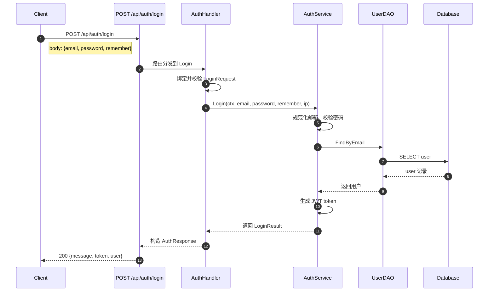
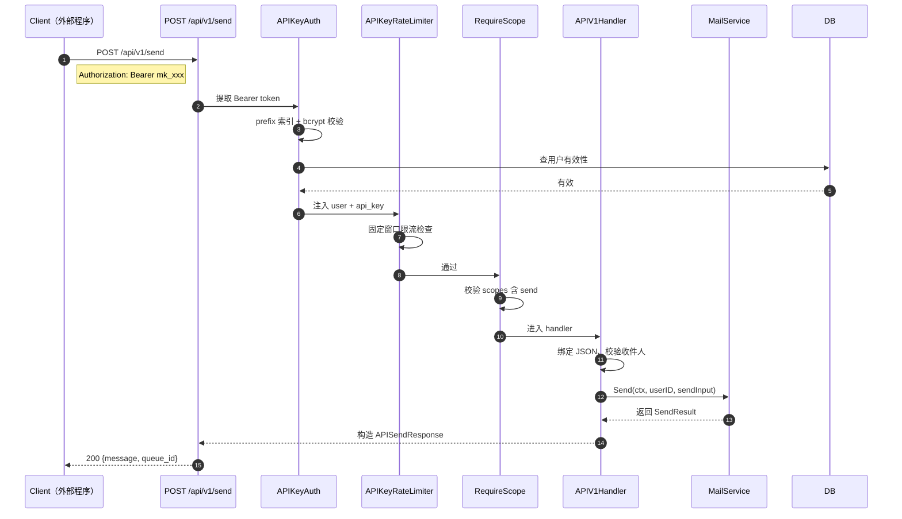
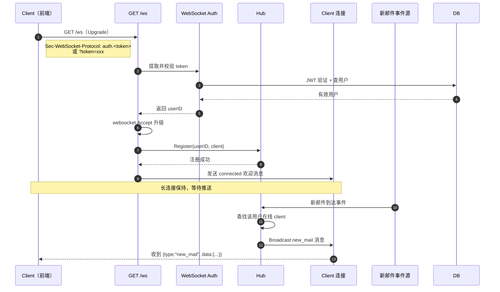

# API 参考文档

> 本文档详细描述 MyMail Go 后端（`mymail-go`）提供的全部 HTTP REST API 与 WebSocket 接口，供前端开发、第三方集成与运维人员参考。
> 所有端点路径、请求/响应字段均与原 Node.js 后端 100% 兼容，前端 Vue 项目零改动即可对接。

---

## 概述

MyMail 后端基于 Gin 框架实现，提供以下几类端点：

| 模块 | 路径前缀 | 认证方式 | 说明 |
|---|---|---|---|
| 认证 | `/api/auth/*` | JWT Bearer（部分端点公开） | 注册、登录、个人资料、密码管理 |
| 邮件 | `/api/mail/*` | JWT Bearer | 列表、详情、发送、草稿、标记、附件、批量操作 |
| 管理员 | `/api/admin/*` | JWT Bearer + admin 角色 | 用户管理、统计、全局设置 |
| API Key 管理 | `/api/auth/api-keys/*` | JWT Bearer | 用户维度的 API Key CRUD |
| 外部发信 | `/api/v1/*` | API Key Bearer | 供外部程序通过 API Key 发信 |
| 规则 | `/api/rules/*` | JWT Bearer | 用户级邮件规则 CRUD |
| WebSocket | `/ws` | JWT（子协议或 URL query） | 实时推送新邮件、队列完成事件 |
| 健康检查 | `/healthz` `/readyz` `/startupz` `/health` | 无 | Kubernetes 探针 |
| Metrics | `/metrics`（可配置） | 无 | Prometheus 指标 |

**默认监听端口**：`8080`（由配置 `SERVER_PORT` 决定）。

---

## 认证机制

### 1. JWT Bearer Token（用户认证）

- **适用端点**：`/api/auth/me`、`/api/mail/*`、`/api/admin/*`、`/api/auth/api-keys/*`、`/api/rules/*`。
- **获取方式**：调用 `POST /api/auth/login` 或 `POST /api/auth/register` 成功后返回 `token` 字段。
- **使用方式**：在请求头添加 `Authorization: Bearer <token>`。
- **存储位置**：前端存储于 `localStorage`（key 为 `token`）。
- **有效期**：默认 24 小时；登录时传 `remember: true` 则为 30 天。
- **失效处理**：返回 `401` 时前端清空 token 并跳转登录页。

### 2. API Key Bearer Token（外部程序认证）

- **适用端点**：`/api/v1/send`。
- **获取方式**：用户通过 `POST /api/auth/api-keys` 创建，返回明文 `plain_text`（仅一次，格式为 `mk_xxxxxxxx`）。
- **使用方式**：在请求头添加 `Authorization: Bearer mk_xxxxxxxx`。
- **作用域**：创建时指定 `scopes`（如 `["send"]`），调用端点时由 `RequireScope` 中间件校验。
- **限流**：per-key 限流，由 `RateLimit` 字段配置（单位：请求/分钟）。
- **失效处理**：返回 `401` 或 `403`。

### 3. WebSocket 认证

- **适用端点**：`GET /ws`（WebSocket 升级）。
- **方式 1（推荐）**：子协议认证，握手时携带 `Sec-WebSocket-Protocol: auth.<token>`。
- **方式 2（兼容）**：URL query 参数，`ws://host/ws?token=<token>`。
- **失效处理**：返回 `401` JSON 响应 `{"error":"WebSocket 认证失败"}`。

---

## 通用响应格式

### 成功响应

各端点返回具体的 JSON 结构，HTTP 状态码 200/201/204。

### 错误响应

所有错误响应统一为以下格式：

```json
{
  "error": "错误描述"
}
```

### 常见状态码

| 状态码 | 含义 | 触发场景 |
|---|---|---|
| 200 | OK | 请求成功（GET/PUT/DELETE） |
| 201 | Created | 资源创建成功（POST 注册/创建用户/创建 API Key/创建规则） |
| 400 | Bad Request | 请求参数无效、JSON 格式错误、字段校验失败 |
| 401 | Unauthorized | 未登录、token 无效、token 过期 |
| 403 | Forbidden | 权限不足（非管理员访问 admin 端点、非本人资源） |
| 404 | Not Found | 资源不存在 |
| 405 | Method Not Allowed | HTTP 方法不支持 |
| 429 | Too Many Requests | 限流触发（API Key 限流） |
| 500 | Internal Server Error | 服务器内部错误 |
| 503 | Service Unavailable | 健康检查未就绪 |

下面以登录接口为例，展示一次通用 REST 请求-响应的完整交互过程：



这张图展示了客户端、Handler、Service、DAO 与数据库之间的标准调用链。所有 REST 端点都遵循这一模式：请求进入 Handler 后，由 Service 处理业务，再经 DAO 访问数据库，最终把结果序列化为 JSON 返回。

---

## 1. 认证接口 `/api/auth/*`

### POST /api/auth/register

**功能**：注册新用户。

**认证**：无（公开端点）。

**请求 Body**（JSON）：

```json
{
  "username": "alice",
  "password": "P@ssw0rd",
  "displayName": "Alice"
}
```

| 字段 | 类型 | 必填 | 说明 |
|---|---|---|---|
| `username` | string | 是 | 用户名（3-20 字符） |
| `password` | string | 是 | 密码（至少 6 位） |
| `displayName` | string | 否 | 显示名称 |

**成功响应**（201）：

```json
{
  "message": "注册成功",
  "token": "eyJhbGciOiJIUzI1NiIs...",
  "user": {
    "id": 1,
    "username": "alice",
    "email": "alice@example.com",
    "displayName": "Alice",
    "role": "user"
  }
}
```

**失败响应**：

```json
// 400 用户名或密码为空
{ "error": "用户名和密码不能为空" }

// 409 用户名已存在
{ "error": "用户名已存在" }
```

---

### POST /api/auth/login

**功能**：用户登录。

**认证**：无（公开端点）。

**请求 Body**（JSON）：

```json
{
  "email": "alice@example.com",
  "password": "P@ssw0rd",
  "remember": true
}
```

| 字段 | 类型 | 必填 | 说明 |
|---|---|---|---|
| `email` | string | 是 | 邮箱 |
| `password` | string | 是 | 密码 |
| `remember` | boolean | 否 | 记住我（true → 30 天，false → 24 小时） |

**成功响应**（200）：

```json
{
  "message": "登录成功",
  "token": "eyJhbGciOiJIUzI1NiIs...",
  "user": {
    "id": 1,
    "username": "alice",
    "email": "alice@example.com",
    "displayName": "Alice",
    "role": "user"
  }
}
```

**需要改密响应**（200，`is_default_password=1` 时）：

```json
{
  "message": "需要修改默认密码",
  "token": "eyJhbGciOiJIUzI1NiIs...",
  "user": { "id": 1, "...": "..." },
  "requirePasswordChange": true
}
```

**失败响应**：

```json
// 400
{ "error": "邮箱和密码不能为空" }

// 401 密码错误（含登录失败次数计数与锁定）
{ "error": "密码错误，剩余 4 次尝试机会" }

// 401 账户被锁定
{ "error": "账户已锁定，请 15 分钟后重试" }

// 401 用户被禁用
{ "error": "账户已被禁用" }
```

---

### GET /api/auth/me

**功能**：获取当前登录用户信息。

**认证**：JWT Bearer。

**成功响应**（200）：

```json
{
  "id": 1,
  "username": "alice",
  "email": "alice@example.com",
  "displayName": "Alice",
  "role": "user",
  "signature": "Alice Wei",
  "storageLimit": 104857600,
  "storageUsed": 5242880,
  "createdAt": "2026-07-01T10:00:00Z"
}
```

**失败响应**：

```json
// 401
{ "error": "未登录" }
```

---

### PUT /api/auth/profile

**功能**：更新个人资料（显示名称、签名）。

**认证**：JWT Bearer。

**请求 Body**（JSON，所有字段可选）：

```json
{
  "displayName": "Alice Wei",
  "signature": "发自我的手机"
}
```

| 字段 | 类型 | 说明 |
|---|---|---|
| `displayName` | string? | 显示名称，null 表示不更新 |
| `signature` | string? | 邮件签名 |

**成功响应**（200）：

```json
{ "message": "更新成功" }
```

**失败响应**：

```json
// 400
{ "error": "请求格式错误" }
```

---

### PUT /api/auth/password

**功能**：修改密码（需校验当前密码）。

**认证**：JWT Bearer。

**请求 Body**（JSON）：

```json
{
  "currentPassword": "OldP@ssw0rd",
  "newPassword": "NewP@ssw0rd"
}
```

**成功响应**（200）：

```json
{ "message": "密码修改成功" }
```

**失败响应**：

```json
// 400
{ "error": "请填写当前密码和新密码" }

// 401 当前密码错误
{ "error": "当前密码错误" }
```

---

### POST /api/auth/change-default-password

**功能**：强制修改默认密码（不校验当前密码，仅用于 `is_default_password=1` 的账户）。

**认证**：JWT Bearer。

**请求 Body**（JSON）：

```json
{
  "newPassword": "NewP@ssw0rd"
}
```

**成功响应**（200）：

```json
{ "message": "密码修改成功" }
```

---

## 2. 邮件接口 `/api/mail/*`

> **P0-3 修复**：所有 `/:id` 端点前置 `RequireOwnedMail` 中间件，校验当前用户为邮件归属人，防止 IDOR 越权。

### GET /api/mail/list

**功能**：查询邮件列表。

**认证**：JWT Bearer。

**Query 参数**：

| 参数 | 类型 | 默认 | 说明 |
|---|---|---|---|
| `folder` | string | `INBOX` | 文件夹：INBOX/SENT/DRAFTS/TRASH/JUNK |
| `page` | int | 1 | 页码 |
| `limit` | int | 20 | 每页条数 |
| `search` | string | - | 搜索关键词（匹配主题/发件人/收件人/正文） |
| `unread` | string | - | `"true"` 表示只查未读 |
| `starred` | string | - | `"1"` 表示只查星标 |

**请求示例**：

```
GET /api/mail/list?folder=INBOX&page=1&limit=20&search=invoice&unread=true
```

**成功响应**（200）：

```json
{
  "messages": [
    {
      "id": 101,
      "user_id": 1,
      "folder": "INBOX",
      "message_id": "<abc@example.com>",
      "uid": 1001,
      "from_addr": "billing@stripe.com",
      "from_name": "Stripe",
      "to_addr": "alice@example.com",
      "cc_addr": "",
      "bcc_addr": "",
      "reply_to": "",
      "subject": "Your invoice #12345",
      "body_text": "Please find your invoice...",
      "body_html": "<html>...</html>",
      "is_read": false,
      "is_starred": false,
      "is_deleted": false,
      "has_attach": true,
      "attach_count": 2,
      "size_bytes": 102400,
      "in_reply_to": "",
      "flags": "",
      "spam_score": 0,
      "spam_reasons": "",
      "received_at": "2026-07-04T08:00:00Z"
    }
  ],
  "total": 153,
  "page": 1,
  "limit": 20,
  "unreadCount": 12
}
```

> **字段命名约定**：`messages` 数组中元素为 snake_case（与数据库字段一致），包装字段 `unreadCount` 为 camelCase（与原 Node.js 兼容）。

---

### GET /api/mail/unread-count

**功能**：获取各文件夹未读数。

**认证**：JWT Bearer。

**成功响应**（200）：

```json
{
  "INBOX": 12,
  "SENT": 0,
  "DRAFTS": 2,
  "TRASH": 0
}
```

---

### GET /api/mail/:id

**功能**：获取邮件详情（含附件列表）。**副作用**：若邮件未读，自动标记为已读。

**认证**：JWT Bearer。

**路径参数**：

| 参数 | 类型 | 说明 |
|---|---|---|
| `id` | int | 邮件 ID |

**成功响应**（200）：

```json
{
  "id": 101,
  "user_id": 1,
  "folder": "INBOX",
  "message_id": "<abc@example.com>",
  "uid": 1001,
  "from_addr": "billing@stripe.com",
  "from_name": "Stripe",
  "to_addr": "alice@example.com",
  "cc_addr": "",
  "bcc_addr": "",
  "reply_to": "",
  "subject": "Your invoice #12345",
  "body_text": "Please find your invoice...",
  "body_html": "<html>...</html>",
  "is_read": true,
  "is_starred": false,
  "is_deleted": false,
  "has_attach": true,
  "attach_count": 2,
  "size_bytes": 102400,
  "in_reply_to": "",
  "flags": "",
  "spam_score": 0,
  "spam_reasons": "",
  "received_at": "2026-07-04T08:00:00Z",
  "attachments": [
    {
      "id": 201,
      "message_id": 101,
      "filename": "invoice.pdf",
      "mime_type": "application/pdf",
      "size_bytes": 51200,
      "created_at": "2026-07-04T08:00:00Z"
    }
  ]
}
```

**失败响应**：

```json
// 404 邮件不存在或不属于当前用户
{ "error": "邮件不存在" }
```

---

### POST /api/mail/send

**功能**：发送邮件。

**认证**：JWT Bearer。

**Content-Type**：`multipart/form-data`

**表单字段**：

| 字段 | 类型 | 必填 | 说明 |
|---|---|---|---|
| `to` | string | 是 | 收件人（多个用逗号分隔） |
| `cc` | string | 否 | 抄送 |
| `bcc` | string | 否 | 密送 |
| `subject` | string | 否 | 主题 |
| `bodyHtml` | string | 否 | HTML 正文 |
| `bodyText` | string | 否 | 纯文本正文 |
| `replyTo` | string | 否 | 回复地址 |
| `attachments` | File[] | 否 | 附件文件（多文件，字段名重复） |

**请求示例**（curl）：

```bash
curl -X POST http://localhost:8080/api/mail/send \
  -H "Authorization: Bearer <token>" \
  -F "to=alice@example.com" \
  -F "subject=Hello" \
  -F "bodyHtml=<h1>Hi</h1>" \
  -F "bodyText=Hi" \
  -F "attachments=@/path/to/file.pdf"
```

**成功响应**（200）：

```json
{
  "message": "发送成功",
  "messageId": "<uuid@example.com>"
}
```

**失败响应**：

```json
// 400 收件人为空
{ "error": "收件人不能为空" }

// 400 附件类型不允许
{ "error": "不允许的文件类型: application/x-msdownload" }

// 400 存储空间不足
{ "error": "存储空间不足" }
```

---

### POST /api/mail/save-draft

**功能**：保存草稿。

**认证**：JWT Bearer。

**Content-Type**：`application/json`

**请求 Body**：

```json
{
  "to": "alice@example.com",
  "cc": "",
  "bcc": "",
  "subject": "草稿主题",
  "bodyHtml": "<p>草稿内容</p>",
  "bodyText": "草稿内容"
}
```

**成功响应**（200）：

```json
{
  "message": "草稿已保存",
  "id": 102
}
```

---

### PUT /api/mail/:id/read

**功能**：标记邮件为已读。

**认证**：JWT Bearer。

**成功响应**（200）：

```json
{ "message": "ok" }
```

---

### PUT /api/mail/:id/unread

**功能**：标记邮件为未读。

**认证**：JWT Bearer。

**成功响应**（200）：

```json
{ "message": "ok" }
```

---

### PUT /api/mail/:id/star

**功能**：切换星标状态（已星标 → 取消，未星标 → 加星）。

**认证**：JWT Bearer。

**成功响应**（200）：

```json
{ "message": "ok" }
```

---

### DELETE /api/mail/:id

**功能**：删除邮件。若邮件已在 TRASH 文件夹则永久删除，否则软删除（移到 TRASH）。

**认证**：JWT Bearer。

**成功响应**（200）：

```json
{ "message": "ok" }
```

---

### PUT /api/mail/:id/restore

**功能**：从回收站恢复邮件到 INBOX。

**认证**：JWT Bearer。

**成功响应**（200）：

```json
{ "message": "已恢复" }
```

---

### POST /api/mail/empty-trash

**功能**：清空回收站。

**认证**：JWT Bearer。

**成功响应**（200）：

```json
{ "message": "垃圾箱已清空" }
```

---

### GET /api/mail/:id/attachments/:aid/download

**功能**：下载单个附件。

**认证**：JWT Bearer。

**路径参数**：

| 参数 | 类型 | 说明 |
|---|---|---|
| `id` | int | 邮件 ID（由 `RequireOwnedMail` 校验归属） |
| `aid` | int | 附件 ID（handler 二次校验附件属于该邮件） |

**成功响应**（200）：

- Content-Type: `application/octet-stream`
- Content-Disposition: `attachment; filename="invoice.pdf"`
- Body: 二进制流（32KB 缓冲区流式写入）

**失败响应**：

```json
// 400 无效的附件 ID
{ "error": "无效的附件 ID" }

// 403 附件不属于该邮件（防 IDOR）
{ "error": "无权访问" }

// 404 附件文件不存在
{ "error": "附件文件不存在" }
```

---

### GET /api/mail/:id/attachments/download-all

**功能**：将邮件所有附件打包为 ZIP 流式下载。

**认证**：JWT Bearer。

**成功响应**（200）：

- Content-Type: `application/zip`
- Content-Disposition: `attachment; filename="attachments.zip"`
- Body: ZIP 二进制流

**失败响应**：

```json
// 404 没有附件
{ "error": "没有附件" }
```

---

### POST /api/mail/batch/mark-read

**功能**：批量标记已读。

**认证**：JWT Bearer。

**请求 Body**（JSON）：

```json
{
  "ids": [101, 102, 103]
}
```

**成功响应**（200）：

```json
{
  "message": "ok",
  "affected": 3
}
```

---

### POST /api/mail/batch/move

**功能**：批量移动到指定文件夹。

**认证**：JWT Bearer。

**请求 Body**（JSON）：

```json
{
  "ids": [101, 102],
  "folder": "TRASH"
}
```

**成功响应**（200）：

```json
{
  "message": "ok",
  "affected": 2
}
```

---

### POST /api/mail/batch/delete

**功能**：批量删除（已在 TRASH 则永久删除，否则移到 TRASH）。

**认证**：JWT Bearer。

**请求 Body**（JSON）：

```json
{
  "ids": [101, 102, 103]
}
```

**成功响应**（200）：

```json
{
  "message": "ok",
  "affected": 3
}
```

---

## 3. 管理员接口 `/api/admin/*`

> **认证链**：JWT Bearer（`Authenticate`）+ `RequireAdmin`（role=admin）。非管理员访问返回 403。

### GET /api/admin/stats

**功能**：获取用户统计。

**成功响应**（200）：

```json
{
  "total_users": 42,
  "active_users": 38
}
```

---

### GET /api/admin/users

**功能**：获取所有用户列表。

**成功响应**（200）：

```json
[
  {
    "id": 1,
    "username": "admin",
    "email": "admin@example.com",
    "display_name": "Administrator",
    "role": "admin",
    "storage_limit": 104857600,
    "storage_used": 5242880,
    "is_active": true,
    "created_at": "2026-07-01T10:00:00Z"
  },
  {
    "id": 2,
    "username": "alice",
    "email": "alice@example.com",
    "display_name": "Alice",
    "role": "user",
    "storage_limit": 104857600,
    "storage_used": 0,
    "is_active": true,
    "created_at": "2026-07-02T11:00:00Z"
  }
]
```

---

### GET /api/admin/users/:id

**功能**：获取指定用户详情。

**路径参数**：`id` (int)

**成功响应**（200）：同列表中的单个用户对象。

**失败响应**：

```json
// 400
{ "error": "无效的用户 ID" }

// 404
{ "error": "用户不存在" }
```

---

### POST /api/admin/users

**功能**：创建新用户（管理员创建，可指定角色与存储配额）。

**请求 Body**（JSON）：

```json
{
  "username": "bob",
  "email": "bob@example.com",
  "password": "P@ssw0rd",
  "display_name": "Bob",
  "role": "user",
  "storage_limit": 104857600
}
```

| 字段 | 类型 | 说明 |
|---|---|---|
| `username` | string | 用户名 |
| `email` | string | 邮箱 |
| `password` | string | 初始密码 |
| `display_name` | string | 显示名称 |
| `role` | string | 角色（`user` 或 `admin`） |
| `storage_limit` | int64 | 存储配额（字节，0 表示默认 100MB） |

**成功响应**（201）：返回创建的用户对象。

**失败响应**：

```json
// 400
{ "error": "请求参数无效" }

// 409 用户名/邮箱已存在
{ "error": "用户名已存在" }
```

---

### PUT /api/admin/users/:id

**功能**：更新用户（所有字段可选，nil 不更新）。可改角色、配额、启用状态、重置密码。

**请求 Body**（JSON）：

```json
{
  "role": "admin",
  "storage_limit": 524288000,
  "is_active": false,
  "password": "NewP@ssw0rd"
}
```

**成功响应**（200）：

```json
{ "message": "更新成功" }
```

---

### DELETE /api/admin/users/:id

**功能**：软删除用户。

**成功响应**（200）：

```json
{ "message": "删除成功" }
```

---

### GET /api/admin/settings

**功能**：查询全局设置。

**成功响应**（200）：

```json
{
  "settings": [
    {
      "key": "default_storage_limit",
      "value": "104857600",
      "updated_at": "2026-07-01T10:00:00Z"
    },
    {
      "key": "smtp_relay_host",
      "value": "smtp.example.com",
      "updated_at": "2026-07-01T10:00:00Z"
    }
  ]
}
```

---

### PUT /api/admin/settings

**功能**：更新全局设置。

**请求 Body**（JSON）：

```json
{
  "settings": {
    "default_storage_limit": "524288000",
    "smtp_relay_host": "smtp.new.com"
  }
}
```

**成功响应**（200）：

```json
{ "message": "更新成功" }
```

---

## 4. API Key 接口 `/api/auth/api-keys/*`

> **认证**：JWT Bearer（用户维度，非 API Key 认证）。handler 通过 `middleware.CurrentUser` 取当前用户。

### POST /api/auth/api-keys

**功能**：创建 API Key。**明文仅返回一次**，后续无法查询。

**请求 Body**（JSON）：

```json
{
  "name": "我的发信脚本",
  "scopes": ["send"],
  "rate_limit": 60
}
```

| 字段 | 类型 | 说明 |
|---|---|---|
| `name` | string | Key 名称（备注） |
| `scopes` | string[] | 作用域列表（如 `["send"]`） |
| `rate_limit` | int | 限流（请求/分钟） |

**成功响应**（201）：

```json
{
  "id": 1,
  "plain_text": "mk_abcdef1234567890",
  "name": "我的发信脚本",
  "key_prefix": "mk_abcdef",
  "scopes": ["send"],
  "rate_limit": 60,
  "created_at": "2026-07-04T10:00:00Z"
}
```

> **重要**：`plain_text` 仅在此响应中出现，数据库只存储 hash。请立即保存到安全位置。

---

### GET /api/auth/api-keys

**功能**：列出当前用户的所有 API Key（不含明文）。

**成功响应**（200）：

```json
[
  {
    "id": 1,
    "name": "我的发信脚本",
    "key_prefix": "mk_abcdef",
    "scopes": ["send"],
    "rate_limit": 60,
    "is_active": true,
    "last_used_at": "2026-07-04T11:30:00Z",
    "created_at": "2026-07-04T10:00:00Z"
  }
]
```

---

### DELETE /api/auth/api-keys/:id

**功能**：删除 API Key（service 层校验归属，非本人 key 返回 403）。

**路径参数**：`id` (int)

**成功响应**（200）：

```json
{ "message": "删除成功" }
```

**失败响应**：

```json
// 400
{ "error": "无效的 API Key ID" }

// 403 非本人 API Key
{ "error": "无权操作" }
```

---

## 5. 外部发信接口 `/api/v1/send`

> **认证链**：API Key Bearer（`APIKeyAuth`）→ `APIKeyRateLimiter`（per-key 限流）→ `RequireScope("send")`。



该图说明了外部调用 `/api/v1/send` 时的三层安全关卡：先通过 `APIKeyAuth` 确认身份，再由 `APIKeyRateLimiter` 检查是否超过每分钟配额，最后 `RequireScope` 校验 Key 是否具备 `send` 权限。任一关卡失败都会立即返回 401/403/429，不会进入业务 Handler。

### POST /api/v1/send

**功能**：外部程序通过 API Key 发信。

**请求 Header**：

```
Authorization: Bearer mk_abcdef1234567890
Content-Type: application/json
```

**请求 Body**（JSON）：

```json
{
  "to": ["alice@example.com", "bob@example.com"],
  "cc": ["boss@example.com"],
  "bcc": [],
  "subject": "API 发信测试",
  "body_html": "<h1>Hello</h1>",
  "body_text": "Hello",
  "reply_to": "noreply@example.com"
}
```

| 字段 | 类型 | 必填 | 说明 |
|---|---|---|---|
| `to` | string[] | 是 | 收件人数组 |
| `cc` | string[] | 否 | 抄送 |
| `bcc` | string[] | 否 | 密送 |
| `subject` | string | 否 | 主题 |
| `body_html` | string | 否 | HTML 正文 |
| `body_text` | string | 否 | 纯文本正文 |
| `reply_to` | string | 否 | 回复地址 |

**成功响应**（200）：

```json
{
  "message": "发送成功",
  "queue_id": 101
}
```

> `queue_id` 对应邮件记录 ID（`MailID`）。

**失败响应**：

```json
// 401 未认证 / API Key 无效
{ "error": "未认证" }

// 401 未通过 API Key 认证（防御性检查）
{ "error": "未通过 API Key 认证" }

// 400 收件人为空
{ "error": "收件人不能为空" }

// 429 限流
{ "error": "请求过于频繁" }
```

---

## 6. 规则接口 `/api/rules/*`

> **认证**：JWT Bearer（用户维度）。handler 通过 `middleware.CurrentUser` 取用户。

### GET /api/rules

**功能**：列出当前用户的所有规则。

**成功响应**（200）：

```json
[
  {
    "id": 1,
    "user_id": 1,
    "name": "工作邮件归档",
    "priority": 10,
    "conditions": [
      { "field": "from_addr", "op": "contains", "value": "@company.com" }
    ],
    "actions": [
      { "type": "move", "folder": "INBOX" },
      { "type": "flag", "flag": "\\Flagged" }
    ],
    "is_active": true,
    "created_at": "2026-07-01T10:00:00Z"
  }
]
```

**条件字段说明**：

| `field` | `op` | `value` |
|---|---|---|
| `from_addr` | `contains` / `equals` / `regex` | 字符串 |
| `to_addr` | `contains` / `equals` / `regex` | 字符串 |
| `subject` | `contains` / `equals` / `regex` | 字符串 |
| `has_attach` | `equals` | `true` / `false` |

**动作类型说明**：

| `type` | 附加字段 | 说明 |
|---|---|---|
| `move` | `folder` | 移动到指定文件夹 |
| `forward` | `address` | 转发到指定地址 |
| `flag` | `flag` | 设置 IMAP flag |

> **P1-7 修复**：`regex` 操作由 Go RE2 引擎实现，线性时间复杂度，防 ReDoS。

---

### POST /api/rules

**功能**：创建规则。

**请求 Body**（JSON）：

```json
{
  "name": "工作邮件归档",
  "priority": 10,
  "conditions": [
    { "field": "from_addr", "op": "contains", "value": "@company.com" }
  ],
  "actions": [
    { "type": "move", "folder": "INBOX" }
  ]
}
```

**成功响应**（201）：

```json
{
  "id": 2,
  "user_id": 1,
  "name": "工作邮件归档",
  "priority": 10,
  "conditions": [
    { "field": "from_addr", "op": "contains", "value": "@company.com" }
  ],
  "actions": [
    { "type": "move", "folder": "INBOX" }
  ],
  "is_active": true
}
```

---

### PUT /api/rules/:id

**功能**：更新规则（所有字段指针，nil 不更新）。service 层校验归属。

**路径参数**：`id` (int)

**请求 Body**（JSON）：

```json
{
  "name": "工作邮件归档（已更新）",
  "priority": 20,
  "is_active": false
}
```

| 字段 | 类型 | 说明 |
|---|---|---|
| `name` | string? | 规则名 |
| `priority` | int? | 优先级（数值越小越先执行） |
| `conditions` | RuleConditionDTO[]? | 条件列表（整体替换） |
| `actions` | RuleActionDTO[]? | 动作列表（整体替换） |
| `is_active` | bool? | 是否启用 |

**成功响应**（200）：

```json
{ "message": "更新成功" }
```

**失败响应**：

```json
// 400
{ "error": "无效的规则 ID" }

// 403 非本人规则
{ "error": "无权操作" }

// 404 规则不存在
{ "error": "规则不存在" }
```

---

### DELETE /api/rules/:id

**功能**：删除规则（校验归属）。

**成功响应**（200）：

```json
{ "message": "删除成功" }
```

---

## 7. WebSocket `/ws`



上图左侧展示 WebSocket 握手与注册流程：客户端通过子协议或 URL 参数携带 token，服务器完成 JWT 校验后接受升级，并把该连接注册到 Hub。右侧展示推送场景：当后台收到新邮件事件时，Hub 会找到目标用户的连接并把消息广播出去，前端即可实时刷新收件箱。

### GET /ws

**功能**：升级为 WebSocket 连接，实时接收推送事件。

**认证**：
- **方式 1（推荐）**：`Sec-WebSocket-Protocol: auth.<token>` 子协议
- **方式 2（兼容）**：URL query `?token=<token>`

**连接示例**（前端）：

```js
const proto = location.protocol === 'https:' ? 'wss:' : 'ws:'
const ws = new WebSocket(`${proto}//${location.host}/ws?token=${encodeURIComponent(token)}`)
```

**握手响应**：
- 101 Switching Protocols（升级成功）
- 401 Unauthorized（认证失败）

**服务器推送消息格式**（JSON）：

| 事件类型 | `type` 字段 | `data`/`message` 字段 | 说明 |
|---|---|---|---|
| 连接成功 | `"connected"` | `message: "WebSocket 已连接"` | 升级成功后立即推送 |
| 新邮件 | `"new_mail"` | `data: { id, from_addr, subject, ... }` | 收到新邮件时推送 |
| 队列完成 | `"queue_complete"` | `data: { id, status, ... }` | 出站邮件发送完成 |

**消息示例**：

```json
// 连接成功
{ "type": "connected", "message": "WebSocket 已连接" }

// 新邮件
{
  "type": "new_mail",
  "data": {
    "id": 105,
    "from_addr": "billing@stripe.com",
    "from_name": "Stripe",
    "subject": "Your invoice #12345",
    "received_at": "2026-07-04T08:00:00Z"
  }
}

// 队列完成
{
  "type": "queue_complete",
  "data": {
    "id": 200,
    "status": "sent",
    "message_id": "<uuid@example.com>"
  }
}
```

**心跳**：服务器定期发送 ping，客户端无需响应（coder/websocket 自动处理 pong）。

**重连**：客户端 `onclose` 后建议 5 秒后重连（前端 `stores/ws.js` 已实现）。

**指标**：`WSConnectionsTotal{result="success|auth_failed|upgrade_failed"}` Prometheus 计数器。

---

## 8. 健康检查 `/healthz` `/readyz` `/startupz` `/health`

> **认证**：无。用于 Kubernetes 探针与负载均衡健康检查。

### GET /healthz

**功能**：liveness 存活探针。进程存活即返回 200。

**成功响应**（200）：

```json
{
  "status": "alive",
  "time": "2026-07-04T10:00:00Z"
}
```

### GET /readyz

**功能**：readiness 就绪探针。检查启动状态与数据库连通性。

**成功响应**（200）：

```json
{
  "status": "ready",
  "checks": {
    "startup": "ready",
    "db": "up"
  }
}
```

**未就绪响应**（503）：

```json
{
  "status": "not_ready",
  "checks": {
    "startup": "starting",
    "db": "down"
  }
}
```

**检查项**：
- `startup`：启动后 2 秒标记为 ready（模拟预热完成）
- `db`：调用 `db.PingContext` 检查 SQLite 连通性（2 秒超时）

### GET /startupz

**功能**：startup 启动探针。避免慢启动应用被 liveness 杀死。

**已启动响应**（200）：

```json
{ "status": "started" }
```

**启动中响应**（503）：

```json
{ "status": "starting" }
```

### GET /health

**功能**：`/healthz` 的兼容别名（与 P1-8 修复一致，供 Dockerfile HEALTHCHECK 使用）。

响应同 `/healthz`。

---

## 附录 A：全局中间件链

所有请求按以下顺序经过中间件：

| 顺序 | 中间件 | 功能 |
|---|---|---|
| 1 | `Recover` | panic 恢复，返回 500 |
| 2 | `Security` | 安全响应头（X-Content-Type-Options、X-Frame-Options、CSP 等） |
| 3 | `RequestID` | 生成/透传 X-Request-ID |
| 4 | `RequestLogger` | 结构化访问日志（slog） |
| 5 | `CORS` | 跨域白名单 |
| 6 | `Metrics` | Prometheus 指标采集 |

业务路由组额外中间件：

| 路由组 | 额外中间件 |
|---|---|
| `/api/auth/*`（部分） | `Authenticate` |
| `/api/mail/*` | `Authenticate` |
| `/api/mail/:id/*` | `Authenticate` + `RequireOwnedMail` |
| `/api/admin/*` | `Authenticate` + `RequireAdmin` |
| `/api/auth/api-keys/*` | `Authenticate` |
| `/api/rules/*` | `Authenticate` |
| `/api/v1/*` | `APIKeyAuth` + `APIKeyRateLimiter` + `RequireScope` |

---

## 附录 B：字段命名约定

| 场景 | 命名风格 | 示例 |
|---|---|---|
| 请求 body（前端提交） | camelCase | `bodyHtml`、`displayName`、`currentPassword` |
| 响应 - 邮件/用户字段（数据库字段） | snake_case | `is_read`、`from_addr`、`storage_limit` |
| 响应 - 包装字段 | camelCase | `unreadCount`、`messageId`、`requirePasswordChange` |
| API v1 请求 body（外部） | snake_case | `body_html`、`body_text`、`reply_to` |

---

## 附录 C：SPA 静态文件服务

后端通过 `//go:embed dist/` 将前端构建产物嵌入二进制，运行时由 `registerSPARoutes` 服务：

1. `/api/*`、`/ws`、`/healthz` 等基础设施路径 → JSON 404（不被 SPA 劫持）
2. 存在的静态文件（如 `/assets/index-xxx.js`） → 直接返回
3. 其他路径 → 返回 `index.html`（交由 Vue Router 处理前端路由）
4. 开发环境下 dist/ 仅含 `.gitkeep`，`index.html` 不存在，所有非 API 路径返回 JSON 404

---

> 文档版本：v1.0
> 生成日期：2026-07-04
> 对应代码版本：mymail-go 当前工作区
