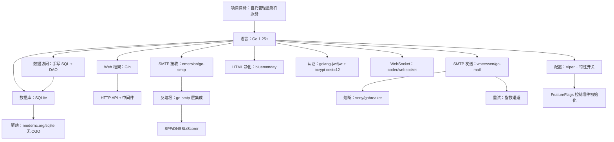
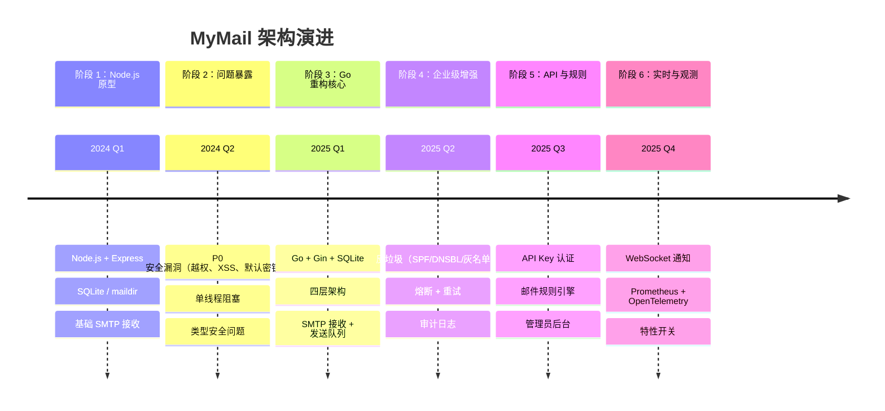

# 架构决策记录（Architecture Decision Records）

> **文档版本**：v1.0  
> **编写日期**：2026-07-04  
> **适用对象**：初级开发人员、新加入团队的工程师  
> **文档目的**：用结构化方式记录 MyMail-Go 项目在重构过程中做出的关键设计选型，以及每个选型背后的真实理由。所有结论均可在 `internal/`、`go.mod`、迁移文件等源码中找到对应实现。

---

## 一、阅读地图

在阅读本文前，建议先打开以下文件建立整体印象：

| 文件 | 说明 |
|---|---|
| [`go.mod`](../go.mod) | 全部依赖项与版本锁定 |
| [`internal/config/config.go`](../internal/config/config.go) | 配置结构与特性开关 |
| [`internal/server/server.go`](../internal/server/server.go) | 依赖编排、启动/关闭顺序 |
| [`internal/httpapi/router.go`](../internal/httpapi/router.go) | HTTP 路由与中间件注册 |
| [`internal/storage/db/db.go`](../internal/storage/db/db.go) | SQLite 连接与 PRAGMA |
| [`internal/storage/db/migrate.go`](../internal/storage/db/migrate.go) | 迁移机制 |
| [`internal/storage/dao/`](../internal/storage/dao/) | 手写 SQL + DAO 实现 |
| [`internal/mailsender/`](../internal/mailsender/) | 本地投递 + 队列 + 外部 SMTP 发送 |
| [`internal/spam/`](../internal/spam/) | 反垃圾评分 |
| [`internal/smtp/receiver.go`](../internal/smtp/receiver.go) | SMTP 接收器 |

---

## 二、ADR-001 为什么用 Go 重构 Node.js

### 背景

MyMail 最早由 Node.js 实现。随着功能增加，团队发现以下问题：

- 单线程事件循环在邮件解析、大量附件写入时容易阻塞；
- 动态类型导致接口契约容易漂移，重构风险高；
- 依赖树庞大且版本碎片化，安全审计困难；
- 原代码存在 9 项 P0 阻断性 Bug 和 21 项 P1 高危 Bug（如越权读取邮件、存储型 XSS、JWT 默认密钥等）。

### 决策

将后端完整重构为 Go 1.25+ 版本（模块 `github.com/mymail/mymail-go`）。

### 理由

1. **静态类型与编译期检查**：Go 在编译阶段即可捕获大量类型与接口错误，降低重构回归风险。  
2. **原生并发模型**：goroutine + channel 在处理 SMTP 并发连接、WebSocket 多连接、队列 worker 时比 Node.js 的回调/异步更易控制。  
3. **单一静态二进制**：`go build` 产出单个可执行文件，配合 `//go:embed` 打包前端 `dist/`，部署简单。  
4. **标准库与生态成熟度**：Go 在邮件（`emersion/go-smtp`、`wneessen/go-mail`）、安全（`golang.org/x/crypto/bcrypt`）、观测（OpenTelemetry、Prometheus）等领域有成熟库。  
5. **与原项目兼容**：重构保留了 Maildir 文件路径、JWT payload、WebSocket 消息格式，前端无需重写。

### 后果

- **正面**：启动速度、SMTP 并发处理能力、代码可维护性显著提升；CI 通过 `go test` 与 `golangci-lint` 保证质量。  
- **代价**：团队成员需要熟悉 Go 的错误处理、`context` 传播、接口设计；前期需要补齐 Node.js 中缺失的安全修复。  
- **相关源码**：  
  - 入口编排：[cmd/mymail/main.go](../cmd/mymail/main.go)  
  - 依赖声明：[go.mod](../go.mod)  
  - 启动顺序：[internal/server/server.go](../internal/server/server.go)

---

## 三、ADR-002 为什么用 SQLite + modernc.org/sqlite（无 CGO）

### 背景

项目定位为“个人开发者与小型团队自托管邮件服务”，数据规模可控，但需要：

- 零额外运维成本（不需要单独部署 PostgreSQL/MySQL）；
- 单文件备份与迁移；
- 跨平台编译（Windows / Linux / macOS）。

### 决策

使用 **SQLite** 作为主数据库，驱动采用 **modernc.org/sqlite v1.34.1**（纯 Go 实现，无 CGO）。

### 理由

1. **无 CGO 交叉编译**：原生的 `mattn/go-sqlite3` 需要 CGO，交叉编译困难；`modernc.org/sqlite` 用纯 Go 重写，可直接 `GOOS=linux go build`。  
2. **单文件部署**：数据库就是 `data/mymail.db`，备份只需复制文件。  
3. **WAL 模式提升并发**：通过 PRAGMA `journal_mode=WAL`，读操作可并发，写操作串行但不会被读阻塞。  
4. **足够支撑目标规模**：在数万用户、数十万封邮件场景下，SQLite + WAL 完全够用。  
5. **外键与 busy_timeout**：启动时设置 `foreign_keys=ON`、`busy_timeout=5000`、`synchronous=NORMAL`，保证数据完整性与写冲突等待。

### 后果

- **正面**：部署包仅一个二进制 + 数据目录；无需 DBA；迁移脚本即 SQL 文件，便于版本管理。  
- **代价**：写操作本质串行，连接池强制设为 1（[`internal/storage/db/db.go:47`](./internal/storage/db/db.go#L47)）；未来若用户量达到百万级，需迁移到 PostgreSQL。  
- **相关源码**：  
  - 连接管理：[internal/storage/db/db.go](../internal/storage/db/db.go)  
  - DSN 构建：[internal/storage/db/db.go](../internal/storage/db/db.go)

---

## 四、ADR-003 为什么用 Gin 而不是标准库/其他框架

### 背景

HTTP API 需要：

- 路由分组与中间件链（认证、CORS、限流、请求日志、Panic 恢复）；
- 与 Vue SPA 集成的静态文件 fallback；
- 较高的 JSON 序列化性能；
- 团队成员学习成本要低。

### 决策

采用 **Gin v1.10.0** 作为 Web 框架。

### 理由

1. **中间件生态成熟**：Gin 的中间件链式写法清晰，便于统一注册 Recover、Security、RequestID、RequestLogger、CORS、Metrics。  
2. **路由分组**：`/api/auth`、`/api/mail`、`/api/admin`、`/api/v1`、`/api/rules` 等分组在 Gin 中表达直观。  
3. **性能**：Gin 基于 `httprouter`，路由匹配和 JSON 绑定性能优于 `net/http` + `gorilla/mux` 等方案。  
4. **社区与文档**：中文资料丰富，初级开发者上手快。  
5. **不过度封装**：Gin 只负责路由与中间件，业务逻辑仍放在 `handler` 和 `service` 中，避免框架绑定。

### 后果

- **正面**：路由注册集中、中间件复用方便；Panic 恢复中间件避免单个请求拖垮进程。  
- **代价**：Gin 上下文 `*gin.Context` 会渗透到 handler 层，需避免在 service/DAO 中引用它。  
- **相关源码**：  
  - 路由注册：[internal/httpapi/router.go](../internal/httpapi/router.go)  
  - 中间件目录：[internal/httpapi/middleware/](../internal/httpapi/middleware/)

---

## 五、ADR-004 为什么手写 SQL + DAO 而不是 ORM

### 背景

数据访问层需要：

- 精确控制查询，避免 N+1 和隐式加载；
- 灵活使用 SQLite 特性（`ON CONFLICT`、`datetime('now', '-7 days')`、部分索引）；
- 在 DAO 中显式处理 `user_id` 归属校验（P0-3 修复）；
- 支持事务内多步操作（P1-1 修复）。

### 决策

**不引入 GORM/Ent 等 ORM**，所有 SQL 手写，按表封装 DAO 对象。

### 理由

1. **SQL 可见性**：初级开发者直接阅读 DAO 即可知道数据库在做什么，不会被 ORM 的“魔法”隐藏。  
2. **精确索引利用**：例如 `api_keys` 的 `idx_api_keys_prefix` 是部分索引（`WHERE is_active = 1`），ORM 不一定能生成最优 SQL。  
3. **事务控制简单**：通过 `db.RunInTransaction` + `*sql.Tx` 即可在多个 DAO 间编排事务。  
4. **避免 ORM 陷阱**：不会出现隐式预加载、批量更新漏条件、软删除误判等问题。  
5. **与迁移脚本对应**：DAO 中的 SQL 与 `internal/storage/db/migrations/*.sql` 完全对应，schema 变更可追溯。

### 后果

- **正面**：查询性能可控；代码即文档；事务边界清晰。  
- **代价**：需要手写 `Scan` 映射与批量操作的 `?` 占位符；新增字段需要同时改 schema、DAO struct、scan 函数。  
- **相关源码**：  
  - DAO 目录：[internal/storage/dao/](../internal/storage/dao/)  
  - 事务封装：[internal/storage/db/tx.go](../internal/storage/db/tx.go)  
  - 示例：MessageDAO [internal/storage/dao/message.go](../internal/storage/dao/message.go)

---

## 六、ADR-005 为什么用四层架构（HTTP→Service→DAO→Infra）

### 背景

原 Node.js 项目代码层间边界模糊，handler 直接调用 DAO，导致：

- 业务逻辑散落在路由中；
- 同一事务跨多个 DAO 时难以保证原子性；
- 单元测试难以 mock 依赖。

### 决策

采用清晰四层架构：

```
HTTP API (handler + router)
    ↓
Service (业务编排 + 事务)
    ↓
DAO (手写 SQL)
    ↓
Infra (DB / Maildir / SMTP / 附件存储 / WebSocket Hub)
```

### 理由

1. **单一职责**：handler 只负责解析请求与返回响应；service 负责业务规则与事务；DAO 只负责 SQL；infra 负责外部资源。  
2. **便于测试**：service 依赖 DAO 接口/具体类型，测试中可用 fake DAO 替换。  
3. **安全边界**：归属校验、配额校验、HTML 净化统一放在 service，而不是每个 handler 重复。  
4. **事务编排**：service 可调用 `db.RunInTransaction`，在事务内使用多个 DAO 的 `CreateOn` / `EnqueueOn` 方法。  
5. **与 Go 风格一致**：通过依赖注入在 `server.New` 中组装所有对象，避免全局状态。

### 后果

- **正面**：代码结构清晰；新人能按层快速定位；测试覆盖率高。  
- **代价**：文件数量增加；需要在 `server.New` 中显式注入依赖。  
- **相关源码**：  
  - 依赖注入与编排：[internal/server/server.go](../internal/server/server.go)  
  - HTTP 层：[internal/httpapi/handler/](../internal/httpapi/handler/)  
  - 业务层：[internal/service/](../internal/service/)

---

## 七、ADR-006 为什么用 maildir 文件系统 + 数据库存元数据

### 背景

邮件系统需要同时满足两种访问方式：

- Web 前端需要按用户、文件夹、已读状态快速列表和搜索；
- Dovecot IMAP 服务器需要按 Maildir 格式读取原始邮件文件。

### 决策

采用 **maildir 文件系统存储原始邮件**，**SQLite 存储邮件元数据**（收件人、主题、状态、附件索引等）。

### 理由

1. **与 Dovecot 兼容**：Maildir 格式是标准邮件存储格式，路径为 `{maildirPath}/{domain}/{username}/{new,cur,tmp}/`，Dovecot 可直接挂载。  
2. **数据库负责查询**：用户列表、未读数、搜索、分页等操作通过 `messages` 表高效完成，不必扫描文件系统。  
3. **邮件正文大字段 offload**：原始 RFC 5322 邮件写入 maildir，数据库只存解析后的 `body_text`、`body_html` 等必要字段，控制数据库大小。  
4. **兼容原 Node.js**：文件名格式 `{timestamp}.{unique8}.{domain}` 与原版一致，升级时可复用旧数据目录。  
5. **存储配额可计算**：通过 `maildir.UserUsedBytes` 和 `messages.size_bytes` 双轨校验用户配额。

### 后果

- **正面**：Web 查询快；IMAP 兼容；数据目录结构清晰。  
- **代价**：存在两份数据，需要保证一致性（目前以数据库为权威，maildir 作为兼容副本）。  
- **相关源码**：  
  - Maildir 实现：[internal/storage/maildir/maildir.go](../internal/storage/maildir/maildir.go)  
  - 元数据表：[`001_initial_schema.up.sql`](../internal/storage/db/migrations/001_initial_schema.up.sql) 中的 `messages` 表

---

## 八、ADR-007 为什么用 go-smtp 自建 SMTP 接收器

### 背景

MyMail 需要接收外部 MTA 投递到本域的邮件。可选方案：

- 直接集成 Postfix/Dovecot 做接收；
- 用 Go 实现轻量 SMTP 服务器。

### 决策

基于 **emersion/go-smtp v0.24.0** 在 Go 进程中自建 SMTP 接收器。

### 理由

1. **与业务逻辑深度集成**：接收邮件后可直接调用 `MailService.DeliverLocal`，完成入库、附件保存、配额校验、HTML 净化、反垃圾评分、WebSocket 通知。  
2. **灰名单/限流可在 SMTP 层实现**：在 `MAIL`、`RCPT`、`DATA` 阶段即可拒绝异常连接，减少后续处理。  
3. **轻量自托管**：个人/小团队部署时不需要额外维护 Postfix 的复杂配置。  
4. **兼容原 Node.js**：域名校验、收件人存在性校验、TLS 可选等配置与原版行为一致。  
5. **测试友好**：go-smtp 提供 `Backend` / `Session` 接口，便于在测试中模拟 SMTP 会话。

### 后果

- **正面**：接收链路完全可控；灰名单、限流、反垃圾集成自然。  
- **代价**：需要自行处理 SMTP 协议细节（如 `MaxRecipients`、`MaxMessageBytes`、`TLSConfig`）。  
- **相关源码**：  
  - SMTP 接收器：[internal/smtp/receiver.go](../internal/smtp/receiver.go)  
  - 会话处理：[internal/smtp/handler.go](../internal/smtp/handler.go)

---

## 九、ADR-008 为什么用 go-mail 作为 SMTP 客户端 + gobreaker 熔断

### 背景

外域邮件发送需要：

- 稳定的 SMTP 客户端库；
- 对发送失败进行重试；
- 当外部 SMTP 服务不可用时避免雪崩。

### 决策

- SMTP 客户端：**wneessen/go-mail v0.7.3**；
- 熔断器：**sony/gobreaker/v2 v2.4.0**（封装在 `internal/resilience` 中）。

### 理由

1. **go-mail 现代且活跃**：相比老牌 `gomail`、`go-smtp` 的客户端，go-mail 支持 TLS 策略、超时、SMTP AUTH、替代正文等现代特性。  
2. **TLS 策略可配置**：`TLSMandatory`（强制 TLS）与 `TLSOpportunistic`（机会 TLS）通过配置切换。  
3. **gobreaker 语义清晰**：Closed / Half-Open / Open 三态，支持按失败率（默认 60%）和最小请求数触发熔断。  
4. **重试 + 熔断组合**：`SMTPSender.Send` 内部先走熔断器，再走指数退避重试，既保护下游又提高成功率。  
5. **指标可观测**：熔断器状态通过 `CircuitBreakerState()` 暴露给 Prometheus。

### 后果

- **正面**：外域发送失败时自动重试；外部 SMTP 故障时快速失败，避免阻塞队列。  
- **代价**：熔断参数需要结合实际 SMTP 服务商调整；首次配置不正确可能导致误熔断。  
- **相关源码**：  
  - 发送器：[internal/mailsender/sender.go](../internal/mailsender/sender.go)  
  - 队列 worker：[internal/mailsender/queue.go](../internal/mailsender/queue.go)  
  - 熔断器封装：[internal/resilience/circuit_breaker.go](../internal/resilience/circuit_breaker.go)

---

## 十、ADR-009 为什么用 bluemonday 做 HTML 净化

### 背景

原 Node.js 后端对邮件 HTML 零处理，直接入库并返回，前端 `v-html` 渲染，存在**存储型 XSS**（P0-4）。

### 决策

使用 **microcosm-cc/bluemonday v1.0.27** 的 `UGCPolicy()` 净化邮件 HTML。

### 理由

1. **成熟且经过审计**：bluemonday 是 Go 社区最广泛使用的 HTML 净化库，策略丰富。  
2. **UGCPolicy 适合邮件场景**：保留 `p/div/span/a/img/ul/ol/li/table` 等格式标签，移除 `script/style/iframe/object/embed/form`。  
3. **移除事件属性**：所有 `on*` 事件属性都会被清除，防御 DOM 型 XSS。  
4. **协议白名单**：`a.href` 仅允许 `http/https/mailto`，`img.src` 仅允许 `http/https/data`，阻止 `javascript:` 伪协议。  
5. **双字段保存**：净化后内容存入 `body_html`，原始内容存入 `body_html_raw`，便于审计与调试。

### 后果

- **正面**：从后端阻断恶意 HTML；原始内容保留便于追溯。  
- **代价**：净化会改变邮件外观（如内联样式可能被过滤）；需要在前端再用 DOMPurify 做二次防御。  
- **相关源码**：  
  - 净化实现：[internal/sanitize/html.go](../internal/sanitize/html.go)  
  - 双字段存储：`messages.body_html` / `messages.body_html_raw`（[001_initial_schema.up.sql](../internal/storage/db/migrations/001_initial_schema.up.sql)）

---

## 十一、ADR-010 为什么用 JWT + bcrypt(cost=12)

### 背景

用户认证需要：

- 无状态会话（适合 Vue SPA 与 API Key 体系）；
- 密码哈希与原 Node.js 后端兼容；
- 密钥需要支持轮换。

### 决策

- 认证令牌：**golang-jwt/jwt/v5**，算法 HS256，payload 含 `id` / `email` / `role`；
- 密码哈希：**golang.org/x/crypto/bcrypt**，cost=12。

### 理由

1. **与原 Node.js 兼容**：Node.js 版使用 `jsonwebtoken`（HS256）和 `bcrypt`（cost=12），重构后旧用户密码哈希和已签发 token 仍然可用。  
2. **HS256 足够且轻量**：自托管服务无需 RS256 的公私钥管理；HMAC 签名快，适合高并发 API 调用。  
3. **bcrypt cost=12 平衡安全与性能**：约 250ms 一次哈希，对登录接口可接受；cost 过低易被暴力破解，过高影响体验。  
4. **JWT_SECRET 强制校验**：启动时若未设置 JWT_SECRET 或使用默认占位符，服务直接退出（P0-8 修复）。  
5. **密钥轮换支持**：`crypto.KeyRotator` 保留最近 2 个旧密钥，新 token 用当前密钥签发，旧 token 仍可校验。

### 后果

- **正面**：无状态认证；密码哈希互通；JWT_SECRET 强制避免默认密钥漏洞。  
- **代价**：JWT 无法服务端失效，敏感操作（改密码、禁用用户）需要配合 token 过期时间或额外黑名单。  
- **相关源码**：  
  - JWT：[internal/crypto/jwt.go](../internal/crypto/jwt.go)  
  - bcrypt：[internal/crypto/bcrypt.go](../internal/crypto/bcrypt.go)  
  - 强制校验：[internal/config/config.go](../internal/config/config.go)

---

## 十二、ADR-011 为什么 WebSocket 用 coder/websocket

### 背景

前端需要新邮件到达实时通知。原 Node.js 使用 `ws` 库，Go 版需要：

- 支持子协议认证（`Sec-WebSocket-Protocol: auth.<token>`）；
- 上下文感知关闭；
- API 现代、文档清晰。

### 决策

使用 **coder/websocket v1.8.15**。

### 理由

1. **现代 API**：基于 `context`，支持 `Accept`、`Close`、`Read`、`Write` 的优雅关闭。  
2. **子协议支持**：`websocket.AcceptOptions.Subprotocols` 可直接回显 `auth.<token>`，与原 Node.js 行为一致。  
3. **Origin 控制**：`AcceptOptions.OriginPatterns` 支持按模式限制跨域。  
4. **无需第三方 gorilla/websocket**：coder/websocket 更轻量，维护活跃，与 Go 1.23+ 的 `net/http` 配合良好。  
5. **Hub 模型**：在进程内维护 `userID → clients` 映射，新邮件到达时推送给该用户所有在线连接。

### 后果

- **正面**：认证方式兼容原版；连接关闭与 HTTP 服务器生命周期一致。  
- **代价**：单实例内存维护连接状态，多实例部署时需要额外引入 Redis 等共享介质（当前未实现）。  
- **相关源码**：  
  - WebSocket Hub：[internal/ws/hub.go](../internal/ws/hub.go)  
  - 认证提取：[internal/ws/auth.go](../internal/ws/auth.go)  
  - HTTP 升级：[internal/httpapi/handler/ws.go](../internal/httpapi/handler/ws.go)

---

## 十三、ADR-012 为什么使用特性开关（Feature Flags）

### 背景

MyMail 功能较多（反垃圾、灰名单、API Key、规则引擎、审计、WebSocket、用户注册），不同部署环境可能需要禁用某些功能。

### 决策

在配置中引入布尔型特性开关，启动时决定是否初始化对应组件与注册对应路由。

### 理由

1. **渐进上线**：新功能可先在生产关闭，灰度验证后再开启。  
2. **故障隔离**：当反垃圾 DNS 查询导致 SMTP 延迟时，可临时关闭 `FEATURE_SPAM_FILTER` 而不发版。  
3. **资源节省**：关闭 `FEATURE_WS_NOTIFY` 时，WebSocket Hub 不注册 `/ws` 路由，减少连接维护开销。  
4. **多租户差异**：不同客户环境可能需要不同的功能组合。  
5. **测试便利**：单测中可通过配置快速关闭依赖外部网络的功能（如 DNSBL）。

### 当前开关列表

| 开关 | 默认 | 控制功能 |
|---|---|---|
| `FEATURE_SPAM_FILTER` | true | SPF/DNSBL/评分反垃圾 |
| `FEATURE_WS_NOTIFY` | true | WebSocket 实时通知 |
| `FEATURE_GREYLIST` | true | SMTP 灰名单 |
| `FEATURE_API_KEY` | true | API Key 管理与 `/api/v1/send` |
| `FEATURE_RULES` | true | 用户邮件规则 |
| `FEATURE_AUDIT` | true | 审计日志 |
| `FEATURE_REGISTRATION` | true | 用户自注册 |

### 后果

- **正面**：运维灵活性高；功能模块化清晰。  
- **代价**：组件初始化路径变多，测试矩阵增大；需在 `server.New` 和 `router.go` 中多处判断。  
- **相关源码**：  
  - 配置定义：[internal/config/config.go](../internal/config/config.go)  
  - 初始化判断：[internal/server/server.go](../internal/server/server.go)  
  - 路由注册判断：[internal/httpapi/router.go](../internal/httpapi/router.go)

---

## 十四、技术栈决策依赖图

下图展示了 MyMail-Go 核心依赖之间的选择关系。



---

## 十五、架构演进时间线



---

## 十六、总结

| 决策 | 核心选型 | 关键理由 | 主要权衡 |
|---|---|---|---|
| 重构语言 | Go | 静态类型、并发、单二进制、生态 | 团队学习成本 |
| 数据库 | SQLite + modernc.org/sqlite | 零运维、单文件、无 CGO | 写串行，连接池为 1 |
| Web 框架 | Gin | 中间件链、路由分组、性能 | handler 层依赖 Gin Context |
| 数据访问 | 手写 SQL + DAO | 可控、可测、与迁移对应 | 代码量略增 |
| 架构分层 | 四层 | 职责清晰、事务可控、易测试 | 依赖注入繁琐 |
| 邮件存储 | maildir + DB 元数据 | Dovecot 兼容 + 快速查询 | 两份数据一致性 |
| SMTP 接收 | go-smtp 自建 | 深度集成业务逻辑 | 需处理协议细节 |
| SMTP 发送 | go-mail + gobreaker | 现代客户端 + 韧性 | 参数需调优 |
| HTML 净化 | bluemonday | 成熟 XSS 防御 | 可能影响邮件样式 |
| 认证 | JWT + bcrypt(cost=12) | 与原 Node.js 兼容 | token 无法服务端失效 |
| WebSocket | coder/websocket | 现代 API、子协议认证 | 多实例需共享状态 |
| 特性开关 | Viper 布尔开关 | 渐进上线、故障隔离 | 测试矩阵增大 |

---

## 十七、参考链接

- Go 模块与依赖：[go.mod](../go.mod)
- 配置与特性开关：[internal/config/config.go](../internal/config/config.go)
- 服务器编排：[internal/server/server.go](../internal/server/server.go)
- HTTP 路由：[internal/httpapi/router.go](../internal/httpapi/router.go)
- 数据库连接：[internal/storage/db/db.go](../internal/storage/db/db.go)
- 迁移机制：[internal/storage/db/migrate.go](../internal/storage/db/migrate.go)
- DAO 目录：[internal/storage/dao/](../internal/storage/dao/)
- SMTP 发送与队列：[internal/mailsender/](../internal/mailsender/)
- 反垃圾：[internal/spam/](../internal/spam/)
- SMTP 接收：[internal/smtp/receiver.go](../internal/smtp/receiver.go)
- HTML 净化：[internal/sanitize/html.go](../internal/sanitize/html.go)
- 认证加密：[internal/crypto/](../internal/crypto/)
- WebSocket：[internal/ws/](../internal/ws/)
