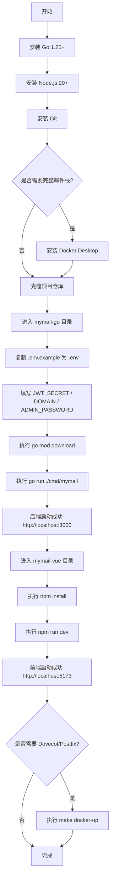

# MyMail 开发环境搭建指南

> **文档版本**：v1.0  
> **编写日期**：2026-07-04  
> **适用对象**：初级开发人员、新加入团队的工程师  
> **文档目的**：从零开始配置可运行的 MyMail 本地开发环境

---

## 一、操作系统要求

本项目在 **Windows** 下开发，同时兼容 macOS 与 Linux。建议配置如下：

| 系统 | 版本要求 | 备注 |
|---|---|---|
| Windows | Windows 10/11（64 位） | 本团队主力开发环境 |
| macOS | macOS 13+ | Apple Silicon / Intel 均可 |
| Linux | Ubuntu 22.04+ / Debian 12+ | 服务器部署常用 |

最低硬件建议：

- CPU：4 核及以上
- 内存：8 GB 及以上
- 磁盘：10 GB 可用空间（含 Go 模块缓存、Node 模块、SQLite 数据）

---

## 二、安装依赖

### 2.1 Go 1.25+

MyMail 后端使用 Go 1.25+（`deployments/docker/Dockerfile` 中基础镜像为 `golang:1.25-alpine`）。

**Windows 安装步骤：**

1. 访问 [https://go.dev/dl/](https://go.dev/dl/) 下载 `go1.25.windows-amd64.msi`。
2. 双击安装，保持默认路径 `C:\Program Files\Go`。
3. 打开 PowerShell，验证：

```powershell
go version
# 期望输出：go version go1.25.x windows/amd64
```

**配置 Go 环境变量（可选但推荐）：**

```powershell
# 设置模块缓存与代理
$env:GOPROXY="https://goproxy.cn,direct"
$env:GOMODCACHE="$env:USERPROFILE\go\pkg\mod"
```

### 2.2 Node.js 20+

前端使用 `mymail-vue`，`package.json` 中要求 `node`: `^20.19.0 || >=22.12.0`。

**Windows 安装步骤：**

1. 访问 [https://nodejs.org/](https://nodejs.org/) 下载 LTS 版本（推荐 22.x）。
2. 双击安装，保持默认路径。
3. 验证：

```powershell
node -v
# 期望输出：v22.x.x

npm -v
# 期望输出：10.x.x
```

### 2.3 Git

1. 访问 [https://git-scm.com/download/win](https://git-scm.com/download/win) 下载安装。
2. 验证：

```powershell
git --version
```

### 2.4 Docker / Docker Compose（可选）

用于本地一键启动完整服务栈（Go 后端 + Dovecot + Postfix + Nginx）。

1. 安装 Docker Desktop for Windows：[https://www.docker.com/products/docker-desktop](https://www.docker.com/products/docker-desktop)
2. 在 Docker Desktop 设置中勾选 **Use the WSL 2 based engine**（推荐）。
3. 验证：

```powershell
docker --version
docker compose version
```

---

## 三、克隆项目与目录结构

项目仓库包含两个同级目录：`mymail-go`（Go 后端）和 `mymail-vue`（Vue 前端）。

```powershell
# 进入你的工作区
cd d:\New AI Project\mymail

# 克隆（如尚未克隆）
git clone <仓库地址> .
```

**目录结构说明：**

```text
d:\New AI Project\mymail
├── mymail-go/                  # Go 后端（本文档工作目录）
│   ├── cmd/mymail/             # 应用入口 main.go
│   ├── internal/               # 内部包：config、server、smtp、mailsender、storage 等
│   ├── deployments/docker/     # Dockerfile + docker-compose.yml
│   ├── config/                 # Dovecot / Nginx 配置
│   ├── web/dist/               # 前端构建产物（//go:embed 嵌入）
│   ├── .env.example            # 环境变量模板
│   ├── Makefile                # 常用构建/测试命令
│   └── go.mod / go.sum         # Go 依赖
├── mymail-vue/                 # Vue 3 前端
│   ├── src/                    # 源码
│   ├── package.json            # Node 依赖与脚本
│   └── vite.config.js          # Vite 配置
```

---

## 四、后端环境配置

### 4.1 复制环境变量文件

```powershell
cd d:\New AI Project\mymail\mymail-go
copy .env.example .env
```

> 后端配置加载逻辑见 `internal/config/config.go`：配置来源优先级为 **环境变量 > .env 文件 > 默认值**。

### 4.2 逐字段解释关键配置

打开 `.env`，重点修改以下字段：

#### 4.2.1 基本信息

| 字段 | 默认值 | 说明 |
|---|---|---|
| `ENV` | `dev` | 开发环境保持 `dev`；生产部署改为 `prod` |
| `DEBUG` | `true` | 开发环境开启；生产必须关闭（`prod` 环境下校验会失败） |
| `PORT` | `3000` | HTTP API 端口 |
| `HOST` | `0.0.0.0` | 监听地址，本地开发保持 `0.0.0.0` |

#### 4.2.2 域名（必填）

| 字段 | 示例值 | 说明 |
|---|---|---|
| `DOMAIN` | `your-domain.com` | **必须修改** 为本域域名；SMTP 接收器会用它校验收件人 |
| `MAIL_HOST` | `mail.your-domain.com` | 邮件子域名，用于 MX / Webmail |

> 本地开发可设置为 `DOMAIN=localhost`、`MAIL_HOST=localhost`。

#### 4.2.3 JWT_SECRET（必填，长度 ≥ 32）

| 字段 | 默认值 | 说明 |
|---|---|---|
| `JWT_SECRET` | `CHANGE_ME_TO_RANDOM_32_CHARS_OR_MORE` | **必须修改**，用于签发/校验 JWT |
| `JWT_EXPIRES_IN` | `24h` | 普通登录 token 有效期 |
| `JWT_REMEMBER_EXPIRES_IN` | `720h` | 记住我 token 有效期 |

生成强随机串（需要 OpenSSL 或 Git Bash）：

```powershell
openssl rand -hex 32
```

将输出填入 `JWT_SECRET`。

> `internal/config/config.go` 中 `Validate()` 会强制校验：不能为空、不能使用默认占位符、长度必须 ≥ 32。

#### 4.2.4 数据库

| 字段 | 默认值 | 说明 |
|---|---|---|
| `DB_PATH` | `./data/mymail.db` | SQLite 数据库文件路径，程序启动时会自动创建 `data/` 目录 |
| `MAILDIR_PATH` | `./data/maildir` | 兼容原 Node.js 的 maildir 存储 |
| `ATTACHMENT_PATH` | `./data/attachments` | 附件存储目录 |
| `MAX_ATTACHMENT_SIZE` | `26214400` | 单附件最大 25 MB |

#### 4.2.5 SMTP 相关

| 字段 | 默认值 | 说明 |
|---|---|---|
| `SMTP_PORT` | `25` | SMTP 接收器监听端口（接收外部邮件） |
| `SMTP_SEND_HOST` | `postfix` | 外发 SMTP 主机；本地开发可改为 `localhost` |
| `SMTP_SEND_PORT` | `587` | 外发 SMTP 端口 |
| `SMTP_SEND_USERNAME` | 空 | 外发 SMTP 认证用户名（如 Postfix 启用 SASL） |
| `SMTP_SEND_PASSWORD` | 空 | 外发 SMTP 认证密码 |
| `SMTP_TLS_REJECT_UNAUTHORIZED` | `true` | 是否强制校验 TLS 证书；生产必须 `true` |
| `SMTP_MAX_CONNECTIONS_PER_IP` | `10` | 每 IP 每分钟最大 SMTP 连接数 |
| `SMTP_RATE_WINDOW_MS` | `60000` | 限流窗口，单位毫秒 |

#### 4.2.6 管理员账号（必填）

| 字段 | 默认值 | 说明 |
|---|---|---|
| `ADMIN_USERNAME` | `admin` | 管理员用户名 |
| `ADMIN_PASSWORD` | `CHANGE_ME_TO_STRONG_PASSWORD` | **必须修改**，用于首次登录后台 |
| `ADMIN_EMAIL` | `admin@your-domain.com` | 管理员邮箱 |

生成强密码：

```powershell
openssl rand -hex 16
```

#### 4.2.7 其他常用字段

| 字段 | 默认值 | 说明 |
|---|---|---|
| `CORS_ALLOWED_ORIGINS` | `https://your-domain.com,...` | 前端跨域白名单；本地开发加入 `http://localhost:5173` |
| `LOG_LEVEL` | `info` | 日志级别：`debug` / `info` / `warn` / `error` |
| `LOG_FORMAT` | `json` | 日志格式：`json` 或 `text` |
| `FEATURE_*` | `true` | 灰名单、API Key、规则引擎等功能开关 |

**本地开发最小 `.env` 示例：**

```dotenv
ENV=dev
DEBUG=true
PORT=3000
HOST=0.0.0.0

DOMAIN=localhost
MAIL_HOST=localhost

JWT_SECRET=your-64-char-hex-string-here-from-openssl-rand-hex-32
JWT_EXPIRES_IN=24h
JWT_REMEMBER_EXPIRES_IN=720h

DB_PATH=./data/mymail.db
MAILDIR_PATH=./data/maildir
ATTACHMENT_PATH=./data/attachments

ADMIN_USERNAME=admin
ADMIN_PASSWORD=your-strong-admin-password
ADMIN_EMAIL=admin@localhost

SMTP_PORT=25
SMTP_SEND_HOST=localhost
SMTP_SEND_PORT=587

CORS_ALLOWED_ORIGINS=http://localhost:5173
LOG_LEVEL=debug
LOG_FORMAT=text
```

---

## 五、后端运行

### 5.1 下载依赖

```powershell
cd d:\New AI Project\mymail\mymail-go
go mod download
```

若网络受限，可设置国内代理：

```powershell
$env:GOPROXY="https://goproxy.cn,direct"
go mod download
```

### 5.2 启动后端

方式一：直接使用 `go run`：

```powershell
go run ./cmd/mymail
```

方式二：使用 Makefile：

```powershell
make dev
```

成功启动后，控制台会输出：

```text
MyMail 已启动  port=3000
HTTP 服务监听中  addr=0.0.0.0:3000
SMTP 接收服务监听中  addr=0.0.0.0:25  domain=localhost
```

### 5.3 运行测试

```powershell
# 运行全部单元测试
go test ./...

# 使用 Makefile（含覆盖率）
make test

# 短测试
go test -short ./...
```

> `Makefile` 中 `test` 目标会启用 `-race` 竞争检测并输出覆盖率。

### 5.4 数据库迁移

首次启动时，`server.New()` 会自动调用 `database.Migrate()` 执行迁移。如需手动触发：

```powershell
make migrate
# 等价于：go run ./cmd/mymail -migrate
```

---

## 六、前端环境配置

前端目录与后端目录平级，位于 `d:\New AI Project\mymail\mymail-vue`。

```powershell
cd d:\New AI Project\mymail\mymail-vue

# 安装依赖
npm install

# 启动开发服务器
npm run dev
```

`package.json` 中定义的脚本：

| 脚本 | 命令 | 用途 |
|---|---|---|
| `dev` | `vite` | 启动 Vite 开发服务器，默认 `http://localhost:5173` |
| `build` | `vite build` | 构建生产包到 `dist/` |
| `preview` | `vite preview` | 预览生产构建 |
| `lint` | `eslint . --ext .vue,.js,.jsx` | 代码检查 |
| `format` | `prettier --write ...` | 格式化 |

启动后，浏览器访问：

```text
http://localhost:5173
```

> 前端默认调用后端 `http://localhost:3000`。若后端端口不同，请修改前端 API 基础地址配置。

---

## 七、数据库工具

后端使用 **SQLite**，数据库文件路径由 `DB_PATH` 指定（默认 `./data/mymail.db`）。

### 7.1 推荐 GUI 工具

- **DBeaver**（免费）：新建 SQLite 连接，选择 `mymail-go/data/mymail.db`。
- **TablePlus**（付费/免费试用）：新建 SQLite 连接，直接拖入数据库文件。
- **DB Browser for SQLite**（免费开源）。

### 7.2 命令行查看

```powershell
# 使用 SQLite 命令行（需安装）
sqlite3 d:\New AI Project\mymail\mymail-go\data\mymail.db

# 常用命令
.tables
.schema users
SELECT id, username, email, role, is_active FROM users LIMIT 10;
```

> 数据库默认开启 WAL 模式（`journal_mode=WAL`），你会看到同目录下生成 `mymail.db-wal` 与 `mymail.db-shm` 文件，属正常现象。

---

## 八、邮件客户端配置

本地调试时，可通过以下端口连接各服务：

| 服务 | 容器名 | 端口 | 用途 |
|---|---|---|---|
| HTTP API | `mymail-app` | `3000` | Web 与 REST API |
| SMTP 接收 | `mymail-app` | `25` | 接收外部 MTA 投递 |
| SMTP 发送 | `mymail-postfix` | `587` | 外域邮件中继 |
| IMAP | `mymail-dovecot` | `993` | 邮件客户端读取 |
| HTTP | `mymail-nginx` | `80` | 反向代理入口 |
| HTTPS | `mymail-nginx` | `443` | TLS 入口 |

**使用 Docker Compose 启动完整栈：**

```powershell
cd d:\New AI Project\mymail\mymail-go
make docker-up
# 等价于：docker compose -f deployments/docker/docker-compose.yml up -d
```

**Thunderbird / Outlook 本地测试账号：**

- 邮箱地址：`admin@localhost`
- 用户名：`admin`
- 密码：`.env` 中 `ADMIN_PASSWORD`
- IMAP 服务器：`localhost:993`
- SMTP 发送服务器：`localhost:587`

> 本地 25 端口接收外部邮件可能需要管理员权限（Windows 非特权端口限制）。开发时可临时改用高位端口，或仅通过 `docker compose` 在容器内运行。

---

## 九、IDE 推荐与插件

### 9.1 后端开发：VS Code / GoLand

**VS Code 推荐插件：**

- `golang.go`：官方 Go 扩展，支持跳转、调试、格式化。
- `GitLens`：代码历史与 diff。
- `Error Lens`：实时显示编译错误。

**必备 Go 工具：**

```powershell
go install golang.org/x/tools/cmd/goimports@latest
go install github.com/golangci/golangci-lint/cmd/golangci-lint@latest
```

### 9.2 前端开发：VS Code

**推荐插件：**

- `Vue - Official`（原 Volar）：Vue 3 语言支持。
- `ESLint`：代码规范检查。
- `Prettier - Code: formatter`：代码格式化。
- `Tailwind CSS IntelliSense`：Tailwind 类名提示。

### 9.3 调试配置示例（VS Code `.vscode/launch.json`）

```json
{
  "version": "0.2.0",
  "configurations": [
    {
      "name": "Launch MyMail Backend",
      "type": "go",
      "request": "launch",
      "mode": "auto",
      "program": "${workspaceFolder}/cmd/mymail",
      "envFile": "${workspaceFolder}/.env",
      "cwd": "${workspaceFolder}"
    }
  ]
}
```

---

## 十、热重载与调试技巧

### 10.1 后端热重载

Go 官方未内置热重载，推荐安装 `air`：

```powershell
go install github.com/air-verse/air@latest

# 在项目根目录创建 .air.toml 或使用默认配置
air
```

`air` 会监听 `.go` 文件变更并自动重新编译运行。

### 10.2 前端热重载

Vite 已内置 HMR，保存文件后浏览器自动刷新。

### 10.3 日志级别切换

排查问题时，将 `.env` 中 `LOG_LEVEL` 改为 `debug` 并重启：

```dotenv
LOG_LEVEL=debug
LOG_FORMAT=text
```

### 10.4 常见调试端点

| 端点 | 说明 |
|---|---|
| `GET http://localhost:3000/healthz` | 健康检查 |
| `GET http://localhost:3000/readyz` | 就绪检查 |
| `GET http://localhost:3000/metrics` | Prometheus 指标 |

### 10.5 端口占用排查

若启动提示端口被占用：

```powershell
# Windows 查看 3000 端口占用
netstat -ano | findstr :3000

# 结束进程（将 <PID> 替换为实际进程号）
taskkill /PID <PID> /F
```

---

## 十一、环境搭建步骤流程图



---

## 十二、验证清单

完成搭建后，请逐项确认：

- [ ] `go version` 输出 1.25+
- [ ] `node -v` 输出 20+
- [ ] `.env` 已复制且 `JWT_SECRET` 长度 ≥ 32
- [ ] `go run ./cmd/mymail` 无报错，监听 3000 端口
- [ ] `npm run dev` 成功，前端可访问
- [ ] `go test ./...` 全部通过
- [ ] 能使用管理员账号登录前端
- [ ] （可选）`make docker-up` 后 Dovecot/Postfix 正常

---

## 相关文件链接

- 环境变量模板：`mymail-go/.env.example`
- 后端入口：`mymail-go/cmd/mymail/main.go`
- 配置加载与校验：`mymail-go/internal/config/config.go`
- 服务器编排：`mymail-go/internal/server/server.go`
- 数据库连接：`mymail-go/internal/storage/db/db.go`
- 构建脚本：`mymail-go/Makefile`
- Docker Compose：`mymail-go/deployments/docker/docker-compose.yml`
- 前端 package.json：`mymail-vue/package.json`
