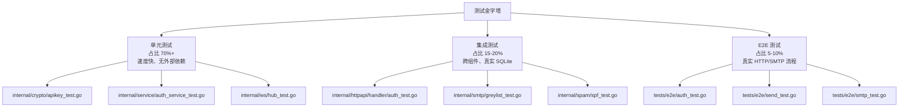

# MyMail 测试指南

> **文档版本**：v1.0  
> **编写日期**：2026-07-04  
> **适用对象**：初级开发人员  
> **文档目的**：教会开发者如何运行、阅读、新增测试，理解项目中的单元测试、集成测试、E2E 测试与基准测试。

---

## 1. 测试哲学与策略

MyMail 采用**测试金字塔**分层策略：底层大量单元测试，中间少量集成测试，顶层少量端到端（E2E）测试。所有测试均基于真实源码，使用 Go 标准库 `testing` 与社区辅助库（`testify`、`gin-gonic/gin` 的 `httptest` 等）。



### 1.1 单元测试

- **目标**：验证单个函数/方法/小模块在隔离环境下的正确性。
- **特点**：使用 `t.TempDir()` 创建临时 DB，不依赖网络，执行快。
- **示例包**：`internal/crypto`、`internal/service`、`internal/ws`、`internal/storage/dao`。

### 1.2 集成测试

- **目标**：验证多个组件协作时的行为，例如 Handler + Service + DAO + 真实 SQLite。
- **特点**：使用 `httptest.NewRecorder` 模拟 HTTP 请求，构造完整路由环境。
- **示例包**：`internal/httpapi/handler`、`internal/smtp`、`internal/mailsender`。

### 1.3 E2E 测试

- **目标**：验证完整业务流程，例如“注册 → 登录 → 发邮件 → 查收件箱”。
- **特点**：使用 `httptest.NewServer` 启动真实 HTTP 服务器，真实 TCP 连接，可测 WebSocket。
- **示例包**：`tests/e2e`。

### 1.4 基准测试

- **目标**：测量关键路径性能，防止回归。
- **示例**：`tests/e2e/bench_test.go`、`internal/storage/dao/api_key_bench_test.go`。

---

## 2. 运行全部测试

进入 `mymail-go/` 目录后执行：

```bash
cd mymail-go

# 运行全部测试（推荐，等价于 CI 阶段 3 的一部分）
go test ./... -count=1

# 带竞态检测（与 CI 一致）
go test ./... -race -count=1 -timeout=180s
```

> `-count=1` 禁用测试缓存，确保每次运行都真正执行测试用例。

### 2.1 Makefile 一键命令

`Makefile` 中预置了常用测试目标（参见 `Makefile` 第 27–43 行）：

```makefile
test:
	go test -race -coverprofile=coverage.out -covermode=atomic ./...
	@go tool cover -func=coverage.out | grep total

test-short:
	go test -short -race ./...

test-integration:
	go test -tags=integration ./tests/integration/...

test-e2e:
	go test -tags=e2e ./tests/e2e/...

bench:
	go test -bench=. -benchmem ./...
```

使用方式：

```bash
make test            # 单元测试 + 覆盖率
make test-short      # 短测试
make test-e2e        # E2E 测试
make bench           # 基准测试
```

---

## 3. 运行特定包测试和特定测试函数

### 3.1 运行单个包

```bash
# 只运行认证服务测试
go test ./internal/service/...

# 只运行 Handler 层测试
go test ./internal/httpapi/handler/...

# 只运行 WebSocket Hub 测试
go test ./internal/ws/...
```

### 3.2 运行单个测试函数

```bash
# 运行指定函数
go test ./internal/service/... -run TestAuthService_Register_FirstUserIsAdmin

# 运行匹配前缀的所有函数
go test ./internal/httpapi/handler/... -run TestAuthHandler_Register

# 运行子测试
go test ./internal/service/... -run TestAuthService_Register_ValidationErrors
```

### 3.3 运行 E2E 测试

E2E 测试位于 `tests/e2e/`，可通过 `-tags=e2e` 触发（如 `Makefile` 的 `test-e2e`）：

```bash
make test-e2e
# 等价于
go test -tags=e2e ./tests/e2e/...
```

单独运行某个 E2E 测试：

```bash
go test -tags=e2e ./tests/e2e/... -run TestE2E_AuthFlow
```

---

## 4. 生成覆盖率报告

### 4.1 文本摘要

```bash
go test -coverprofile=coverage.out -covermode=atomic ./...
go tool cover -func=coverage.out | grep total
```

### 4.2 HTML 可视化报告

```bash
go test -coverprofile=coverage.out -covermode=atomic ./...
go tool cover -html=coverage.out -o coverage.html
```

打开 `coverage.html` 即可在浏览器中查看每个文件的覆盖情况。

### 4.3 CI 覆盖率门控

`.github/workflows/ci.yml` 阶段 8 要求总覆盖率 **≥ 80%**（参见 `coverage-check` job）。本地提交前请先确认：

```bash
make test
```

该命令会输出类似：

```text
total:                                                          (statements)    86.1%
```

---

## 5. 测试目录结构说明

### 5.1 与源码同包的 `_test.go`

大多数单元测试与被测源码放在同一目录，并声明为同一包，可直接访问未导出函数：

```
internal/service/
├── auth_service.go
├── auth_service_test.go      # package service
├── mail_service.go
└── mail_service_test.go
```

例如 `internal/service/auth_service_test.go` 第 12 行：

```go
package service
```

### 5.2 外部测试包 `_test`

当测试需要引用被测包的上层包（如 `httpapi.NewRouter`）以避免 import cycle 时，使用外部测试包：

```
internal/httpapi/handler/
├── auth.go
├── auth_test.go              # package handler_test
├── mail.go
└── mail_test.go              # package handler_test
```

例如 `internal/httpapi/handler/auth_test.go` 第 15 行：

```go
package handler_test
```

### 5.3 独立 E2E 测试目录

```
tests/e2e/
├── setup_test.go      # 测试环境初始化
├── auth_test.go       # 认证流程 E2E
├── send_test.go       # 发邮件 E2E
├── smtp_test.go       # SMTP 接收 E2E
├── mail_test.go       # 邮件管理 E2E
├── admin_test.go      # 管理员 E2E
├── apikey_test.go     # API Key E2E
├── security_test.go   # 安全 E2E
└── bench_test.go      # 性能基线
```

---

## 6. 如何编写单元测试

### 6.1 表驱动测试

Go 社区最推荐的写法。以 `internal/smtp/greylist_test.go` 的 `TestExtractDomain` 为例：

```go
func TestExtractDomain(t *testing.T) {
    cases := []struct {
        name string
        addr string
        want string
    }{
        {"标准邮箱", "user@example.com", "example.com"},
        {"空字符串", "", ""},
        {"无@符号", "noatdomain", ""},
    }
    for _, c := range cases {
        t.Run(c.name, func(t *testing.T) {
            got := extractDomain(c.addr)
            if got != c.want {
                t.Errorf("extractDomain(%q) = %q, want %q", c.addr, got, c.want)
            }
        })
    }
}
```

### 6.2 临时数据库与 setup/teardown

项目统一使用 `t.TempDir()` 创建临时目录，避免测试污染真实数据库：

```go
func newTestAuthService(t *testing.T) (*AuthService, *dao.UserDAO) {
    t.Helper()
    path := filepath.Join(t.TempDir(), "test.db")
    database, err := db.Open(path)
    if err != nil {
        t.Fatalf("打开测试 DB 失败: %v", err)
    }
    if err := database.Migrate(); err != nil {
        t.Fatalf("迁移失败: %v", err)
    }
    t.Cleanup(func() { database.Close() })

    userDAO := dao.NewUserDAO(database)
    jwtMgr, _ := crypto.NewJWTManager("test-secret-key-for-service-test-32chars", "24h", "720h")
    auditLogger, _ := audit.NewLogger(database, true, "")
    t.Cleanup(func() { auditLogger.Close() })

    maildirPath := filepath.Join(t.TempDir(), "maildir")
    svc := NewAuthService(userDAO, jwtMgr, auditLogger, "example.com", maildirPath)
    return svc, userDAO
}
```

来源：`internal/service/auth_service_test.go` 第 29–58 行。

### 6.3 Mock 与依赖注入

MyMail 不强制使用 mock 框架，而是利用 Go 的接口和具体类型做依赖替换。例如 `internal/ws/hub_test.go` 中直接构造 `Client` 结构体进行测试：

```go
func newTestClient(userID int64) *Client {
    return &Client{
        userID: userID,
        send:   make(chan []byte, sendBufferSize),
        done:   make(chan struct{}),
    }
}
```

### 6.4 并发测试

使用 `sync.WaitGroup` 和 goroutine 验证并发安全，例如 `internal/ws/hub_test.go` 的 `TestHub_ConcurrentSafe`：

```go
func TestHub_ConcurrentSafe(t *testing.T) {
    h := NewHub()
    var wg sync.WaitGroup
    for i := 0; i < 10; i++ {
        wg.Add(1)
        go func(idx int) {
            defer wg.Done()
            c := newTestClient(int64(idx))
            h.Register(int64(idx), c)
            h.SendToUser(int64(idx), []byte("test"))
            h.Unregister(int64(idx), c)
        }(i)
    }
    wg.Wait()
    if h.ClientCount() != 0 {
        t.Errorf("并发操作后 ClientCount 期望 0，实际 %d", h.ClientCount())
    }
}
```

---

## 7. 如何编写 E2E 测试

### 7.1 tests/e2e 模式

E2E 测试使用 `httptest.NewServer` 启动真实 HTTP 服务器，通过真实 HTTP 客户端发送请求。与 Handler 测试的区别：

- 真实 TCP 连接（验证连接处理、超时等）
- 支持 WebSocket（需要 `ws://` 协议升级）
- 完整流程测试（多端点串联，验证业务流转）

来源：`tests/e2e/setup_test.go` 第 1–9 行。

### 7.2 setup_test.go 用法

`tests/e2e/setup_test.go` 提供统一的 `testEnv`：

```go
type testEnv struct {
    server      *httptest.Server
    db          *db.DB
    cfg         *config.Config
    userDAO     *dao.UserDAO
    msgDAO      *dao.MessageDAO
    jwtMgr      *crypto.JWTManager
    authSvc     *service.AuthService
    mailSvc     *service.MailService
    apiKeySvc   *service.APIKeyService
    adminSvc    *service.AdminService
    ruleSvc     *service.RuleService
    wsHub       *ws.Hub
    attachStore *attachment.Store
}
```

来源：`tests/e2e/setup_test.go` 第 36–50 行。

### 7.3 新增一个 E2E 测试的步骤

```mermaid
flowchart TD
    A[确定要验证的完整业务流程] --> B[在 tests/e2e/ 新建或复用 *_test.go]
    B --> C[调用 newTestEnv(t) 初始化环境]
    C --> D[使用 registerAndLogin 获取 token]
    D --> E[调用 doJSON / doMultipart 发送请求]
    E --> F[断言状态码与响应体]
    F --> G[可选: 直接查 DB 或 maildir 验证副作用]
    G --> H[运行 go test -tags=e2e ./tests/e2e/... -run YourTest]
```

### 7.4 示例：认证流程 E2E

`tests/e2e/auth_test.go` 的 `TestE2E_AuthFlow`：

```go
func TestE2E_AuthFlow(t *testing.T) {
    env := newTestEnv(t)

    // 1. 注册
    status, resp := env.doJSON(t, "POST", "/api/auth/register",
        map[string]string{"username": "alice", "password": "AlicePass123!"}, "")
    if status != http.StatusCreated {
        t.Fatalf("注册失败: status=%d, resp=%v", status, resp)
    }

    // 2. 登录
    status, resp = env.doJSON(t, "POST", "/api/auth/login",
        map[string]any{"email": "alice@example.com", "password": "AlicePass123!", "remember": false}, "")
    if status != http.StatusOK {
        t.Fatalf("登录失败: status=%d, resp=%v", status, resp)
    }
    token, _ := resp["token"].(string)

    // 3. 获取 me
    status, resp = env.doJSON(t, "GET", "/api/auth/me", nil, token)
    if status != http.StatusOK {
        t.Fatalf("获取 me 失败: status=%d, resp=%v", status, resp)
    }
}
```

### 7.5 E2E 辅助函数

`tests/e2e/setup_test.go` 提供以下常用辅助：

| 函数 | 作用 |
|---|---|
| `newTestEnv(t)` | 创建完整测试环境 |
| `doJSON(t, method, path, body, token)` | 发送 JSON 请求 |
| `doJSONArr(t, method, path, body, token)` | 发送 JSON 请求并解析数组响应 |
| `doRaw(method, path, body, token)` | 发送原始请求 |
| `registerAndLogin(t, username, password)` | 注册并登录，返回 token |
| `loginAdmin(t)` | 注册首个用户（自动 admin）并登录 |
| `insertTestMessage(t, userID, subject, body)` | 直接插入测试邮件 |

---

## 8. 测试数据与数据库隔离策略

### 8.1 每个测试独立数据库

所有测试都通过 `t.TempDir()` 创建独立临时目录，数据库文件互不干扰：

```go
path := filepath.Join(t.TempDir(), "test.db")
database, err := db.Open(path)
```

### 8.2 自动迁移

测试数据库创建后立即调用 `database.Migrate()`，确保 schema 与生产一致：

```go
if err := database.Migrate(); err != nil {
    t.Fatalf("迁移失败: %v", err)
}
```

### 8.3 Cleanup 机制

使用 `t.Cleanup` 在测试结束后关闭数据库和审计日志器：

```go
t.Cleanup(func() { database.Close() })
t.Cleanup(func() { auditLogger.Close() })
```

### 8.4 避免测试间状态泄漏

- 不要硬编码用户名/邮箱，必要时加随机后缀。
- E2E 中每个 `newTestEnv(t)` 都是全新环境，天然隔离。
- 需要共享环境的 E2E 测试可放在同一文件，但尽量不要跨文件共享状态。

---

## 9. 性能测试与基准测试

### 9.1 运行基准测试

```bash
# 运行全部基准测试
go test -bench=. -benchmem ./...

# 只运行 E2E 基准测试
go test -bench=. -benchmem ./tests/e2e/...

# 运行特定基准函数
go test -bench=BenchmarkLogin -benchmem ./tests/e2e/...
```

### 9.2 E2E 性能基线

`tests/e2e/bench_test.go` 定义了关键接口的基准测试：

| 函数 | 验收目标 | 说明 |
|---|---|---|
| `BenchmarkLogin` | ≥ 100 QPS | 含 bcrypt 校验，实际受 cost=12 限制 |
| `BenchmarkMailList` | ≥ 1000 QPS | 邮件列表查询 |
| `BenchmarkMailDetail` | ≥ 1000 QPS | 邮件详情查询 |
| `BenchmarkRegister` | ≥ 50 QPS | 含 bcrypt + maildir 创建 |
| `BenchmarkUnreadCount` | - | 未读计数查询 |

来源：`tests/e2e/bench_test.go` 第 5–9 行。

### 9.3 性能验收测试

`internal/storage/dao/api_key_bench_test.go` 中有一个显式断言：

```go
func TestAPIKeyDAO_FindByPrefix_Performance(t *testing.T) {
    // ... 创建 100 个 API Key ...
    start := time.Now()
    keys, err := apiKeyDAO.FindByPrefix(ctx, targetPrefix)
    elapsed := time.Since(start)

    if elapsed >= time.Millisecond {
        t.Errorf("验收标准：FindByPrefix 应 < 1ms，实际 %v", elapsed)
    }
}
```

来源：`internal/storage/dao/api_key_bench_test.go` 第 70–94 行。

### 9.4 如何解读基准测试结果

```text
BenchmarkLogin-8           10    112345678 ns/op    12345 B/op    234 allocs/op
```

- `10`：在 1 秒默认时间内运行了 10 次
- `112345678 ns/op`：每次操作耗时约 112ms
- `12345 B/op`：每次操作分配 12KB 内存
- `234 allocs/op`：每次操作 234 次堆分配

---

## 10. CI 中的测试门控说明

`.github/workflows/ci.yml` 定义了 8 阶段 CI 门禁，其中与测试直接相关的是：

| 阶段 | 名称 | 说明 |
|---|---|---|
| 3 | Test | `go test ./... -race -cover -timeout=180s -coverprofile=coverage.out` |
| 7 | Security Scan | `gosec` + `govulncheck` |
| 8 | Coverage Check | 总覆盖率 ≥ 80% |
| - | CI Gate | 汇总 8 个阶段结果，任一失败禁止合并 |

来源：`.github/workflows/ci.yml` 第 69–256 行。

### 10.1 本地预提交检查

提交 PR 前，请在本地运行：

```bash
make lint      # golangci-lint
go vet ./...   # 静态分析
make test      # 单元测试 + 覆盖率
make test-e2e  # E2E 测试
```

### 10.2 新增测试后需要做什么

1. 确保新增测试能通过：`go test ./... -run YourTest`。
2. 确保整体覆盖率不下降：`make test`。
3. 确保无竞态：`go test ./... -race`。
4. 如果新增 E2E 测试，请确认 `-tags=e2e` 下能运行。
5. 在 PR 描述中说明新增/更新的测试用例。

---

## 附录：常用测试命令速查

| 命令 | 作用 |
|---|---|
| `go test ./...` | 运行全部测试 |
| `go test ./... -count=1` | 禁用缓存运行全部测试 |
| `go test ./... -race` | 竞态检测 |
| `go test ./... -cover` | 覆盖率摘要 |
| `go test ./... -coverprofile=coverage.out` | 生成覆盖率文件 |
| `go tool cover -html=coverage.out` | 查看 HTML 覆盖率 |
| `go test -tags=e2e ./tests/e2e/...` | 运行 E2E 测试 |
| `go test -bench=. -benchmem ./...` | 运行基准测试 |
| `go test ./internal/service/... -run TestAuthService` | 运行指定包指定函数 |
| `make test` | 单元测试 + 覆盖率（项目推荐） |
| `make test-e2e` | E2E 测试 |
| `make bench` | 基准测试 |

---

## 参考文件

- `Makefile`
- `.github/workflows/ci.yml`
- `internal/crypto/apikey_test.go`
- `internal/service/auth_service_test.go`
- `internal/httpapi/handler/auth_test.go`
- `internal/httpapi/handler/mail_test.go`
- `internal/ws/hub_test.go`
- `internal/smtp/greylist_test.go`
- `internal/smtp/integrate_test.go`
- `internal/storage/dao/api_key_bench_test.go`
- `tests/e2e/setup_test.go`
- `tests/e2e/auth_test.go`
- `tests/e2e/send_test.go`
- `tests/e2e/smtp_test.go`
- `tests/e2e/bench_test.go`
