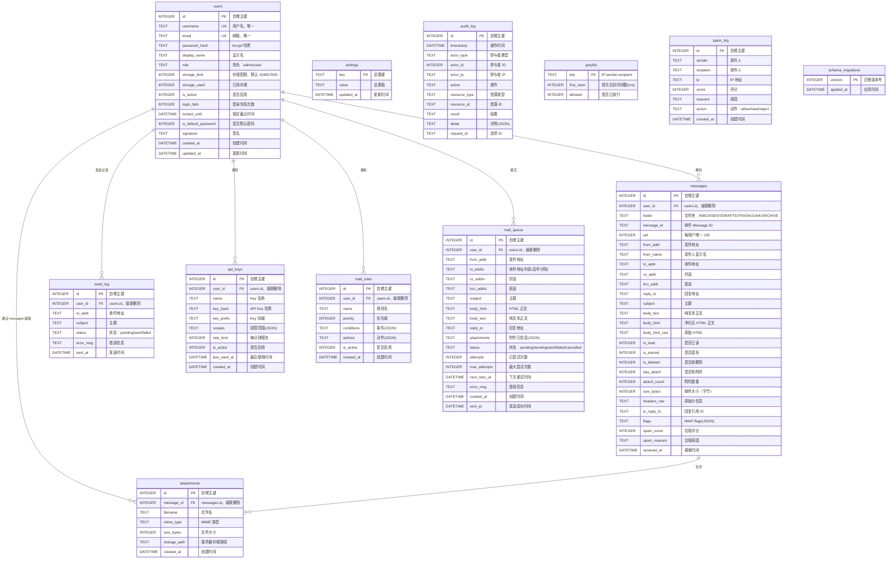

# 数据库设计详解

> **文档版本**：v1.0  
> **编写日期**：2026-07-04  
> **适用对象**：初级开发人员、新加入团队的工程师  
> **文档目的**：帮助开发者理解 MyMail-Go 的 SQLite 数据库表结构、字段含义、表间关系、索引策略、迁移机制，以及从 DAO 中提取的真实查询示例。本文所有表名、字段名、SQL 均来自源码中的迁移文件与 DAO 文件，无编造。

---

## 一、数据库选型与文件位置

### 1.1 选型

MyMail-Go 使用 **SQLite** 作为关系型数据库，驱动为纯 Go 实现的 [`modernc.org/sqlite`](https://pkg.go.dev/modernc.org/sqlite)。

选择理由：

- **零运维**：无需独立数据库进程，适合自托管场景；
- **单文件存储**：整个数据库即一个文件，便于备份与迁移；
- **无 CGO**：纯 Go 驱动可跨平台交叉编译；
- **WAL 模式**：通过 `journal_mode=WAL` 提升读写并发能力。

### 1.2 文件位置

| 文件/目录 | 说明 |
|---|---|
| [`internal/storage/db/db.go`](../internal/storage/db/db.go) | 数据库连接、DSN 构建、PRAGMA 设置 |
| [`internal/storage/db/migrate.go`](../internal/storage/db/migrate.go) | 自定义迁移器实现 |
| [`internal/storage/db/migrations/`](../internal/storage/db/migrations/) | 所有 up/down 迁移脚本 |
| [`internal/storage/dao/`](../internal/storage/dao/) | 所有 DAO 文件（手写 SQL） |

### 1.3 数据库文件

默认数据库文件路径由配置 `DB_PATH` 决定，默认值为 `./data/mymail.db`（见 [`internal/config/config.go`](../internal/config/config.go)）。

启动时连接参数：

```text
journal_mode=WAL
foreign_keys=ON
busy_timeout=5000
synchronous=NORMAL
```

> 源码位置：[`internal/storage/db/db.go`](../internal/storage/db/db.go)

---

## 二、ER 图

下图使用 Mermaid `erDiagram` 描述核心实体关系。



---

## 三、表字段说明

### 3.1 users（用户表）

| 字段 | 类型 | 约束 | 说明 |
|---|---|---|---|
| `id` | INTEGER | PK, AUTOINCREMENT | 自增主键 |
| `username` | TEXT | NOT NULL, UNIQUE | 用户名 |
| `email` | TEXT | NOT NULL, UNIQUE | 邮箱地址 |
| `password_hash` | TEXT | NOT NULL | bcrypt 哈希 |
| `display_name` | TEXT | 可空 | 显示名 |
| `role` | TEXT | NOT NULL, DEFAULT 'user' | 角色：`admin` / `user` |
| `storage_limit` | INTEGER | NOT NULL, DEFAULT 104857600 | 存储配额（字节），默认 100MB |
| `storage_used` | INTEGER | NOT NULL, DEFAULT 0 | 已用存储（字节） |
| `is_active` | INTEGER | NOT NULL, DEFAULT 1 | 是否启用（0/1） |
| `login_fails` | INTEGER | NOT NULL, DEFAULT 0 | 连续登录失败次数 |
| `locked_until` | DATETIME | 可空 | 账户锁定截止时间 |
| `is_default_password` | INTEGER | NOT NULL, DEFAULT 0 | 是否默认密码（需强制修改） |
| `signature` | TEXT | 可空 | 邮件签名 |
| `created_at` | DATETIME | NOT NULL, DEFAULT CURRENT_TIMESTAMP | 创建时间 |
| `updated_at` | DATETIME | NOT NULL, DEFAULT CURRENT_TIMESTAMP | 更新时间 |

**索引**：

- `idx_users_email`：`email`
- `idx_users_username`：`username`
- `idx_users_role`：`role`
- `idx_users_active`：`is_active`（部分索引，仅 `is_active = 1`）
- `idx_users_locked`：`locked_until`（部分索引，仅 `locked_until IS NOT NULL`）

> 源码：[`001_initial_schema.up.sql`](../internal/storage/db/migrations/001_initial_schema.up.sql)、[`004_add_indexes.up.sql`](../internal/storage/db/migrations/004_add_indexes.up.sql)、[`internal/storage/dao/user.go`](../internal/storage/dao/user.go)

---

### 3.2 messages（邮件表）

| 字段 | 类型 | 约束 | 说明 |
|---|---|---|---|
| `id` | INTEGER | PK, AUTOINCREMENT | 自增主键 |
| `user_id` | INTEGER | NOT NULL, FK → users(id), ON DELETE CASCADE | 所属用户 |
| `folder` | TEXT | NOT NULL, DEFAULT 'INBOX' | 文件夹 |
| `message_id` | TEXT | 可空 | 邮件 Message-ID |
| `uid` | INTEGER | 可空 | 每用户唯一 UID（Dovecot 集成） |
| `from_addr` | TEXT | NOT NULL | 发件地址 |
| `from_name` | TEXT | 可空 | 发件人显示名 |
| `to_addr` | TEXT | NOT NULL | 收件地址 |
| `cc_addr` | TEXT | 可空 | 抄送 |
| `bcc_addr` | TEXT | 可空 | 密送 |
| `reply_to` | TEXT | 可空 | 回复地址 |
| `subject` | TEXT | 可空 | 主题 |
| `body_text` | TEXT | 可空 | 纯文本正文 |
| `body_html` | TEXT | 可空 | 净化后 HTML 正文 |
| `body_html_raw` | TEXT | 可空 | 原始 HTML |
| `is_read` | INTEGER | NOT NULL, DEFAULT 0 | 是否已读 |
| `is_starred` | INTEGER | NOT NULL, DEFAULT 0 | 是否星标 |
| `is_deleted` | INTEGER | NOT NULL, DEFAULT 0 | 是否软删除 |
| `has_attach` | INTEGER | NOT NULL, DEFAULT 0 | 是否有附件 |
| `attach_count` | INTEGER | NOT NULL, DEFAULT 0 | 附件数量 |
| `size_bytes` | INTEGER | NOT NULL, DEFAULT 0 | 邮件大小（字节） |
| `headers_raw` | TEXT | 可空 | 原始头信息 |
| `in_reply_to` | TEXT | 可空 | 回复引用 ID |
| `flags` | TEXT | NOT NULL, DEFAULT '[]' | IMAP flags（JSON） |
| `spam_score` | INTEGER | NOT NULL, DEFAULT 0 | 垃圾评分 |
| `spam_reasons` | TEXT | 可空 | 垃圾原因 |
| `received_at` | DATETIME | NOT NULL, DEFAULT CURRENT_TIMESTAMP | 接收/创建时间 |

**索引**：

- `idx_msg_user_folder`：`user_id, folder`
- `idx_msg_received`：`received_at`
- `idx_msg_user_read`：`user_id, is_read`
- `idx_msg_user_received`：`user_id, received_at DESC`
- `idx_msg_message_id`：`message_id`
- `idx_msg_user_starred`：`user_id, is_starred`（部分索引，`is_starred = 1`）
- `idx_msg_user_deleted`：`user_id, is_deleted`（部分索引，`is_deleted = 1`）
- `idx_msg_from_addr`：`from_addr`
- `idx_msg_folder`：`folder`

> 源码：[`001_initial_schema.up.sql`](../internal/storage/db/migrations/001_initial_schema.up.sql)、[`004_add_indexes.up.sql`](../internal/storage/db/migrations/004_add_indexes.up.sql)、[`internal/storage/dao/message.go`](../internal/storage/dao/message.go)

---

### 3.3 attachments（附件表）

| 字段 | 类型 | 约束 | 说明 |
|---|---|---|---|
| `id` | INTEGER | PK, AUTOINCREMENT | 自增主键 |
| `message_id` | INTEGER | NOT NULL, FK → messages(id), ON DELETE CASCADE | 所属邮件 |
| `filename` | TEXT | NOT NULL | 文件名 |
| `mime_type` | TEXT | 可空 | MIME 类型 |
| `size_bytes` | INTEGER | 可空 | 文件大小 |
| `storage_path` | TEXT | NOT NULL | 服务器存储路径 |
| `created_at` | DATETIME | NOT NULL, DEFAULT CURRENT_TIMESTAMP | 创建时间 |

**索引**：

- `idx_attach_message`：`message_id`

> 源码：[`001_initial_schema.up.sql`](../internal/storage/db/migrations/001_initial_schema.up.sql)、[`internal/storage/dao/attachment.go`](../internal/storage/dao/attachment.go)

---

### 3.4 send_log（发送日志表）

| 字段 | 类型 | 约束 | 说明 |
|---|---|---|---|
| `id` | INTEGER | PK, AUTOINCREMENT | 自增主键 |
| `user_id` | INTEGER | NOT NULL, FK → users(id), ON DELETE CASCADE | 发送用户 |
| `to_addr` | TEXT | NOT NULL | 收件地址 |
| `subject` | TEXT | 可空 | 主题 |
| `status` | TEXT | NOT NULL, DEFAULT 'pending' | 状态：`pending` / `sent` / `failed` |
| `error_msg` | TEXT | 可空 | 错误信息 |
| `sent_at` | DATETIME | NOT NULL, DEFAULT CURRENT_TIMESTAMP | 发送时间 |

**索引**：

- `idx_send_log_user`：`user_id`
- `idx_send_log_sent`：`sent_at`
- `idx_send_log_status`：`status`

> 源码：[`001_initial_schema.up.sql`](../internal/storage/db/migrations/001_initial_schema.up.sql)、[`004_add_indexes.up.sql`](../internal/storage/db/migrations/004_add_indexes.up.sql)、[`internal/storage/dao/send_log.go`](../internal/storage/dao/send_log.go)

---

### 3.5 settings（系统配置表）

| 字段 | 类型 | 约束 | 说明 |
|---|---|---|---|
| `key` | TEXT | PK | 设置键 |
| `value` | TEXT | 可空 | 设置值 |
| `updated_at` | DATETIME | NOT NULL, DEFAULT CURRENT_TIMESTAMP | 更新时间 |

> 说明：使用 SQLite `ON CONFLICT(key) DO UPDATE` 实现 UPSERT。  
> 源码：[`001_initial_schema.up.sql`](../internal/storage/db/migrations/001_initial_schema.up.sql)、[`internal/storage/dao/settings.go`](../internal/storage/dao/settings.go)

---

### 3.6 audit_log（审计日志表）

| 字段 | 类型 | 约束 | 说明 |
|---|---|---|---|
| `id` | INTEGER | PK, AUTOINCREMENT | 自增主键 |
| `timestamp` | DATETIME | NOT NULL, DEFAULT CURRENT_TIMESTAMP | 操作时间 |
| `actor_type` | TEXT | NOT NULL | 参与者类型，如 `user` / `system` / `api_key` |
| `actor_id` | INTEGER | 可空 | 参与者 ID |
| `actor_ip` | TEXT | 可空 | 参与者 IP |
| `action` | TEXT | NOT NULL | 操作名称 |
| `resource_type` | TEXT | 可空 | 资源类型 |
| `resource_id` | TEXT | 可空 | 资源 ID |
| `result` | TEXT | NOT NULL | 结果，如 `success` / `failure` |
| `detail` | TEXT | 可空 | 详情（JSON） |
| `request_id` | TEXT | 可空 | 请求 ID |

**索引**：

- `idx_audit_timestamp`：`timestamp`
- `idx_audit_actor`：`actor_type, actor_id`
- `idx_audit_action`：`action`

> 源码：[`001_initial_schema.up.sql`](../internal/storage/db/migrations/001_initial_schema.up.sql)、[`internal/audit/dao.go`](../internal/audit/dao.go)

---

### 3.7 api_keys（API Key 表）

| 字段 | 类型 | 约束 | 说明 |
|---|---|---|---|
| `id` | INTEGER | PK, AUTOINCREMENT | 自增主键 |
| `user_id` | INTEGER | NOT NULL, FK → users(id), ON DELETE CASCADE | 所属用户 |
| `name` | TEXT | NOT NULL | Key 名称 |
| `key_hash` | TEXT | NOT NULL | API Key bcrypt 哈希 |
| `key_prefix` | TEXT | NOT NULL | Key 前缀（用于展示与索引） |
| `scopes` | TEXT | NOT NULL, DEFAULT '["send"]' | 权限范围（JSON 数组） |
| `rate_limit` | INTEGER | NOT NULL, DEFAULT 60 | 每分钟最大请求数 |
| `is_active` | INTEGER | NOT NULL, DEFAULT 1 | 是否启用 |
| `last_used_at` | DATETIME | 可空 | 最后使用时间 |
| `created_at` | DATETIME | NOT NULL, DEFAULT CURRENT_TIMESTAMP | 创建时间 |

**索引**：

- `idx_api_keys_prefix`：`key_prefix`（部分索引，仅 `is_active = 1`）
- `idx_api_keys_user`：`user_id`
- `idx_api_keys_active`：`is_active`（部分索引，仅 `is_active = 1`）
- `idx_api_keys_last_used`：`last_used_at`

> 源码：[`002_add_apikeys_rules.up.sql`](../internal/storage/db/migrations/002_add_apikeys_rules.up.sql)、[`004_add_indexes.up.sql`](../internal/storage/db/migrations/004_add_indexes.up.sql)、[`internal/storage/dao/api_key.go`](../internal/storage/dao/api_key.go)

---

### 3.8 mail_rules（邮件规则表）

| 字段 | 类型 | 约束 | 说明 |
|---|---|---|---|
| `id` | INTEGER | PK, AUTOINCREMENT | 自增主键 |
| `user_id` | INTEGER | NOT NULL, FK → users(id), ON DELETE CASCADE | 所属用户 |
| `name` | TEXT | NOT NULL | 规则名 |
| `priority` | INTEGER | NOT NULL, DEFAULT 0 | 优先级，数值越大越优先 |
| `conditions` | TEXT | NOT NULL | 条件（JSON 数组） |
| `actions` | TEXT | NOT NULL | 动作（JSON 数组） |
| `is_active` | INTEGER | NOT NULL, DEFAULT 1 | 是否启用 |
| `created_at` | DATETIME | NOT NULL, DEFAULT CURRENT_TIMESTAMP | 创建时间 |

**索引**：

- `idx_rules_user_active`：`user_id, is_active`
- `idx_rules_priority`：`priority`
- `idx_rules_user_priority`：`user_id, priority`

> 源码：[`002_add_apikeys_rules.up.sql`](../internal/storage/db/migrations/002_add_apikeys_rules.up.sql)、[`004_add_indexes.up.sql`](../internal/storage/db/migrations/004_add_indexes.up.sql)、[`internal/storage/dao/rule.go`](../internal/storage/dao/rule.go)

---

### 3.9 greylist（灰名单表）

| 字段 | 类型 | 约束 | 说明 |
|---|---|---|---|
| `key` | TEXT | PK | 格式：`IP:sender:recipient` |
| `first_seen` | INTEGER | NOT NULL | 首次见到时间戳（Unix 毫秒） |
| `allowed` | INTEGER | NOT NULL, DEFAULT 0 | 是否已通过延迟窗口 |

**索引**：

- `idx_greylist_first_seen`：`first_seen`

> 源码：[`003_add_greylist_spamlog.up.sql`](../internal/storage/db/migrations/003_add_greylist_spamlog.up.sql)、[`internal/storage/dao/greylist.go`](../internal/storage/dao/greylist.go)

---

### 3.10 spam_log（垃圾邮件日志表）

| 字段 | 类型 | 约束 | 说明 |
|---|---|---|---|
| `id` | INTEGER | PK, AUTOINCREMENT | 自增主键 |
| `sender` | TEXT | 可空 | 发件人 |
| `recipient` | TEXT | 可空 | 收件人 |
| `ip` | TEXT | 可空 | 发件人 IP |
| `score` | INTEGER | NOT NULL | 垃圾评分 |
| `reasons` | TEXT | 可空 | 原因（分号分隔） |
| `action` | TEXT | NOT NULL | 动作：`allow` / `mark` / `reject` |
| `created_at` | DATETIME | NOT NULL, DEFAULT CURRENT_TIMESTAMP | 创建时间 |

**索引**：

- `idx_spam_log_created`：`created_at`
- `idx_spam_log_sender`：`sender`
- `idx_spam_log_action`：`action`

> 源码：[`003_add_greylist_spamlog.up.sql`](../internal/storage/db/migrations/003_add_greylist_spamlog.up.sql)、[`internal/storage/dao/spam_log.go`](../internal/storage/dao/spam_log.go)

---

### 3.11 mail_queue（发送队列表）

| 字段 | 类型 | 约束 | 说明 |
|---|---|---|---|
| `id` | INTEGER | PK, AUTOINCREMENT | 自增主键 |
| `user_id` | INTEGER | NOT NULL, FK → users(id), ON DELETE CASCADE | 提交用户 |
| `from_addr` | TEXT | NOT NULL | 发件地址 |
| `to_addrs` | TEXT | NOT NULL | 收件地址列表（逗号分隔） |
| `cc_addrs` | TEXT | 可空 | 抄送 |
| `bcc_addrs` | TEXT | 可空 | 密送 |
| `subject` | TEXT | 可空 | 主题 |
| `body_html` | TEXT | 可空 | HTML 正文 |
| `body_text` | TEXT | 可空 | 纯文本正文 |
| `reply_to` | TEXT | 可空 | 回复地址 |
| `attachments` | TEXT | 可空 | 附件元信息（JSON） |
| `status` | TEXT | NOT NULL, DEFAULT 'pending' | 状态：`pending` / `sending` / `sent` / `failed` / `cancelled` |
| `attempts` | INTEGER | NOT NULL, DEFAULT 0 | 已尝试次数 |
| `max_attempts` | INTEGER | NOT NULL, DEFAULT 3 | 最大尝试次数 |
| `next_retry_at` | DATETIME | 可空 | 下次重试时间 |
| `error_msg` | TEXT | 可空 | 错误信息 |
| `created_at` | DATETIME | NOT NULL, DEFAULT CURRENT_TIMESTAMP | 创建时间 |
| `sent_at` | DATETIME | 可空 | 发送成功时间 |

**索引**：

- `idx_queue_status`：`status, next_retry_at`
- `idx_queue_user`：`user_id`

> 源码：[`003_add_greylist_spamlog.up.sql`](../internal/storage/db/migrations/003_add_greylist_spamlog.up.sql)、[`internal/storage/dao/queue.go`](../internal/storage/dao/queue.go)

---

### 3.12 schema_migrations（迁移版本表）

| 字段 | 类型 | 约束 | 说明 |
|---|---|---|---|
| `version` | INTEGER | PK | 迁移版本号 |
| `applied_at` | DATETIME | NOT NULL, DEFAULT CURRENT_TIMESTAMP | 应用时间 |

> 说明：由迁移器自动创建，记录已执行的迁移版本。  
> 源码：[`internal/storage/db/migrate.go`](../internal/storage/db/migrate.go)

---

## 四、表关系说明

### 4.1 一对多关系（1:N）

| 主表 | 从表 | 外键 | 级联删除 |
|---|---|---|---|
| `users` | `messages` | `messages.user_id` | CASCADE |
| `users` | `send_log` | `send_log.user_id` | CASCADE |
| `users` | `api_keys` | `api_keys.user_id` | CASCADE |
| `users` | `mail_rules` | `mail_rules.user_id` | CASCADE |
| `users` | `mail_queue` | `mail_queue.user_id` | CASCADE |
| `messages` | `attachments` | `attachments.message_id` | CASCADE |

### 4.2 无关系/独立表

- `settings`：全局键值对，无外部关联；
- `audit_log`：审计日志，记录操作事件，不与其他表做外键（避免删除用户时丢失审计记录）；
- `greylist`：反垃圾灰名单，使用复合 key（`IP:sender:recipient`），无外键；
- `spam_log`：垃圾邮件日志，记录反垃圾评估结果，无外键。

### 4.3 关系设计意图

- **用户为中心**：所有用户相关数据（邮件、发送记录、API Key、规则、队列）都通过 `user_id` 关联，并设置 `ON DELETE CASCADE`，删除用户时自动清理相关数据。  
- **邮件与附件**：附件必须属于某封邮件，删除邮件时自动级联删除附件记录。  
- **审计独立**：`audit_log` 不设置外键，确保用户删除后审计记录仍然可追溯。  
- **反垃圾数据独立**：`greylist` 和 `spam_log` 面向 SMTP 会话，不依赖 `users`/`messages` 表，便于独立清理与统计。

---

## 五、迁移机制

### 5.1 迁移文件命名

迁移文件位于 [`internal/storage/db/migrations/`](../internal/storage/db/migrations/)，命名规则：

```text
NNN_description.up.sql
NNN_description.down.sql
```

当前迁移列表：

| 版本 | up 文件 | down 文件 | 内容 |
|---|---|---|---|
| 001 | [`001_initial_schema.up.sql`](../internal/storage/db/migrations/001_initial_schema.up.sql) | [`001_initial_schema.down.sql`](../internal/storage/db/migrations/001_initial_schema.down.sql) | users / messages / attachments / send_log / settings / audit_log |
| 002 | [`002_add_apikeys_rules.up.sql`](../internal/storage/db/migrations/002_add_apikeys_rules.up.sql) | [`002_add_apikeys_rules.down.sql`](../internal/storage/db/migrations/002_add_apikeys_rules.down.sql) | api_keys / mail_rules |
| 003 | [`003_add_greylist_spamlog.up.sql`](../internal/storage/db/migrations/003_add_greylist_spamlog.up.sql) | [`003_add_greylist_spamlog.down.sql`](../internal/storage/db/migrations/003_add_greylist_spamlog.down.sql) | greylist / spam_log / mail_queue |
| 004 | [`004_add_indexes.up.sql`](../internal/storage/db/migrations/004_add_indexes.up.sql) | [`004_add_indexes.down.sql`](../internal/storage/db/migrations/004_add_indexes.down.sql) | 补充索引 |

### 5.2 迁移器实现

迁移逻辑在 [`internal/storage/db/migrate.go`](../internal/storage/db/migrate.go) 中实现：

1. **创建 `schema_migrations` 表**（如果不存在）；
2. **读取已应用版本**；
3. **加载 `migrations/*.up.sql` 文件**，按版本号升序排序；
4. **跳过已应用版本**，对未应用版本执行：
   - 在事务中执行 up SQL；
   - 向 `schema_migrations` 插入版本号；
   - 提交事务。

迁移器使用 `//go:embed migrations/*.sql` 将 SQL 文件嵌入二进制，保证单二进制部署时也能自动迁移。

### 5.3 如何新增迁移

假设需要新增“在 `users` 表添加 `timezone` 字段”：

1. 创建迁移文件：
   - `internal/storage/db/migrations/005_add_user_timezone.up.sql`
   - `internal/storage/db/migrations/005_add_user_timezone.down.sql`

2. 在 up 文件中写入：

```sql
ALTER TABLE users ADD COLUMN timezone TEXT DEFAULT 'UTC';
```

3. 在 down 文件中写入：

```sql
-- SQLite 不支持直接删除列，需要重建表
CREATE TABLE users_new (... 不含 timezone ...);
INSERT INTO users_new SELECT ... FROM users;
DROP TABLE users;
ALTER TABLE users_new RENAME TO users;
```

4. 在 `internal/storage/dao/user.go` 的 `User` struct、`userColumns`、`scanUser` 中增加 `timezone` 字段；
5. 启动服务，`DB.Migrate()` 会自动执行新迁移。

---

## 六、常见查询示例（来自 DAO 真实 SQL）

### 6.1 用户查询

按邮箱查询用户：

```sql
SELECT id, username, email, password_hash, display_name, role,
       storage_limit, storage_used, is_active, login_fails, locked_until,
       is_default_password, signature, created_at, updated_at
FROM users
WHERE email = ?;
```

> 来源：[`internal/storage/dao/user.go:88`](./internal/storage/dao/user.go#L88)

---

### 6.2 邮件列表查询（分页 + 搜索 + 未读过滤）

```sql
-- 总数
SELECT COUNT(*) FROM messages
WHERE user_id = ? AND folder = ? AND is_deleted = 0
  AND (from_addr LIKE ? OR from_name LIKE ? OR subject LIKE ? OR body_text LIKE ?);

-- 列表
SELECT id, user_id, folder, message_id, uid, from_addr, from_name,
       to_addr, cc_addr, bcc_addr, reply_to, subject, body_text, body_html, body_html_raw,
       is_read, is_starred, is_deleted, has_attach, attach_count, size_bytes,
       headers_raw, in_reply_to, flags, spam_score, spam_reasons, received_at
FROM messages
WHERE user_id = ? AND folder = ? AND is_deleted = 0
  AND (from_addr LIKE ? OR from_name LIKE ? OR subject LIKE ? OR body_text LIKE ?)
ORDER BY received_at DESC
LIMIT ? OFFSET ?;
```

> 来源：[`internal/storage/dao/message.go:267`](./internal/storage/dao/message.go#L267)

---

### 6.3 未读数统计

```sql
SELECT COUNT(*) FROM messages
WHERE user_id = ? AND folder = ? AND is_read = 0 AND is_deleted = 0;
```

> 来源：[`internal/storage/dao/message.go:343`](./internal/storage/dao/message.go#L343)

---

### 6.4 邮件归属校验查询

```sql
SELECT ... FROM messages WHERE id = ? AND user_id = ?;
```

> 来源：[`internal/storage/dao/message.go:242`](./internal/storage/dao/message.go#L242)  
> 用途：修复 P0-3 越权读取，所有 `:id` 操作必须先校验 `user_id`。

---

### 6.5 软删除与恢复

```sql
-- 软删除（移到垃圾箱）
UPDATE messages SET is_deleted = 1, folder = 'TRASH' WHERE id = ? AND user_id = ?;

-- 恢复
UPDATE messages SET is_deleted = 0, folder = 'INBOX' WHERE id = ? AND user_id = ?;
```

> 来源：[`internal/storage/dao/message.go:429`](./internal/storage/dao/message.go#L429)、[`internal/storage/dao/message.go:418`](./internal/storage/dao/message.go#L418)

---

### 6.6 批量操作

```sql
-- 批量标记已读
UPDATE messages SET is_read = 1 WHERE user_id = ? AND id IN (?, ?, ?);

-- 批量移动
UPDATE messages SET folder = ? WHERE user_id = ? AND id IN (?, ?, ?);

-- 批量软删除
UPDATE messages SET is_deleted = 1, folder = 'TRASH' WHERE user_id = ? AND id IN (?, ?, ?);
```

> 来源：[`internal/storage/dao/message.go:585`](./internal/storage/dao/message.go#L585)、[`internal/storage/dao/message.go:606`](./internal/storage/dao/message.go#L606)、[`internal/storage/dao/message.go:627`](./internal/storage/dao/message.go#L627)

---

### 6.7 附件按邮件查询

```sql
SELECT id, message_id, filename, mime_type, size_bytes, storage_path, created_at
FROM attachments
WHERE message_id = ?
ORDER BY id;
```

> 来源：[`internal/storage/dao/attachment.go:95`](./internal/storage/dao/attachment.go#L95)

---

### 6.8 API Key 按前缀查询（P1-3 修复）

```sql
SELECT id, user_id, name, key_hash, key_prefix, scopes, rate_limit, is_active, last_used_at, created_at
FROM api_keys
WHERE key_prefix = ? AND is_active = 1;
```

> 来源：[`internal/storage/dao/api_key.go:94`](./internal/storage/dao/api_key.go#L94)  
> 说明：原 Node.js 使用全表遍历 + bcrypt 比对，Go 版通过 `key_prefix` 索引将候选行降到 0 或 1 条。

---

### 6.9 规则查询

```sql
-- 查询用户活跃规则，按优先级降序
SELECT id, user_id, name, priority, conditions, actions, is_active, created_at
FROM mail_rules
WHERE user_id = ? AND is_active = 1
ORDER BY priority DESC;
```

> 来源：[`internal/storage/dao/rule.go:131`](./internal/storage/dao/rule.go#L131)

---

### 6.10 队列领取（事务 + 更新状态）

```sql
-- 1. 查询最早的 pending 项
SELECT ... FROM mail_queue
WHERE status = 'pending'
  AND (next_retry_at IS NULL OR next_retry_at <= CURRENT_TIMESTAMP)
ORDER BY created_at ASC
LIMIT 1;

-- 2. 标记为 sending，增加 attempts
UPDATE mail_queue SET status = 'sending', attempts = attempts + 1 WHERE id = ?;
```

> 来源：[`internal/storage/dao/queue.go:177`](./internal/storage/dao/queue.go#L177)  
> 说明：两步在同一个事务内完成，实现原子“领取”语义。

---

### 6.11 灰名单查询

```sql
SELECT key, first_seen, allowed FROM greylist WHERE key = ?;
```

> 来源：[`internal/storage/dao/greylist.go:48`](./internal/storage/dao/greylist.go#L48)

---

### 6.12 发送频率限制查询

```sql
SELECT COUNT(*) FROM send_log
WHERE user_id = ? AND sent_at >= ? AND status = 'sent';
```

> 来源：[`internal/storage/dao/send_log.go:105`](./internal/storage/dao/send_log.go#L105)  
> 用途：统计用户在指定时间窗口内已发送成功邮件数，用于限流。

---

## 七、性能考虑

### 7.1 索引策略

MyMail-Go 的索引设计遵循以下原则：

1. **高频查询字段必加索引**：
   - `messages.user_id` + `folder`：邮件列表最常用过滤条件；
   - `messages.received_at`：按时间排序；
   - `users.email` / `users.username`：登录查询。

2. **外键加索引**：
   - `attachments.message_id`：查某封邮件的附件；
   - `api_keys.user_id`、`mail_rules.user_id`：查用户列表。

3. **部分索引降低写入开销**：
   - `idx_msg_user_starred WHERE is_starred = 1`：星标邮件占比小，部分索引更高效；
   - `idx_users_active WHERE is_active = 1`：活跃用户查询；
   - `idx_api_keys_prefix WHERE is_active = 1`：API Key 认证只查活跃 key。

4. **复合索引覆盖排序**：
   - `idx_msg_user_received(user_id, received_at DESC)`：邮件列表按用户 + 时间排序，可直接使用索引顺序。

### 7.2 软删除 `is_deleted`

- `messages` 表使用 `is_deleted` 标志实现软删除，而不是直接 `DELETE`；
- 正常邮件列表查询都会加上 `AND is_deleted = 0`；
- 清空垃圾箱时再通过 `DELETE FROM messages WHERE user_id = ? AND folder = 'TRASH'` 物理删除；
- 附件记录通过 `ON DELETE CASCADE` 自动级联删除，但**附件文件**由服务层负责清理。

> 来源：[`internal/storage/dao/message.go:451`](./internal/storage/dao/message.go#L451)

### 7.3 存储配额字段 `storage_limit`

- `users.storage_limit` 默认 104857600 字节（100MB）；
- `users.storage_used` 由服务层在收发邮件时增量更新；
- 发送/接收前会校验 `storage_used + 新邮件大小 <= storage_limit`，超出则拒绝。

> 来源：[`internal/storage/dao/user.go:124`](./internal/storage/dao/user.go#L124)、[`internal/storage/dao/user.go:262`](./internal/storage/dao/user.go#L262)

### 7.4 WAL 模式与连接池

- SQLite 写操作串行，连接池设为 `MaxOpenConns=1`、`MaxIdleConns=1`，避免写锁冲突；
- WAL 模式允许读事务与写事务并发，提高并发读取能力；
- `busy_timeout=5000` 在写冲突时等待 5 秒，降低“database is locked”错误。

> 来源：[`internal/storage/db/db.go:47`](./internal/storage/db/db.go#L47)

### 7.5 大字段与 JSON 字段

- `messages.body_html`、`messages.headers_raw` 等大文本字段可空，避免空邮件浪费空间；
- `mail_rules.conditions`、`mail_rules.actions`、`api_keys.scopes`、`mail_queue.attachments` 使用 TEXT 存 JSON，利用 SQLite 的 JSON1 扩展可在未来做更复杂的查询；
- 反垃圾日志、审计日志等增长快的表需定期清理，避免单文件数据库无限膨胀。

### 7.6 查询优化建议

1. **列表查询必须带 `user_id` 和 `folder`**：这是最高效的索引前缀；
2. **避免在 `messages.body_text` 上做前缀模糊搜索**：虽然已加索引，但大文本 LIKE 仍较慢，后续可考虑全文搜索（FTS5）；
3. **定期清理 `greylist` 和 `spam_log`**：`greylist.Cleanup` 已按 TTL 清理，`spam_log` 建议按保留策略归档或删除。

---

## 八、数据流示例

### 8.1 接收一封外部邮件

```text
SMTP 接收器 (go-smtp)
    ↓
Greylist / RateLimiter / MessageValidator
    ↓
MailService.DeliverLocal
    ↓
事务开始
    ├─ 保存附件文件 → attachments 目录
    ├─ INSERT INTO messages (...)
    ├─ INSERT INTO attachments (...) （如有）
    ├─ UPDATE users SET storage_used = storage_used + ?
    └─ INSERT INTO spam_log (...) （如有）
事务提交
    ↓
WebSocket Hub.SendNewMail → 推送给在线用户
```

### 8.2 发送一封邮件

```text
HTTP /api/mail/send
    ↓
MailService.Send
    ↓
事务开始
    ├─ INSERT INTO mail_queue (...)
    ├─ INSERT INTO send_log (...)
    └─ 保存上传附件到临时目录
事务提交
    ↓
QueueWorker 轮询 mail_queue
    ↓
本域收件人 → LocalDeliverer → 写入 messages
外域收件人 → SMTPSender (go-mail + gobreaker)
    ↓
UPDATE mail_queue SET status = 'sent' / 'failed'
```

---

## 九、总结

| 方面 | 设计要点 |
|---|---|
| 数据库 | SQLite + modernc.org/sqlite，单文件、无 CGO、WAL 模式 |
| 表数量 | 11 张业务表 + 1 张迁移版本表 |
| 核心关系 | 以 `users` 为中心，`messages` / `attachments` / `send_log` / `api_keys` / `mail_rules` / `mail_queue` 通过 `user_id` 级联 |
| 索引策略 | 高频查询加复合索引，布尔状态加部分索引，外键加索引 |
| 软删除 | `messages.is_deleted` + `folder='TRASH'`，清空垃圾箱时物理删除 |
| 配额 | `users.storage_limit` / `users.storage_used` 双字段控制 |
| 迁移 | 自定义迁移器，按版本号顺序执行，事务保证原子性 |
| 真实 SQL | 全部来自 `internal/storage/dao/*.go` 与迁移脚本 |

---

## 十、参考链接

- 数据库连接：[`internal/storage/db/db.go`](../internal/storage/db/db.go)
- 迁移机制：[`internal/storage/db/migrate.go`](../internal/storage/db/migrate.go)
- 迁移脚本目录：[`internal/storage/db/migrations/`](../internal/storage/db/migrations/)
- DAO 目录：[`internal/storage/dao/`](../internal/storage/dao/)
- 用户 DAO：[`internal/storage/dao/user.go`](../internal/storage/dao/user.go)
- 邮件 DAO：[`internal/storage/dao/message.go`](../internal/storage/dao/message.go)
- 附件 DAO：[`internal/storage/dao/attachment.go`](../internal/storage/dao/attachment.go)
- API Key DAO：[`internal/storage/dao/api_key.go`](../internal/storage/dao/api_key.go)
- 规则 DAO：[`internal/storage/dao/rule.go`](../internal/storage/dao/rule.go)
- 设置 DAO：[`internal/storage/dao/settings.go`](../internal/storage/dao/settings.go)
- 灰名单 DAO：[`internal/storage/dao/greylist.go`](../internal/storage/dao/greylist.go)
- 垃圾日志 DAO：[`internal/storage/dao/spam_log.go`](../internal/storage/dao/spam_log.go)
- 队列 DAO：[`internal/storage/dao/queue.go`](../internal/storage/dao/queue.go)
- 发送日志 DAO：[`internal/storage/dao/send_log.go`](../internal/storage/dao/send_log.go)
- 审计 DAO：[`internal/audit/dao.go`](../internal/audit/dao.go)
