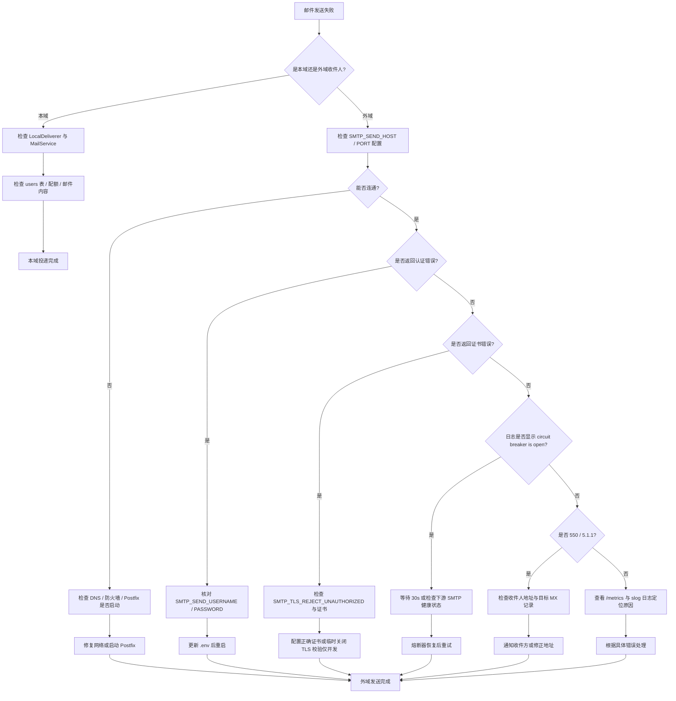

# MyMail 故障排查指南

> **文档版本**：v1.0  
> **编写日期**：2026-07-04  
> **适用对象**：初级开发人员、运维人员  
> **文档目的**：汇总开发、测试、运行中常见问题及系统化解决方案

---

## 一、启动失败

### 1.1 JWT_SECRET 校验失败

**现象**

控制台输出：

```text
配置加载失败  error="JWT_SECRET 必须设置，请用 `openssl rand -hex 32` 生成"
```

或

```text
JWT_SECRET 不能使用默认占位符，请生成随机字符串
```

或

```text
JWT_SECRET 长度必须 >= 32 字符（当前 16）
```

**可能原因**

- `.env` 中 `JWT_SECRET` 未设置。
- 使用了 `.env.example` 中的默认占位符。
- 随机串长度不足 32 字符。

**排查命令**

```powershell
# 检查 .env 中 JWT_SECRET 是否已替换
cat .env | findstr JWT_SECRET

# 统计长度（PowerShell）
$env:JWT_SECRET.Length
```

**解决方案**

生成 64 字符十六进制串并写入 `.env`：

```powershell
openssl rand -hex 32
```

**相关代码**

- `internal/config/config.go` 第 242–257 行：`Validate()` 强制校验逻辑。

---

### 1.2 DOMAIN 未设置

**现象**

```text
配置加载失败  error="DOMAIN 必须设置"
```

**可能原因**

- `.env` 中 `DOMAIN` 为空。
- 复制 `.env.example` 后未替换 `your-domain.com`。

**解决方案**

本地开发可设为：

```dotenv
DOMAIN=localhost
MAIL_HOST=localhost
```

**相关代码**

- `internal/config/config.go` 第 260–262 行。

---

### 1.3 端口占用

**现象**

```text
HTTP 服务异常  error="listen tcp 0.0.0.0:3000: bind: Only one usage of each socket address ..."
```

或 SMTP 接收器报错：

```text
SMTP 接收器异常  error="listen tcp 0.0.0.0:25: bind: ..."
```

**可能原因**

- 3000 端口被其他应用（如另一个 mymail 实例、Docker、IIS）占用。
- 25 端口为系统保留端口，Windows 非管理员权限无法绑定。

**排查命令**

```powershell
# 查看端口占用
netstat -ano | findstr :3000
netstat -ano | findstr :25

# 结束占用进程（替换 <PID>）
taskkill /PID <PID> /F
```

**解决方案**

- 结束占用进程，或修改 `.env` 中 `PORT` / `SMTP_PORT` 为高位端口。
- 若需保留 25 端口，以管理员身份运行终端；或在 Docker 中运行。

**相关代码**

- `internal/server/server.go` 第 135–144 行：HTTP Server 构建。
- `internal/smtp/receiver.go` 第 64–65 行：SMTP 监听地址。

---

### 1.4 数据库打开失败

**现象**

```text
服务器初始化失败  error="打开数据库失败: 创建数据目录失败: ..."
```

或

```text
数据库连通性检查失败: unable to open database file
```

**可能原因**

- `DB_PATH` 所在目录无写入权限。
- 磁盘已满。
- 数据库文件被其他进程独占打开（如 DBeaver）。

**排查命令**

```powershell
# 检查目录权限
cd d:\New AI Project\mymail\mymail-go
ls data\

# 检查磁盘空间
wmic logicaldisk get size,freespace,caption
```

**解决方案**

- 确保运行用户对 `data/` 目录有读写权限。
- 关闭 DBeaver / TablePlus 等占用数据库文件的客户端。
- 清理磁盘或修改 `DB_PATH` 到空间充足的分区。

**相关代码**

- `internal/storage/db/db.go` 第 29–76 行：`Open()` 函数。

---

## 二、认证问题

### 2.1 登录失败

**现象**

前端提示“用户名或密码错误”，HTTP 返回 401。

**可能原因**

- 用户名 / 密码输入错误。
- 管理员账号未正确初始化（首次启动时由 `AuthService` 自动创建）。
- 用户被禁用（`is_active=0`）。

**排查命令**

```powershell
# 查看 users 表
sqlite3 data/mymail.db "SELECT id, username, email, role, is_active FROM users;"
```

**解决方案**

- 核对 `.env` 中 `ADMIN_USERNAME` / `ADMIN_PASSWORD`。
- 如忘记密码，可临时在数据库中重置 bcrypt 哈希（需熟悉 SQL）。
- 检查用户是否被管理员禁用。

**相关代码**

- `internal/service/auth_service.go`：登录校验逻辑。
- `internal/httpapi/handler/auth.go`：登录接口。

---

### 2.2 Token 过期

**现象**

```json
{ "error": "Token 已过期，请重新登录" }
```

**可能原因**

- `JWT_EXPIRES_IN` 默认 `24h`，超过后 token 失效。
- 系统时间被修改导致 token 校验失败。
- 更换了 `JWT_SECRET`，旧 token 无法校验。

**解决方案**

- 重新登录获取新 token。
- 如需长期保持登录，勾选“记住我”（使用 `JWT_REMEMBER_EXPIRES_IN=720h`）。
- 检查服务器与客户端系统时间是否一致。
- 若刚轮换过 `JWT_SECRET`，旧 token 会失效，需重新登录。

**相关代码**

- `internal/crypto/jwt.go`：JWT 生成与校验。
- `internal/httpapi/middleware/auth.go` 第 41–46 行。

---

### 2.3 401 / 403

**现象**

- 401：`{"error":"未登录"}`
- 403：`{"error":"需要管理员权限"}`

**可能原因**

- 请求未携带 `Authorization: Bearer <token>` 头。
- Token 格式错误（如少了 `Bearer ` 前缀）。
- 访问管理员接口但当前用户 `role != admin`。

**排查命令**

```powershell
# 测试携带 token 访问
$token = "eyJhbG..."
curl -H "Authorization: Bearer $token" http://localhost:3000/api/auth/me
```

**解决方案**

- 确保前端 Axios 拦截器正确附加 token。
- 管理员接口需使用 `ADMIN_USERNAME` 对应的账号。

**相关代码**

- `internal/httpapi/middleware/auth.go`：JWT 认证与 `RequireAdmin`。
- `internal/httpapi/router.go`：路由组注册。

---

### 2.4 API Key 无效

**现象**

```json
{ "error": "缺少 API Key" }
```

或

```json
{ "error": "无效的 API Key" }
```

或

```json
{ "error": "API Key 无此操作权限" }
```

**可能原因**

- 调用 `/api/v1/*` 未携带 `Authorization: Bearer mk_xxx`。
- API Key 已被删除或前缀不匹配。
- Key 的 `Scopes` 不包含 `send`。

**排查命令**

```powershell
# 查询 API Key 表
sqlite3 data/mymail.db "SELECT id, user_id, key_prefix, scopes, is_active FROM api_keys;"
```

**解决方案**

- 在 `/api/auth/api-keys` 重新创建 API Key（明文仅返回一次，务必保存）。
- 确认请求头格式正确。
- 创建时勾选 `send` scope。

**相关代码**

- `internal/httpapi/middleware/api_auth.go`：API Key 认证与 scope 校验。
- `internal/crypto/apikey.go`：Key 生成与格式校验。

---

## 三、邮件发送失败

### 3.1 SMTP 配置错误

**现象**

队列项状态长期为 `failed`，日志出现：

```text
SMTP 发送失败  host=postfix  port=587  error="dial tcp: lookup postfix: no such host"
```

或

```text
创建 SMTP 客户端失败: ... x509: certificate signed by unknown authority
```

**可能原因**

- `SMTP_SEND_HOST` 拼写错误或主机不可达。
- `SMTP_SEND_PORT` 错误。
- `SMTP_TLS_REJECT_UNAUTHORIZED=true` 但证书无效或自签名。
- 用户名 / 密码错误（Postfix 启用 SASL 时）。

**排查命令**

```powershell
# 测试连通性
telnet postfix 587
# 或
test-netconnection -ComputerName postfix -Port 587

# 查看证书
curl -v smtps://postfix:587
```

**解决方案**

- 本地开发时将 `SMTP_SEND_HOST` 改为 `localhost`。
- 若使用自签名证书且仅为开发测试，可临时关闭 `SMTP_TLS_REJECT_UNAUTHORIZED=false`（生产禁止）。
- 核对 `SMTP_SEND_USERNAME` / `SMTP_SEND_PASSWORD`。

**相关代码**

- `internal/mailsender/sender.go` 第 130–186 行：`sendOnce()`。
- `internal/mailsender/queue.go` 第 138–170 行：外域发送处理。

---

### 3.2 熔断器开启

**现象**

外域发送全部失败，日志出现：

```text
外域 SMTP 发送失败  error="circuit breaker is open"
```

**可能原因**

- 最近 60 秒内失败率超过 60%，且请求数 ≥ 10，熔断器进入 Open 状态。
- 下游 SMTP 服务持续不可用。

**排查命令**

```powershell
# 查看 /metrics 中熔断器状态
curl http://localhost:3000/metrics | findstr smtp_circuit_breaker
```

**解决方案**

- 等待 30 秒（`SMTP_CIRCUIT_BREAKER_TIMEOUT_MS=30000`），熔断器自动进入 Half-Open。
- 修复下游 SMTP 服务（Postfix / 第三方中继）。
- 临时禁用熔断器（仅开发调试）：`SMTP_CIRCUIT_BREAKER_ENABLED=false`。

**相关代码**

- `internal/mailsender/sender.go` 第 67–101 行：熔断器配置。
- `internal/resilience/circuit_breaker.go`：gobreaker 封装。

---

### 3.3 外域 DNS / MX 问题

**现象**

```text
SMTP 发送失败: 550 5.1.1 User unknown
```

或

```text
SMTP 发送失败: 451 4.4.3 Cannot connect to recipient's mail server
```

**可能原因**

- 收件人域名 MX 记录不存在或配置错误。
- 本地 DNS 解析失败。
- 目标服务器将本域列入黑名单。

**排查命令**

```powershell
# 查询 MX 记录
nslookup -type=mx example.com

# 测试目标 25 端口
telnet mx.example.com 25
```

**解决方案**

- 确认收件人地址拼写正确。
- 检查本机 DNS 设置，尝试更换公共 DNS（如 8.8.8.8 / 223.5.5.5）。
- 配置正确的 SPF / DKIM / DMARC 记录，降低被对方拒收概率。

**相关代码**

- `internal/mailsender/sender.go` 第 169–178 行：`client.DialAndSend()`。

---

### 3.4 发送被限流

**现象**

```json
{ "error": "发送过于频繁，请稍后再试" }
```

**可能原因**

- `SEND_RATE_LIMIT_PER_MIN=10`，单用户每分钟最多发 10 封。

**解决方案**

- 降低发送频率。
- 开发测试时可临时调高该值（生产谨慎）。

**相关代码**

- `internal/service/mail_service.go`：发送限流逻辑。

---

## 四、邮件接收失败

### 4.1 SMTP 接收器未启动

**现象**

外部邮件无法投递到本域，telnet 25 端口不通。

**可能原因**

- 端口 25 被占用或无权限绑定。
- `FEATURE_SPAM_FILTER` 等开关不影响接收器启动，但 `SMTP_PORT` 配置错误会。
- 防火墙 / 云安全组未放行 25。

**排查命令**

```powershell
# 检查监听端口
netstat -ano | findstr :25

# 查看日志
curl http://localhost:3000/metrics
```

**解决方案**

- 以管理员权限运行，或改用高位端口 + Nginx/防火墙转发。
- 检查云服务器安全组是否放行 TCP 25。

**相关代码**

- `internal/smtp/receiver.go` 第 105–118 行：`Start()`。
- `internal/server/server.go` 第 221–244 行：启动顺序。

---

### 4.2 灰名单拦截

**现象**

发件方收到：

```text
450 4.7.1 greylisted, try again in 300 seconds
```

**可能原因**

- `FEATURE_GREYLIST=true` 且是首次收到该 `(IP, sender, recipient)` 三元组。
- 默认延迟窗口 `GREYLIST_DELAY_MS=300000`（5 分钟）。

**排查命令**

```powershell
# 查看 greylist 表
sqlite3 data/mymail.db "SELECT * FROM greylist ORDER BY first_seen DESC LIMIT 10;"
```

**解决方案**

- 正常 MTA 会在 5 分钟后自动重试并放行。
- 测试环境可关闭灰名单：`FEATURE_GREYLIST=false`。
- 缩短 `GREYLIST_DELAY_MS`（开发调试）。

**相关代码**

- `internal/smtp/greylist.go`：灰名单决策逻辑。
- `internal/smtp/handler.go` 第 128–137 行：RCPT TO 阶段调用。

---

### 4.3 SPF / DNSBL 误判

**现象**

合法邮件被 SMTP 接收器拒绝：

```text
550 5.7.1 message rejected as spam (score=12)
```

**可能原因**

- 发件方未配置 SPF 记录，或 SPF 记录语法错误。
- 发件 IP 被列入 DNSBL（如 zen.spamhaus.org）。
- `DNSBL_ZONES` 配置中的某个 zone 误拦截。

**排查命令**

```powershell
# 查询 SPF 记录
nslookup -type=txt example.com

# 查询 DNSBL（将 IP 反序）
nslookup 1.0.0.127.zen.spamhaus.org
```

**解决方案**

- 联系发件方修复 SPF 记录。
- 若本域测试邮件被误判，可临时关闭反垃圾：`FEATURE_SPAM_FILTER=false`。
- 调整 `SPAM_THRESHOLD` / `SPAM_SUSPICIOUS_THRESHOLD`。
- 从 `DNSBL_ZONES` 中移除误拦截的 zone（生产谨慎）。

**相关代码**

- `internal/smtp/validator.go`：反垃圾验证器。
- `internal/spam/spf.go`：SPF 校验。
- `internal/spam/dnsbl.go`：DNSBL 查询。
- `internal/smtp/handler.go` 第 165–187 行：DATA 阶段评分与拒绝。

---

## 五、数据库问题

### 5.1 迁移失败

**现象**

```text
服务器初始化失败  error="数据库迁移失败: 执行迁移 SQL 失败 (v2): ..."
```

**可能原因**

- 已有表结构与迁移脚本冲突。
- `schema_migrations` 表损坏。
- 多个实例同时启动导致竞争。

**排查命令**

```powershell
# 查看已应用版本
sqlite3 data/mymail.db "SELECT * FROM schema_migrations ORDER BY version;"

# 查看表结构
sqlite3 data/mymail.db ".schema"
```

**解决方案**

- 备份 `data/` 目录后删除数据库文件，重新启动自动迁移（数据会丢失，仅开发环境）。
- 手动修复冲突的 schema。
- 确保单实例执行首次迁移。

**相关代码**

- `internal/storage/db/migrate.go`：迁移器实现。
- `internal/server/server.go` 第 46–52 行：启动时自动迁移。

---

### 5.2 锁竞争

**现象**

接口偶发超时，日志出现：

```text
database is locked
```

**可能原因**

- SQLite 写串行，多个并发写操作竞争。
- `busy_timeout=5000` 内未能获取锁。
- 长时间事务未提交。

**排查命令**

```powershell
# 检查 WAL 文件大小
ls data/mymail.db-wal

# 查看当前连接（SQLite 无内置进程列表，可借助 DBeaver）
```

**解决方案**

- 避免在业务代码中持有事务过久。
- 增加 `busy_timeout`（需修改 `internal/storage/db/db.go`）。
- 高并发场景考虑迁移到 PostgreSQL/MySQL（需额外改造）。

**相关代码**

- `internal/storage/db/db.go` 第 45–49 行：连接池限制为 1。
- `internal/storage/db/db.go` 第 60–71 行：PRAGMA 配置。

---

### 5.3 磁盘满

**现象**

```text
创建数据目录失败: ... 磁盘空间不足
```

或写入数据库 / 附件时报 `no space left on device`。

**排查命令**

```powershell
wmic logicaldisk get size,freespace,caption

# 查看 data 目录大小
du -sh data/
```

**解决方案**

- 清理日志、临时文件、旧附件。
- 扩展磁盘或迁移 `DB_PATH` / `ATTACHMENT_PATH` 到更大分区。
- 配置审计日志保留：`AUDIT_RETENTION_DAYS`。

**相关代码**

- `internal/storage/db/db.go` 第 31–35 行：创建数据目录。
- `internal/audit/audit.go`：审计日志清理逻辑。

---

## 六、前端问题

### 6.1 CORS 跨域失败

**现象**

浏览器控制台：

```text
Access to fetch at 'http://localhost:3000/api/...' from origin 'http://localhost:5173'
has been blocked by CORS policy
```

**可能原因**

- `CORS_ALLOWED_ORIGINS` 未包含前端地址 `http://localhost:5173`。
- 预检请求 `OPTIONS` 返回 403。

**排查命令**

```powershell
# 查看响应头
curl -I -H "Origin: http://localhost:5173" http://localhost:3000/api/auth/me
```

**解决方案**

在 `.env` 中添加：

```dotenv
CORS_ALLOWED_ORIGINS=http://localhost:5173
```

**相关代码**

- `internal/httpapi/middleware/cors.go`：白名单逻辑。
- `internal/config/config.go` 第 98 行：`CORSAllowedOrigins`。

---

### 6.2 构建失败

**现象**

```text
npm run build
> vite build
error during build: [vite]: Rollup failed to resolve import ...
```

**可能原因**

- 依赖未安装或版本不兼容。
- `node_modules` 损坏。
- 代码中存在语法错误。

**排查命令**

```powershell
# 删除 node_modules 重装
rm -rf node_modules package-lock.json
npm install

# 检查 lint
npm run lint
```

**解决方案**

- 使用 `package.json` 中指定的 Node 版本（`^20.19.0 || >=22.12.0`）。
- 删除 `node_modules` 后重新 `npm install`。
- 修复 ESLint 报错。

**相关文件**

- `mymail-vue/package.json`
- `mymail-vue/vite.config.js`

---

### 6.3 404 路由

**现象**

刷新非首页（如 `/inbox/123`）后返回 JSON：

```json
{ "error": "not found" }
```

**可能原因**

- 开发环境下 `web/dist/index.html` 不存在（仅含 `.gitkeep`）。
- 生产构建后未重新启动 Go 后端，新路由未嵌入二进制。

**排查命令**

```powershell
# 检查 dist 目录
ls mymail-vue/dist
ls mymail-go/web/dist
```

**解决方案**

- 开发环境使用 Vue Router 的 history 模式并由 Vite dev server 处理。
- 生产环境先执行 `npm run build`（输出到 `mymail-vue/dist`），再重新构建 Go 二进制（`//go:embed dist/` 会嵌入产物）。
- 确保 `mymail-go/web/dist/index.html` 存在。

**相关代码**

- `internal/httpapi/router.go` 第 101–103 行：注册 SPA 路由。
- `internal/httpapi/router.go` 第 116–157 行：`registerSPARoutes()`。
- `mymail-go/web/embed.go`：前端产物嵌入。

---

## 七、WebSocket 连接问题

### 7.1 无法连接 /ws

**现象**

前端无法收到新邮件实时通知，控制台显示 WebSocket 连接失败。

**可能原因**

- 后端未启动 `WSHub`（理论上默认启动）。
- Token 未通过子协议或 URL query 传递。
- Nginx 反向代理未配置 WebSocket upgrade。
- `FEATURE_WS_NOTIFY=false`。

**排查命令**

```powershell
# 直接测试 WebSocket（需安装 wscat）
npx wscat -c "ws://localhost:3000/ws?token=eyJhbG..."
```

**解决方案**

- 确认 `.env` 中 `FEATURE_WS_NOTIFY=true`。
- 确保 token 在有效期内。
- 使用子协议方式连接：`Sec-WebSocket-Protocol: auth.<token>`。
- Nginx 配置中添加：

```nginx
proxy_http_version 1.1;
proxy_set_header Upgrade $http_upgrade;
proxy_set_header Connection "upgrade";
```

**相关代码**

- `internal/ws/hub.go`：Hub 管理。
- `internal/ws/auth.go`：WS 认证。
- `internal/httpapi/handler/ws.go`：Upgrade 端点。

---

### 7.2 连接频繁断开

**现象**

WebSocket 每隔一段时间自动重连。

**可能原因**

- 心跳超时。Client 端未响应服务端 ping。
- 代理 / 负载均衡空闲超时过短。

**解决方案**

- 检查前端心跳逻辑，保持活跃。
- 调整代理空闲超时 > 60 秒。

**相关代码**

- `internal/ws/client.go`：心跳 ping/pong。

---

## 八、性能问题

### 8.1 登录慢

**现象**

点击登录后等待数秒才有响应。

**可能原因**

- bcrypt 密码校验计算量大（cost=12 是正常行为）。
- 数据库被锁或磁盘 IO 高。
- 审计日志同步写入阻塞。

**排查命令**

```powershell
# 查看登录接口耗时
curl -w "@curl-format.txt" -H "Content-Type: application/json" \
  -d '{"username":"admin","password":"..."}' \
  http://localhost:3000/api/auth/login
```

**解决方案**

- bcrypt cost 不建议降低（安全要求）。
- 检查磁盘性能，确保 SSD。
- 审计日志开启异步缓冲（如已实现）。

**相关代码**

- `internal/crypto/bcrypt.go`：密码哈希。
- `internal/service/auth_service.go`：登录服务。

---

### 8.2 查询慢

**现象**

邮件列表、搜索等接口响应慢。

**可能原因**

- 单表数据量大，未命中索引。
- `messages` 表缺少必要索引（检查迁移 `004_add_indexes`）。
- 附件大导致序列化慢。

**排查命令**

```powershell
# 查看慢查询（开启 sqlite 日志需自定义）
sqlite3 data/mymail.db "EXPLAIN QUERY PLAN SELECT * FROM messages WHERE user_id = 1 ORDER BY created_at DESC;"
```

**解决方案**

- 确认迁移 `004_add_indexes` 已应用。
- 为常用查询字段添加复合索引。
- 分页加载，避免一次性返回大量邮件。
- 对大附件启用懒加载或 CDN。

**相关代码**

- `internal/storage/db/migrations/004_add_indexes.up.sql`
- `internal/storage/dao/message.go`

---

## 九、邮件发送失败排查流程决策树



---

## 十、通用排查命令速查

| 场景 | 命令 |
|---|---|
| 查看健康状态 | `curl http://localhost:3000/healthz` |
| 查看指标 | `curl http://localhost:3000/metrics` |
| 查看后端日志 | `go run ./cmd/mymail` 或 `make docker-logs` |
| 查看数据库 | `sqlite3 data/mymail.db` |
| 查看队列 | `SELECT * FROM mail_queue ORDER BY id DESC LIMIT 10;` |
| 查看灰名单 | `SELECT * FROM greylist ORDER BY first_seen DESC LIMIT 10;` |
| 查看反垃圾日志 | `SELECT * FROM spam_log ORDER BY created_at DESC LIMIT 10;` |
| 端口占用 | `netstat -ano \| findstr :3000` |
| Docker 状态 | `docker compose -f deployments/docker/docker-compose.yml ps` |

---

## 相关文件链接

- 配置校验：`internal/config/config.go`
- 服务器启动/关闭：`internal/server/server.go`
- 数据库连接：`internal/storage/db/db.go`
- 数据库迁移：`internal/storage/db/migrate.go`
- SMTP 接收器：`internal/smtp/receiver.go`
- SMTP 会话处理：`internal/smtp/handler.go`
- 灰名单：`internal/smtp/greylist.go`
- 反垃圾验证器：`internal/smtp/validator.go`
- 连接限流：`internal/smtp/ratelimit.go`
- 外发 SMTP：`internal/mailsender/sender.go`
- 发送队列：`internal/mailsender/queue.go`
- 本地投递：`internal/mailsender/local.go`
- JWT 认证中间件：`internal/httpapi/middleware/auth.go`
- API Key 认证中间件：`internal/httpapi/middleware/api_auth.go`
- CORS 中间件：`internal/httpapi/middleware/cors.go`
- 路由与 SPA fallback：`internal/httpapi/router.go`
- WebSocket Hub：`internal/ws/hub.go`
- WebSocket 认证：`internal/ws/auth.go`
