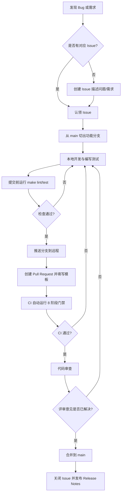

# MyMail 贡献指南

> **文档版本**：v1.0  
> **编写日期**：2026-07-04  
> **适用对象**：初级开发人员、所有希望向 MyMail 提交代码或文档的贡献者  
> **文档目的**：规范团队协作、分支管理、提交信息、代码风格、PR 流程与 CI/CD 门禁。

---

## 1. 开发流程

MyMail 采用标准的 GitHub Flow 变体，从提交 issue 到合并 PR 的完整流程如下：



### 1.1 Issue 阶段

- 在动手编码前，先检查是否已有相关 Issue；
- 如果是新需求或 Bug，请创建 Issue，描述：现象、复现步骤、期望行为、环境信息；
- 复杂需求建议在 Issue 中先进行技术方案讨论，必要时产出 ADR。

### 1.2 分支阶段

- 所有开发工作基于 `main` 分支切出；
- 禁止直接向 `main` 推送代码；
- 分支命名规范见下一节。

### 1.3 开发与测试阶段

- 遵循四层架构（Handler → Service → DAO → Infra），不跨层直接调用；
- 新增功能必须配套测试，Bug 修复优先写复现测试；
- 提交前执行 `make lint`、`make test`、`make test-e2e`。

### 1.4 PR 与合并阶段

- PR 必须通过 CI 全部 8 个阶段（lint / vet / test / build / frontend / docker / security-scan / coverage-check）；
- 至少需要 1 名 Reviewer 批准；
- 合并方式优先使用 **Squash and Merge**，保持 `main` 历史清晰。

---

## 2. 分支命名规范

| 类型 | 格式 | 示例 |
|---|---|---|
| 功能 | `feature/<issue-id>-简短描述` | `feature/123-greylist-config` |
| Bug 修复 | `fix/<issue-id>-简短描述` | `fix/145-token-expiry-msg` |
| 重构 | `refactor/<issue-id>-简短描述` | `refactor/150-dao-error-wrap` |
| 文档 | `docs/<issue-id>-简短描述` | `docs/160-contribution-guide` |
| 测试 | `test/<issue-id>-简短描述` | `test/170-ws-reconnect` |
| 紧急修复 | `hotfix/<issue-id>-简短描述` | `hotfix/200-fix-smtp-open-relay` |

**规则**：
- 只使用小写字母、数字、连字符 `-`；
- 尽量关联 Issue 编号；
- 名称要能一眼看出分支目的。

---

## 3. Commit Message 规范

MyMail 采用**约定式提交（Conventional Commits）**，类型前缀 + 中文描述。

### 3.1 格式

```
<类型>[可选作用域]: <简短描述>

[可选正文]

[可选脚注]
```

### 3.2 类型前缀

| 前缀 | 含义 |
|---|---|
| `feat` | 新功能 |
| `fix` | Bug 修复 |
| `refactor` | 重构（不改变外部行为） |
| `docs` | 文档变更 |
| `test` | 测试补充/修正 |
| `chore` | 构建/工具链/依赖等杂项 |
| `perf` | 性能优化 |
| `security` | 安全修复 |

### 3.3 示例

```text
feat(smtp): 添加灰名单延迟窗口可配置化

- 新增 GREYLIST_DELAY_MS / GREYLIST_TTL_MS 配置项
- 默认延迟 5 分钟、TTL 1 小时
- 补充 greylist_test.go 边界条件测试

Closes #123
```

```text
fix(auth): 修复 JWT token 过期后错误提示不明确的问题

原提示为裸底层错误，现返回"Token 已过期，请重新登录"。

Refs #145
```

### 3.4 注意事项

- 标题不超过 50 个字符；
- 使用中文描述，清晰说明"为什么"而不仅是"做了什么"；
- 关联 Issue 时在正文末尾写 `Closes #xxx` 或 `Refs #xxx`；
- 禁止提交无意义信息，如 `update`、`fix bug`、`tmp`。

---

## 4. 代码规范

### 4.1 Go 后端规范

#### 格式化

- 使用 `gofmt` / `goimports` 自动格式化；
- import 分组：标准库 / 第三方 / 本地项目，组间空一行。

```go
import (
    "fmt"
    "time"

    "github.com/gin-gonic/gin"

    "github.com/mymail/mymail-go/internal/config"
)
```

#### 命名

- 包名简短、小写、单数，如 `smtp`、`dao`、`ws`；
- 导出符号（首字母大写）必须有 Go doc 注释，以标识符名称开头；
- 接口名按行为命名，带 `-er` 后缀，如 `Sender`、`Validator`；
- 错误变量使用 `ErrXxx` 前缀，如 `ErrCircuitOpen`。

#### 错误处理

- 错误必须检查，不忽略关键 `err`；
- 使用 `fmt.Errorf("...: %w", err)` 包装错误，保留错误链；
- 面向用户的错误提供上下文，避免裸返回底层错误。

```go
if err := doSomething(); err != nil {
    return fmt.Errorf("发送邮件失败: %w", err)
}
```

#### Context

- 函数链路传递 `ctx context.Context`，且作为第一个参数；
- I/O / DB / 网络调用使用 `ctx` 派生的超时；
- context value key 使用未导出类型，避免冲突。

### 4.2 前端规范

MyMail 前端使用 ESLint + Prettier 统一风格。

#### ESLint 配置

文件位置：[`mymail-vue/.eslintrc.json`](../mymail-vue/.eslintrc.json)

```json
{
  "root": true,
  "env": { "browser": true, "es2022": true, "node": true },
  "extends": ["eslint:recommended", "plugin:vue/vue3-recommended"],
  "parserOptions": { "ecmaVersion": "2022", "sourceType": "module" },
  "rules": {
    "vue/multi-word-component-names": "off",
    "vue/no-v-html": "off",
    "no-unused-vars": ["warn", { "argsIgnorePattern": "^_", "varsIgnorePattern": "^_" }],
    "no-undef": "error",
    "prefer-const": "warn",
    "eqeqeq": ["warn", "smart"]
  }
}
```

#### Prettier 配置

文件位置：[`mymail-vue/.prettierrc`](../mymail-vue/.prettierrc)

```json
{
  "semi": false,
  "singleQuote": true,
  "tabWidth": 2,
  "trailingComma": "es5",
  "printWidth": 120,
  "arrowParens": "always",
  "endOfLine": "lf"
}
```

#### 前端提交前检查

```bash
cd mymail-vue
npm run lint       # ESLint 检查
npm run format     # Prettier 格式化
npm run build      # 生产构建
```

---

## 5. 提交前检查命令

在提交 PR 前，请在本地完成以下检查：

### 5.1 Go 后端

```bash
cd mymail-go

# 1. 格式化（建议配置编辑器保存时自动执行）
go fmt ./...
go vet ./...

# 2. 代码质量
make lint

# 3. 单元测试 + 覆盖率
make test

# 4. E2E 测试
make test-e2e

# 5. 安全扫描
make security

# 6. 构建验证
make build
```

### 5.2 前端

```bash
cd mymail-vue

# 1. 安装依赖
npm ci

# 2. 代码检查
npm run lint

# 3. 格式化
npm run format

# 4. 生产构建
npm run build
```

### 5.3 一键检查

```bash
# 后端
make all    # 等价于 lint + test + build

# 前端
cd mymail-vue && npm run lint && npm run build
```

> **注意**：CI 会重新执行上述检查，本地提前跑通可显著缩短反馈周期。

---

## 6. PR 模板填写说明

PR 模板位于 [`.github/PULL_REQUEST_TEMPLATE.md`](../.github/PULL_REQUEST_TEMPLATE.md)，创建 PR 时请逐项填写。

### 6.1 变更描述

- 用 1–3 句话说明"做了什么"和"为什么需要"；
- 重点写原因，避免逐行复述代码。

### 6.2 变更类型

- 勾选适用的类型（可多选）：feature / fix / refactor / docs / test / chore。

### 6.3 关联 Issue

- 填写 `Closes #xxx` 或 `Refs #xxx`；
- 无关联 Issue 时填"无"。

### 6.4 变更内容

- 列出主要改动点，帮助 Reviewer 快速定位；
- 例如："新增 GreylistChecker 的 delayMs 配置项；补充单元测试；更新 .env.example"。

### 6.5 测试说明

- 勾选"新增/更新了单元测试"；
- 说明手动验证步骤；
- 提供测试命令输出截图或关键日志。

### 6.6 检查清单

- 提交前必须全部勾选；
- 若某项不适用（如纯文档改动不需要新增测试），请在 PR 描述中说明。

---

## 7. 代码审查检查清单

代码审查参考 [`.github/CODE_REVIEW_CHECKLIST.md`](../.github/CODE_REVIEW_CHECKLIST.md)。评审优先级为：**正确性 > 安全 > 可读性 > 性能 > 一致性**。

### 7.1 通用检查

- 命名是否清晰、自解释？
- 导出函数/类型是否有 Go doc 注释？
- 复杂逻辑是否有解释"为什么"的注释？
- 错误是否被妥善处理？
- 是否滥用 `panic`？

### 7.2 安全检查

- SQL 是否使用参数化绑定（`?` 占位符）？
- 用户输入是否经过校验？
- 是否无硬编码密钥/Token/密码？
- 日志是否未输出敏感字段？
- 跨用户资源访问是否有归属校验（防 IDOR）？

### 7.3 并发检查

- goroutine 是否有明确退出条件？
- 共享可变状态是否受锁/channel 保护？
- `go test -race` 是否通过？
- 锁粒度是否合理，无死锁风险？

### 7.4 性能检查

- 是否存在 N+1 查询？
- 高频查询字段是否有索引？
- 大文件/附件是否流式处理？
- 热路径是否避免不必要的堆分配？

### 7.5 Go 特定检查

- 错误是否用 `%w` wrap？
- `context.Context` 是否作为第一个参数传递？
- `defer` 顺序是否正确？
- 接口是否定义在使用方？
- 测试覆盖核心逻辑与边界条件？

---

## 8. 安全与敏感信息

### 8.1 禁止提交的内容

- `.env` 文件（仓库中仅保留 `.env.example`）；
- 任何密码、JWT、API Key、私钥、TLS 证书；
- 生产环境数据库、邮件正文等敏感数据；
- 调试用的 `fmt.Println` / `log.Printf`（使用 `slog`）。

### 8.2 密钥管理

- 本地开发从 `.env` 读取；
- CI 中使用 GitHub Secrets；
- 生产环境使用 Docker Secrets / 环境变量注入。

### 8.3 日志脱敏

- 不记录密码、JWT、API Key、邮件正文；
- 必要时对邮箱、IP 进行部分遮蔽。

---

## 9. 如何报告 Bug 和提功能建议

### 9.1 报告 Bug

创建 Issue 时尽量提供：

1. **环境信息**：OS、Go 版本、Node 版本、部署方式；
2. **复现步骤**：最小可复现路径；
3. **预期行为**：你认为应该发生什么；
4. **实际行为**：实际发生了什么；
5. **日志/截图**：关键错误日志或界面截图；
6. **已尝试的排查**：避免重复建议。

### 9.2 提功能建议

1. 先搜索是否已有类似 Issue；
2. 描述使用场景和核心价值；
3. 如果可能，提出初步实现思路；
4. 复杂功能先讨论 ADR，再进入开发。

### 9.3 安全漏洞

- 不要通过公开 Issue 报告安全漏洞；
- 请发送邮件至项目安全联系人（见 `SECURITY.md` 或仓库主页）；
- 提供复现方式和影响范围。

---

## 10. 文档贡献规范

### 10.1 什么时候需要更新文档

- 新增/修改配置项（同步 `.env.example`、相关 Markdown）；
- 新增 API 端点（同步 `docs/04-API参考文档.md`）；
- 修改架构或关键流程（同步 `docs/01-项目规格文档.md` 或 ADR）；
- 修复用户常见困惑（同步 `docs/10-术语表与FAQ.md`）。

### 10.2 文档格式

- 使用 Markdown；
- 文件编码 UTF-8；
- 标题层级从 `##` 开始（`#` 为文档主标题）；
- 代码块标注语言，如 ```go、```bash、```yaml；
- 引用真实源码时使用相对路径链接。

### 10.3 文档存放位置

| 文档类型 | 存放路径 |
|---|---|
| 快速入门 | `docs/00-快速入门指南.md` |
| 项目规格 | `docs/01-项目规格文档.md` |
| 后端文件详解 | `docs/02-后端文件详解/*.md` |
| 前端文件详解 | `docs/03-前端文件详解.md` |
| API 参考 | `docs/04-API参考文档.md` |
| 架构决策记录 | `docs/05-架构决策记录.md` |
| 开发环境搭建 | `docs/06-开发环境搭建指南.md` |
| 测试指南 | `docs/07-测试指南.md` |
| 数据库设计 | `docs/08-数据库设计详解.md` |
| 故障排查 | `docs/09-故障排查指南.md` |
| 术语表与 FAQ | `docs/10-术语表与FAQ.md` |
| 贡献指南 | `docs/11-贡献指南.md` |
| 项目思维导图 | `docs/12-项目思维导图.md` |
| 部署与运维 | `docs/DEPLOY.md`、`docs/OPERATIONS.md`、`docs/MIGRATION.md` |
| 运维 Runbook | `docs/runbooks/*.md` |

---

## 11. CI/CD 相关

### 11.1 CI 流水线

`.github/workflows/ci.yml` 定义了 8 阶段门禁：

| 阶段 | 名称 | 说明 |
|---|---|---|
| 1 | Lint | `golangci-lint` |
| 2 | Vet | `go vet ./...` |
| 3 | Test | `go test ./... -race -cover -timeout=180s` |
| 4 | Build | `CGO_ENABLED=0 go build` |
| 5 | Frontend | `npm ci && npm run build` |
| 6 | Docker | 验证 Dockerfile 可构建 |
| 7 | Security Scan | `gosec` + `govulncheck` |
| 8 | Coverage Check | 总覆盖率 ≥ 80% |

来源：[`.github/workflows/ci.yml`](../.github/workflows/ci.yml) 第 30–256 行。

### 11.2 安全扫描

`.github/workflows/security.yml` 每周一定时执行：

- `gosec`：Go 代码安全扫描；
- `govulncheck`：Go 依赖漏洞检查；
- `Trivy`：Docker 镜像漏洞扫描；
- `npm audit`：前端依赖漏洞扫描。

来源：[`.github/workflows/security.yml`](../.github/workflows/security.yml) 第 24–122 行。

### 11.3 合并要求

- 必须通过 `ci-gate` 汇总检查；
- 必须至少 1 名 Reviewer 批准；
- 必须解决所有冲突；
- 建议使用 **Squash and Merge**。

---

## 12. 新成员 onboarding 检查清单

如果你是新加入的开发者，请按以下顺序熟悉项目：

1. 阅读 [`docs/00-快速入门指南.md`](00-快速入门指南.md)；
2. 阅读 [`docs/01-项目规格文档.md`](01-项目规格文档.md)；
3. 搭建开发环境（[`docs/06-开发环境搭建指南.md`](06-开发环境搭建指南.md)）；
4. 运行 `make test` 和 `make test-e2e`，确认环境正常；
5. 阅读本贡献指南和 [`.github/CODE_REVIEW_CHECKLIST.md`](../.github/CODE_REVIEW_CHECKLIST.md)；
6. 从标有 `good first issue` 的 Issue 开始实践。

---

## 参考文件

- [`.github/PULL_REQUEST_TEMPLATE.md`](../.github/PULL_REQUEST_TEMPLATE.md)
- [`.github/CODE_REVIEW_CHECKLIST.md`](../.github/CODE_REVIEW_CHECKLIST.md)
- [`.github/workflows/ci.yml`](../.github/workflows/ci.yml)
- [`.github/workflows/security.yml`](../.github/workflows/security.yml)
- [`mymail-vue/.eslintrc.json`](../mymail-vue/.eslintrc.json)
- [`mymail-vue/.prettierrc`](../mymail-vue/.prettierrc)
- [`Makefile`](../Makefile)
- [`docs/07-测试指南.md`](07-测试指南.md)
