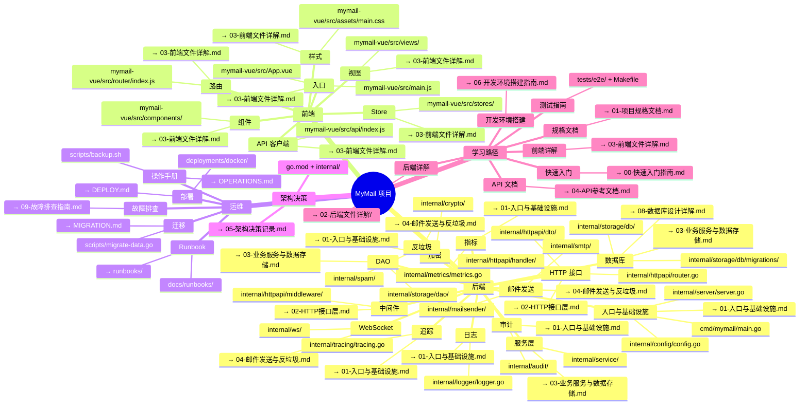

# MyMail 项目思维导图

> **定位**：整个 `docs/` 目录的导航入口。面向初级开发人员，帮助你一眼看清项目结构、核心文件位置，以及该读哪份文档。

---

## 项目全景图

---

## 文档索引

| 模块 | 核心文件/目录 | 说明 | 对应文档 |
|---|---|---|---|
| **后端：入口与基础设施** | `cmd/mymail/main.go` | 应用入口：加载配置、初始化日志、启动服务器、优雅关闭 | [01-入口与基础设施.md](./02-后端文件详解/01-入口与基础设施.md) |
| | `internal/server/server.go` | 服务器编排：依赖注入中心 | [01-入口与基础设施.md](./02-后端文件详解/01-入口与基础设施.md) |
| | `internal/config/config.go` | 配置加载与校验（JWT/DOMAIN 必填） | [01-入口与基础设施.md](./02-后端文件详解/01-入口与基础设施.md) |
| **后端：日志** | `internal/logger/logger.go` | slog 结构化日志 + trace_id | [01-入口与基础设施.md](./02-后端文件详解/01-入口与基础设施.md) |
| **后端：指标** | `internal/metrics/metrics.go` | Prometheus 指标暴露 | [01-入口与基础设施.md](./02-后端文件详解/01-入口与基础设施.md) |
| **后端：追踪** | `internal/tracing/tracing.go` | OpenTelemetry 分布式追踪 | [01-入口与基础设施.md](./02-后端文件详解/01-入口与基础设施.md) |
| **后端：加密** | `internal/crypto/` | JWT、bcrypt、API Key 生成 | [01-入口与基础设施.md](./02-后端文件详解/01-入口与基础设施.md) |
| **后端：审计** | `internal/audit/` | 审计日志记录与 DAO | [01-入口与基础设施.md](./02-后端文件详解/01-入口与基础设施.md) |
| **后端：HTTP 接口** | `internal/httpapi/router.go` | 路由总入口、中间件链、SPA 回退 | [02-HTTP接口层.md](./02-后端文件详解/02-HTTP接口层.md) |
| | `internal/httpapi/handler/` | 注册/登录/邮件/管理员/API/规则/WebSocket/健康检查 Handler | [02-HTTP接口层.md](./02-后端文件详解/02-HTTP接口层.md) |
| | `internal/httpapi/dto/` | 请求/响应 DTO | [02-HTTP接口层.md](./02-后端文件详解/02-HTTP接口层.md) |
| **后端：中间件** | `internal/httpapi/middleware/` | JWT 认证、API Key 认证、限流、CORS、归属校验、请求日志、安全头、Recover | [02-HTTP接口层.md](./02-后端文件详解/02-HTTP接口层.md) |
| **后端：服务层** | `internal/service/` | AuthService、MailService、AdminService、APIKeyService、RuleService | [03-业务服务与数据存储.md](./02-后端文件详解/03-业务服务与数据存储.md) |
| **后端：DAO** | `internal/storage/dao/` | 9 个 DAO（user、message、attachment、queue、rule、api_key、send_log、spam_log、greylist、settings） | [03-业务服务与数据存储.md](./02-后端文件详解/03-业务服务与数据存储.md) |
| **后端：数据库** | `internal/storage/db/` | 连接池、迁移、事务 | [03-业务服务与数据存储.md](./02-后端文件详解/03-业务服务与数据存储.md) |
| | `internal/storage/db/migrations/` | Schema 迁移脚本 | [08-数据库设计详解.md](./08-数据库设计详解.md) |
| **后端：邮件发送** | `internal/mailsender/` | SMTP 外发、本地投递、队列 Worker | [04-邮件发送与反垃圾.md](./02-后端文件详解/04-邮件发送与反垃圾.md) |
| | `internal/smtp/` | SMTP 接收器、处理器、验证器、灰名单、限流 | [04-邮件发送与反垃圾.md](./02-后端文件详解/04-邮件发送与反垃圾.md) |
| **后端：反垃圾** | `internal/spam/` | SPF、DNSBL、评分器、主过滤器 | [04-邮件发送与反垃圾.md](./02-后端文件详解/04-邮件发送与反垃圾.md) |
| **后端：WebSocket** | `internal/ws/` | Hub、Client、认证 | [04-邮件发送与反垃圾.md](./02-后端文件详解/04-邮件发送与反垃圾.md) |
| **前端：入口** | `mymail-vue/src/main.js` | Vue 应用创建、Pinia + Router 注册 | [03-前端文件详解.md](./03-前端文件详解.md) |
| | `mymail-vue/src/App.vue` | 根组件、路由视图、登录状态恢复 | [03-前端文件详解.md](./03-前端文件详解.md) |
| **前端：路由** | `mymail-vue/src/router/index.js` | Vue Router 路由表与全局守卫 | [03-前端文件详解.md](./03-前端文件详解.md) |
| **前端：视图** | `mymail-vue/src/views/` | LoginView、MailView、ComposeView、MailDetailView、SettingsView、AdminView | [03-前端文件详解.md](./03-前端文件详解.md) |
| **前端：组件** | `mymail-vue/src/components/` | AppLayout、SkeletonList、UploadZone | [03-前端文件详解.md](./03-前端文件详解.md) |
| **前端：Store** | `mymail-vue/src/stores/` | Pinia：auth.js、ws.js | [03-前端文件详解.md](./03-前端文件详解.md) |
| **前端：API 客户端** | `mymail-vue/src/api/index.js` | Axios 封装、401 跳转 | [03-前端文件详解.md](./03-前端文件详解.md) |
| **前端：样式** | `mymail-vue/src/assets/main.css` | Tailwind CSS v4 + 自定义主题 | [03-前端文件详解.md](./03-前端文件详解.md) |
| **运维：部署** | `deployments/docker/` | Dockerfile + docker-compose.yml + 配置 | [DEPLOY.md](./DEPLOY.md) |
| **运维：迁移** | `scripts/migrate-data.go` | Node.js → Go 数据迁移脚本 | [MIGRATION.md](./MIGRATION.md) |
| **运维：操作手册** | `scripts/backup.sh` | 加密备份脚本 | [OPERATIONS.md](./OPERATIONS.md) |
| **运维：故障排查** | `docs/09-故障排查指南.md` | 启动失败、数据库、邮件、安全等常见问题 | [09-故障排查指南.md](./09-故障排查指南.md) |
| **运维：Runbook** | `docs/runbooks/` | SMTP 中断、DB 锁死、磁盘满、安全事件 | [runbooks/](./runbooks/) |
| **架构决策** | `docs/05-架构决策记录.md` | Go 重构、SQLite、Gin、迁移等关键 ADR | [05-架构决策记录.md](./05-架构决策记录.md) |
| **学习路径：快速入门** | `docs/00-快速入门指南.md` | 5 分钟把项目跑起来 | [00-快速入门指南.md](./00-快速入门指南.md) |
| **学习路径：开发环境搭建** | `docs/06-开发环境搭建指南.md` | 从零配置本地开发环境 | [06-开发环境搭建指南.md](./06-开发环境搭建指南.md) |
| **学习路径：规格文档** | `docs/01-项目规格文档.md` | 项目定位、技术栈、架构总览 | [01-项目规格文档.md](./01-项目规格文档.md) |
| **学习路径：后端详解** | `docs/02-后端文件详解/` | 入口、HTTP、Service/DAO、邮件/反垃圾 | [02-后端文件详解/](./02-后端文件详解/) |
| **学习路径：前端详解** | `docs/03-前端文件详解.md` | Vue 3 全文件解析 | [03-前端文件详解.md](./03-前端文件详解.md) |
| **学习路径：API 文档** | `docs/04-API参考文档.md` | REST API + WebSocket 接口参考 | [04-API参考文档.md](./04-API参考文档.md) |
| **学习路径：测试指南** | `tests/e2e/` + `Makefile` | 单元测试、e2e 测试、性能测试命令 | [tests/e2e/](../tests/e2e/) |

---

## 推荐阅读顺序

如果你刚加入团队，建议按 **学习路径** 的顺序阅读：

1. **[00-快速入门指南.md](./00-快速入门指南.md)** — 先把项目跑起来。
2. **[06-开发环境搭建指南.md](./06-开发环境搭建指南.md)** — 若快速入门遇到问题，按此文档逐项检查环境。
3. **[01-项目规格文档.md](./01-项目规格文档.md)** — 建立整体认知。
4. **[05-架构决策记录.md](./05-架构决策记录.md)** — 了解关键选型（为什么用 Go、SQLite、Gin 等）。
5. **[02-后端文件详解/01-入口与基础设施.md](./02-后端文件详解/01-入口与基础设施.md)** — 从 `cmd/mymail/main.go` 开始理解后端启动。
6. **[02-后端文件详解/02-HTTP接口层.md](./02-后端文件详解/02-HTTP接口层.md)** — 理解请求如何被路由、认证、处理。
7. **[02-后端文件详解/03-业务服务与数据存储.md](./02-后端文件详解/03-业务服务与数据存储.md)** — 理解 Service、DAO、DB 三层。
8. **[08-数据库设计详解.md](./08-数据库设计详解.md)** — 深入数据库表结构与迁移。
9. **[02-后端文件详解/04-邮件发送与反垃圾.md](./02-后端文件详解/04-邮件发送与反垃圾.md)** — 理解邮件收发、反垃圾、WebSocket。
10. **[03-前端文件详解.md](./03-前端文件详解.md)** — 理解 Vue 3 前端。
11. **[04-API参考文档.md](./04-API参考文档.md)** — 查接口时当手册用。
12. **[DEPLOY.md](./DEPLOY.md)** / **[OPERATIONS.md](./OPERATIONS.md)** / **[MIGRATION.md](./MIGRATION.md)** — 部署、运维、迁移时再读。
13. **[09-故障排查指南.md](./09-故障排查指南.md)** — 遇到问题先查。
14. **[runbooks/](./runbooks/)** — 生产故障处理时直接按编号查找。

---

## 说明
> - 本文档中的文件路径均相对于 `mymail-go/` 目录。
> - `测试指南` 目前分散在 `tests/e2e/` 与 `Makefile` 中，尚未形成独立 Markdown 文档；相关命令可参考 `Makefile` 中的 `test` / `test-e2e` / `bench` 目标。
