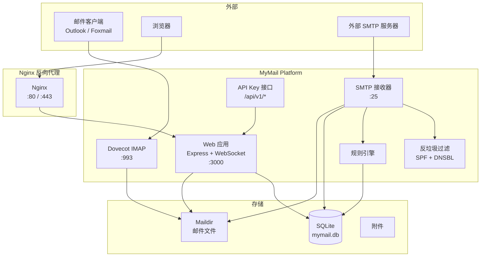

# 📧 MyMail Platform

自建邮件服务平台 — 轻量、安全、功能完整。


## 🏗️ 架构概览



## ✨ 功能特性

- 📬 **Web 邮箱** — 注册/登录、收发邮件、富文本编辑（Quill.js）、附件拖拽上传
- 📎 **附件支持** — zip/rar/pdf/doc/xls/jpg/png，单文件最大 25MB，支持批量下载
- 📨 **SMTP 收发** — 端口 25 接收外部邮件，nodemailer 发送出站邮件
- 📂 **IMAP 支持** — Dovecot 集成，Outlook/Foxmail 等客户端可连接
- 🔔 **实时推送** — WebSocket 新邮件即时通知 + 提示音
- 🔒 **安全机制** — JWT 认证、bcrypt 密码加密、登录锁定、频率限制、Helmet 安全头
- 🛡️ **邮件安全** — SPF / DKIM / DMARC 支持
- 👤 **管理后台** — 用户管理、系统配置、DNS 状态检测、SMTP 端口管理
- 🌙 **深色主题** — 科技感 UI，Tailwind CSS 响应式设计
- ⚡ **一键部署** — setup.sh 自动安装 Nginx + Dovecot + SSL

## 📸 页面预览

| 登录 | 收件箱 | 写邮件 |
|------|--------|--------|
| 深色科技风登录页 | 邮件列表 + 实时推送 | Quill 富文本 + 拖拽附件 |

## 🏗️ 技术栈

| 层级 | 技术 |
|------|------|
| 前端 | HTML + JavaScript + Tailwind CSS + Quill.js |
| 后端 | Node.js + Express |
| 数据库 | SQLite (better-sqlite3) + DAO 抽象层 |
| SMTP 收发 | smtp-server + nodemailer |
| IMAP | Dovecot |
| 实时推送 | WebSocket (ws) |
| 反向代理 | Nginx |
| SSL | Let's Encrypt |

## 🚀 快速开始

### 环境要求

- Node.js 18+
- npm 8+
- Linux (推荐 Ubuntu 22.04+)

### 一键部署

```bash
# 克隆仓库
git clone https://github.com/Stone5618/mymail-platform.git
cd mymail-platform

# 复制并编辑配置
cp .env.example .env
vim .env

# 一键部署（需要 root）
sudo bash scripts/setup.sh
```

部署完成后访问 `https://your-domain.com`，使用预设管理员账号登录。

### Docker 部署（推荐）

```bash
# 克隆仓库
git clone https://github.com/Stone5618/mymail-platform.git
cd mymail-platform

# 复制并编辑配置
cp .env.example .env
vim .env

# 启动服务
docker compose up -d
```

服务启动后访问 `https://your-domain.com`。数据持久化在 Docker volume `mymail-data` 中。

常用命令：

```bash
docker compose up -d          # 后台启动
docker compose down           # 停止服务
docker compose logs -f app    # 查看日志
docker compose restart app    # 重启应用
```

### 手动部署

```bash
# 安装依赖
npm install

# 初始化数据库
node scripts/init-db.js

# 构建 CSS
npx tailwindcss -i ./public/css/input.css -o ./public/css/style.css --minify

# 启动服务
npm start
# 或开发模式（自动重启）
npm run dev
```

## ⚙️ 配置说明

复制 `.env.example` 为 `.env`，修改以下关键配置：

```bash
# 你的域名
DOMAIN=your-domain.com
MAIL_HOST=mail.your-domain.com

# DuckDNS token（如使用 DuckDNS）
DUCKDNS_TOKEN=your-token-here

# JWT 密钥（务必修改！）
JWT_SECRET=your-random-secret-string

# 预设管理员
ADMIN_USERNAME=stone
ADMIN_PASSWORD=CHANGE_ME
```

## 🌐 DNS 配置

要正常收发邮件，需配置以下 DNS 记录：

```dns
# MX 记录
your-domain.com.        MX   10  mail.your-domain.com.

# A 记录
mail.your-domain.com.   A    {你的服务器IP}

# SPF
your-domain.com.        TXT  "v=spf1 ip4:{你的服务器IP} mx ~all"

# DMARC
_dmarc.your-domain.com. TXT  "v=DMARC1; p=none"

# DKIM（运行 scripts/gen-dkim.sh 生成密钥后填入）
default._domainkey.your-domain.com. TXT  "v=DKIM1; k=rsa; p={公钥}"
```

### 生成 DKIM 密钥

```bash
bash scripts/gen-dkim.sh
```

## 📱 客户端配置

在 Outlook / Foxmail / Thunderbird 中：

| 设置 | 值 |
|------|-----|
| 收件服务器 (IMAP) | mail.your-domain.com |
| IMAP 端口 | 993 (SSL/TLS) |
| 发件服务器 (SMTP) | mail.your-domain.com |
| SMTP 端口 | 465 (SSL) 或 587 (STARTTLS) |
| 用户名 | 完整邮箱地址（如 user@your-domain.com） |
| 密码 | 网页登录密码 |

## 📁 项目结构

```
mymail-platform/
├── src/
│   ├── server.js              # 入口，Express + WebSocket + SMTP
│   ├── config.js              # 配置加载
│   ├── routes/
│   │   ├── auth.js            # 注册/登录/个人信息
│   │   ├── mail.js            # 邮件 CRUD + 附件
│   │   └── admin.js           # 管理后台 API
│   ├── services/
│   │   ├── smtp-sender.js     # 出站邮件发送
│   │   ├── smtp-receiver.js   # 入站邮件接收（端口 25）
│   │   └── ws-service.js      # WebSocket 实时推送
│   ├── dao/                   # 数据访问层（SQLite）
│   │   ├── user-dao.js
│   │   ├── message-dao.js
│   │   ├── attachment-dao.js
│   │   ├── send-log-dao.js
│   │   └── settings-dao.js
│   └── middleware/
│       └── auth.js            # JWT 认证 + 管理员权限
├── public/
│   ├── index.html             # SPA 入口
│   ├── css/
│   │   ├── input.css          # Tailwind 源文件
│   │   └── style.css          # 编译后样式
│   └── js/
│       └── app.js             # 前端 SPA（路由 + 页面）
├── scripts/
│   ├── setup.sh               # 一键部署脚本
│   ├── gen-dkim.sh            # DKIM 密钥生成
│   ├── init-db.js             # 数据库初始化
│   └── backup.sh              # 备份脚本
├── data/                      # 运行时数据（不提交）
│   ├── mymail.db              # SQLite 数据库
│   ├── maildir/               # 邮件存储
│   └── attachments/           # 附件存储
├── .env.example               # 环境变量模板
├── DEPLOY.md                  # 详细部署文档
├── tailwind.config.js
├── postcss.config.js
└── package.json
```

## 🔧 常用命令

```bash
npm start              # 启动生产服务
npm run dev            # 启动开发服务（nodemon 自动重启）
npm run build:css      # 构建 Tailwind CSS
npm run watch:css      # 监听 CSS 变化
node scripts/init-db.js # 初始化/重置数据库
bash scripts/backup.sh  # 备份数据库 + 邮件
bash scripts/gen-dkim.sh # 生成 DKIM 密钥
```

## 🐛 故障排除

### 端口 25 被封

云厂商（阿里云/AWS 等）默认封锁端口 25，需在控制台申请解封。

```bash
# 检测端口 25
telnet smtp.qq.com 25
```

### 邮件发送失败

1. 检查 DNS 记录（MX / SPF / DKIM）
2. 检查 SSL 证书是否有效
3. 查看日志：`journalctl -u mymail -f`

### Dovecot 连接失败

```bash
systemctl status dovecot
openssl s_client -connect mail.your-domain.com:993
```

### 无法接收外部邮件

1. 确认端口 25 已开放
2. 确认 MX 记录指向正确
3. 确认管理员已在后台开启端口 25

## 🔒 安全注意事项

> **部署前务必完成以下安全配置，否则服务器可能被滥用或入侵。**

1. **修改默认密码** — `.env` 中的 `ADMIN_PASSWORD`、`JWT_SECRET` 必须改为强随机值
2. **启用 HTTPS** — 生产环境必须配置 SSL 证书（Let's Encrypt 免费），切勿使用 HTTP
3. **限制端口暴露** — 仅开放 80/443/25/993，内部端口 3000 不应对外暴露
4. **定期更新** — 关注项目更新，及时升级依赖：`npm audit fix`
5. **备份数据** — 使用 `scripts/backup.sh` 定期备份数据库和邮件
6. **监控日志** — 关注异常登录、垃圾邮件攻击：`journalctl -u mymail -f`
7. **DKIM 签名** — 务必生成并配置 DKIM 密钥，否则发出的邮件大概率被拒收
8. **SPF/DMARC** — 正确配置 DNS 记录，防止域名被冒用

## 📄 License

MIT

## 🙏 致谢

- [Express](https://expressjs.com/) — Web 框架
- [better-sqlite3](https://github.com/WiseLibs/better-sqlite3) — SQLite 驱动
- [Quill.js](https://quilljs.com/) — 富文本编辑器
- [Tailwind CSS](https://tailwindcss.com/) — CSS 框架
- [Dovecot](https://www.dovecot.org/) — IMAP 服务器
- [nodemailer](https://nodemailer.com/) — SMTP 客户端
